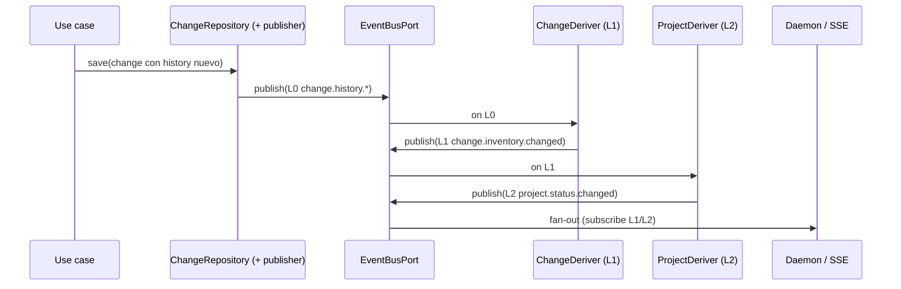

# Exploración: Event Bus en `specd`

> Status: investigation only — no implementation, no change created.
> Date: 2026-07-21
> Goal: definir un mecanismo desacoplado para notificar eventos del ciclo de
> vida (archive, transition, discard, …) de forma que plugins, extensiones y
> la UI web reaccionen sin acoplar use cases entre sí, respetando hexagonal +
> DI manual. La lista afinada de eventos decide si ambient (como Logger) o DI.

---

## Verdict

Un event bus **sí encaja**. El modelo más limpio no es “Tier curado a mano
en cada use case”, sino **capas**:

1. **L0 — espejo de `ChangeEvent`:** cada append al historial del change
   genera un `SpecdEvent` equivalente (`change.history.created`, …).
2. **L1 — derivados de change:** p.ej. `change.changed` cuando el working set
   o el estado efectivo del change muta (agrupa varios L0).
3. **L2 — derivados de proyección:** p.ej. `project.status.changed` cuando
   un L0/L1 implica que `GetProjectSummary` / dashboard ya no es fresco.

Wiring:

| Opción                      | ¿Merece la pena?                                                                                                                                         |
| --------------------------- | -------------------------------------------------------------------------------------------------------------------------------------------------------- |
| Ambient (como `Logger`)     | **No.** Con espejo 1:1 el emisor L0 es **un choke point** (post-persist), no 50 call sites.                                                              |
| DI                          | **Sí.** Inyectar `EventBusPort` en el publisher de persistencia + en derivadores (subscribers que re-emiten). Host/SSE se suscribe a la misma instancia. |
| `new EventEmitter()` suelto | **No.**                                                                                                                                                  |

Domain sigue puro: el entity append-only a `history`; el bus se alimenta
**después** de persistir (o vía outbox de hechos ya aceptados).

`EventEmitter` solo como detalle interno del adapter in-memory.

---

## 1. Problema

Hoy, cuando un change se archiva / transiciona / descarta, no hay un canal
único para que:

- plugins reaccionen en el mismo proceso,
- un daemon / Studio / UI web se enteren de procesos CLI que ya terminaron,
- extensiones se suscriban sin tocar use cases ajenos.

Sin un bus, o se acopla por llamadas directas, o cada consumidor inventa su
propio polling / hack de filesystem.

---

## 2. Decisiones de diseño (consenso de exploración)

### A. Modelo en capas: espejo L0 + derivados L1/L2

`ChangeEvent` (domain/manifest) y `SpecdEvent` (bus) siguen siendo tipos
distintos, pero L0 es un **mapeo 1:1 estable**:

| Domain `ChangeEvent.type` | SpecdEvent L0 (propuesto)            |
| ------------------------- | ------------------------------------ |
| `created`                 | `change.history.created`             |
| `transitioned`            | `change.history.transitioned`        |
| `spec-approved`           | `change.history.spec-approved`       |
| `signed-off`              | `change.history.signed-off`          |
| `invalidated`             | `change.history.invalidated`         |
| `drafted`                 | `change.history.drafted`             |
| `restored`                | `change.history.restored`            |
| `discarded`               | `change.history.discarded`           |
| `archive-failed`          | `change.history.archive-failed`      |
| `artifact-skipped`        | `change.history.artifact-skipped`    |
| `artifacts-synced`        | `change.history.artifacts-synced`    |
| `description-updated`     | `change.history.description-updated` |

Payload L0: `{ changeName, historyEvent: ChangeEvent }` (o campos aplanados

- `historyType`). Así el bus no duplica semántica: **transporta** el hecho
  ya aceptado por el domain.

#### Hechos de sistema fuera del historial (L0-sys)

No viven en `Change.history()` pero sí en el working set:

| SpecdEvent                                 | Origen                               |
| ------------------------------------------ | ------------------------------------ |
| `change.archived`                          | `ArchiveChange` tras mover a archive |
| (futuro) `change.moved` / storage checkout | si aparece abstraction de storage    |

Estos se publican en el use case / puerto de archive, no en el espejo de history.

#### L1 — derivados de change

Subscribers (o un `ChangeEventDeriver` cableado en composition) escuchan L0
y re-emiten agregados:

| SpecdEvent L1              | Se dispara cuando…                                  | Para qué                       |
| -------------------------- | --------------------------------------------------- | ------------------------------ |
| `change.changed`           | cualquier L0 (o subset) de ese change               | “refetch este change”          |
| `change.inventory.changed` | created / drafted / restored / discarded / archived | listas active/drafts/discarded |
| `change.state.changed`     | transitioned / invalidated / approvals              | badge de lifecycle             |

La UI se suscribe a L1 si no quiere el ruido fino de L0.

#### L2 — derivados de proyección (project, …)

Misma idea un nivel arriba:

```text
L0 history.* ──► L1 change.inventory.changed
                      │
                      ▼
              L2 project.status.changed
              L2 project.summary.changed   (counts de GetProjectSummary)
```

| SpecdEvent L2             | Trigger típico                                                    | Consumidor             |
| ------------------------- | ----------------------------------------------------------------- | ---------------------- |
| `project.status.changed`  | inventory L1, o cualquier mutación que afecte `project status`    | Studio dashboard / SSE |
| `project.summary.changed` | mismos triggers; payload opcional = summary fresco o solo “stale” | widgets de counts      |

El derivador L2 **no** tiene que recomputar siempre el summary en el
publisher: puede emitir `{ reason, changeName }` y dejar que el cliente
llame `GetProjectSummary`, o (en host largo) recompute y adjuntar snapshot.

Otros L2 futuros (mismo patrón): `graph.stale`, `specs.changed`, etc.

#### Cascade — reglas

1. **Solo L0 (y L0-sys) escriben desde “fuente de verdad”** (post-persist /
   archive). L1/L2 **solo** se emiten desde derivadores suscritos al bus
   (o a un pipeline síncrono post-publish), nunca desde use cases sueltos.
2. **Sin ciclos:** L2 no vuelve a generar L0. Un derivador no escucha su
   propio tipo.
3. **Orden:** `publish(L0)` → handlers L1 → handlers L2 en el mismo
   `publish` (sync) o vía cola interna; `PublishReport` puede anidar
   derivados o listarlos en `flush`.
4. **Idempotencia / dedupe:** un `transitioned` no debe spamear N
   `project.status.changed` idénticos en el mismo tick — coalescer por
   transaction/`flush`.

#### Choke point de emisión L0 (clave para DI)

Si espejamos **cada** `ChangeEvent`, **no** hay que tocar 12 use cases:

```text
UseCase → Change (append history) → ChangeRepository.save
                                            │
                                            ▼
                                   EventPublisher.publishHistoryDelta
                                   (diff history before/after, o
                                    pending events drained post-save)
                                            │
                                            ▼
                                      EventBusPort.publish(L0…)
```

Opciones de implementación (a elegir en el change):

| Enfoque                                                 | Pros                              | Contras                                            |
| ------------------------------------------------------- | --------------------------------- | -------------------------------------------------- |
| A. Decorator / wrapper de `ChangeRepository`            | Un solo sitio; use cases intactos | Hay que detectar qué eventos son nuevos            |
| B. Domain “pending events” + use case publica tras save | Explícito; fácil de testear       | Cada use case llama `publishPending` (o un helper) |
| C. Solo en `FsChangeRepository.save`                    | Cero cambios en use cases         | Acopla infra al bus; peor para otros adapters      |

**Preferencia de exploración:** A o B en application/composition — no C
puro en un adapter fs concreto (rompe ports si mañana hay storage DB).

Archive (`change.archived`) sigue siendo L0-sys en `ArchiveChange` /
`ArchiveRepository` post-success.

Con esto, DI es **1–2 constructores** (publisher + deriver), no 12.

#### Relación con el Tier anterior

El “Tier 1” de UI ya no es la lista de publicación; es la **lista de
suscripción recomendada** (L1/L2). L0 es el feed completo para audit /
plugins finos.

| Necesidad UI            | Suscribirse a                                            |
| ----------------------- | -------------------------------------------------------- |
| Refresco de listas      | `change.inventory.changed` o `project.status.changed`    |
| Badge de un change      | `change.state.changed` o L0 `transitioned`/`invalidated` |
| Panel de historial live | todos los L0 `change.history.*`                          |
| Dashboard counts        | `project.summary.changed`                                |

#### Suscriptores

| Consumidor                   | Escucha                             |
| ---------------------------- | ----------------------------------- |
| `ChangeDeriver` (in-process) | L0 → emite L1                       |
| `ProjectStatusDeriver`       | L1 (o L0 subset) → emite L2         |
| Daemon / SSE                 | L1 + L2 (y L0 opcional con filtro)  |
| Plugins                      | L0 fino o L1 según interés          |
| Use cases entre sí           | **No** — evita acoplamiento vía bus |

### B. DI en choke points + derivadores (no ambient)

```ts
// composition — una instancia
const events = new SqliteEventBus(dbPath) // o InMemoryEventBus

const changes = createChangeRepository({ ..., events }) // wrapper publica L0
const derivers = [
  new ChangeProjectionDeriver(events),   // L0 → L1
  new ProjectStatusDeriver(events),      // L1 → L2
]
derivers.forEach((d) => d.start()) // subscribe

// host largo (daemon)
events.subscribe('project.status.changed', 'sse-hub', (e) => fanOut(e))
```

Reglas:

- Composition crea **una** instancia del bus.
- L0 sale del publisher post-persist (repo wrapper / helper), no de cada use case.
- L1/L2 solo desde derivadores suscritos.
- Domain no importa el bus.
- Prohibido: singleton `new EventEmitter()` suelto.

Ambient solo si el choke point se rompe y aparecen decenas de emisores
fuera de persistencia.

### C. Puerto tipado, no `EventEmitter` crudo

Application habla con un port. `EventEmitter` (si se usa) vive solo en
infrastructure como detalle del adapter in-memory.

### D. Persistencia opcional para cross-process

| Escenario                       | Adapter                           |
| ------------------------------- | --------------------------------- |
| Un solo proceso (CLI + plugins) | `InMemoryEventBus`                |
| CLI escribe, daemon/UI leen     | `SqliteEventBus` (+ poller / SSE) |

El puerto es agnóstico a SQLite. IDs incrementales (`sequence_id`), poda y
optimizaciones de consulta son detalle del adapter.

### E. Consulta histórica por `Date`, no por ID de DB

`getEventsSince(since: Date)` en el port. Si la ventana pedida ya fue podada:

```ts
{ events: [], resetRequired: true }
```

El cliente debe recargar estado completo.

### F. Poda en caliente probabilística

Tabla limitada (~1000 eventos). Poda ~10% de las escrituras para no pagar
`DELETE` en cada publish.

---

## 3. Arquitectura y flujo



Capas:

1. **Application** — `SpecdEvent` (L0/L1/L2), `EventBusPort`, publisher, derivers.
2. **Infrastructure** — in-memory / sqlite adapters + poller.
3. **Composition** — una instancia, wire publisher + `deriver.start()`.---

## 4. Contrato propuesto (`EventBusPort` + proxy)

### 4.1 Eventos (capas)

```typescript
import { type ActorIdentity, type ChangeEvent } from '../../domain/entities/change.js'

export interface BaseEvent {
  readonly id: string
  readonly timestamp: Date
  readonly actor?: ActorIdentity // L0 suele llevar el del history event
}

/** L0 — espejo de un ChangeEvent ya persistido. */
export interface ChangeHistorySpecdEvent extends BaseEvent {
  readonly type: `change.history.${ChangeEvent['type']}`
  readonly changeName: string
  readonly historyEvent: ChangeEvent
}

/** L0-sys — fuera del historial del entity. */
export interface ChangeArchivedSpecdEvent extends BaseEvent {
  readonly type: 'change.archived'
  readonly changeName: string
  readonly commitHash?: string
}

/** L1 — agregados de change. */
export interface ChangeChangedEvent extends BaseEvent {
  readonly type: 'change.changed'
  readonly changeName: string
  readonly causedBy: readonly SpecdEvent['type'][]
}

export interface ChangeInventoryChangedEvent extends BaseEvent {
  readonly type: 'change.inventory.changed'
  readonly changeName: string
  readonly bucket: 'active' | 'drafts' | 'discarded' | 'archived'
  readonly op: 'entered' | 'left'
}

export interface ChangeStateChangedEvent extends BaseEvent {
  readonly type: 'change.state.changed'
  readonly changeName: string
  readonly state: string
}

/** L2 — proyecciones de proyecto. */
export interface ProjectStatusChangedEvent extends BaseEvent {
  readonly type: 'project.status.changed'
  readonly reason: readonly SpecdEvent['type'][]
  readonly changeName?: string
}

export interface ProjectSummaryChangedEvent extends BaseEvent {
  readonly type: 'project.summary.changed'
  readonly reason: readonly SpecdEvent['type'][]
  /** Si el derivador recompute; si no, cliente hace GetProjectSummary. */
  readonly summary?: unknown
}

export type SpecdEvent =
  | ChangeHistorySpecdEvent
  | ChangeArchivedSpecdEvent
  | ChangeChangedEvent
  | ChangeInventoryChangedEvent
  | ChangeStateChangedEvent
  | ProjectStatusChangedEvent
  | ProjectSummaryChangedEvent
```

v1 puede activar L0 + 1–2 L1 y un L2; el union crece con derivadores.### 4.2 Port

```typescript
export interface SubscriberResult {
  readonly subscriberName: string
  readonly status: 'success' | 'failed'
  readonly error?: Error
}

export interface PublishReport {
  readonly eventId: string
  readonly eventType: string
  readonly subscribersNotified: number
  readonly details: readonly SubscriberResult[]
}

export type EventHandler<T extends SpecdEvent> = (event: T) => Promise<void> | void

export interface EventBusPort {
  /** Publica y espera a listeners locales + persistencia del adapter. */
  publish(event: SpecdEvent): Promise<PublishReport>

  /** Fire-and-forget (no bloquea el use case). */
  emit(event: SpecdEvent): void

  /** Suscripción in-process. Devuelve unsubscribe. */
  subscribe<T extends SpecdEvent['type']>(
    type: T,
    subscriberName: string,
    handler: EventHandler<Extract<SpecdEvent, { type: T }>>,
  ): () => void

  /**
   * Histórico desde una fecha (agnóstico a sequence_id).
   * resetRequired si since cae fuera de la ventana retenida.
   */
  getEventsSince(since: Date): Promise<{
    readonly events: readonly SpecdEvent[]
    readonly resetRequired: boolean
  }>

  /** Espera publishes async pendientes (útil al salir del CLI). */
  flush(): Promise<readonly PublishReport[]>
}
```

### 4.3 Wiring: DI en publisher + derivers

```typescript
/** Tras save exitoso: publica un L0 por cada ChangeEvent nuevo. */
export class ChangeHistoryEventPublisher {
  constructor(private readonly events: EventBusPort) {}

  async publishNewHistory(changeName: string, newEvents: readonly ChangeEvent[]): Promise<void> {
    for (const historyEvent of newEvents) {
      await this.events.publish({
        id: crypto.randomUUID(),
        type: `change.history.${historyEvent.type}`,
        timestamp: historyEvent.at,
        actor: historyEvent.by,
        changeName,
        historyEvent,
      })
    }
  }
}
```

Derivador (subscriber que re-emite):

```typescript
events.subscribe('change.history.drafted', 'inventory-deriver', async (e) => {
  await events.publish({
    id: crypto.randomUUID(),
    type: 'change.inventory.changed',
    timestamp: new Date(),
    changeName: e.changeName,
    bucket: 'drafts',
    op: 'entered',
  })
})
```

Cuidado: si `publish` es sync respecto a handlers, coalescer L2 en el mismo
tick para no emitir 5× `project.status.changed` por un solo comando.---

## 5. Adapters

### 5.1 `InMemoryEventBus`

- Mapa `type → handlers` (o `EventEmitter` encapsulado).
- `publish` / `emit` solo notifican listeners del proceso.
- `getEventsSince` puede devolver vacío o un ring buffer opcional en memoria.
- Base natural para tests y CLI sin daemon.

### 5.2 `SqliteEventBus` (extiende o compone in-memory)

Schema interno (no expuesto en el port):

```sql
CREATE TABLE IF NOT EXISTS system_events (
  sequence_id INTEGER PRIMARY KEY AUTOINCREMENT,
  id TEXT NOT NULL UNIQUE,
  type TEXT NOT NULL,
  timestamp TEXT NOT NULL,
  actor TEXT NOT NULL,
  payload TEXT NOT NULL
);
CREATE INDEX IF NOT EXISTS idx_system_events_timestamp
  ON system_events(timestamp);
```

Comportamiento:

1. Notifica listeners locales (como in-memory).
2. Persiste fila.
3. Poda probabilística (~10%) a los últimos N (~1000) por `sequence_id`.
4. `getEventsSince(since)`:
   - si `since` &lt; timestamp del evento más antiguo retenido → `resetRequired: true`
   - si no → filas con `timestamp > since`, ordenadas por `sequence_id`

Errores de persistencia: loguear con `Logger.error`, no tumbar el use case
(política a confirmar en el change real).

### 5.3 `SqliteEventPoller` (daemon)

Estado privado: último timestamp (o `sequence_id`) procesado.

- Arranque: ancla al último evento existente o a `now`.
- Intervalo ~500ms: lee nuevos, invoca `onEvent`.
- Usado por el servidor HTTP para alimentar SSE; **no** forma parte del port.

### 5.4 SSE (superficie HTTP, fuera de core)

```text
GET /v1/events/stream?since=<iso>
→ text/event-stream
→ event: change.archived
→ data: { ...SpecdEvent }
```

El poller alimenta el stream; al cerrar la conexión se detiene el poller de
esa sesión.

---

## 6. Composition / Kernel

Al boot:

1. Resolver adapter (`in-memory` | `sqlite`).
2. Crear **una** `EventBusPort`.
3. Cablear `ChangeHistoryEventPublisher` (o repo wrapper) con ese bus → L0.
4. Registrar derivadores L1/L2 (`start()` = `subscribe`).
5. Exponer `kernel.events` para host / SSE / plugins.
6. CLI: `await events.flush()` al salir si hay async.

Archive publica L0-sys `change.archived` en su propio success path.---

## 7. Límites conscientes

| Sí                                             | No                                                   |
| ---------------------------------------------- | ---------------------------------------------------- |
| L0 espejo de `ChangeEvent` + L0-sys `archived` | Curar a mano un Tier en cada use case                |
| L1/L2 solo desde derivadores                   | Use cases emitiendo `project.status.changed` directo |
| DI en publisher + derivers                     | Ambient proxy como default                           |
| Coalesce L2 por comando/`flush`                | Cascadas cíclicas L2→L0                              |
| Bus in-process + outbox SQLite                 | Bus distribuido multi-host en v1                     |
| Port tipado + adapters                         | Domain importando el bus                             |

---

## 8. Relación con arquitectura existente

Alineado con `default:_global/architecture`:

- Ports en application; adapters en infrastructure; wiring en composition.
- Manual DI: publisher L0 + derivers reciben `EventBusPort`; use cases
  normales no necesitan el bus si el choke point es el save.
- Use cases no importan `better-sqlite3` ni `node:events`.
- `Logger` ambient sigue siendo la excepción cross-cutting; el bus no la
  copia — el espejo 1:1 concentra emisión en 1–2 sitios.

---

## 9. Inventario: qué use cases tocar

API de persistencia relevante hoy:

| Método                      | Quién lo usa                                   | Emite `ChangeEvent`?   |
| --------------------------- | ---------------------------------------------- | ---------------------- |
| `save`                      | solo `CreateChange`                            | sí (`created`)         |
| `mutate`                    | mayoría de mutadores                           | a menudo sí            |
| `mutateDraft`               | `RestoreChange`, `DiscardChange` (desde draft) | sí                     |
| `ArchiveRepository.archive` | `ArchiveChange`                                | no en history → L0-sys |

### Opción A — choke point en repo (preferida): use cases ≈ 0

Si el wrapper de `ChangeRepository` compara `history` before/after en
`save` / `mutate` / `mutateDraft` y publica L0:

| Pieza                                            | ¿Modificar?                                |
| ------------------------------------------------ | ------------------------------------------ |
| Use cases que solo hacen `mutate`/`save`         | **No**                                     |
| Composition (`createChangeRepository` / wiring)  | **Sí** — inyectar publisher                |
| `ArchiveChange` o wrapper de `ArchiveRepository` | **Sí** — `change.archived` (L0-sys)        |
| Derivadores L1/L2                                | **Nuevos**, no editan use cases existentes |
| Tests de repo / composition                      | **Sí**                                     |

Use cases que **persisten** hoy (cubiertos por A sin editarlos):

| Use case                        | Persistencia                                                   | History típico                                                              |
| ------------------------------- | -------------------------------------------------------------- | --------------------------------------------------------------------------- |
| `CreateChange`                  | `save`                                                         | `created`                                                                   |
| `TransitionChange`              | `mutate`                                                       | `transitioned` (+ a veces `invalidated`)                                    |
| `ApproveSpec`                   | `mutate`                                                       | vía `transition('spec-approved')` → `spec-approved` / `transitioned`        |
| `ApproveSignoff`                | `mutate`                                                       | análogo signoff                                                             |
| `InvalidateChange`              | `mutate`                                                       | `invalidated`                                                               |
| `DraftChange`                   | `mutate`                                                       | `drafted`                                                                   |
| `RestoreChange`                 | `mutateDraft`                                                  | `restored`                                                                  |
| `DiscardChange`                 | `mutate` o `mutateDraft`                                       | `discarded`                                                                 |
| `EditChange`                    | `mutate`                                                       | `invalidated` y/ o `description-updated`                                    |
| `SkipArtifact`                  | `mutate`                                                       | `artifact-skipped`                                                          |
| `ValidateArtifacts`             | `mutate`                                                       | a veces `invalidated` (+ hashes sin history)                                |
| `ArchiveChange`                 | `mutate` (archiving / failures / overlaps) + `archive.archive` | `transitioned`, `archive-failed`, `invalidated` en overlaps; éxito → L0-sys |
| `UpdateSpecDeps`                | `mutate`                                                       | **sin** `ChangeEvent` (solo `specDependsOn`)                                |
| `UpdateImplementationTracking`  | `mutate`                                                       | **sin** `ChangeEvent`                                                       |
| `RefreshImplementationTracking` | `mutate`                                                       | **sin** `ChangeEvent`                                                       |

Los tres últimos: con A no generan L0. Si la UI debe refrescar tracking,
hace falta un L1 débil (`change.changed` / `change.manifest.changed`) cuando
`mutate` persiste **sin** history delta — decisión de diseño, no de use case.

### Opción B — publish explícito en cada use case

Habría que tocar **todos** los de la tabla que añaden history (~11) +
`ArchiveChange` para L0-sys. Peor superficie; solo tiene sentido si el
wrapper de repo es inviable.

### Fuera de scope (no mutan change / solo lectura)

`GetStatus`, `ListChanges`, `ListDrafts`, `ListDiscarded`, `GetDraft`,
`GetDiscarded`, `CompileContext`, `RunStepHooks` (salvo side effects vía
otros), metadata/specs/graph queries, etc. — **no** se modifican.

`saveArtifact` no lo llama ningún use case de core hoy (escritura de
artefactos suele ser agente → disco; el drift aparece en validate/get).

---

## 10. Próximos pasos (cuando se implemente)

1. Abrir un change specd.
2. Specs: `core:event-bus-port`, publisher L0, derivers L1/L2,
   `in-memory` (+ sqlite cuando haga falta SSE).
3. Implementar choke point post-persist (wrapper A o helper B).
4. L0 completo para todos los `ChangeEvent` + `change.archived`.
5. Un L1 (`change.inventory.changed` o `change.changed`) + un L2
   (`project.status.changed`) como prueba de cascada.
6. SSE se suscribe a L1/L2, no necesariamente a todo L0.

---

## 11. Abierto / a decidir en el change

- ¿Choke point A (repo wrapper) o B (pending events + helper post-save)?
- ¿L2 lleva snapshot de summary o solo señal de stale?
- ¿Coalesce: por `publish` anidado, por `flush`, o batch explícito?
- ¿Prefijo `change.history.*` vs reutilizar el string corto del domain?
- ¿`publish` best-effort si SQLite falla?
- ¿Plugins: `PluginContext.events`?
- ¿Path SQLite y storage abstraction futura?
