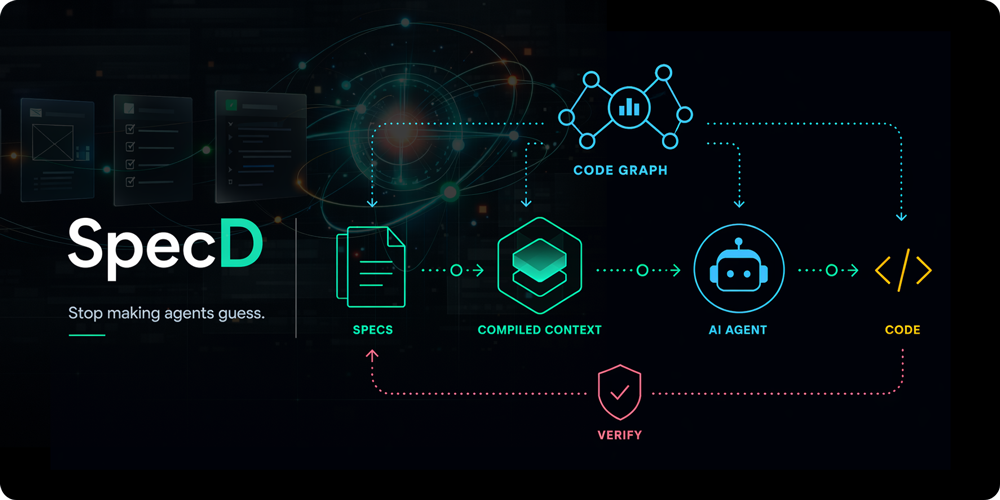

<p align="center">
  
</p>

# SpecD

Stop making agents guess.

Spec-driven development for AI coding agents. SpecD compiles the right specs into agent context, verifies plans against requirements before implementation, and helps prevent drift before code ships.

Context is delivered, not discovered. Compliance is structural, not optional. For more information, visit [getspecd.dev](https://getspecd.dev).

## Why SpecD?

AI coding agents often fail for repeatable reasons:

- They miss relevant requirements.
- They lose context across long tasks.
- They drift from specifications during implementation.

SpecD addresses this by combining:

- **Compiled context for agents.** The right specs and lifecycle instructions are assembled before the agent starts work.
- **Structured verification and approval guardrails.** Mandatory verification reduces drift during the lifecycle, while optional human approval checkpoints can gate progression at key transitions.
- **Spec and code graph impact analysis.** SpecD connects specs, source files, symbols, and dependencies so agents can reason about change impact.
- **Deterministic where correctness matters.** Merging, validation, status resolution, and delta application are computed by SpecD instead of delegated to the LLM.

## Minimal workflow

```sh
# CLI
specd project init
```

```text
# Coding agent
/specd
```

Invokes the SpecD skill, inspects project state, and routes to the next workflow step (for example creating or continuing a change).

## What is SpecD?

AI coding assistants work best when given clear, structured intent. Spec-Driven Development (SDD) addresses this by inserting a spec layer between human intent and AI-generated code: requirements are written, validated, and agreed upon before implementation begins.

SpecD is a ground-up redesign of that workflow, built for professional teams. It models specs, changes, schemas, and hooks as first-class domain concepts — independent of any particular AI tool or delivery mechanism. The same business logic is exposed through a CLI, an MCP server, and agent plugins, all consuming a single core library with no I/O dependencies.

Key differences from earlier SDD tools:

- **Context compiled, not discovered.** At every lifecycle step, SpecD computes which specs are relevant to the current change and delivers their content as a structured, ready-to-consume block. The agent does not decide what to read; SpecD resolves it.
- **Code graph built in.** SpecD indexes your codebase and specs into a queryable graph, enabling impact analysis (upstream/downstream reach), hotspot detection, and change-aware queries. Multi-language: TypeScript, Go, Python, PHP (more languages coming).
- **Deterministic where correctness matters.** Spec merging, validation, status resolution, and delta application are computed algorithmically — not delegated to the LLM.
- **Customizable schema model.** A default schema is included, while projects can define their own artifact workflow, section structure, and dependency order in `schema.yaml`. SpecD does not hardcode any particular convention.
- **Composable packages.** Use only what you need: the core library as an SDK, the CLI for terminal workflows, the MCP server for agent-native workflows, or the full stack.
- **Structured verification and approval guardrails.** Mandatory verification is built into the lifecycle, while optional human approval checkpoints can govern progression at critical transitions.
- **Multi-workspace and coordinator repos.** A project can declare multiple spec workspaces, each pointing to a different directory or repository. A single coordinator repo can govern specs across an entire microservice architecture without coupling service repos to each other.

## Current status (April 2026)

SpecD is in active development and usable from source in this monorepo.

- **@specd/core** — business logic layer: change lifecycle, spec management, schema validation, delta application, context compilation, hooks, storage adapters
- **@specd/cli** — complete command surface: `change`, `spec`, `project`, `schema`, `skills`, `graph`, `plugins`, `drafts`, `discarded`, `archive`, `config`
- **@specd/code-graph** — Multi-language indexing (TypeScript, Go, Python, PHP), impact analysis, hotspot detection, staleness detection
- **@specd/skills** — skill registry API with bundle resolution and multiple agent runtime support
- **@specd/plugin-\*** — all agent plugins (claude, copilot, codex, opencode) implemented per spec
- **@specd/plugin-manager** — plugin loader, install/update/uninstall use cases
- **@specd/mcp** and **@specd/public-web** — in progress
- **@specd/schema-std** — ships a real `schema.yaml` and template files

Publishing/install flows are not finalized yet; use workspace commands for now.

## Core concepts

| Concept       | Description                                                                                                                                                                                  |
| ------------- | -------------------------------------------------------------------------------------------------------------------------------------------------------------------------------------------- |
| **Change**    | A named, in-progress unit of spec work. A change tracks which specs are being modified, which artifacts have been produced, and where it sits in its lifecycle.                              |
| **Spec**      | A specification file (or set of files) that defines what a system should do. Specs live in a dedicated directory and are governed by the active schema.                                      |
| **Artifact**  | A typed file produced during a change — for example, a proposal, a spec, a design, or a task list. Artifact types and their dependency order are declared in the schema.                     |
| **Schema**    | A `schema.yaml` file that defines the artifact workflow for a project: what artifacts exist, how they relate, what validations apply, and what instructions guide the AI.                    |
| **Workspace** | A declared location of specs, with its own storage path, code root, and ownership relationship. A project can span multiple workspaces (e.g. a coordinator managing several service repos).  |
| **Delta**     | A structured artifact expressing semantic operations over spec documents using selectors and generated content, rather than line-based diffs. Deltas are applied deterministically by SpecD. |

The change lifecycle progresses through well-defined states:

```
drafting → designing → ready → implementing ⇄ verifying → done → archivable
```

Optional approval checkpoints can require human sign-off between `ready → implementing` and `done → archivable`.

## Context compilation

Most SDD tools give the agent a list of files and leave it to figure out which specs are relevant. SpecD takes a different approach: at every lifecycle step, `specd context` computes and delivers the full instruction block the agent needs.

The resolution works in five steps:

1. **Project-level include patterns** — which specs always apply to every change in this project.
2. **Project-level exclude patterns** — specs explicitly excluded from context.
3. **Workspace-level include/exclude patterns** — applied only for workspaces active in the current change.
4. **`dependsOn` traversal** — starting from the specs a change touches, SpecD follows declared dependencies transitively to pull in related specs automatically.
5. **Assembly** — for each resolved spec, SpecD injects structured metadata (rules, constraints, scenarios) when available, with a raw-content fallback when metadata is stale or absent.

The output is a single, ordered instruction block combining project context, schema instructions for the active artifact, spec content, and lifecycle hooks — ready to inject into the agent's context window. The agent doesn't search, doesn't guess, and doesn't miss a spec that wasn't mentioned by name.

## Structured verification and approval guardrails

The most common failure mode in spec-driven development is not writing bad specs — it is that agents plan and implement without fully respecting them. An agent reads the specs, generates a design and task list, then produces code that diverges from the requirements. The gap surfaces during verification or review, after the work is done.

SpecD addresses this with mandatory verification built into the lifecycle, plus optional human approval guardrails around critical transitions:

```
designing → ready → [optional approval] → implementing ⇄ verifying → done → [optional approval] → archivable
```

**Verification (mandatory):** after implementation, the agent enters the `verifying` step, where a dedicated verification skill checks the implementation against the relevant specs and may send the change back for revision when drift or contradictions are detected.

**Approval checkpoints (optional):** projects may require a design approval gate before implementation (`ready → implementing`) to review scope, affected specs, and design decisions, and/or an implementation approval gate before archiving (`done → archivable`) to review correctness, catch omissions discovered late, reconsider flawed or incomplete approaches, or reopen the change when the implementation or spec changes need adjustment before specs and deltas are merged. These checkpoints are deterministic workflow gates controlled by project policy.

This separates verification from governance: verification is always part of the lifecycle, while approvals are an optional control layer.

This turns spec conformance review into a first-class lifecycle concern, while allowing teams to add human governance where needed.

## Multi-workspace projects

A SpecD project can declare multiple workspaces, each with its own spec tree, storage path, and code root. Workspaces can point to directories inside the same repository or to external repositories entirely.

This enables a coordinator pattern: a single repo holds the specs for an entire system, while each service repo maintains its own codebase. Context compilation is workspace-aware — when a change touches specs in multiple workspaces, include/exclude patterns and `dependsOn` traversal are applied per-workspace, and only the active workspaces contribute to the compiled context.

Teams with microservice architectures can manage cross-cutting specs (authentication contracts, API schemas, shared conventions) in one place, without forcing every service repo to carry a full SpecD installation.

## Packages

| Package                  | Description                                                                                                   | Status      |
| ------------------------ | ------------------------------------------------------------------------------------------------------------- | ----------- |
| `@specd/core`            | Business logic: change lifecycle, spec management, schema validation, delta application, context compilation. | Functional  |
| `@specd/cli`             | CLI adapter around `@specd/core` with command registration and formatting/output modes.                       | Functional  |
| `@specd/code-graph`      | Code graph indexing, impact analysis, hotspots, staleness detection (TypeScript, Go, Python, PHP).            | Functional  |
| `@specd/mcp`             | MCP server adapter package.                                                                                   | In Progress |
| `@specd/skills`          | Skill registry API with bundle resolution, multiple agent runtimes.                                           | Functional  |
| `@specd/schema-std`      | Standard SpecD schema package with `schema.yaml` and template files.                                          | Functional  |
| `@specd/plugin-manager`  | Plugin loader, install/update/uninstall use cases.                                                            | Functional  |
| `@specd/plugin-claude`   | Claude Code plugin with skill installation and frontmatter injection.                                         | Functional  |
| `@specd/plugin-copilot`  | GitHub Copilot plugin.                                                                                        | Functional  |
| `@specd/plugin-codex`    | OpenAI Codex plugin.                                                                                          | Functional  |
| `@specd/plugin-opencode` | Open Code plugin.                                                                                             | Functional  |
| `@specd/public-web`      | Public documentation site (Docusaurus).                                                                       | In Progress |

## Getting started (CLI)

### Use as a CLI

Install globally:

```sh
pnpm add -g @specd/specd
```

Initialize a project (wizard guides you through plugin selection):

```sh
specd project init
```

Then launch your agent and run the skill:

```
/specd
```

### Develop on specd

**Requirements**

- Node.js >= 20
- pnpm >= 10

Install dependencies and run quality checks:

```sh
pnpm install
pnpm build
pnpm test
pnpm lint
```

Build and run the CLI from source:

```sh
pnpm --filter @specd/cli build
node packages/cli/dist/index.js --help
```

Preview the public website locally:

```sh
pnpm web:dev
```

This starts the Docusaurus app in `apps/public-web` and serves the site locally, typically at `http://localhost:3000`.
Development mode intentionally skips the generated API reference so the dev server does not watch hundreds of generated Markdown files.

Useful routes to check:

- `/` — presentation landing page
- `/docs` — public guides and reference docs
- `/api` — generated API reference for `@specd/core` in production preview builds

To preview the production output instead of the dev server:

```sh
pnpm web:build
pnpm web:serve
```

Example command groups currently wired:

- `specd change ...`
- `specd spec ...`
- `specd project ...`
- `specd config show`
- `specd schema show`
- `specd graph ...`
- `specd skills ...`

`project init` can generate a local `specd.yaml`. A minimal config looks like:

```yaml
schema: '@specd/schema-std'

workspaces:
  default:
    specs:
      adapter: fs
      fs:
        path: specs/

storage:
  changes:
    adapter: fs
    fs:
      path: specd/changes
  drafts:
    adapter: fs
    fs:
      path: specd/drafts
  discarded:
    adapter: fs
    fs:
      path: specd/discarded
  archive:
    adapter: fs
    fs:
      path: specd/archive
```

See the [configuration reference](docs/config/config-reference.md) for all available options.

## Documentation

**Start here:**

| Guide                                                            | Contents                                                          |
| ---------------------------------------------------------------- | ----------------------------------------------------------------- |
| [`docs/guide/getting-started.md`](docs/guide/getting-started.md) | Philosophy, core concepts, project structure, lifecycle overview. |
| [`docs/guide/workflow.md`](docs/guide/workflow.md)               | Lifecycle states, transitions, hooks, approval gates.             |
| [`docs/guide/schemas.md`](docs/guide/schemas.md)                 | Artifacts, templates, customisation (fork/extend/overrides).      |
| [`docs/guide/workspaces.md`](docs/guide/workspaces.md)           | Multi-package and multi-repo spec organisation.                   |
| [`docs/guide/configuration.md`](docs/guide/configuration.md)     | specd.yaml explained: storage, context, plugins, overrides.       |
| [`docs/guide/selectors.md`](docs/guide/selectors.md)             | Selectors, extractors, validations, metadata extraction.          |

**Reference:**

| Section                          | Contents                                                                    |
| -------------------------------- | --------------------------------------------------------------------------- |
| [`docs/cli/`](docs/cli/)         | CLI command reference.                                                      |
| [`docs/config/`](docs/config/)   | `specd.yaml` technical reference and configuration examples.                |
| [`docs/schemas/`](docs/schemas/) | Schema format technical reference and schema examples.                      |
| [`docs/core/`](docs/core/)       | Core API and model docs (`overview`, `domain-model`, `ports`, `use-cases`). |
| [`docs/adr/`](docs/adr/)         | Architecture Decision Records.                                              |
| [`docs/mcp/`](docs/mcp/)         | MCP docs directory (currently mostly pending).                              |

## Development model

This repository follows a spec-driven workflow: each significant area of behavior is specified in `specs/` before implementation begins.

## License

MIT — see [LICENSE](LICENSE).
