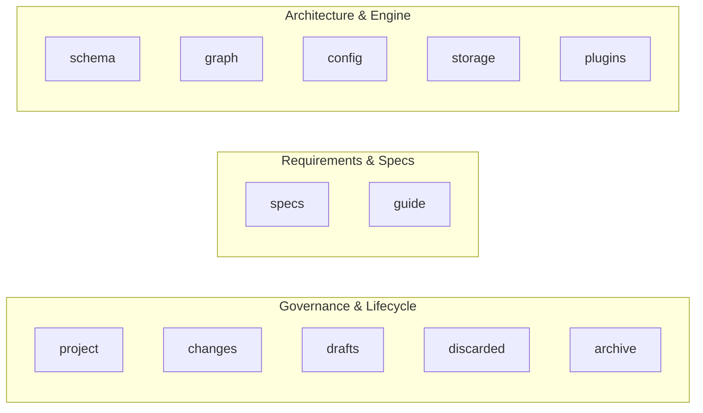

# CLI Guide & Command Interface

The SpecD command-line interface (`specd`) is the central engine of the platform. It manages the change lifecycle, compiles context for AI coding assistants, validates artifact syntax and relationships, indexes AST code graphs, manages plugins, and delivers on-demand documentation directly in the terminal.

While AI coding assistants typically invoke SpecD through slash skills (`/specd`, `/specd-new`, `/specd-design`, etc.) or MCP tools, those integrations are thin orchestrators calling the CLI directly. You can run every command in your terminal, in shell scripts, or in CI/CD pipelines.

---

## Command Anatomy

```bash
specd <command> [subcommand] [arguments...] [flags...]
```

When working within this repository without a global link:

```bash
node packages/cli/dist/index.js <command> ...
```

### Global Options

These options apply across all command families:

| Flag                | Description                                                           |
| :------------------ | :-------------------------------------------------------------------- |
| `--config <path>`   | Path to `specd.yaml` (overrides automatic config discovery).          |
| `-v, --verbose`     | Increase logging verbosity (`-v` for info, `-vv` for debug/trace).    |
| `--format <format>` | Output format: `text` (default), `json`, or `toon` (token-optimized). |

### Output Formats

- **`text`** _(default)_: Formatted for human readability with tables, status glyphs, and dynamic terminal-width fitting.
- **`json`**: Structured JSON representation for scripting and programmatic ingestion.
- **`toon`**: Ultra-compact token-optimized format specifically engineered to preserve LLM prompt context.

---

## The 12 Command Families

SpecD organizes its capabilities into 12 dedicated command families:



---

### 1. `specd project` — Project Operations

Inspects project health, compiles context, and monitors change pipelines.

- **`specd project init`** (or root shorthand **`specd init`**): Scaffolds a new project interactively, generating `specd.yaml`.
- **`specd project status`**: High-level status showing active schema, workspaces, spec counts, active changes, and graph freshness.
  ```bash
  specd project status --context --graph --format toon
  ```
- **`specd project dashboard`**: Interactive terminal dashboard displaying project metrics, drift detection, and recent changes.
- **`specd project context`**: Compiles global project context (architecture rules and global specs).
  ```bash
  specd project context --mode summary
  ```
- **`specd project context-specs`**: Discovers matching spec IDs for project and workspace include/exclude patterns without rendering full markdown.
- **`specd project metadata`**: Inspects compiled project-level metadata and layout.
- **`specd project update`**: Updates project-managed assets to match the currently declared plugin set in `specd.yaml`. It triggers plugin installation orchestration, synthesizing and refreshing agent instruction files (`AGENTS.md`, `CLAUDE.md`, `.github/copilot-instructions.md`) and skill templates across the project.
- **`specd project update-metadata`**: Updates project-level metadata with LLM-optimized context and input freshness hashes.

👉 _See [Project Reference](../cli/project.md) for full options and examples._

---

### 2. `specd changes` — Change Lifecycle Management

Manages the core unit of work in SpecD from proposal to verification and archive.

- **`specd changes create <name>`**: Initializes a new change directory under `.specd/changes/`.
  ```bash
  specd changes create add-oauth --specs default:auth/oauth
  ```
- **`specd changes list`**: Lists all active changes with their current lifecycle state.
- **`specd changes status <name>`**: Displays the change state, completed artifacts DAG, blockers, and next action.
  ```bash
  specd changes status add-oauth
  ```
- **`specd changes transition <name> <state>`**: Advances change state (`designing`, `ready`, `implementing`, `verifying`, `done`, `archivable`).
- **`specd changes validate <name>`**: Validates change artifacts structurally and checks cross-artifact relational integrity.
- **`specd changes spec-preview <name> <specId>`**: Previews unified spec content after applying delta patches.
  ```bash
  specd changes spec-preview add-oauth default:auth/login --diff
  ```
- **`specd changes approve spec|signoff <name>`**: Grants human approvals at configured lifecycle gates.
- **`specd changes context <name> <step>`**: Compiles the token-optimized instruction block and specs for the current step.
- **`specd changes artifacts <name>`**: Lists artifact statuses (`complete`, `missing`, `drifted`, `skipped`).
- **`specd changes skip-artifact <name> <artifactId>`**: Marks an optional artifact as skipped.
- **`specd changes deps <name> [specId]`**: Inspects or modifies declared spec dependencies for the change.
- **`specd changes draft <name>`**: Shelves an active change into `.specd/drafts/`.
- **`specd changes discard <name>`**: Abandons an active change, moving it to `.specd/discarded/`.
- **`specd changes archive <name>`**: Merges validated spec deltas into canonical specs and archives the change.
- **`specd changes run-hooks <name> <step> [--phase pre|post]`**: Executes lifecycle validation hooks.
- **`specd changes hook-instruction <name> <step>`**: Returns instructions defined for the current lifecycle hook.
- **`specd changes artifact-instruction <name> [artifactId]`**: Retrieves the active instruction and template for the next artifact.
- **`specd changes check-overlap [name]`**: Detects specifications targeted by multiple concurrent active changes.
- **`specd changes invalidate <name>`**: Rolls back a change to `designing` when upstream specs have drifted.
- **`specd changes implementation <subcommand> <name>`**: Tracks confirmed implementation files and symbols mapped to the change.

👉 _See [Changes Reference](../cli/changes.md) for full options and examples._

---

### 3. `specd drafts` — Shelved Work

Browses and restores changes that were paused.

- **`specd drafts list`**: Lists all shelved draft changes, showing date and reasons.
- **`specd drafts show <name>`**: Inspects artifacts within a shelved change draft.
- **`specd drafts restore <name>`**: Restores a shelved draft back to active changes in `.specd/changes/`.
  ```bash
  specd drafts restore add-oauth
  ```

👉 _See [Drafts Reference](../cli/drafts.md) for full options and examples._

---

### 4. `specd discarded` — Abandoned Work Audit

Maintains an audit trail of changes that were abandoned.

- **`specd discarded list`**: Lists all abandoned changes.
- **`specd discarded show <name>`**: Inspects artifacts, proposal, and discard rationale of an abandoned change.

👉 _See [Discarded Reference](../cli/discarded.md) for full options and examples._

---

### 5. `specd archive` — Completed History

Permanent historical archive of merged changes.

- **`specd archive list`**: Lists all completed, archived changes.
- **`specd archive show <name>`**: Displays the archived change manifest, applied spec deltas, and completion audit record.
  ```bash
  specd archive show 20260920-core-architecture --diff
  ```

👉 _See [Archive Reference](../cli/archive.md) for full options and examples._

---

### 6. `specd specs` — Canonical Specifications

Direct inspection, searching, and validation of specifications in workspaces.

- **`specd specs list`**: Lists all specifications across workspaces.
  ```bash
  specd specs list --workspace core
  ```
- **`specd specs search <query>`**: Searches specifications by title, description, or requirements.
- **`specd specs show <specId>`**: Displays full specification content (`spec.md` or `verify.md` with `--verify`).
- **`specd specs outline <specId>`**: Displays hierarchical section headings and line boundaries.
- **`specd specs context <specId>`**: Compiles the dependency context block for a single spec.
- **`specd specs metadata <specId>`**: Inspects compiled requirements, dependencies, and verification scenarios.
- **`specd specs resolve-path <specId>`**: Prints the exact filesystem path on disk.
- **`specd specs validate [specId]`**: Validates Markdown AST and schema conformance.
- **`specd specs init <specId>`**: Scaffolds a new spec directory with `spec.md` and `verify.md`.
- **`specd specs deps <specId>`**: Adds, removes, or lists dependencies between specifications.
- **`specd specs implementation <specId>`**: Maps source files and symbols to specification capabilities.
- **`specd specs optimizations`**: Diagnostics for spec authoring and token usage optimization.

👉 _See [Specs Reference](../cli/specs.md) for full options and examples._

---

### 7. `specd guide` — On-Demand Documentation

Access and search documentation topics directly within your terminal without opening a browser.

- **`specd guide`**: Catalogs all available guides with titles and descriptions.
- **`specd guide <topic>`**: Displays the full guide content.
  ```bash
  specd guide workflow
  ```
- **`specd guide <topic> --meta`**: Inspects document outline, heading depths, and line spans.
- **`specd guide <topic> --section <name|index>`**: Slices a specific section by heading name or 1-indexed number.
  ```bash
  specd guide specs --section 2
  ```
- **`specd guide <topic> --start-line 20 --lines 30 --line-numbers`**: Windowed line slicing with 1-indexed line numbers.
- **`specd guide search <query>`**: BM25 full-text search across all guide sections with contextual snippets.
  ```bash
  specd guide search "approval gates" --limit 3 --format toon
  ```

👉 _See [Guide Reference](../cli/guide.md) for full options and examples._

---

### 8. `specd graph` — Codebase Intelligence

The Code Graph is a core SpecD pillar: AST symbols, call and import edges, spec links, and markdown documents. Use it before reading files at random. The full walkthrough, risk model, and playbooks are in [Code Graph & Intelligence](./code-graph.md).

- **`specd graph index`**: Incremental index. `--force` rebuilds from scratch. `--exclude-path <glob>` drops paths from the index. Text and structured output include `coverage diagnostics` (`FILE_NOT_INDEXED`, `SYMBOL_NOT_FOUND`, `SYMBOL_AMBIGUOUS`).
  ```bash
  specd graph index --format toon
  specd graph index --force --exclude-path "**/dist/**"
  ```
- **`specd graph stats`**: File, document, symbol, and spec counts, relation totals, and freshness (`Content fresh`, `Known stale`, coverage completeness).
- **`specd graph search "<query>"`**: With no category flag, searches symbols, source files, specs, and documents. Narrow with `--symbols`, `--files`, `--specs`, or `--documents`. Useful flags: `--kind`, `--snippet`, `--spec-content` (json/toon only), `--workspace`, `--exclude-workspace`, `--file`, `--exclude-path`, `--limit`.
  ```bash
  specd graph search "archive pattern" --specs --spec-content --format toon
  specd graph search "cascade resolution" --documents --snippet --format text
  specd graph search "createChange" --symbols --kind function --exclude-path "*:test/*"
  ```
- **`specd graph impact`**: Blast radius. Pass exactly one of `--symbol`, `--file` (repeatable, aggregated), `--spec <workspace:capability-path>`, or `--export <name> --from <surface>`. `--direction` is `dependents` (default; alias `upstream`), `dependencies` (alias `downstream`), or `both`. `--depth` defaults to `3`.
  ```bash
  specd graph impact --symbol "resolveCliContext" --direction dependents --format toon
  specd graph impact --file "packages/core/src/domain/entities/change.ts" --file "packages/core/src/application/use-cases/edit-change.ts" --direction dependents
  specd graph impact --spec "core:core/transition-change" --direction both --depth 2
  specd graph impact --export "SpecdConfig" --from "core:src/public.ts" --direction dependents
  ```
- **`specd graph hotspots`**: Ranks coupled symbols. Defaults: kinds `class,method,function`, `--min-risk MEDIUM`, `--min-score 1`, `--limit 20`. `--kind` replaces the default kinds. `--include-importer-only` adds symbols scored only from imports.
  ```bash
  specd graph hotspots --min-risk HIGH --exclude-path "*:test/*" --format toon
  ```

👉 _See [Code Graph & Intelligence](./code-graph.md) for playbooks, and [Graph Reference](../cli/graph.md) for the command contract._

---

### 9. `specd schema` — Workflow Customization

Introspects, extends, and validates artifact workflows.

- **`specd schema show`**: Displays the active schema definition, declared artifacts, and lifecycle DAG.
- **`specd schema fork <name>`**: Clones the default schema into a custom local schema for your project.
- **`specd schema extend`**: Scaffolds a schema extension overlay with custom artifact types or rules.
- **`specd schema validate`**: Validates a schema definition for circular dependencies and syntax rules.

👉 _See [Schema Reference](../cli/schema.md) for full options and examples._

---

### 10. `specd config` — Configuration Inspection

Introspects the multi-layer configuration cascade.

- **`specd config show`**: Displays effective configuration merged across defaults, user configs, and `specd.yaml`.
  ```bash
  specd config show --resolved --format json
  ```

👉 _See [Config Reference](../cli/config.md) for full options and examples._

---

### 11. `specd storage` — Cache & Index Storage

Manages underlying cache directories and internal indices.

- **`specd storage reindex`**: Rebuilds internal metadata caches and spec indices from scratch.
  ```bash
  specd storage reindex --all
  ```

👉 _See [Storage Reference](../cli/storage.md) for full options and examples._

---

### 12. `specd plugins` — Extensibility & Agent Adapters

Installs and manages agent skill plugins and workflow integrations.

- **`specd plugins list`**: Lists installed plugins and their active status.
- **`specd plugins show <name>`**: Displays plugin metadata, registered hooks, and tools.
- **`specd plugins install <package>`**: Installs and registers a plugin in `specd.yaml`.
- **`specd plugins update [name]`**: Updates installed plugins to their latest versions.
- **`specd plugins uninstall <name>`**: Removes a plugin and unregisters its hooks.

👉 _See [Plugins Reference](../cli/plugins.md) for full options and examples._

---

## Practical Recipes

### Recipe 1: Complete Change Lifecycle in 5 Steps

```bash
# 1. Create a change targeting a spec
specd changes create 20260924-user-profile --specs default:users/profile

# 2. Transition to designing and author artifacts
specd changes transition 20260924-user-profile designing

# 3. Validate artifacts and transition to implementing
specd changes validate 20260924-user-profile
specd changes transition 20260924-user-profile ready
specd changes transition 20260924-user-profile implementing

# 4. Implement code, check status, verify against spec
specd changes status 20260924-user-profile
specd changes transition 20260924-user-profile verifying
specd changes transition 20260924-user-profile done

# 5. Archive and merge deltas into canonical specs
specd changes transition 20260924-user-profile archivable
specd changes archive 20260924-user-profile
```

### Recipe 2: AI Agent Token Optimization

When generating prompts or piping commands to AI agents, use `--format toon` to minimize tokens by up to 70%:

```bash
specd project status --format toon
specd changes context 20260924-user-profile implementing --format toon
specd guide search "approval gates" --format toon
```

### Recipe 3: Investigate, then measure blast radius

Find the definition, then measure who depends on it, then check whether the area is already a hotspot:

```bash
specd graph search "resolveCliContext" --symbols --kind function --format toon
specd graph impact --symbol "resolveCliContext" --direction dependents --depth 3 --format toon
specd graph impact --file packages/cli/src/helpers/cli-context.ts --direction dependencies --format text
specd graph hotspots --workspace cli --min-risk HIGH --exclude-path "*:test/*" --format toon
```

For a public export, name the barrel file as `--from`, not the package name:

```bash
specd graph impact --export "SpecdConfig" --from "core:src/public.ts" --direction dependents --format toon
```
