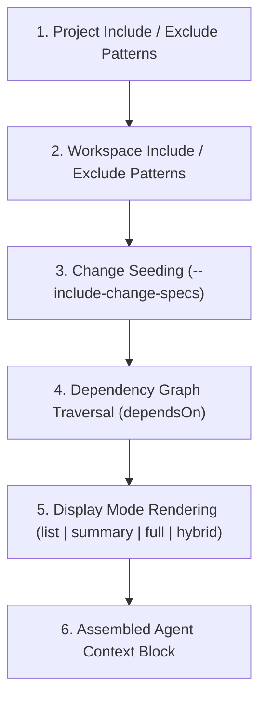

# Context Compilation

When an AI agent or human developer works on a change, it needs to know which specifications and constraints are relevant. Rather than dumping entire repositories into prompt windows or expecting an agent to guess where boundaries lie, SpecD compiles a structured, deterministic, and token-optimized **context block** at each lifecycle step.

---

## Why Context Compilation Matters

LLMs have finite context windows and suffer from attention degradation when presented with irrelevant noise ("needle in a haystack" problem). SpecD solves this by treating requirements as a dependency graph and dynamically assembling only the specs pertinent to the current work.

The result is a unified instruction block injected directly into agent sessions containing:

1. High-level project context and architecture guidelines.
2. Active artifact instructions according to the project's schema.
3. Relevant specification requirements, constraints, and scenarios.

---

## The Compilation Pipeline

Context compilation follows a deterministic 6-step pipeline:



### 1. Project-level include/exclude patterns

Specs configured under `context.include` in `specd.yaml` (e.g. `_global/architecture`, `_global/security`) are considered universally applicable and are automatically included in every compiled context. Conversely, patterns in `context.exclude` are filtered out.

### 2. Workspace-level patterns

Each workspace defined in `specd.yaml` can specify its own include and exclude rules. When compiling context for a workspace or package, only relevant workspace specs participate.

### 3. Change seeding (Change context only)

When compiling context for a change via `specd change context <change-id>`, the specs listed in the change manifest (`change.specIds`) are the primary seed.

- By default, SpecD focuses on dependencies and active instructions.
- Add `--include-change-specs` to force-seed all declared `specIds` directly into the compiled block.

### 4. Dependency graph traversal

Starting from the selected seeds, SpecD queries the `@specd/code-graph` or spec metadata and transitively traverses all `dependsOn` links. For instance, if `auth/oauth` depends on `auth/tokens`, both are collected.

### 5. Display mode rendering

Specs are formatted according to the configured `contextMode` to minimize token overhead while providing sufficient detail.

### 6. Assembly

The collected components are assembled into an ordered markdown payload ready to inject into the agent prompt or stdout.

---

## Display Modes

SpecD supports four display modes, configured via `contextMode` in `specd.yaml` or overridden per command invocation:

| Mode                      | Behavior                                                                                                                   | Best Used For                                                               |
| :------------------------ | :------------------------------------------------------------------------------------------------------------------------- | :-------------------------------------------------------------------------- |
| **`summary`** _(default)_ | Renders spec ID and summary metadata (`title`, `description`).                                                             | General orienting, planning, and keeping prompts lean.                      |
| **`list`**                | Emits only spec IDs (`workspace:path`).                                                                                    | Quick listing, shell piping, and minimal footprint lookups.                 |
| **`full`**                | Emits full content (purpose, requirements, constraints, scenarios) for all matched specs.                                  | Implementation and verification where exact scenario details are necessary. |
| **`hybrid`**              | Tiered rendering: directly targeted specs (`specIds`) render in `full`, while transitive dependencies render as `summary`. | Focused implementation with contextual awareness of dependencies.           |

> **Note:** For `project context` and `spec context`, `hybrid` automatically behaves as `full`.

---

## Context Commands

SpecD provides dedicated commands for inspecting context across different lifecycle levels:

### 1. Change Context

Compiles context specifically for an active change:

```bash
specd change context 20260923-144548-my-feature
specd change context 20260923-144548-my-feature --mode full --include-change-specs
```

### 2. Project Context

Compiles high-level project specs and global rules:

```bash
specd project context
specd project context --mode summary
```

### 3. Spec Context

Compiles a single canonical spec and its transitive dependencies:

```bash
specd spec context default:auth/login --mode full
```

### 4. Discovery: `project context-specs`

For pre-change discovery without markdown rendering, `context-specs` resolves the project and workspace include/exclude patterns and prints matching spec IDs:

```bash
specd project context-specs
specd project context-specs --workspace packages/core --workspaces-only
```

---

## Section Filtering Flags

When rendering in `full` mode, you can filter specific sections to keep token counts down:

- `--rules`: Emits only the requirements / rules section.
- `--constraints`: Emits only technical and operational constraints.
- `--scenarios`: Emits only verification test scenarios (`WHEN ... THEN ...`).

```bash
specd spec context default:auth/login --mode full --scenarios
```

_(In `list` and `summary` modes, these flags are accepted without altering the rendered shape)._

---

## Source-Aware Drill-Down Guidance

When output contains summary or list entries, SpecD prints helpful drill-down suggestions based on where the spec originated:

- For specs originating in the change (`source: 'specIds'`):
  ```bash
  specd changes spec-preview <change-name> <specId>
  ```
- For canonical workspace specs (`source: 'specDependsOn'`, `'includePattern'`, or `'dependsOnTraversal'`):
  ```bash
  specd specs context <specId> --mode full
  ```
