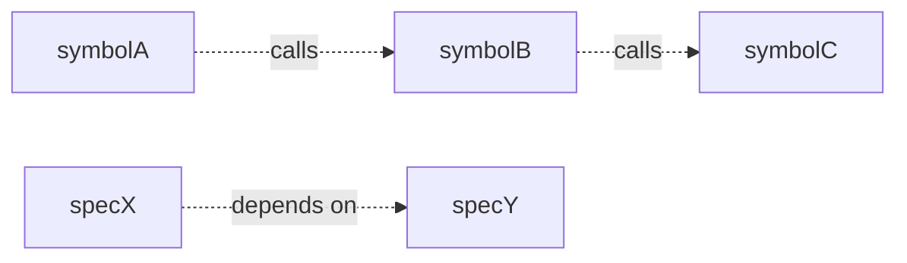

<!-- AI guidance: analyse what needs to change and how. Identify affected files, symbols,
     and modules. Document the implementation approach so tasks can be derived from it
     without ambiguity. Be concrete — specify file paths, class names, method signatures.
     Reference spec requirements — do not repeat them.
     Always write this artifact, even for non-code changes.

     Adapt the depth to the change:
     - Code changes: analyse the codebase — identify affected symbols, layers, and
       modules. Define new constructs with full signatures. Analyse symbol-level impact
       (callers, dependents, risk) and spec-level ripple effects before writing.
     - Non-code changes (documentation, configuration): focus on which files are
       affected, what content changes, and how it relates to existing material.

     Omit sections that genuinely do not apply (e.g. Trade-offs for a typo fix), but
     Affected areas, Approach, and New constructs (when applicable) are always required. -->

# Design: {{change.name}}

## Non-goals

<!-- What this design explicitly excludes. Scope boundaries prevent creep during
     implementation. If the change is small enough that non-goals are obvious,
     delete this section. -->

## Affected areas

<!-- List every EXISTING file, module, symbol, document, or resource that will be
     modified or removed. Use the codebase and tooling to discover these — do not
     guess. This analysis is how you find additional files that must be touched
     beyond the initially obvious target. For each area, explain what changes and why.

     For code changes, go beyond file-level analysis. Identify specific symbols
     (functions, classes, types, interfaces) being modified and assess their impact:
     - **Callers / dependents**: how many direct and transitive callers does each
       symbol have? Which files import it?
     - **Risk level**: symbols with many cross-workspace callers are high-risk.
       Flag symbols that are critical integration points.
     - **Hotspots**: symbols with high fan-in that require careful change management.

     Format each entry with the symbol, its location, what changes, and its impact
     assessment. Example:
       - `resolveConfig()` in `packages/core/src/application/resolve-config.ts`
         Change: add optional `overrides` parameter
         Callers: 12 direct (8 same-workspace, 4 cross-workspace) · Risk: HIGH
         Note: CLI and MCP both call this — signature change must be backwards-compatible -->

## New constructs

<!-- List every new file, class, interface, value object, factory, service, function,
     or type that will be created. For each one, specify:
     - **Location**: full file path where it will live.
     - **Shape**: interface signatures, constructor parameters, method signatures,
       key properties, and return types. Use TypeScript notation. This is the
       contract — implementers should not need to invent signatures.
     - **Responsibility**: one sentence on what it does and what it does not do.
     - **Relationships**: what it depends on, what depends on it, and where it fits
       in the dependency graph (layer, module, injection point).

     Delete this section only when the change creates no new symbols. -->

## Approach

<!-- The chosen strategy and why. How do the pieces fit together? What is the order
     of operations? Reference spec requirements to ensure full coverage — any
     requirement without a clear path to implementation should be flagged. -->

## Key decisions

<!-- Each significant technical choice with its rationale. For each decision, state
     what alternatives were considered and why they were rejected.
     Format: **Decision** → rationale. **Alternatives rejected** → why. -->

## Trade-offs

<!-- Known limitations or things that could go wrong, with mitigations.
     Format: [Risk] → Mitigation.
     Omit this section if genuinely not applicable. -->

## Spec impact

<!-- When this change modifies existing specs, analyse the ripple effect on other
     specs that depend on them. For each modified spec:
     - List specs that declare a dependency on it (direct dependents)
     - Identify transitive dependents — specs that depend on the direct dependents
     - For each dependent, assess whether its requirements are still satisfied or
       need updating. Flag any requirement in a dependent spec that references
       concepts, types, or behaviours being changed.
     - If this reveals additional specs that need requirement changes, they must be
       added to the change scope and handled with their own delta or artifact files;
       do not leave them as untracked ripple effects.

     This section prevents silent breakage: modifying a spec without understanding
     its dependents can invalidate downstream requirements. If no existing specs
     are modified, delete this section.

     Example:
       ### `core:change-manifest`
       - Direct dependents: `core:change-layout`, `core:change`
       - Transitive: `core:change` → `core:schema-format`
       - `core:change-layout` Req "Manifest location" references manifest field names
         → needs delta if fields are renamed
       - `core:change` Req "Event sourcing" reads manifest → unaffected (reads only
         state, not the fields being changed) -->

## Dependency map

<!-- Visualise the key relationships this change touches. Provide BOTH representations
     so the map is useful regardless of rendering support:

     1. A mermaid diagram for rendered markdown viewers
     2. An ASCII box diagram for raw markdown readers. Use boxes (┌─┐│└─┘),
        arrows (───▶, ◀───, ─ ─ ▶), and connectors to draw a real visual diagram,
        not just an indented tree. It should read as a diagram, not a list.

     Focus on what matters for THIS change. Do not map the entire codebase. Show:
     - Symbols being changed and their callers/dependents
     - Specs being modified and their dependent specs
     - Cross-workspace boundaries when relevant

     Keep it focused: 5~15 nodes is usually enough. A diagram with 30 nodes helps
     no one. Delete this section for trivial changes.

     Replace the examples below with the actual diagrams for this change. -->



```
┌─────────────┐       ┌───────────┐
│ cli:run     │◀──────│ resolve   │
└─────────────┘       │ Config()  │
┌─────────────┐       │           │
│ mcp:handler │◀──────│  [HIGH]   │
└─────────────┘       └─────┬─────┘
                            │
                            ▼
                      ┌─────────────┐
                      │ loadWork    │
                      │ space()     │
                      └─────┬───────┘
                            │
                            ▼
                      ┌──────────────┐
                      │ validate     │
                      │ Schema()     │
                      └──────────────┘

┌──────────┐  depends on  ┌──────────┐
│ specX    │─ ─ ─ ─ ─ ─ ─▶│ specY    │
└──────────┘              └──────────┘
```

## Migration / Rollback

<!-- Steps to deploy and roll back safely. Include this section when the change
     affects runtime state, APIs, data models, or external dependencies.
     Delete this section for purely additive internal changes. -->

## Testing

<!-- Plan how the implementation will be verified. Two layers:

     **Automated tests** (when a test suite exists):
     List every new test file or describe block to create. Each scenario in verify.md
     must map to at least one test. Beyond verify coverage, add tests for edge cases,
     error paths, and anything that could reasonably break. Specify file paths and
     describe what each test asserts.

     **Manual / E2E verification** (always):
     Describe the manual steps to confirm the change works end-to-end in a real
     environment. Even when automated tests exist, manual verification catches
     integration issues that unit tests miss. Include the commands to run, the
     expected output, and how to tell if something is wrong.

     Also note which linting rules or documentation sources apply, and flag gaps. -->

## Open questions

<!-- Outstanding unknowns to resolve during implementation.
     Delete this section if there are none. -->
