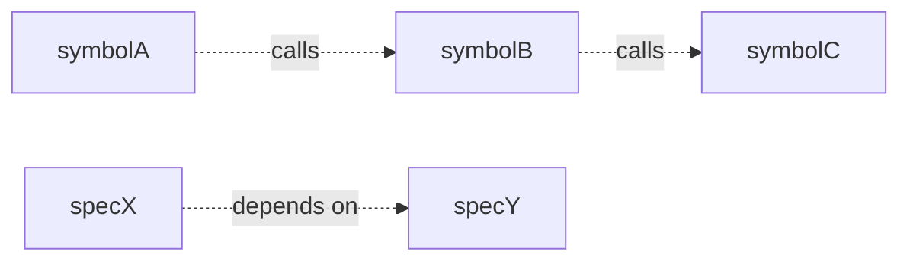

<!-- AI guidance: this artifact is the authoritative implementation contract and single
     source of truth for implementation. It must be fully self-contained, self-sufficient,
     and independently consumable.
     Do NOT use vague descriptions, TODOs, placeholders, or indirect references (like
     "as specified in spec" or "see previous artifact"). Materialize and restate all
     required technical information directly.
     A developer or agent reading ONLY this document must be able to implement the complete
     solution without guessing signatures, data shapes, error handling, or algorithms.
     Always write this artifact, even for non-code changes. -->

# Design: {{change.name}}

## Non-goals

<!-- What this design explicitly excludes. Scope boundaries prevent creep during
     implementation. If the change is small enough that non-goals are obvious,
     delete this section. -->

## Affected areas

<!-- List every EXISTING file, module, symbol, document, or resource that will be
     modified or removed. Rigorously use SpecD tools (impact & blast-radius analysis,
     code/symbol search, hotspots inspection) to discover all affected targets so nothing
     is missed or left untracked — do not guess or rely on manual assumptions.

     For each existing area, provide exact technical details:
     - **File path**: full path from workspace root.
     - **Symbol / construct**: function, class, interface, method, or export modified.
     - **Changes**: exact modification (arguments added/removed, return type changes,
       internal logic updates, behavioral changes). Include before/after signatures.
     - **Impact & Risk**: callers, importers, dependents, risk level, and backwards-compatibility
       handling.

     Example:
       - `resolveConfig()` in `packages/core/src/application/resolve-config.ts`
         - Signature change:
           ```ts
           // Before:
           function resolveConfig(path: string): Promise<Config>;
           // After:
           function resolveConfig(path: string, options?: ResolveOptions): Promise<Config>;
           ```
         - Behavioral change: when `options.overrides` is provided, merges overrides into loaded config before schema resolution.
         - Callers & Risk: 12 direct callers (8 same-workspace, 4 cross-workspace) · Risk: HIGH.
         - Backwards compatibility: `options` is optional; existing call sites remain functional without changes. -->

## New constructs

<!-- List every NEW file, class, interface, type, function, service, or value object
     to create. Provide complete, compilable TypeScript / language definitions — do not
     leave signatures or fields to be invented during implementation.

     For each construct specify:
     - **Location**: full file path.
     - **Complete Type / Signature**: full interface, type alias, or function signature
       with all properties, parameters, optionality, and return types.
     - **Responsibility & Invariants**: exact business rules and invariants enforced.
     - **Wiring & Dependencies**: where it is instantiated, injected, or called.

     Example:
       ```ts
       // packages/core/src/domain/entities/impact-report.ts
       export interface ImpactTarget {
         readonly file: string;
         readonly symbol?: string;
         readonly riskLevel: 'LOW' | 'MEDIUM' | 'HIGH' | 'CRITICAL';
       }

       export interface ImpactReport {
         readonly targets: readonly ImpactTarget[];
         readonly totalAffectedFiles: number;
         readonly hasCrossWorkspaceImpact: boolean;
       }
       ``` -->

## Data models & Contracts

<!-- Explicit data schemas, input/output interfaces, payload contracts, state structures,
     or configuration formats involved in this change.
     Define field names, exact types, validation constraints, default values, and optionality.
     Delete this section only if no data structures or contracts are created or modified. -->

## Approach & Execution flow

<!-- Concrete, step-by-step algorithmic flow and architecture strategy:
     - Sequence of operations: step 1, step 2, step 3 from invocation to return.
     - State transitions and lifecycle mutations.
     - Data transformations: how inputs are parsed, converted, and returned.
     - Control flow, branching logic, and condition checks.
     Be explicit and granular: the implementer should follow this flow directly
     without needing to design the algorithm on the fly. -->

## Error handling & Edge cases

<!-- Explicitly specify all failure modes, validation errors, and edge cases:
     - Exact error classes, error codes, and message formats.
     - Validation failure behaviors (e.g. return failure result vs throw exception).
     - Edge cases: empty collections, missing files, concurrency collisions, undefined inputs,
       stale data, boundary values.
     - Recovery / fallback strategies for each failure mode. -->

## Key decisions

<!-- Significant technical choices with their rationale:
     - **Decision**: what was chosen and why.
     - **Alternatives rejected**: other approaches considered and specific reasons they were ruled out. -->

## Trade-offs

<!-- Known limitations, compromises, or operational risks with mitigations.
     Format: [Risk / Limitation] → Mitigation.
     Omit only if genuinely not applicable. -->

## Spec impact

<!-- When this change modifies existing specs, analyse the ripple effect on other
     specs that depend on them using SpecD tools (such as spec impact analysis and dependency tracing):
     - Direct dependents: specs that declare a dependency on the modified specs.
     - Transitive dependents: specs that depend on the direct dependents.
     - Requirement assessment: whether dependent specs' requirements remain valid or
       require updates.
     - If updates are needed, ensure the affected specs are added to the change scope.
     Delete this section if no existing specs are modified. -->

## Dependency map

<!-- Visualise the key relationships touched by this change:
     1. Mermaid diagram (rendered markdown)
     2. ASCII box diagram (raw text readers)

     Show affected symbols, calling modules, modified specs, and cross-workspace edges.
     Delete this section for trivial changes. -->


```mermaid
graph LR
  symbolA -. calls .-> symbolB
  symbolB -. calls .-> symbolC
  specX -. depends on .-> specY
```

```
┌─────────────┐       ┌───────────┐
│ cli:run     │◀──────│ resolve   │
│             │       │ Config()  │
│             │       │  [HIGH]   │
└─────────────┘       └─────┬─────┘
                            │
                            ▼
                      ┌─────────────┐
                      │ loadWork    │
                      │ space()     │
                      └─────────────┘
```

## Migration / Rollback

<!-- Steps to deploy, migrate state/data, and roll back safely.
     Include when changing runtime state, APIs, schemas, storage, or external dependencies.
     Delete for purely additive, non-breaking internal changes. -->

## Testing

<!-- Plan how the implementation will be verified:

     **Automated tests**:
     - Unit tests: specific files, describe blocks, mocked dependencies, and assertions.
     - Integration tests: temporary filesystem, real adapter wiring, expected outputs.
     - Edge-case tests: error conditions, boundary inputs, malformed data.

     **Manual / E2E verification**:
     - Step-by-step commands to run in a real environment.
     - Expected outputs and assertions.
     - Failure indicators to watch for. -->

## Open questions

<!-- Outstanding unknowns to resolve before or during implementation.
     Delete this section if all questions have been resolved. -->
