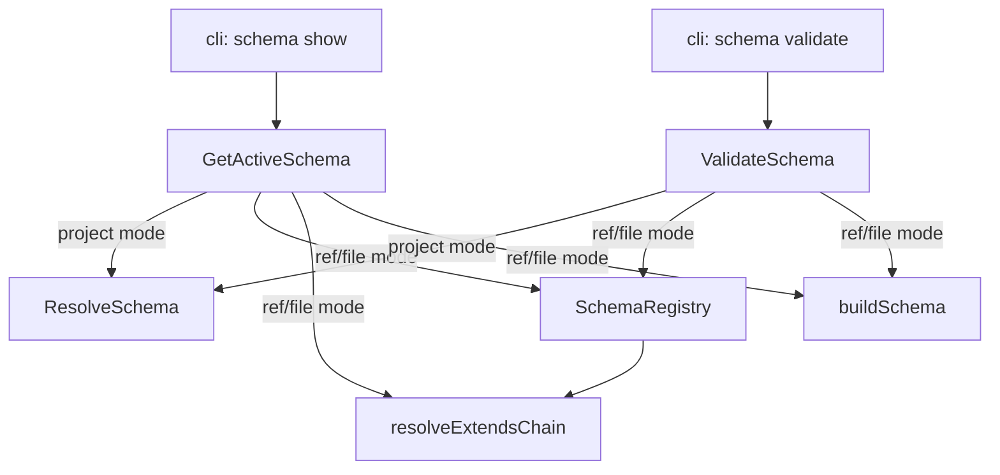

# Design: schema-ref-resolution

## Non-goals

- Applying project plugins or overrides when resolving by ref or file — these modes resolve the schema with its extends chain only.
- Adding `--raw` support to `schema show` — `--raw` is specific to project validation.
- Changing `SchemaRegistry` or `resolveExtendsChain` — the infrastructure already supports all ref formats.

## Affected areas

- **`GetActiveSchema`** in `packages/core/src/application/use-cases/get-active-schema.ts`
  Change: add optional `GetActiveSchemaInput` parameter to `execute()`, add `_resolveByRef()` and `_resolveByFile()` private methods, add `SchemaRegistry` and `buildSchemaFn` constructor dependencies.
  Callers: 3 direct in CLI (`show.ts`, `artifacts.ts`, `create.ts`) + kernel composition · Risk: MEDIUM
  Note: all existing callers pass no arguments — backwards-compatible since input is optional.

- **`ValidateSchema`** in `packages/core/src/application/use-cases/validate-schema.ts`
  Change: add `ref` case to `ValidateSchemaInput` union and `execute()` switch, add `_validateRef()` private method.
  Callers: 1 direct (CLI `validate.ts`) + kernel composition · Risk: LOW

- **`registerSchemaShow`** in `packages/cli/src/commands/schema/show.ts`
  Change: add `[ref]` argument, add `--file` option, dispatch to `getActiveSchema.execute()` with appropriate input mode.
  Callers: CLI command registration · Risk: LOW

- **`registerSchemaValidate`** in `packages/cli/src/commands/schema/validate.ts`
  Change: add `[ref]` argument, expand mutual exclusivity checks, dispatch to `validateSchema.execute()` with `ref` mode.
  Callers: CLI command registration · Risk: LOW

- **Kernel composition** in `packages/core/src/composition/kernel.ts` (line 262)
  Change: pass `i.schemas` and `buildSchema` to `GetActiveSchema` constructor.

- **Composition factory** in `packages/core/src/composition/use-cases/get-active-schema.ts`
  Change: pass `schemas` and `buildSchema` to `GetActiveSchema` constructor.

- **Test files:**
  - `packages/core/test/application/use-cases/get-active-schema.spec.ts` — add ref/file mode tests
  - `packages/core/test/application/use-cases/validate-schema.spec.ts` — add ref mode tests
  - `packages/cli/test/commands/schema-show.spec.ts` — add ref/file mode tests
  - `packages/cli/test/commands/schema-validate.spec.ts` — add ref mode tests

## New constructs

### `GetActiveSchemaInput` type

- **Location:** `packages/core/src/application/use-cases/get-active-schema.ts`
- **Shape:**
  ```typescript
  export type GetActiveSchemaInput =
    | { readonly mode: 'ref'; readonly ref: string }
    | { readonly mode: 'file'; readonly filePath: string }
  ```
- **Responsibility:** Discriminated union for the optional input to `GetActiveSchema.execute()`. When absent, the use case resolves the project's active schema.
- **Relationships:** Used by CLI `schema show` command; exported from `@specd/core`.

### `ValidateSchemaInput` — `ref` variant (added to existing union)

- **Location:** `packages/core/src/application/use-cases/validate-schema.ts`
- **Shape:** Add `| { readonly mode: 'ref'; readonly ref: string }` to existing `ValidateSchemaInput` union.
- **Responsibility:** Represents the ref validation mode in the existing input type.

## Approach

### 1. Core: extend `ValidateSchema` with ref mode

Add `{ mode: 'ref', ref: string }` to `ValidateSchemaInput`. Implement `_validateRef(ref: string)` as a private method. The logic is nearly identical to `_validateFile()`:

1. `schemas.resolveRaw(ref)` — resolve the reference
2. `resolveExtendsChain(schemas, raw)` — walk the extends chain
3. Build extends chain warnings (same pattern as file mode)
4. Merge templates (parent first, child overrides)
5. `buildSchemaFn(ref, cascadedData, templates)` — build and validate
6. Return structured result

The only difference from `_validateFile` is the error message on null: `"schema '${ref}' not found"` vs `"file not found: ${filePath}"`.

### 2. Core: extend `GetActiveSchema` with ref/file modes

**Constructor changes:** Add two new dependencies alongside `resolveSchema`:

- `schemas: SchemaRegistry` — for ref/file resolution
- `buildSchemaFn: (ref, data, templates) => Schema` — for building the Schema entity

**`execute()` signature:** Change from `execute(): Promise<Schema>` to `execute(input?: GetActiveSchemaInput): Promise<Schema>`.

- Without input (or `undefined`): delegate to `resolveSchema.execute()` as before.
- With `{ mode: 'ref', ref }`: call `_resolveByRef(ref)`.
- With `{ mode: 'file', filePath }`: call `_resolveByFile(filePath)`.

**`_resolveByRef(ref)` and `_resolveByFile(filePath)`** follow the same pattern:

1. `schemas.resolveRaw(ref/filePath)` → null check → `SchemaNotFoundError`
2. `resolveExtendsChain(schemas, raw)` → cascaded data + templates
3. Merge templates (inherited first, base overrides)
4. `buildSchemaFn(ref/filePath, cascadedData, templates)` → `Schema`

These two methods share ~90% logic with `ValidateSchema._validateFile`. This is acceptable duplication (~15 lines each) since:

- `GetActiveSchema` throws on failure (returns `Schema`)
- `ValidateSchema` catches and returns structured results (returns `ValidateSchemaResult`)
- Extracting a shared helper would couple two independent use cases

### 3. Core: update kernel composition

In `createKernel()` (kernel.ts line 262), change:

```typescript
getActiveSchema: new GetActiveSchema(resolveSchema),
```

to:

```typescript
getActiveSchema: new GetActiveSchema(resolveSchema, i.schemas, buildSchema),
```

Same change in `createGetActiveSchema()` composition factory — pass `schemas` and `buildSchema`.

### 4. CLI: update `schema show`

- Add `.argument('[ref]', 'schema reference to show')` before `.option(...)`.
- Add `.option('--file <path>', 'show a schema from a file')`.
- Add mutual exclusivity check: if both ref and file are provided, `cliError('[ref] and --file are mutually exclusive', ...)`.
- Dispatch:
  - No ref, no file → `kernel.specs.getActiveSchema.execute()` (current behavior)
  - Ref provided → `kernel.specs.getActiveSchema.execute({ mode: 'ref', ref })`
  - File provided → `kernel.specs.getActiveSchema.execute({ mode: 'file', filePath: resolve(opts.file) })`
- Add `mode` field to JSON output (`'project'`, `'ref'`, or `'file'`).
- In text mode, only show the `plugins:` line when mode is `project`.

### 5. CLI: update `schema validate`

- Add `.argument('[ref]', 'schema reference to validate')` before `.option(...)`.
- Expand mutual exclusivity: check ref vs file, ref vs raw (in addition to existing file vs raw).
- Dispatch:
  - Ref provided → `{ mode: 'ref' as const, ref }`
  - Existing file/raw/project logic unchanged
- Add `[ref]` suffix in text output and `"ref"` mode in JSON output.
- `modeLabel` computation: add `'ref'` case.

## Key decisions

- **Extend `GetActiveSchema` rather than creating a new use case.** The existing use case is the natural place for "get me a schema" — adding modes keeps the CLI adapter thin and the kernel API surface small. `execute(input?)` with optional input is backward-compatible.
  **Alternatives rejected:** A new `ShowSchema` use case would duplicate the resolution pattern without adding architectural value — it would just be `GetActiveSchema` with a parameter.

- **Duplicate the resolveRaw → extends → build pipeline in `GetActiveSchema` rather than sharing it with `ValidateSchema`.** The two use cases have different error handling contracts (throw vs structured result), making shared extraction awkward. ~15 lines of duplication is acceptable.
  **Alternatives rejected:** A shared `resolveSchemaByRef()` helper would couple the two use cases and require a common error handling strategy.

- **`[ref]` and `--file` are separate inputs, not unified.** `[ref]` goes through `SchemaRegistry` routing (npm, workspace, bare name), while `--file` is always a filesystem path. Keeping them separate preserves clarity and matches the existing `validate` pattern.

## Spec impact

### `core:core/get-active-schema`

- Direct dependents: `cli:cli/schema-show`, `cli:cli/change-create`, `cli:cli/change-artifacts`
- `cli:cli/schema-show` — directly modified in this change
- `cli:cli/change-create` and `cli:cli/change-artifacts` — call `execute()` without arguments, unaffected by the optional parameter addition

### `core:core/validate-schema`

- Direct dependents: `cli:cli/schema-validate`
- `cli:cli/schema-validate` — directly modified in this change

## Dependency map



```
┌──────────────────┐     ┌──────────────────┐
│ cli: schema show │     │ cli: schema      │
│   [ref] --file   │     │   validate [ref] │
└────────┬─────────┘     └────────┬─────────┘
         │                        │
         ▼                        ▼
┌──────────────────┐     ┌──────────────────┐
│ GetActiveSchema  │     │ ValidateSchema   │
│  execute(input?) │     │  execute(input)  │
└───┬──────────┬───┘     └───┬──────────┬───┘
    │ project  │ ref/file    │ project  │ ref/file
    ▼          ▼             ▼          ▼
┌────────┐ ┌──────────┐  ┌────────┐ ┌──────────┐
│Resolve │ │ Schema   │  │Resolve │ │ Schema   │
│Schema  │ │ Registry │  │Schema  │ │ Registry │
└────────┘ └────┬─────┘  └────────┘ └────┬─────┘
                │                         │
                ▼                         ▼
          ┌───────────────┐         ┌───────────────┐
          │resolveExtends │         │resolveExtends │
          │Chain + build  │         │Chain + build  │
          │Schema         │         │Schema         │
          └───────────────┘         └───────────────┘
```

## Testing

### Automated tests

**`packages/core/test/application/use-cases/get-active-schema.spec.ts`:**

- Add `describe('ref mode')` block:
  - Scenario: valid ref resolves schema with extends chain
  - Scenario: ref not found throws `SchemaNotFoundError`
  - Scenario: ref with circular extends throws `SchemaValidationError`
  - Scenario: no plugins/overrides applied in ref mode
- Add `describe('file mode')` block:
  - Scenario: valid file path resolves schema
  - Scenario: file not found throws `SchemaNotFoundError`
- Existing project-mode tests must remain passing unchanged.

**`packages/core/test/application/use-cases/validate-schema.spec.ts`:**

- Add `describe('ref mode')` block:
  - Scenario: valid ref returns `{ valid: true }` with Schema
  - Scenario: ref not found returns `{ valid: false }` with error
  - Scenario: ref with extends chain emits warnings
  - Scenario: ref with circular extends returns `{ valid: false }`
  - Scenario: ref with invalid content returns `{ valid: false }`
- Existing tests must remain passing unchanged.

**`packages/cli/test/commands/schema-show.spec.ts`:**

- Add tests for `[ref]` argument and `--file` flag
- Test mutual exclusivity error
- Test `mode` field in JSON output

**`packages/cli/test/commands/schema-validate.spec.ts`:**

- Add tests for `[ref]` argument
- Test mutual exclusivity: ref+file, ref+raw
- Test `[ref]` suffix in text output
- Test `"ref"` mode in JSON output

### Manual verification

```bash
# Show project's active schema (existing behavior)
node packages/cli/dist/index.js schema show

# Show a schema by npm ref
node packages/cli/dist/index.js schema show @specd/schema-std

# Show a schema by file
node packages/cli/dist/index.js schema show --file packages/schema-std/schema.yaml

# Validate by ref
node packages/cli/dist/index.js schema validate @specd/schema-std

# Validate by ref with JSON output
node packages/cli/dist/index.js schema validate @specd/schema-std --format json

# Mutual exclusivity errors
node packages/cli/dist/index.js schema show @specd/schema-std --file ./foo.yaml
node packages/cli/dist/index.js schema validate @specd/schema-std --raw
node packages/cli/dist/index.js schema validate @specd/schema-std --file ./foo.yaml

# Ref not found
node packages/cli/dist/index.js schema show @nonexistent/schema
node packages/cli/dist/index.js schema validate @nonexistent/schema
```

## Open questions

None.
