# Design: indexer-config-exclude-paths

## Non-goals

- No per-file include patterns (only exclusions)
- No `--respect-gitignore` / `--no-respect-gitignore` CLI flag — config-only
- No changes to query-time `--exclude-path` on `graph search` / `graph hotspots`
- No migration of existing `.specd.yaml` files — new fields are optional with backward-compatible defaults

## Affected areas

### `packages/core/src/application/specd-config.ts`

- **`SpecdWorkspaceConfig`** interface — add optional `graph?: SpecdWorkspaceGraphConfig` field
- Impact: `isSpecdConfig` (CRITICAL, 118 dependents via zod inference) auto-updates — no manual callers to touch
- Risk: LOW — additive optional field, no existing callers break

### `packages/core/src/infrastructure/fs/config-loader.ts`

- **`WorkspaceRawZodSchema`** — add `graph` block (currently `.strict()` — unknown fields cause startup error, so this is required to accept the new config)
- Workspace builder block (lines ~420–450) — read `ws.graph` and pass to `SpecdWorkspaceConfig`
- Risk: LOW — additive schema extension

### `packages/code-graph/src/domain/value-objects/index-options.ts`

- **`WorkspaceIndexTarget`** interface — add `excludePaths?: readonly string[]` and `respectGitignore?: boolean`
- Risk: LOW — additive optional fields; one call site (`build-workspace-targets.ts`)

### `packages/code-graph/src/application/use-cases/discover-files.ts`

- Remove `EXCLUDED_DIRS` constant (lines 5–14)
- Add exported `DEFAULT_EXCLUDE_PATHS` constant (same values, as gitignore-syntax patterns)
- Add `DiscoverFilesOptions` interface and optional third param to `discoverFiles`
- Remove `EXCLUDED_DIRS.has(entry)` guard (line 126)
- Add config `ignore` instance (built from `excludePaths ?? DEFAULT_EXCLUDE_PATHS`) applied after gitignore evaluation
- Risk: LOW — single caller (`index-code-graph.ts:174`)

### `packages/code-graph/src/application/use-cases/index-code-graph.ts`

- `discoverFiles(ws.codeRoot, ...)` call (line 174) — pass options: `{ excludePaths: ws.excludePaths, respectGitignore: ws.respectGitignore }`
- Risk: LOW — single call site change

### `packages/cli/src/commands/graph/build-workspace-targets.ts`

- `buildWorkspaceTargets()` — when constructing each target, spread `ws.graph` fields (`excludePaths`, `respectGitignore`) conditionally
- Risk: LOW — additive fields on returned targets

### `packages/cli/src/commands/graph/index-graph.ts`

- Add `--exclude-path <pattern>` option with `.collect()` for repeatability (or manual array accumulation via `.option(...).action`)
- In the action, merge CLI `--exclude-path` flags with each target's `excludePaths` before calling `provider.index()`
- Risk: LOW — new optional flag, no breaking change

### `docs/cli/cli-reference.md`

- Add `## graph` section (after `## config` or `## schema`) covering all five subcommands
- Risk: NONE — additive documentation

## New constructs

### `SpecdWorkspaceGraphConfig` in `packages/core/src/application/specd-config.ts`

```typescript
/** Per-workspace code graph configuration from `specd.yaml`. */
export interface SpecdWorkspaceGraphConfig {
  /**
   * Whether `.gitignore` files are loaded and applied during file discovery.
   * Defaults to `true`. When `false`, only `excludePaths` governs exclusion.
   */
  readonly respectGitignore?: boolean
  /**
   * Gitignore-syntax exclusion patterns applied during file discovery.
   * Supports `!` negation. When absent, built-in defaults apply.
   * When present, replaces built-in defaults entirely.
   */
  readonly excludePaths?: readonly string[]
}
```

### `DiscoverFilesOptions` in `packages/code-graph/src/application/use-cases/discover-files.ts`

```typescript
export interface DiscoverFilesOptions {
  readonly excludePaths?: readonly string[]
  readonly respectGitignore?: boolean
}

export const DEFAULT_EXCLUDE_PATHS: readonly string[] = [
  'node_modules/',
  '.git/',
  '.specd/',
  'dist/',
  'build/',
  'coverage/',
  '.next/',
  '.nuxt/',
]

export function discoverFiles(
  root: string,
  hasAdapter: (filePath: string) => boolean,
  options?: DiscoverFilesOptions,
): string[]
```

`DEFAULT_EXCLUDE_PATHS` must be exported so `index-graph.ts` can use it when merging CLI `--exclude-path` flags with an absent config.

## Approach

Implementation order (each step is independently testable):

**Step 1 — Core types (`@specd/core`)**

In `specd-config.ts`: add `SpecdWorkspaceGraphConfig` interface and `graph?: SpecdWorkspaceGraphConfig` to `SpecdWorkspaceConfig`.

In `config-loader.ts`: add `graph` zod sub-schema to `WorkspaceRawZodSchema`:

```typescript
const WorkspaceGraphZodSchema = z
  .object({
    respectGitignore: z.boolean().optional(),
    excludePaths: z.array(z.string()).optional(),
  })
  .strict()

const WorkspaceRawZodSchema = z
  .object({
    // ... existing fields ...
    graph: WorkspaceGraphZodSchema.optional(),
  })
  .strict()
```

In the workspace builder block, pass the graph config:

```typescript
...(ws.graph !== undefined
  ? {
      graph: {
        ...(ws.graph.respectGitignore !== undefined
          ? { respectGitignore: ws.graph.respectGitignore }
          : {}),
        ...(ws.graph.excludePaths !== undefined
          ? { excludePaths: ws.graph.excludePaths }
          : {}),
      },
    }
  : {}),
```

**Step 2 — `WorkspaceIndexTarget` (`@specd/code-graph`)**

In `index-options.ts`, add the two optional fields to `WorkspaceIndexTarget`. No logic change — purely a type extension.

**Step 3 — `discoverFiles` (`@specd/code-graph`)**

Replace `EXCLUDED_DIRS` with `DEFAULT_EXCLUDE_PATHS` and `DiscoverFilesOptions`. New evaluation logic in `isIgnored`:

```typescript
// Build two ignore instances at function start:
const gitignoreScoped: Array<{ ig: ReturnType<typeof ignore>; base: string }> = []
const configIg = ignore()
configIg.add([...(options?.excludePaths ?? DEFAULT_EXCLUDE_PATHS)])

// isIgnored evaluates gitignore first (if respectGitignore !== false), then config:
function isIgnored(relPath: string, isDir: boolean): boolean {
  const target = isDir ? relPath + '/' : relPath

  // Layer 1: gitignore (absolute priority)
  if (options?.respectGitignore !== false) {
    let gitIgnored = false
    for (const { ig, base } of gitignoreScoped) {
      /* existing logic */
    }
    if (gitIgnored) return true
  }

  // Layer 2: config excludePaths
  const result = configIg.test(target)
  if (result.ignored) return true
  if (result.unignored) return false

  return false
}
```

Remove the `EXCLUDED_DIRS.has(entry) continue` guard (line 126) — directory exclusion is now handled entirely by `isIgnored()` via the config layer.

Note: gitignore loading (`loadIgnoreFile`, `findGitRoot`) is conditional on `respectGitignore !== false`. When `false`, `gitignoreScoped` stays empty and layer 1 is skipped entirely.

**Step 4 — `index-code-graph.ts` (`@specd/code-graph`)**

Update the `discoverFiles` call to pass workspace options:

```typescript
const relFiles = discoverFiles(
  ws.codeRoot,
  (filePath) => this.registry.getAdapterForFile(filePath) !== undefined,
  {
    excludePaths: ws.excludePaths,
    respectGitignore: ws.respectGitignore,
  },
)
```

**Step 5 — `build-workspace-targets.ts` (`@specd/cli`)**

Pass graph config fields when building each target:

```typescript
targets.push({
  name: ws.name,
  codeRoot: ws.codeRoot,
  ...(repoRoot !== undefined ? { repoRoot } : {}),
  ...(ws.graph?.excludePaths !== undefined ? { excludePaths: ws.graph.excludePaths } : {}),
  ...(ws.graph?.respectGitignore !== undefined
    ? { respectGitignore: ws.graph.respectGitignore }
    : {}),
  specs: () => resolveSpecsFromRepo(kernel.specs.repos.get(ws.name), ws.name),
})
```

**Step 6 — `index-graph.ts` (`@specd/cli`)**

Add `--exclude-path` flag and merge logic:

```typescript
.option(
  '--exclude-path <pattern>',
  'gitignore-syntax pattern to exclude (repeatable; merges with config)',
  (val: string, prev: string[]) => [...prev, val],
  [] as string[],
)
```

In the action, after `buildWorkspaceTargets`, apply CLI overrides:

```typescript
const cliExcludePaths: string[] = opts.excludePath // string[]

const workspacesWithOverrides =
  cliExcludePaths.length > 0
    ? workspaces.map((ws) => ({
        ...ws,
        excludePaths: [...(ws.excludePaths ?? DEFAULT_EXCLUDE_PATHS), ...cliExcludePaths],
      }))
    : workspaces
```

Import `DEFAULT_EXCLUDE_PATHS` from `@specd/code-graph`.

**Step 7 — `docs/cli/cli-reference.md`**

Add `## graph` section covering:

- `### graph index` — full signature, `--exclude-path` / `--workspace` / `--force` / `--format`, `graph.excludePaths` and `graph.respectGitignore` config fields, built-in defaults list, replace semantics, negation example
- `### graph search` — flags, examples
- `### graph hotspots` — flags, examples
- `### graph stats` — flags, examples
- `### graph impact` — flags, examples

## Key decisions

**`DEFAULT_EXCLUDE_PATHS` exported from `discover-files.ts`** — the CLI merge logic needs access to the defaults to construct the full list when `ws.excludePaths` is absent. Exporting from the use-case module keeps the single source of truth without leaking implementation details through multiple layers. **Alternative rejected:** duplicate the list in `index-graph.ts` — duplication creates drift risk.

**Replace semantics (not merge) for `excludePaths`** — when a user specifies `excludePaths`, they take full control; defaults are not silently added. Users who want standard exclusions can copy-paste from the docs. **Alternative rejected:** merge with defaults — harder to reason about ("why is `node_modules/` still being excluded if I didn't list it?"); surprising when adding a single pattern.

**gitignore absolute priority** — `.gitignore` rules cannot be re-included by `excludePaths`. This matches the semantics of the `ignore` library and prevents accidental indexing of committed-to-ignore files. **Alternative rejected:** allow `excludePaths` to override gitignore — too surprising; gitignore is the repo's source of truth for what should not be tracked.

**`DiscoverFilesOptions` as a third parameter (not spreading fields)** — keeps the `discoverFiles` signature clean and extensible. **Alternative rejected:** separate `excludePaths` and `respectGitignore` params — positional params become unwieldy if further options are added.

**CLI merge: append to effective list** — `--exclude-path` appends to `ws.excludePaths ?? DEFAULT_EXCLUDE_PATHS`. This means CLI flags never reduce the exclusion set, only extend it. **Alternative rejected:** replace config entirely — defeats the purpose of having config; users would need to repeat config values on every CLI invocation.

## Trade-offs

- **Performance of removing `EXCLUDED_DIRS` guard:** the early-exit guard prevented `readdirSync` on large dirs like `node_modules/`. With the new approach, `readdirSync` is still avoided because `isIgnored(relPath, true)` returns `true` for the directory and `walk()` never recurses into it. The pattern `node_modules/` in `configIg` will match `node_modules/` (trailing slash added for dirs). No performance regression expected.

- **`.strict()` on `WorkspaceGraphZodSchema`:** unknown fields in `graph:` block fail at startup. This is intentional (consistent with `WorkspaceRawZodSchema`) but means future fields require a spec+code change. Mitigation: well-documented schema catches typos early.

## Spec impact

The 4 specs modified in this change are leaf specs — no other currently registered specs declare `dependsOn` on them. No ripple effect on other specs.

`core:core/config` is referenced in context by many skills and agents, but its requirements regarding workspace shape are only additive here. Existing behaviour (no `graph` key) is unchanged.

## Dependency map

```mermaid
graph LR
  specd.yaml -->|graph block| FsConfigLoader
  FsConfigLoader -->|SpecdWorkspaceGraphConfig| SpecdWorkspaceConfig
  SpecdWorkspaceConfig -->|ws.graph| buildWorkspaceTargets
  buildWorkspaceTargets -->|excludePaths, respectGitignore| WorkspaceIndexTarget
  index-graph.ts -->|--exclude-path merge| WorkspaceIndexTarget
  WorkspaceIndexTarget -->|options| IndexCodeGraph
  IndexCodeGraph -->|DiscoverFilesOptions| discoverFiles
  discoverFiles -->|DEFAULT_EXCLUDE_PATHS| index-graph.ts
```



```
  specd.yaml
      │ graph block
      ▼
┌─────────────────┐    SpecdWorkspaceGraphConfig    ┌──────────────────────┐
│  FsConfigLoader │ ──────────────────────────────▶ │ SpecdWorkspaceConfig │
└─────────────────┘                                  └──────────┬───────────┘
                                                                │ ws.graph
                                                                ▼
┌──────────────────┐   --exclude-path   ┌──────────────────────────────┐
│  index-graph.ts  │ ─ ─ ─ ─ ─ ─ ─ ─ ─▶│    buildWorkspaceTargets     │
└──────────────────┘   (merge)          └──────────────┬───────────────┘
       │                                               │ excludePaths
       │ DEFAULT_EXCLUDE_PATHS                         │ respectGitignore
       │ ◀─ ─ ─ ─ ─ ─ ─ ─ ─ ─ ─ ─ ─ ─ ─ ─ ─ ─ ─ ─ ─ ─ ▼
       │                                    ┌────────────────────────┐
       │                                    │  WorkspaceIndexTarget  │
       │                                    └────────────┬───────────┘
       │                                                 │
       │                                                 ▼
       │                                    ┌────────────────────────┐
       │                                    │    IndexCodeGraph      │
       │                                    └────────────┬───────────┘
       │                                                 │ DiscoverFilesOptions
       │                                                 ▼
       └────────────────────────────────▶  ┌────────────────────────┐
                                           │    discoverFiles       │
                                           │  DEFAULT_EXCLUDE_PATHS │
                                           └────────────────────────┘
```

## Testing

### Automated tests

**`packages/code-graph/test/application/use-cases/discover-files.spec.ts`** (new file)

Unit tests for `discoverFiles` with the new options. Uses `tmp` directory fixtures:

- `DEFAULT_EXCLUDE_PATHS applied when no options` — `node_modules/` dir not discovered
- `custom excludePaths replaces defaults` — `node_modules/` discovered when not listed; custom dir excluded
- `negation re-includes subdirectory` — `.specd/*` + `!.specd/metadata/` leaves `metadata/` visible
- `respectGitignore: false ignores gitignore` — `.gen.ts` files discovered despite `.gitignore` exclusion
- `gitignore has absolute priority over excludePaths` — `!generated/` in excludePaths cannot re-include gitignored dir
- `empty excludePaths excludes nothing` — all files discovered

**`packages/core/test/infrastructure/fs/config-loader.spec.ts`** (existing — add cases)

- `graph block parsed correctly` — `graph.excludePaths` and `graph.respectGitignore` on resolved workspace
- `graph block absent — graph field is undefined on workspace`
- `graph.respectGitignore must be boolean — ConfigValidationError`
- `graph.excludePaths must be array of strings — ConfigValidationError`
- `unknown field in graph block — ConfigValidationError` (`.strict()`)

**`packages/code-graph/test/application/use-cases/workspace-indexing.spec.ts`** (existing — add cases)

- `excludePaths from WorkspaceIndexTarget passed to discoverFiles`
- `respectGitignore from WorkspaceIndexTarget passed to discoverFiles`

### Manual / E2E verification

```bash
# 1. Verify defaults still work (no config change)
node packages/cli/dist/index.js graph index --format json
# → node_modules/, dist/ etc. absent from indexed files

# 2. Test graph.excludePaths in specd.yaml:
# Add to a workspace: graph: { excludePaths: ["packages/cli/*"] }
node packages/cli/dist/index.js graph index --force --format json
# → no cli:* files in graph

# 3. Test negation:
# graph: { excludePaths: ["node_modules/", ".git/", "dist/", "build/", "coverage/", ".next/", ".nuxt/", ".specd/*", "!.specd/metadata/"] }
node packages/cli/dist/index.js graph index --force --format json
# → .specd/metadata/ files indexed; rest of .specd/ not

# 4. Test --exclude-path CLI flag:
node packages/cli/dist/index.js graph index --exclude-path "packages/mcp/*" --format json
# → no mcp:* files in graph (merged with defaults)

# 5. Test respectGitignore: false:
# graph: { respectGitignore: false, excludePaths: ["node_modules/", ".git/"] }
node packages/cli/dist/index.js graph index --force --format json
# → gitignored files discovered (if any)
```

## Open questions

None — all decisions resolved in proposal and discussion.
