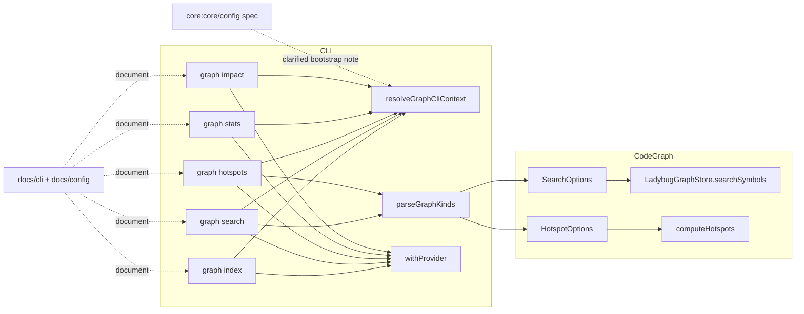

# Design: graph-cli-context-and-kind-filters

## Non-goals

- Change hotspot scoring or default ranking semantics beyond what is required for `--kind` list handling and context resolution.
- Change which symbol kinds `graph hotspots` includes by default. That follow-up is tracked separately in [#53](https://github.com/lsmonki/SpecD/issues/53).
- Generalize bootstrap mode to all CLI command families. This change is limited to the `graph` subcommands in scope.

## Affected areas

- `registerGraphIndex()` in [`packages/cli/src/commands/graph/index-graph.ts`](/Users/monki/Documents/Proyectos/specd/packages/cli/src/commands/graph/index-graph.ts)
  Change: add `--config` and `--path`, stop assuming configured mode only, and branch indexing between configured workspaces and bootstrap-mode synthetic workspace construction.
  Callers: 1 direct registration site in [`packages/cli/src/index.ts`](/Users/monki/Documents/Proyectos/specd/packages/cli/src/index.ts). Risk: MEDIUM.
  Note: this is the only graph command that also depends on `kernel.specs.repos`, so bootstrap mode must bypass `buildWorkspaceTargets()` cleanly.

- `registerGraphSearch()` in [`packages/cli/src/commands/graph/search.ts`](/Users/monki/Documents/Proyectos/specd/packages/cli/src/commands/graph/search.ts)
  Change: add `--config` and `--path`, replace single-kind handling with comma-separated multi-kind parsing, and pass normalized kinds through to `SearchOptions`.
  Callers: 1 direct registration site. Risk: MEDIUM.
  Note: current code validates a single string twice, once through Commander choices and once manually; both need to be removed in favor of shared parsing.

- `registerGraphHotspots()` in [`packages/cli/src/commands/graph/hotspots.ts`](/Users/monki/Documents/Proyectos/specd/packages/cli/src/commands/graph/hotspots.ts)
  Change: add `--config` and `--path`, replace single-kind handling with comma-separated multi-kind parsing, and pass normalized kinds through to `HotspotOptions`.
  Callers: 1 direct registration site. Risk: MEDIUM.
  Note: this command also applies implicit defaults; the design preserves that logic while widening only kind filtering and context resolution.

- `registerGraphStats()` in [`packages/cli/src/commands/graph/stats.ts`](/Users/monki/Documents/Proyectos/specd/packages/cli/src/commands/graph/stats.ts)
  Change: replace implicit configured-only context with shared graph CLI context resolution and expose bootstrap mode.
  Callers: 1 direct registration site. Risk: LOW.

- `registerGraphImpact()` and helpers in [`packages/cli/src/commands/graph/impact.ts`](/Users/monki/Documents/Proyectos/specd/packages/cli/src/commands/graph/impact.ts)
  Change: add `--config` and `--path`, resolve graph context through the shared graph-specific resolver, keep analysis logic unchanged.
  Callers: 1 direct registration site. Risk: MEDIUM.

- `withProvider()` in [`packages/cli/src/commands/graph/with-provider.ts`](/Users/monki/Documents/Proyectos/specd/packages/cli/src/commands/graph/with-provider.ts)
  Change: none in behavior unless the chosen graph context shape requires a different config source; likely reused as-is once bootstrap mode can synthesize a valid `SpecdConfig`.
  Callers: 6 direct command sites under `packages/cli/src/commands/graph`. Risk: HIGH as an integration point, but this change should avoid altering its contract.

- `resolveCliContext()` in [`packages/cli/src/helpers/cli-context.ts`](/Users/monki/Documents/Proyectos/specd/packages/cli/src/helpers/cli-context.ts)
  Change: no contract change; it remains the configured-mode path used by non-graph commands and by graph commands when config is explicit or autodetected.
  Callers: 51 direct usages across `packages/cli/src`. Risk: HIGH if modified.
  Note: this design keeps graph bootstrap behavior out of `resolveCliContext()` to avoid breaking the rest of the CLI.

- `parseCommaSeparatedValues()` in [`packages/cli/src/helpers/parse-comma-values.ts`](/Users/monki/Documents/Proyectos/specd/packages/cli/src/helpers/parse-comma-values.ts)
  Change: reuse for `--kind` parsing rather than adding bespoke split logic in each command.
  Callers: existing helper tests only plus new graph command callers after this change. Risk: LOW.

- `SearchOptions` in [`packages/code-graph/src/domain/value-objects/search-options.ts`](/Users/monki/Documents/Proyectos/specd/packages/code-graph/src/domain/value-objects/search-options.ts)
  Change: widen `kind?: SymbolKind` to `kinds?: readonly SymbolKind[]` (or an equivalent readonly collection) so the query layer can filter against multiple kinds.
  Dependents: `CodeGraphProvider.searchSymbols`, `LadybugGraphStore.searchSymbols`, CLI graph search. Risk: MEDIUM.

- `HotspotOptions` in [`packages/code-graph/src/domain/value-objects/hotspot-result.ts`](/Users/monki/Documents/Proyectos/specd/packages/code-graph/src/domain/value-objects/hotspot-result.ts)
  Change: widen `kind?: SymbolKind` to `kinds?: readonly SymbolKind[]`.
  Dependents: `computeHotspots`, `CodeGraphProvider.getHotspots`, CLI graph hotspots. Risk: MEDIUM.

- `computeHotspots()` in [`packages/code-graph/src/domain/services/compute-hotspots.ts`](/Users/monki/Documents/Proyectos/specd/packages/code-graph/src/domain/services/compute-hotspots.ts)
  Change: apply multi-kind filtering both when pre-scoping `findSymbols()` and when filtering final entries.
  Callers: `CodeGraphProvider.getHotspots`. Risk: MEDIUM.

- `LadybugGraphStore.searchSymbols()` in [`packages/code-graph/src/infrastructure/ladybug/ladybug-graph-store.ts`](/Users/monki/Documents/Proyectos/specd/packages/code-graph/src/infrastructure/ladybug/ladybug-graph-store.ts)
  Change: replace single `node.kind = ...` predicate with an `OR` or `IN`-style predicate over the normalized kind list.
  Callers: `CodeGraphProvider.searchSymbols`. Risk: MEDIUM.

- `docs/cli/cli-reference.md` and [`docs/config/config-reference.md`](/Users/monki/Documents/Proyectos/specd/docs/config/config-reference.md)
  Change: document graph bootstrap semantics, `--config` vs `--path`, no-config fallback, and comma-separated `--kind`.
  Risk: LOW, but required for spec closure.

## New constructs

- `resolveGraphCliContext()` in [`packages/cli/src/commands/graph/resolve-graph-cli-context.ts`](/Users/monki/Documents/Proyectos/specd/packages/cli/src/commands/graph/resolve-graph-cli-context.ts)
  Shape:

  ```ts
  export interface GraphCliContextOptions {
    readonly configPath?: string
    readonly repoPath?: string
  }

  export interface GraphCliContext {
    readonly mode: 'configured' | 'bootstrap'
    readonly config: SpecdConfig
    readonly configFilePath: string | null
    readonly kernel: Kernel | null
    readonly projectRoot: string
    readonly vcsRoot: string
  }

  export async function resolveGraphCliContext(
    options: GraphCliContextOptions,
  ): Promise<GraphCliContext>
  ```

  Responsibility: resolve the graph command context using `--config`, autodetected config, `--path`, or no-config bootstrap fallback without changing global CLI config semantics.
  Relationships: used by `graph index`, `graph search`, `graph hotspots`, `graph stats`, and `graph impact`; configured mode delegates to `resolveCliContext()`, bootstrap mode synthesizes a minimal `SpecdConfig`.

- `parseGraphKinds()` in [`packages/cli/src/commands/graph/parse-graph-kinds.ts`](/Users/monki/Documents/Proyectos/specd/packages/cli/src/commands/graph/parse-graph-kinds.ts)
  Shape:

  ```ts
  export function parseGraphKinds(
    value: string | undefined,
    optionName?: string,
  ): readonly SymbolKind[] | undefined
  ```

  Responsibility: normalize a single comma-separated CLI value into a deduplicated ordered `SymbolKind[]` using `parseCommaSeparatedValues()`.
  Relationships: called only by `graph search` and `graph hotspots`.

- `createBootstrapGraphConfig()` in [`packages/cli/src/commands/graph/bootstrap-graph-config.ts`](/Users/monki/Documents/Proyectos/specd/packages/cli/src/commands/graph/bootstrap-graph-config.ts)
  Shape:
  ```ts
  export function createBootstrapGraphConfig(params: {
    readonly projectRoot: string
    readonly vcsRoot: string
  }): SpecdConfig
  ```
  Responsibility: produce the minimal valid `SpecdConfig` needed by `createCodeGraphProvider()` and graph commands when no project config is used.
  Relationships: used only by `resolveGraphCliContext()` bootstrap mode.

## Approach

The implementation will isolate graph-specific context resolution from the rest of the CLI rather than broadening `resolveCliContext()`. That avoids destabilizing 51 existing call sites that assume config must always exist.

The work splits into three concrete tracks:

1. Graph context resolution
   - Add `--config <path>` and `--path <path>` to the five graph commands in scope.
   - Move each command off direct `resolveCliContext()` calls and onto `resolveGraphCliContext({ configPath, repoPath })`.
   - In configured mode, `resolveGraphCliContext()` delegates to `resolveCliContext({ configPath })`.
   - In bootstrap mode, it resolves the target VCS root, synthesizes a single-workspace `SpecdConfig`, and returns `kernel: null`.
   - `graph index` branches on `context.mode`:
     - configured mode: existing `buildWorkspaceTargets(config, kernel, opts.workspace)`
     - bootstrap mode: build exactly one `WorkspaceIndexTarget` named `default` from `vcsRoot`, with no spec repos

2. Multi-kind filtering
   - Remove single-value `.choices(Object.values(SymbolKind))` from `graph search` and `graph hotspots`, because Commander choices do not support comma-separated composite values.
   - Parse `--kind` through `parseGraphKinds()`, which wraps the existing `parseCommaSeparatedValues()` helper and returns `readonly SymbolKind[]`.
   - Update `SearchOptions` and `HotspotOptions` to carry `kinds` instead of `kind`.
   - Update `LadybugGraphStore.searchSymbols()` and `computeHotspots()` to treat the list as an OR filter over allowed kinds.

3. Docs and command help
   - Update `docs/cli/cli-reference.md` graph sections for `index`, `search`, `hotspots`, `stats`, and `impact`.
   - Update `docs/config/config-reference.md` so bootstrap mode is documented as a command-family-specific behavior that does not redefine `--config`.
   - Update command help text examples for `--kind class,method` and bootstrap semantics where relevant.

This covers every modified requirement:

- `--config` / `--path` semantics are implemented in the graph-specific resolver and command options.
- bootstrap fallback is localized to graph commands.
- multi-kind semantics are implemented end-to-end from CLI parsing to store/service filtering.
- docs updates are explicitly part of the implementation, not left implicit.

## Key decisions

- **Keep bootstrap logic out of `resolveCliContext()`** → protects the 51 non-graph call sites that rely on hard failure when config is missing.  
  **Alternatives rejected** → extending `resolveCliContext()` with bootstrap flags would make a graph-specific exception part of the global CLI contract and increase regression risk.

- **Introduce a graph-local context resolver instead of duplicating per-command logic** → the five commands need the same precedence rules and mutual exclusivity behavior.  
  **Alternatives rejected** → inline resolution in each command would duplicate error handling and make the docs/spec behavior drift.

- **Represent symbol-kind filters as `readonly SymbolKind[]`** → matches the CLI input shape and is easy to serialize into store predicates.  
  **Alternatives rejected** → `Set<SymbolKind>` in the domain layer adds conversion overhead and complicates JSON/debug output without providing meaningful extra value here.

- **Reuse `parseCommaSeparatedValues()` instead of adding graph-specific string parsing** → keeps validation semantics consistent with existing CLI helpers and reuses an already tested path.  
  **Alternatives rejected** → manual split/trim in each command would duplicate validation and error message generation.

- **Synthesize a minimal valid `SpecdConfig` for bootstrap mode** → lets `withProvider()` and `createCodeGraphProvider()` stay unchanged.  
  **Alternatives rejected** → overloading `withProvider()` to accept raw project roots would push config branching into every graph command and duplicate provider setup concerns.

## Trade-offs

- `[Bootstrap mode requires a resolvable VCS root]` → fail fast with a CLI error if `--path` or no-config fallback does not resolve inside a repository; do not invent non-repo semantics in this change.
- `[Search and hotspots option shape changes ripple into code-graph]` → keep the type change small (`kind` -> `kinds`) and limit updates to CLI, store, and hotspot service.
- `[Synthetic config may omit non-essential config fields]` → centralize synthesis in `createBootstrapGraphConfig()` so bootstrap assumptions are explicit and testable.

## Spec impact

### `core:core/config`

- Direct dependents include many CLI and core specs such as `cli:cli/entrypoint`, `core:core/config-loader`, `core:core/workspace`, `core:core/get-project-context`, and `core:core/compile-context`.
- This change is additive: it clarifies that command-family bootstrap modes may exist, but `--config` always retains its explicit-config meaning.
- No dependent spec requires a delta because none of those dependents rely on `--config` meaning “repo root”; the clarification narrows interpretation rather than changing any existing configured-mode requirement.

### `cli:cli/graph-stats`

- Direct dependent found: `code-graph:code-graph/staleness-detection`.
- The dependent remains satisfied because this change does not alter staleness semantics or output fields, only how the command resolves graph context before opening the provider.

### `cli:cli/graph-index`, `cli:cli/graph-search`, `cli:cli/graph-impact`, `cli:cli/graph-hotspots`

- No downstream spec dependencies were found in `specs/`.
- Ripple is therefore implementation-facing, not spec-facing: docs and tests need updates, but no additional spec deltas outside this change scope are required.

## Dependency map



```
┌───────────────────── CLI graph commands ─────────────────────┐
│  index   search   hotspots   stats   impact                 │
└──────┬──────┬─────────┬────────┬────────┬────────────────────┘
       │      │         │        │        │
       └──────┴─────────┴────────┴────────▼───────────┐
                                                      │
                                        ┌──────────────────────────┐
                                        │ resolveGraphCliContext() │
                                        │ configured | bootstrap   │
                                        └─────────────┬────────────┘
                                                      │
                           configured ────────────────┴────────────── bootstrap
                                                      │
                    ┌───────────────────────┐         │        ┌────────────────────────┐
                    │ resolveCliContext()   │         │        │ createBootstrapGraph   │
                    │ [HIGH fan-in: 51]     │         │        │ Config()               │
                    └───────────────────────┘         │        └────────────────────────┘
                                                      │
                                                      ▼
                                            ┌────────────────┐
                                            │ withProvider() │
                                            │ [6 callers]    │
                                            └──────┬─────────┘
                                                   │
                      ┌────────────────────────────┴────────────────────────────┐
                      │                                                         │
              ┌───────────────┐                                        ┌───────────────────┐
              │ SearchOptions │◀──── parseGraphKinds() ──── search ───▶│ searchSymbols()   │
              └───────────────┘                                        └───────────────────┘
              ┌───────────────┐
              │ HotspotOptions│◀──── parseGraphKinds() ─ hotspots ────▶ computeHotspots()
              └───────────────┘

docs/config/config-reference.md ───── clarifies bootstrap vs --config
docs/cli/cli-reference.md      ───── documents graph command behavior
```

## Testing

**Automated tests**

- Add [`packages/cli/test/commands/graph-search.spec.ts`](/Users/monki/Documents/Proyectos/specd/packages/cli/test/commands/graph-search.spec.ts)
  - covers `--config` explicit config bypass
  - covers `--path` bootstrap mode
  - covers no-config fallback to bootstrap mode
  - covers `--kind class,method` passing both kinds
  - covers invalid kind failure before provider query

- Add [`packages/cli/test/commands/graph-hotspots.spec.ts`](/Users/monki/Documents/Proyectos/specd/packages/cli/test/commands/graph-hotspots.spec.ts)
  - covers default filters when no explicit filter flags are present
  - covers explicit filter removing implicit defaults
  - covers `--config` / `--path`
  - covers multi-kind forwarding
  - covers invalid kind failure

- Add [`packages/cli/test/commands/graph-stats.spec.ts`](/Users/monki/Documents/Proyectos/specd/packages/cli/test/commands/graph-stats.spec.ts)
  - covers `--config` and `--path` mutual exclusivity
  - covers no-config bootstrap fallback
  - keeps existing stale/fresh output assertions

- Extend [`packages/cli/test/commands/graph-impact.spec.ts`](/Users/monki/Documents/Proyectos/specd/packages/cli/test/commands/graph-impact.spec.ts)
  - covers `--config` explicit config path
  - covers `--path` bootstrap mode
  - covers no-config fallback
  - covers `--config` + `--path` failure

- Add [`packages/cli/test/commands/graph-index.spec.ts`](/Users/monki/Documents/Proyectos/specd/packages/cli/test/commands/graph-index.spec.ts)
  - covers configured workspaces via autodetected config
  - covers explicit `--config`
  - covers bootstrap mode target construction through `--path`
  - covers no-config fallback
  - covers `--exclude-path` merging in configured mode and bootstrap mode

- Extend [`packages/cli/test/helpers/parse-comma-values.spec.ts`](/Users/monki/Documents/Proyectos/specd/packages/cli/test/helpers/parse-comma-values.spec.ts) or add [`packages/cli/test/commands/graph/parse-graph-kinds.spec.ts`](/Users/monki/Documents/Proyectos/specd/packages/cli/test/commands/graph/parse-graph-kinds.spec.ts)
  - covers trimming, case normalization, deduplication, and invalid-token errors for symbol kinds

- Extend [`packages/code-graph/test/domain/services/compute-hotspots.spec.ts`](/Users/monki/Documents/Proyectos/specd/packages/code-graph/test/domain/services/compute-hotspots.spec.ts)
  - covers multiple allowed kinds in hotspot filtering
  - covers pre-scope and final filtering consistency

- Extend [`packages/code-graph/test/infrastructure/ladybug/ladybug-graph-store.spec.ts`](/Users/monki/Documents/Proyectos/specd/packages/code-graph/test/infrastructure/ladybug/ladybug-graph-store.spec.ts)
  - covers `searchSymbols()` with multiple kinds
  - covers interaction with workspace/file/exclude filters

Every `verify` scenario maps to one of these suites:

- graph command context-resolution scenarios -> CLI command spec tests
- multi-kind and invalid-kind scenarios -> CLI search/hotspots tests plus store/service tests
- CLI reference and config reference scenarios -> doc assertions or snapshot-style text checks in CLI tests where present, plus manual verification below

**Manual / E2E verification**

- Run `specd graph search "kernel" --kind class,method --format json` in a configured project and confirm both kinds appear in results.
- Run `specd graph hotspots --kind class,method --format json` and confirm the provider returns entries of either kind, not only the last token.
- Run each graph command with `--config <path-to-other-specd.yaml>` and verify it targets the alternate config.
- Run each graph command from a repository without `specd.yaml` and verify bootstrap mode works against the repo root as workspace `default`.
- Run each graph command with both `--config` and `--path` and verify a CLI error occurs before provider access.
- Inspect [`docs/cli/cli-reference.md`](/Users/monki/Documents/Proyectos/specd/docs/cli/cli-reference.md) and [`docs/config/config-reference.md`](/Users/monki/Documents/Proyectos/specd/docs/config/config-reference.md) to confirm bootstrap wording is explicit and marked as non-steady-state usage.

Linting and constraints to observe:

- preserve CLI hexagonal direction: commands depend on helpers/providers, not on lower-level storage details beyond the existing provider facade
- no default exports, no `any`, keep ESM imports
- add/update JSDoc for any new helper or exported type

## Open questions

- None at this stage. The unresolved hotspot-defaults/scoring question from `#53` is explicitly out of scope for this change.
