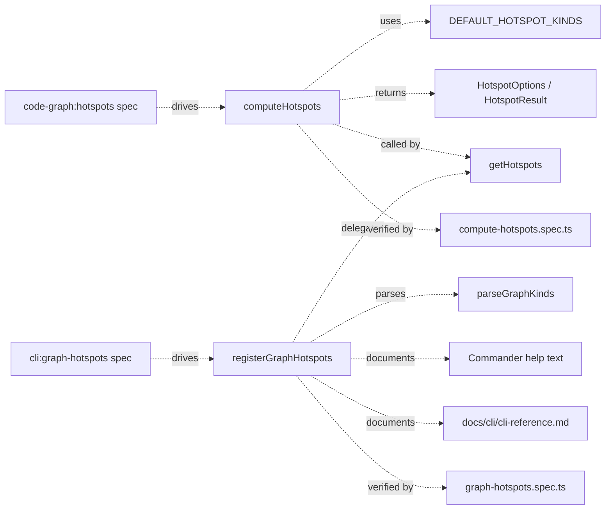

# Design: hotspots-symbol-scoring

## Non-goals

- Changing graph extraction or relation discovery. This change is about hotspot
  ranking and presentation, not about how `CALLS` or `IMPORTS` are extracted.
- Reworking risk thresholds in `computeRiskLevel()`. The specs still require reuse of
  the existing risk-level function.
- Changing non-default filtering semantics beyond the agreed `--kind` override rules.
- Updating unrelated graph commands such as `graph impact`, `graph search`, or
  `graph stats`.

## Affected areas

- `computeHotspots()` in `packages/code-graph/src/domain/services/compute-hotspots.ts`
  Change: replace fixed-weight, importer-heavy default behavior with a default-view
  path that requires direct caller evidence and a flexible scoring path whose exact
  weights remain implementation-level.
  Callers: 5 direct, 7 indirect, 3 transitive · Risk: HIGH
  Note: this is the core behavior change. It touches `HotspotOptions`,
  `HotspotResult`, `computeRiskLevel()`, and `matchesExclude()`, so the implementation
  must preserve existing filtering and output shape while changing default semantics.

- `HotspotOptions` and default-kind exports in
  `packages/code-graph/src/domain/value-objects/hotspot-result.ts`
  Change: expose a shared default hotspot kind set for the default view so the domain
  service and CLI use the same source of truth.
  Callers / dependents: direct dependency of `computeHotspots()` and `getHotspots()`
  via returned/result shapes · Risk: MEDIUM
  Note: this is the right place for a stable constant because it is already the value
  object module for hotspot defaults and filters.

- `getHotspots()` in
  `packages/code-graph/src/composition/code-graph-provider.ts`
  Change: likely no logic change; keep it as a thin pass-through while ensuring the
  design does not accidentally push ranking policy into composition.
  Callers: discovered by graph search as a public composition entry point · Risk: LOW
  Note: mention in design so tasks do not drift into composition changes unless
  strictly needed.

- `registerGraphHotspots()` in `packages/cli/src/commands/graph/hotspots.ts`
  Change: update help/description text and option handling so omitted `--kind` uses
  the shared default kind set, while explicit `--kind` fully replaces it.
  Callers: 6 direct, 7 indirect, 6 transitive · Risk: HIGH
  Note: the command currently uses the “any filter removes defaults” pattern, but that
  turned out to be too aggressive. The implementation should switch to per-option
  defaults instead of a binary default-vs-explicit mode.

- `parseGraphKinds()` in `packages/cli/src/commands/graph/parse-graph-kinds.ts`
  Change: likely no algorithm change; it already preserves ordered multi-kind values.
  Risk: LOW
  Note: keep it unchanged unless the implementation needs a tiny signature adjustment.

- `packages/code-graph/test/domain/services/compute-hotspots.spec.ts`
  Change: replace tests that assert fixed score numbers or importer-only default
  inclusion with tests for observable semantics: default kinds, importer-only
  exclusion, cross-workspace priority, and explicit override behavior.
  Risk: MEDIUM

- `packages/cli/test/commands/graph-hotspots.spec.ts`
  Change: extend command tests to assert the default kind set, explicit replacement of
  defaults by `--kind`, and unchanged error behavior for invalid kinds and
  `--config`/`--path`.
  Risk: MEDIUM

- `docs/cli/cli-reference.md`
  Change: update the existing `graph hotspots` section around line 772 so it explains
  the default kind set, explicit `--kind` replacement semantics, and the fact that the
  default view excludes importer-only symbols.
  Risk: LOW

## New constructs

- `DEFAULT_HOTSPOT_KINDS` in
  `packages/code-graph/src/domain/value-objects/hotspot-result.ts`
  Shape:

  ```ts
  export const DEFAULT_HOTSPOT_KINDS: readonly SymbolKind[] = [
    SymbolKind.Class,
    SymbolKind.Method,
    SymbolKind.Function,
  ] as const
  ```

  Responsibility: shared source of truth for the default hotspot view kinds.
  Relationships: imported by `compute-hotspots.ts`; optionally imported by the CLI
  command for help text or default-option construction.

- `hasDirectCallerEvidence()` in
  `packages/code-graph/src/domain/services/compute-hotspots.ts`
  Shape:

  ```ts
  function hasDirectCallerEvidence(sameWs: number, crossWs: number): boolean
  ```

  Responsibility: make the default importer-only exclusion rule explicit and readable.
  Relationships: internal helper used by the default-view branch in `computeHotspots()`.

- `resolveEffectiveHotspotDefaults()` in
  `packages/code-graph/src/domain/services/compute-hotspots.ts`
  Shape:
  ```ts
  function resolveEffectiveHotspotDefaults(options?: HotspotOptions): {
    kinds: readonly SymbolKind[]
    minScore: number
    minRisk: RiskLevel
    limit: number
    includeImporterOnly: boolean
  }
  ```
  Responsibility: derive field-by-field defaults so each explicit option only overrides
  its own default.
  Relationships: internal helper used to keep ranking policy and CLI semantics aligned
  with the spec.

## Approach

The implementation should derive hotspot behavior field by field rather than treating
the command as a binary default-vs-explicit mode:

- missing `kinds` → use `DEFAULT_HOTSPOT_KINDS`
- explicit `kinds` → replace only the default kind set
- missing `minRisk` → use `MEDIUM`
- explicit `minRisk` → use the requested threshold
- missing `limit` → use `20`
- explicit `limit` → use the requested limit
- missing `minScore` → use `1`
- explicit `minScore` → use the requested score threshold
- importer-only symbols stay excluded unless `includeImporterOnly` is explicitly set

For the domain service, the implementation should keep the current batch-query shape:

- `store.getSymbolCallers()`
- `store.getFileImporterCounts()`
- `store.getStatistics()`
- `store.findSymbols(...)` only when additional symbols are needed for filtering

The scoring logic should move from a fixed spec-level formula to an implementation-level
formula expressed in code. The code still must satisfy the observable guarantees from
the updated spec:

- direct caller evidence is primary
- cross-workspace signal contributes at least as strongly as same-workspace signal
- file importers refine ranking rather than acting as a standalone default inclusion path

The concrete implementation path in `compute-hotspots.ts` should be:

1. Build the per-symbol caller map as today.
2. Derive effective defaults once from `HotspotOptions`.
3. Compute:
   - `effectiveKinds`
   - `effectiveMinScore`
   - `effectiveMinRisk`
   - `effectiveLimit`
   - `includeImporterOnly = options?.includeImporterOnly === true`
4. When enumerating caller-backed symbols, keep computing:
   - `sameWs`
   - `crossWs`
   - `fileImporters`
   - `riskLevel`
5. When enumerating additional symbols through `findSymbols(...)`, only include
   importer-only symbols when `includeImporterOnly` is true.
6. Apply effective kind filtering before ranking.
7. Sort and limit as today.

The initial implementation-level scoring formula should be:

```text
directCallers = sameWorkspaceCallers + crossWorkspaceCallers

if directCallers == 0:
  score = 0
else:
  score = (sameWorkspaceCallers * 2) +
          (crossWorkspaceCallers * 4) +
          min(fileImporters, directCallers)
```

This keeps cross-workspace evidence stronger than same-workspace evidence while capping
the file-level signal so it can reinforce a symbol with real caller evidence but cannot
dominate the score on its own.

For the CLI command, keep the existing structure in
`packages/cli/src/commands/graph/hotspots.ts`:

- parse `--kind` with `parseGraphKinds()`
- construct `HotspotOptions`
- delegate to `provider.getHotspots(options)`

The CLI-side changes should be:

1. Update command description/help text to explain:
   - default kind set
   - explicit `--kind` replacement semantics
   - per-option defaults for `--min-risk`, `--limit`, and `--min-score`
   - importer-only exclusion unless the query is widened with `--include-importer-only`
2. Keep `kinds` omitted from the options object when `--kind` is omitted, so the domain
   service can apply the default kind set.
3. Pass `kinds` only when `--kind` is explicitly supplied, preserving the “full
   override” semantics.
4. Stop injecting `minScore: 0`, `minRisk: 'LOW'`, and `limit: Infinity` just because
   any flag was provided.
5. Introduce `--include-importer-only` as the explicit widening switch instead of
   overloading `--min-score 0` with a second hidden meaning.
6. Update examples and JSON/TOON help text only where user-visible behavior changes.

The documentation update is straightforward:

- edit the `### graph hotspots` section in `docs/cli/cli-reference.md`
- add a short explanation below the options table describing:
  - default kinds: `class`, `method`, `function`
  - explicit `--kind` replaces that set
  - `--min-risk` and `--limit` override only their own defaults
  - importer-only symbols are excluded unless `--include-importer-only` explicitly widens the query

## Key decisions

- **Keep numeric weights out of the spec and in the implementation** → the spec now
  defines observable behavior, not magic numbers, so future tuning does not require
  spec churn. **Alternatives rejected** → retaining fixed numeric weights in the spec
  would make every ranking tune-up a spec edit with little product value.

- **Exclude importer-only symbols in the default view** → this directly addresses the
  user complaint that file centrality was overpowering symbol-level risk. **Alternatives
  rejected** → keeping importer-only symbols but merely downweighting them still leaves
  noisy default rankings and weaker prioritization semantics.

- **Apply defaults per option instead of dropping them all at once** → this keeps the
  command predictable in repos with weak `CALLS` coverage and avoids surprising cases
  where `--min-risk MEDIUM` radically changes the result shape. **Alternatives
  rejected** → the binary “any filter removes defaults” contract proved too broad.

- **Default kinds are `class`, `method`, and `function`** → these are the most useful
  default proxies for “what change risk should I look at first?” **Alternatives
  rejected** → including `variable` or `interface` by default reintroduces semantic
  noise better handled by explicit filtering.

- **Centralize default kinds in `@specd/code-graph`** → one exported constant prevents
  divergence between domain behavior and CLI messaging. **Alternatives rejected** →
  duplicating the list in the CLI and domain service would drift over time.

- **Keep composition thin** → `getHotspots()` should continue delegating straight to the
  domain service. **Alternatives rejected** → pushing default-ranking policy into
  composition would violate the current architecture and make the behavior harder to
  test in isolation.

## Trade-offs

- `[Tuning ambiguity]` → letting design own numeric weights improves agility but means
  ranking details live in code/tests rather than the spec. Mitigation: encode the
  desired ordering properties in tests instead of spec-level constants.

- `[Behavior shift for users who relied on importer-only symbols]` → the default view
  becomes stricter. Mitigation: explicit `--include-importer-only`, `--kind`, and
  other filters still allow a broader exploratory view.

- `[Potential doc/help mismatch]` → the behavior is subtle enough that stale help text
  would create confusion. Mitigation: update both commander help text and
  `docs/cli/cli-reference.md` in the same change and cover both with CLI tests plus
  verify scenarios.

## Spec impact

### `code-graph:code-graph/hotspots`

- Direct dependents found during design: none declared in `specs/` or `.specd/metadata`
- Transitive dependents found during design: none declared
- Impact assessment: ripple is limited to the spec itself plus the CLI contract that
  consumes it. No downstream spec updates are required based on current dependency data.

### `cli:cli/graph-hotspots`

- Direct dependents found during design: none declared in `specs/` or `.specd/metadata`
- Transitive dependents found during design: none declared
- Impact assessment: ripple is limited to the command implementation, tests, help text,
  and `docs/cli/cli-reference.md`. No additional spec deltas are indicated by current
  dependency data.

## Dependency map



```
┌────────────────────────────────────┐
│ code-graph:hotspots spec delta     │
└──────────────────┬─────────────────┘
                   │ drives
                   ▼
        ┌───────────────────────────────┐
        │ computeHotspots()             │
        │ packages/code-graph/...       │
        │ [HIGH] 5 direct / 15 total    │
        └───────────────┬───────────────┘
                        │ uses
          ┌─────────────┴─────────────┐
          ▼                           ▼
┌──────────────────────┐    ┌────────────────────────┐
│ DEFAULT_HOTSPOT_     │    │ HotspotOptions /       │
│ KINDS                │    │ HotspotResult          │
└──────────────────────┘    └────────────────────────┘
                        │
                        ▼
              ┌──────────────────────┐
              │ getHotspots()        │
              │ composition pass-thru│
              └──────────┬───────────┘
                         │ called by
                         ▼
┌────────────────────────────────────┐
│ registerGraphHotspots()            │
│ packages/cli/src/commands/...      │
│ [HIGH] 6 direct / 19 total         │
└───────────────┬───────────────┬────┘
                │               │
                ▼               ▼
      ┌────────────────┐   ┌────────────────────────┐
      │ parseGraphKinds│   │ help text + docs/cli   │
      └────────────────┘   └────────────────────────┘

┌────────────────────────────┐     ┌────────────────────────────┐
│ compute-hotspots.spec.ts   │◀────│ domain behavior changes    │
└────────────────────────────┘     └────────────────────────────┘
┌────────────────────────────┐     ┌────────────────────────────┐
│ graph-hotspots.spec.ts     │◀────│ CLI/default/help changes   │
└────────────────────────────┘     └────────────────────────────┘
```

## Testing

**Automated tests**

- `packages/code-graph/test/domain/services/compute-hotspots.spec.ts`
  - replace fixed-score assertions with ordering/eligibility assertions
  - add a test that default options only include `class`, `method`, and `function`
  - add a test that importer-only symbols are excluded by default
  - add a test that explicit `kinds` outside the default set are honored exactly
  - keep coverage for cross-workspace caller priority and existing workspace/exclude
    filters

- `packages/cli/test/commands/graph-hotspots.spec.ts`
  - add a test that omitted `--kind` sends no explicit `kinds` filter and relies on the
    default hotspot view
  - add a test that explicit `--kind interface` passes only `['interface']`
  - add a test that `--min-score 0` only changes the numeric threshold
  - add a test that `--include-importer-only` is the explicit widening switch
  - add help-text assertions if the project already tests command help output; if not,
    add a focused command-registration test that inspects the generated help string

**Manual / E2E verification**

- Run:
  - `node packages/cli/dist/index.js graph hotspots`
  - `node packages/cli/dist/index.js graph hotspots --kind interface`
  - `node packages/cli/dist/index.js graph hotspots --include-importer-only`
  - `node packages/cli/dist/index.js graph hotspots --kind class,method,function`
  - `node packages/cli/dist/index.js change spec-preview hotspots-symbol-scoring code-graph:code-graph/hotspots --diff`
  - `node packages/cli/dist/index.js change spec-preview hotspots-symbol-scoring cli:cli/graph-hotspots --diff`
- Confirm:
  - default output no longer surfaces importer-only symbols
  - default output focuses on `class`, `method`, and `function`
  - `--include-importer-only` widens the candidate set without changing the meaning of `--min-score`
  - explicit `--kind interface` shows only interfaces and does not merge defaults
  - CLI help text and `docs/cli/cli-reference.md` describe the default/override rules

**Repo constraints to keep in scope**

- Preserve hexagonal boundaries: ranking policy stays in `domain/services/`
- Keep named exports and ESM-only module style
- Update JSDoc on any changed or new symbols
- Keep tests in `test/` and use Vitest
- Update `docs/cli/cli-reference.md` in the same implementation change because the CLI
  behavior is user-visible
