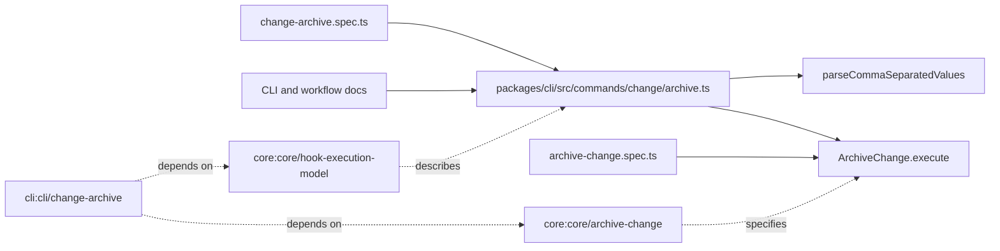

# Design: archive-skip-hooks-parity

## Non-goals

- Reworking transition hook semantics or the hook runner itself.
- Changing schema syntax for workflow hooks.
- Preserving `--no-hooks` as a deprecated alias.

## Affected areas

- `registerChangeArchive()` in `packages/cli/src/commands/change/archive.ts`
  Change: replace `--no-hooks` with `--skip-hooks <phases>`, validate archive-specific phase selectors, and pass a selector set into the use case.
  Callers: CLI entrypoint only via command registration in `packages/cli/src/commands/change.ts` · Risk: MEDIUM.
  Note: user-facing integration point, so help text, errors, and tests must change together.
- `parseCommaSeparatedValues()` in `packages/cli/src/helpers/parse-comma-values.ts`
  Change: reuse existing parsing helper for archive phase lists instead of adding ad hoc parsing.
  Callers: transition command already uses it · Risk: LOW.
  Note: no helper changes are expected unless archive reveals a validation gap.
- `ArchiveChangeInput` and `ArchiveChange.execute()` in `packages/core/src/application/use-cases/archive-change.ts`
  Change: replace `skipHooks?: boolean` with archive hook-phase selectors and gate pre/post `RunStepHooks` execution independently.
  Callers: direct CLI archive command, kernel wiring, unit tests · Risk: HIGH.
  Note: input-contract change touches exported core types and existing tests.
- `packages/cli/test/commands/change-archive.spec.ts`
  Change: assert `--skip-hooks` parsing and forwarded selector sets, and remove `--no-hooks` expectations.
  Callers: test-only · Risk: LOW.
- `packages/core/test/application/use-cases/archive-change.spec.ts`
  Change: update skip-hook unit tests from boolean semantics to `pre` / `post` / `all` selector semantics.
  Callers: test-only · Risk: LOW.
- `docs/cli/cli-reference.md`, `docs/guide/workflow.md`, `docs/guide/getting-started.md`, and `packages/cli/README.md`
  Change: replace the legacy flag name in command examples and option tables.
  Callers: human readers and agents · Risk: LOW.

## New constructs

- `type ArchiveHookPhaseSelector = 'pre' | 'post' | 'all'`
  Location: `packages/core/src/application/use-cases/archive-change.ts`
  Shape:
  ```ts
  export type ArchiveHookPhaseSelector = 'pre' | 'post' | 'all'
  ```
  Responsibility: express which archive hook phases should be skipped; it does not encode transition phases.
  Relationships: referenced by `ArchiveChangeInput`, re-exported from `packages/core/src/application/use-cases/index.ts`, and consumed by the CLI archive command.

## Approach

1. Update the specs and verification deltas so the change contract moves from `--no-hooks` to `--skip-hooks`.
2. Introduce `ArchiveHookPhaseSelector` in the core use case and change the input contract to `skipHookPhases?: ReadonlySet<ArchiveHookPhaseSelector>`.
3. Replace the boolean checks in `ArchiveChange.execute()` with selector gating:
   - skip pre hooks when the set contains `pre` or `all`
   - skip post hooks when the set contains `post` or `all`
4. Update the CLI archive command to expose `--skip-hooks <phases>`, parse it through `parseCommaSeparatedValues()`, and forward the resulting set unchanged.
5. Update tests first around the CLI contract and the core hook-execution branches, then refresh the user-facing docs that mention `change archive`.

This satisfies the modified requirements without affecting the actual hook runner, schema loading, or archive merge flow.

## Key decisions

- **Use archive-specific phase names (`pre`, `post`, `all`)** → archive has no source/target distinction, so reusing transition values would add false precision.
  **Alternatives rejected** → forcing `source.post` / `target.pre` on archive was rejected because the archiving step has only one workflow step boundary and the names would be misleading.
- **Remove `--no-hooks` instead of keeping an alias** → the user asked for a single consistent model, and retaining both flags would prolong inconsistency in docs, tests, and agent habits.
  **Alternatives rejected** → a deprecated alias was rejected because it preserves ambiguity and increases maintenance surface.
- **Reuse the existing comma-separated parser** → keeps transition and archive validation behavior aligned.
  **Alternatives rejected** → custom archive-only parsing was rejected because it duplicates transition logic for no gain.

## Trade-offs

- `[Breaking CLI surface]` → users of `specd change archive --no-hooks` must switch to `--skip-hooks all`; mitigate with doc updates and explicit tests.
- `[Exported core type change]` → callers compiling against `ArchiveChangeInput.skipHooks` will need to update; mitigate by keeping the new selector type small and explicit.

## Spec impact

### `core:core/hook-execution-model`

- Direct dependents: none declared by metadata.
- Transitive dependents: none declared by metadata.
- Assessment: this spec documents the manual-control pattern and is updated for terminology and archive selectors only; no downstream spec needs additional deltas.

### `core:core/archive-change`

- Direct dependents: `cli:cli/change-archive`.
- Transitive dependents: none beyond that CLI spec.
- Assessment: the dependent CLI spec is part of this same change and must be updated together because it mirrors the input contract.

### `cli:cli/change-archive`

- Direct dependents: none declared by metadata.
- Transitive dependents: none declared by metadata.
- Assessment: documentation-facing change only; no further spec ripple detected.

## Dependency map



```text
┌──────────────────────────────────────┐
│ cli: change archive spec             │
└───────────────┬──────────────────────┘
                │ specifies
                ▼
┌──────────────────────────────────────┐       ┌──────────────────────────────┐
│ packages/cli/src/commands/change/   │──────▶│ parseCommaSeparatedValues()  │
│ archive.ts                           │       └──────────────────────────────┘
└───────────────┬──────────────────────┘
                │ calls
                ▼
┌──────────────────────────────────────┐
│ packages/core/src/application/use-   │
│ cases/archive-change.ts              │
└───────────────┬──────────────────────┘
                │ verified by
        ┌───────┴────────┐
        ▼                ▼
┌──────────────┐  ┌────────────────────┐
│ CLI tests    │  │ Core use-case tests│
└──────────────┘  └────────────────────┘

┌──────────────────────────────┐
│ core: hook execution model   │
└──────────────┬───────────────┘
               │ documents
               ▼
        ┌──────────────┐
        │ docs / README│
        └──────────────┘
```

## Testing

Automated tests:

- `packages/cli/test/commands/change-archive.spec.ts`
  Add assertions for `--skip-hooks all`, `--skip-hooks pre`, and default empty selector set; remove `--no-hooks` cases.
- `packages/core/test/application/use-cases/archive-change.spec.ts`
  Replace boolean skip-hook coverage with selector-set coverage for `pre`, `post`, and `all`, while preserving archive merge assertions.

Manual / E2E verification:

- Run `pnpm --filter @specd/cli test -- change-archive.spec.ts` and confirm the command parses `--skip-hooks` values and rejects invalid ones.
- Run `pnpm --filter @specd/core test -- archive-change.spec.ts` and confirm pre/post hooks are skipped only for the selected phases.
- Run `pnpm lint` to catch any API-export or doc reference drift.
- Check `docs/cli/cli-reference.md` and `docs/guide/workflow.md` for any remaining `--no-hooks` mentions.

Documentation notes:

- Update user-facing CLI examples and workflow docs because this is a breaking command-surface change.
- No architecture or schema docs need changes because hook structure does not change.

## Open questions

None.
