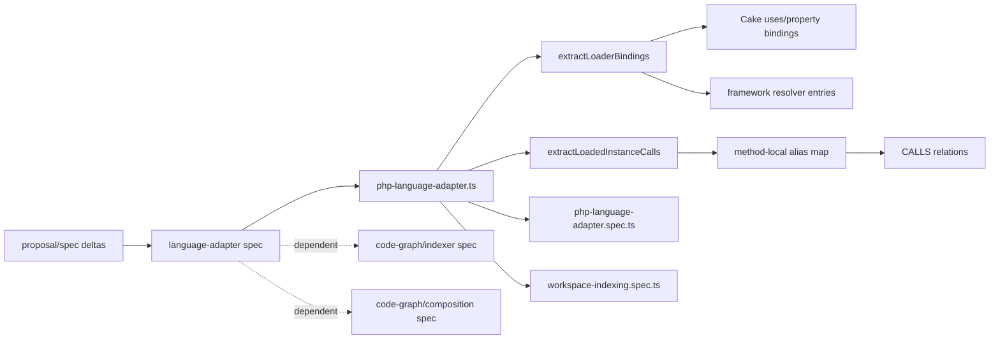

# Design: php-framework-loader-calls

## Non-goals

- Adding runtime PHP execution, reflection, or container bootstrapping to resolve dependencies
- Inferring `CALLS` from arbitrary string service IDs or framework APIs without deterministic class or file targets
- Changing the public `LanguageAdapter` interface or the code-graph persistence schema
- Retuning hotspot scoring; this change improves the upstream `CALLS` data that hotspots consume

## Affected areas

- `packages/code-graph/src/infrastructure/tree-sitter/php-language-adapter.ts`
  Change: expand PHP dependency acquisition and loaded-instance call extraction to support class-property `uses`, bare Cake loader forms, explicit instance construction after loaders, and selected framework acquisition flows across CakePHP, CodeIgniter, Yii, Zend, Laravel, Symfony, and other registry-declared families when the target stays deterministic.
  Callers / dependents: file impact query reports `8` direct dependents, `5` indirect dependents, `2` transitive dependents · Risk: `HIGH`
  Note: this is the single high-risk integration point because it feeds the indexer’s PHP relation extraction path.

- `bindingAppearsInScope()` in `packages/code-graph/src/infrastructure/tree-sitter/php-language-adapter.ts`
  Change: broaden scope matching so bare `loadController(...)` / `loadComponent(...)` and class-property dependency declarations participate in alias discovery.
  Callers / dependents: impact query reports `HIGH` risk for this helper through the PHP adapter path
  Note: incorrect widening here could create noisy false positives across every PHP indexing run.

- `resolveCakeTarget()` in `packages/code-graph/src/infrastructure/tree-sitter/php-language-adapter.ts`
  Change: remain the canonical CakePHP path resolver while supporting new binding sources that reuse the same model/controller/component mapping rules.
  Callers / dependents: impact query reports `HIGH` risk through the adapter file
  Note: path resolution must stay deterministic and backward-compatible for existing loader coverage.

- `extractLoaderBindings()` in `packages/code-graph/src/infrastructure/tree-sitter/php-language-adapter.ts`
  Change: accept additional resolver outputs for class-property declarations and broader framework acquisition patterns, including CakePHP property/loader variants, CodeIgniter aliases, Yii factories, Zend class loaders, and Laravel/Symfony class-literal resolution.
  Callers / dependents: internal dependency of both file-level `IMPORTS` and symbol-level `CALLS` extraction
  Note: this is the seam where new resolver families should enter without changing the outer extraction flow.

- `extractLoadedInstanceCalls()` in `packages/code-graph/src/infrastructure/tree-sitter/php-language-adapter.ts`
  Change: build richer alias maps from class-level bindings, loader-managed properties, and explicit constructed or acquired instances when the target class resolves statically.
  Callers / dependents: internal dependency of PHP `CALLS` creation
  Note: this function must continue to avoid interprocedural propagation.

- `packages/code-graph/test/infrastructure/tree-sitter/php-language-adapter.spec.ts`
  Change: add unit scenarios for new CakePHP, CodeIgniter, Yii, Zend, Laravel, Symfony, and registry-based deterministic framework flows, plus negative cases for runtime-only identifiers.
  Callers / dependents: test-only
  Note: this is the primary regression suite for the adapter heuristics.

- `packages/code-graph/test/application/use-cases/workspace-indexing.spec.ts`
  Change: extend or add end-to-end indexing scenarios proving the new PHP relations survive the full indexing pipeline.
  Callers / dependents: test-only
  Note: this guards against adapter-only tests passing while the indexer drops the relations later.

## New constructs

- `extractCakeUsesPropertyBindings(filePath: string, content: string, symbols: SymbolNode[]): LoaderBinding[]`
  Location: `packages/code-graph/src/infrastructure/tree-sitter/php-language-adapter.ts`
  Shape:

  ```ts
  function extractCakeUsesPropertyBindings(
    filePath: string,
    content: string,
    symbols: SymbolNode[],
  ): LoaderBinding[]
  ```

  Responsibility: parse class-property `uses` declarations with literal entries and convert them into `LoaderBinding` records that reuse Cake model alias conventions.
  Relationships: called from `extractLoaderBindings()`; depends on `resolveCakeTarget()` and `defaultAliasNames()`; no callers outside the PHP adapter.

- `extractExplicitConstructedInstanceAliases(scopeText: string, bindings: ReadonlyMap<string, string>): Map<string, string>`
  Location: `packages/code-graph/src/infrastructure/tree-sitter/php-language-adapter.ts`
  Shape:

  ```ts
  function extractExplicitConstructedInstanceAliases(
    scopeText: string,
    bindings: ReadonlyMap<string, string>,
  ): Map<string, string>
  ```

  Responsibility: derive local variable aliases created by `new X()` or class-literal acquisition flows after a deterministic target path has already been established.
  Relationships: called from `extractLoadedInstanceCalls()` after framework/property aliases are collected; returns only method-local aliases.

- `resolveFrameworkClassLiteralTarget(filePath: string, value: string, symbols: SymbolNode[]): string | undefined`
  Location: `packages/code-graph/src/infrastructure/tree-sitter/php-language-adapter.ts`
  Shape:

  ```ts
  function resolveFrameworkClassLiteralTarget(
    filePath: string,
    value: string,
    symbols: SymbolNode[],
  ): string | undefined
  ```

  Responsibility: resolve explicit class-literal or qualified-class targets through existing PHP path rules and Composer/PSR-4 knowledge without introducing runtime container semantics.
  Relationships: used by new resolver entries for Yii/Laravel/Symfony/Zend-style acquisition where the class target is explicit.

- Additional `LoaderResolver` entries for:
  - bare Cake `loadController`
  - bare Cake `loadComponent`
  - Cake class-property `uses`
  - CodeIgniter model/library/helper alias-compatible flows that already fit the resolver registry
  - Yii factory/class-literal acquisition
  - Zend loader plus explicit `new` flows
  - Laravel `app(Foo::class)` / `resolve(Foo::class)`
  - Symfony `$this->get(Foo::class)`
  - other registry-declared framework patterns only when they expose literal or class-literal targets that are deterministic enough to map to `resolveFrameworkClassLiteralTarget`
    Location: `packages/code-graph/src/infrastructure/tree-sitter/php-language-adapter.ts`
    Shape: additional resolver objects matching the existing `LoaderResolver` contract
    Responsibility: keep framework-specific pattern detection registry-based rather than embedding more branches into the core flow.
    Relationships: consumed by `extractLoaderBindings()`; validated by per-pattern unit tests.

## Approach

1. Keep the existing architecture intact: all work stays inside the PHP infrastructure adapter. No domain model, port, or store contract changes are needed.

2. Extend the binding source model before touching `CALLS` emission:
   - preserve the existing `LOADER_RESOLVERS` registry
   - add resolver coverage for bare Cake controller/component loaders
   - add a dedicated extractor for Cake class-property `uses` declarations because they are not method calls and do not fit the current regex-only resolver shape cleanly
   - add resolver coverage for explicit class-literal or explicit-class acquisition only where the class target can be mapped to a file deterministically
   - keep the widening framework-oriented rather than Cake-only: CakePHP remains the motivating case, but the resolver registry should also carry deterministic patterns already relevant to CodeIgniter, Yii, Zend, Laravel, Symfony, and future registry additions

3. Normalize every supported dependency acquisition form into the same `LoaderBinding` shape:
   - `via`
   - original logical value
   - resolved `targetPath`
   - alias names that should be considered valid inside methods

   This keeps `extractDynamicLoaderRelations()` unchanged except for receiving more bindings.

4. Split alias resolution in `extractLoadedInstanceCalls()` into three phases:
   - collect class-level and method-local framework aliases from `LoaderBinding`
   - derive additional local aliases from simple assignments such as `$model = $this->Article`
   - derive constructed-instance aliases from `new X()` or explicit class-literal acquisition only when `X` already maps to a deterministic target path

5. Continue to enforce method-local scope for emitted `CALLS`:
   - class-property `uses` may seed aliases for all methods of the declaring class
   - local assignments and construction-derived aliases remain confined to the method body being analyzed
   - no cross-method, cross-function, or cross-file alias propagation

6. Restrict framework widening to deterministic cases:
   - include APIs that expose literal names, class literals, or qualified class names
   - explicitly include known deterministic families discussed for this change:
     - CakePHP: `loadModel`, `loadController`, `loadComponent`, `App::uses`, `App::import`, `ClassRegistry::init`, `uses`, class-property `$uses`
     - CodeIgniter: `load->model`, `load->library`, `load->helper`, plus alias use after loading
     - Yii: `Yii::import`, `Yii::createObject`
     - Zend: `Zend_Loader::loadClass` plus explicit `new`
     - Laravel: `app(Foo::class)`, `resolve(Foo::class)`
     - Symfony: `$this->get(Foo::class)`
   - reject runtime-only service IDs, reflection-driven lookup, and unresolved generic `get(...)`-style calls
   - this satisfies the updated spec requirement that ambiguous targets are dropped instead of guessed

7. Verify the behavior at two levels:
   - adapter unit tests for each new pattern family
   - workspace indexing tests that prove the emitted relations survive the full graph pipeline

8. Documentation instruction:
   - no `docs/` update is required for this change because it does not add a new CLI command, MCP surface, or public package API
   - if the team later wants user-facing documentation of supported PHP framework patterns, that should be a follow-up under `docs/core/` or code-graph guides rather than part of this internal extractor change

## Key decisions

- **Keep the change inside `php-language-adapter.ts`** → the public adapter contract and graph schema already support the needed behavior; the defect is in extraction breadth, not in the interface.
  **Alternatives rejected** → changing `LanguageAdapter` or adding graph metadata fields would broaden scope without being necessary for the observed bug.

- **Treat Cake `uses` as a first-class dependency source** → in the observed legacy code, it is a strong framework signal and directly explains missing `CALLS` such as `$this->ResultadoElecciones->...`.
  **Alternatives rejected** → ignoring property declarations would leave the dominant `iccms` pattern unresolved.

- **Use resolver-driven support for additional frameworks** → existing adapter structure already models framework-specific acquisition through a registry of resolvers, and the change should visibly cover more than CakePHP in both design and implementation planning.
  **Alternatives rejected** → embedding one-off framework conditionals directly into `extractLoadedInstanceCalls()` would make future coverage harder to extend and test.

- **Limit new framework support to deterministic class targets** → this keeps false positives low and aligns with the existing “silently drop unresolved targets” rule.
  **Alternatives rejected** → inferring targets from generic service IDs or runtime container state would require executing framework logic and would make graph output noisy.

- **Model explicit construction as alias derivation, not as a separate relation type** → the graph already expresses the needed semantics with `CALLS` from caller method to resolved callee method.
  **Alternatives rejected** → adding constructor-specific relation semantics would not help hotspots or impact analysis for this change.

## Trade-offs

- `[Broader framework support can over-match generic patterns]` → Mitigation: require literal or class-literal targets and preserve the “drop unresolved/ambiguous” rule.
- `[CakePHP-first heuristics may bias the adapter toward legacy conventions]` → Mitigation: keep shared logic in resolver entries and generic class-literal helpers so other frameworks reuse the same deterministic path.
- `[Single-file implementation concentrates complexity]` → Mitigation: extract focused private helpers and cover each pattern family with unit tests.
- `[Impact is HIGH on the adapter file]` → Mitigation: avoid contract changes, preserve existing resolver entries, and add indexing-level regression tests.

## Spec impact

### `code-graph:code-graph/language-adapter`

- Direct dependents:
  - `code-graph:code-graph/indexer`
  - `code-graph:code-graph/composition`
- Transitive dependents identified from current spec references:
  - no additional spec explicitly references `language-adapter` through those specs in a way that requires a delta for this change

Assessment:

- `code-graph:code-graph/indexer` remains satisfied because the indexing pipeline still consumes the same `LanguageAdapter` interface; only PHP extraction coverage broadens.
- `code-graph:code-graph/composition` remains satisfied because adapter registration and composition boundaries do not change.
- No dependent spec delta is required unless implementation work ends up changing the adapter registry contract or the indexer orchestration, which this design explicitly avoids.

## Dependency map



```
┌──────────────────────┐
│ language-adapter     │
│ spec delta           │
└──────────┬───────────┘
           │
           ▼
┌──────────────────────────────────────────────┐
│ php-language-adapter.ts          [HIGH]     │
│ broaden deterministic PHP bindings/calls    │
└───────┬───────────────────────┬─────────────┘
        │                       │
        ▼                       ▼
┌──────────────────┐   ┌──────────────────────┐
│ extractLoader    │   │ extractLoadedInstance│
│ Bindings()       │   │ Calls()              │
└───────┬──────────┘   └──────────┬───────────┘
        │                         │
        ▼                         ▼
┌───────────────┐       ┌─────────────────────┐
│ Cake uses     │       │ method-local alias  │
│ bare loaders  │       │ + constructed alias │
│ CI/Yii/Zend   │       │ resolution          │
└───────┬───────┘       └──────────┬──────────┘
        │                          │
        └──────────────┬───────────┘
                       ▼
               ┌───────────────┐
               │ IMPORTS/CALLS │
               │ graph edges   │
               └──────┬────────┘
                      │
          ┌───────────┴───────────┐
          ▼                       ▼
┌────────────────────┐   ┌─────────────────────┐
│ php-language-      │   │ workspace-indexing  │
│ adapter.spec.ts    │   │ .spec.ts            │
└────────────────────┘   └─────────────────────┘

Spec ripple:
┌────────────────────┐    depends on    ┌────────────────────┐
│ code-graph/indexer │ ─ ─ ─ ─ ─ ─ ─ ─▶ │ language-adapter   │
└────────────────────┘                  └────────────────────┘
┌────────────────────┐    depends on    ┌────────────────────┐
│ code-graph/        │ ─ ─ ─ ─ ─ ─ ─ ─▶ │ language-adapter   │
│ composition        │                  └────────────────────┘
└────────────────────┘
```

## Testing

### Automated tests

- `packages/code-graph/test/infrastructure/tree-sitter/php-language-adapter.spec.ts`
  - add a scenario for Cake `var/public/protected $uses` producing `IMPORTS`
  - add a scenario for Cake `var/public/protected $uses` enabling `$this->Model->method()` `CALLS`
  - add a scenario for bare `loadController('X')`
  - add a scenario for bare `loadComponent('X')`
  - add a scenario for `loadModel('X')` followed by `new X()` and instance method calls
  - add a scenario for CodeIgniter property alias use after `$this->load->model(...)`
  - add a scenario for deterministic class-literal acquisition in each explicitly targeted family where the target is statically resolvable:
    - Yii: `Yii::createObject(Foo::class)` or equivalent explicit-class form
    - Zend: `Zend_Loader::loadClass('Foo_Bar')` plus `new Foo_Bar()`
    - Laravel: `app(Foo::class)`, `resolve(Foo::class)`
    - Symfony: `$this->get(Foo::class)`
  - add negative scenarios for runtime-only string service IDs and unresolved generic `get('service')` lookups

- `packages/code-graph/test/application/use-cases/workspace-indexing.spec.ts`
  - add or extend a PHP workspace fixture proving that the full indexer emits `CALLS` for:
    - Cake `uses` property
    - bare Cake loader forms
    - constructed instance flow after a loader
  - keep the assertions at graph-output level, not just raw adapter return values

### Manual / E2E verification

- Run:

  ```bash
  pnpm --filter @specd/code-graph test
  ```

  Expected: adapter and indexing tests pass with the new PHP scenarios.

- Reindex `../iccms` and inspect stats:

  ```bash
  node ../specd/packages/cli/dist/index.js graph stats --format json --config specd.yaml
  ```

  Expected: `CALLS` is materially greater than `2`; it should increase specifically in controller/model-heavy areas.

- Spot-check impact by searching or inspecting hotspots after reindex:

  ```bash
  node ../specd/packages/cli/dist/index.js graph hotspots --format json --min-risk LOW --config specd.yaml
  ```

  Expected: PHP controller/model methods become more visible in hotspot and impact outputs because real caller edges now exist.

- If lock contention appears while querying the graph, rerun the commands sequentially rather than in parallel; this was already observed during analysis.

### Global-spec compliance notes

- Architecture: implementation stays inside the infrastructure adapter; no domain/application boundary changes.
- Conventions: any new helpers must remain typed, use named exports only where exported, and avoid `any`.
- Testing: new tests must live under `packages/code-graph/test/...` and use `.spec.ts`.
- Docs: no `docs/` artifact update is required for this internal adapter change.

## Open questions

- Which deterministic class-literal framework patterns should be implemented in the first pass if time is limited: only those already represented in the adapter registry, or also Laravel / Symfony helper forms that require new resolver entries but no runtime introspection?
