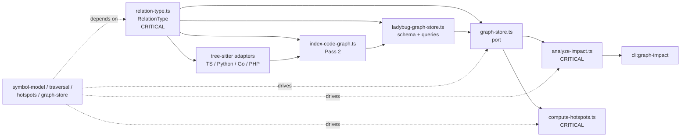

# Design: code-graph-inheritance-relations

## Non-goals

- Introduce new base relation types beyond `EXTENDS`, `IMPLEMENTS`, and `OVERRIDES`.
- Model dynamic dispatch, runtime mixin resolution, or whole-program polymorphic call inference.
- Change CLI flags or output formats in this iteration.
- Backfill hierarchy edges into an existing `.lbug` file without re-indexing; the schema bump will require rebuilding the graph.

## Affected areas

- `RelationType` in [relation-type.ts](/Users/monki/Documents/Proyectos/specd/packages/code-graph/src/domain/value-objects/relation-type.ts)
  Change: add `Extends`, `Implements`, and `Overrides` members to the closed relation vocabulary.
  Dependents: `19` direct, `32` indirect, `17` transitive via graph impact.
  Risk: `CRITICAL`.
  Note: this value object sits on the boundary between the model, adapters, traversal, storage, and tests, so any naming or ordering mistake will ripple widely.

- `GraphStore` in [graph-store.ts](/Users/monki/Documents/Proyectos/specd/packages/code-graph/src/domain/ports/graph-store.ts)
  Change: extend the abstract port with hierarchy-oriented directional queries and update any helper/test double that implements it.
  Dependents: domain services, `IndexCodeGraph`, `LadybugGraphStore`, the in-memory test store, and composition wiring.
  Risk: `HIGH`.
  Note: this is the contract boundary for traversal and hotspot analysis, so new methods must preserve the current hexagonal split and avoid leaking Ladybug-specific details.

- `analyzeImpact()` in [analyze-impact.ts](/Users/monki/Documents/Proyectos/specd/packages/code-graph/src/domain/services/analyze-impact.ts)
  Change: include `EXTENDS`, `IMPLEMENTS`, and `OVERRIDES` edges in symbol-level and file-level blast-radius computation.
  Dependents: `22` direct, `28` indirect, `17` transitive via graph impact.
  Risk: `CRITICAL`.
  Note: this function feeds downstream `graph impact`, provider APIs, and file-level aggregation, so hierarchy traversal must not regress existing call/import semantics.

- `getUpstream()` and `getDownstream()` in [get-upstream.ts](/Users/monki/Documents/Proyectos/specd/packages/code-graph/src/domain/services/get-upstream.ts) and [get-downstream.ts](/Users/monki/Documents/Proyectos/specd/packages/code-graph/src/domain/services/get-downstream.ts)
  Change: generalize traversal from `CALLS`-only to `CALLS` plus hierarchy edges while preserving depth semantics and truncation behavior.
  Dependents: `analyzeImpact()` and anything that relies on its depth buckets.
  Risk: `HIGH`.

- `computeHotspots()` in [compute-hotspots.ts](/Users/monki/Documents/Proyectos/specd/packages/code-graph/src/domain/services/compute-hotspots.ts)
  Change: incorporate hierarchy-dependent counts into ranking and widen the default kind set to include interfaces.
  Dependents: `6` direct, `33` indirect, `28` transitive via graph impact.
  Risk: `CRITICAL`.
  Note: the current implementation is intentionally batch-oriented; hierarchy scoring must preserve that style rather than turning hotspot computation into N+1 store queries.

- hotspot result types in [hotspot-result.ts](/Users/monki/Documents/Proyectos/specd/packages/code-graph/src/domain/value-objects/hotspot-result.ts)
  Change: update `DEFAULT_HOTSPOT_KINDS` to include `interface` and, if needed, add internal-only signal bookkeeping without changing the public `HotspotEntry` shape.
  Dependents: domain service tests and any default-kind assumptions in CLI/provider callers.
  Risk: `MEDIUM`.

- `IndexCodeGraph` in [index-code-graph.ts](/Users/monki/Documents/Proyectos/specd/packages/code-graph/src/application/use-cases/index-code-graph.ts)
  Change: accumulate hierarchy relations in Pass 2 and pass them through the single bulk load.
  Dependents: indexing, reindexing, workspace integration, provider composition, and `workspace-indexing.spec.ts`.
  Risk: `HIGH`.
  Note: the current `SymbolIndex` is already the right resolution substrate; this change should extend Pass 2 rather than creating a third pass.

- all tree-sitter adapters in:
  - [typescript-language-adapter.ts](/Users/monki/Documents/Proyectos/specd/packages/code-graph/src/infrastructure/tree-sitter/typescript-language-adapter.ts)
  - [python-language-adapter.ts](/Users/monki/Documents/Proyectos/specd/packages/code-graph/src/infrastructure/tree-sitter/python-language-adapter.ts)
  - [go-language-adapter.ts](/Users/monki/Documents/Proyectos/specd/packages/code-graph/src/infrastructure/tree-sitter/go-language-adapter.ts)
  - [php-language-adapter.ts](/Users/monki/Documents/Proyectos/specd/packages/code-graph/src/infrastructure/tree-sitter/php-language-adapter.ts)
    Change: emit deterministic hierarchy relations for constructs each language can resolve.
    Dependents: `IndexCodeGraph` Pass 2 and adapter test suites.
    Risk: `HIGH`.
    Note: extraction remains adapter-owned; the indexer should not gain language-specific hierarchy parsing.

- Ladybug schema and adapter in [schema.ts](/Users/monki/Documents/Proyectos/specd/packages/code-graph/src/infrastructure/ladybug/schema.ts) and [ladybug-graph-store.ts](/Users/monki/Documents/Proyectos/specd/packages/code-graph/src/infrastructure/ladybug/ladybug-graph-store.ts)
  Change: add `EXTENDS`, `IMPLEMENTS`, and `OVERRIDES` relationship tables, bump `SCHEMA_VERSION` from `5` to `6`, persist/query hierarchy edges, and expose hierarchy counts in statistics.
  Dependents: `GraphStore`, indexing, staleness-aware reindexing, graph search metadata, and all storage tests.
  Risk: `HIGH`.

- test helpers and contracts:
  - [in-memory-graph-store.ts](/Users/monki/Documents/Proyectos/specd/packages/code-graph/test/helpers/in-memory-graph-store.ts)
  - [graph-store.contract.ts](/Users/monki/Documents/Proyectos/specd/packages/code-graph/test/domain/ports/graph-store.contract.ts)
    Change: support the new hierarchy query surface and keep contract tests implementation-agnostic.
    Dependents: all domain service tests that rely on the in-memory store.
    Risk: `MEDIUM`.

## New constructs

- New `RelationType` members in [relation-type.ts](/Users/monki/Documents/Proyectos/specd/packages/code-graph/src/domain/value-objects/relation-type.ts)
  Shape:

  ```ts
  export const RelationType = {
    Imports: 'IMPORTS',
    Defines: 'DEFINES',
    Calls: 'CALLS',
    Exports: 'EXPORTS',
    DependsOn: 'DEPENDS_ON',
    Covers: 'COVERS',
    Extends: 'EXTENDS',
    Implements: 'IMPLEMENTS',
    Overrides: 'OVERRIDES',
  } as const
  ```

  Responsibility: extend the closed relation set used across model validation, persistence, and traversal.
  Relationships: consumed by every adapter, the store port, traversal services, hotspot scoring, and storage schema code.

- New `GraphStore` abstract methods in [graph-store.ts](/Users/monki/Documents/Proyectos/specd/packages/code-graph/src/domain/ports/graph-store.ts)
  Shape:

  ```ts
  abstract getExtenders(symbolId: string): Promise<Relation[]>
  abstract getExtendedTargets(symbolId: string): Promise<Relation[]>
  abstract getImplementors(symbolId: string): Promise<Relation[]>
  abstract getImplementedTargets(symbolId: string): Promise<Relation[]>
  abstract getOverriders(symbolId: string): Promise<Relation[]>
  abstract getOverriddenTargets(symbolId: string): Promise<Relation[]>
  ```

  Responsibility: expose directional hierarchy traversal without leaking query syntax or storage layout into domain services.
  Relationships: implemented by `LadybugGraphStore` and `InMemoryGraphStore`; consumed by traversal and hotspot services.

- New internal traversal helpers in:
  - [get-upstream.ts](/Users/monki/Documents/Proyectos/specd/packages/code-graph/src/domain/services/get-upstream.ts)
  - [get-downstream.ts](/Users/monki/Documents/Proyectos/specd/packages/code-graph/src/domain/services/get-downstream.ts)
    Shape:

  ```ts
  async function getIncomingRelations(store: GraphStore, symbolId: string): Promise<Relation[]>
  async function getOutgoingRelations(store: GraphStore, symbolId: string): Promise<Relation[]>
  ```

  Responsibility: merge `CALLS` with the relevant incoming or outgoing hierarchy edges before the BFS loop, so traversal logic stays single-path.
  Relationships: private to traversal services; keeps `analyzeImpact()` simple and avoids reimplementing relation merging in multiple places.

- New internal hotspot aggregation helper in [compute-hotspots.ts](/Users/monki/Documents/Proyectos/specd/packages/code-graph/src/domain/services/compute-hotspots.ts)
  Shape:

  ```ts
  interface HierarchySignal {
    readonly extenders: number
    readonly implementors: number
    readonly overriders: number
  }

  async function collectHierarchySignals(
    store: GraphStore,
    symbols: readonly SymbolNode[],
  ): Promise<Map<string, HierarchySignal>>
  ```

  Responsibility: compute hierarchy-dependent counts once per hotspot run and feed them into the final score calculation.
  Relationships: private to hotspot scoring; uses the new `GraphStore` hierarchy queries and keeps `HotspotEntry` stable.

- New `LadybugGraphStore` query helpers in [ladybug-graph-store.ts](/Users/monki/Documents/Proyectos/specd/packages/code-graph/src/infrastructure/ladybug/ladybug-graph-store.ts)
  Shape:

  ```ts
  private async getIncomingSymbolRelations(
    relationType: RelationType,
    symbolId: string,
  ): Promise<Relation[]>

  private async getOutgoingSymbolRelations(
    relationType: RelationType,
    symbolId: string,
  ): Promise<Relation[]>
  ```

  Responsibility: centralize the repeated Cypher query pattern for `CALLS`, `EXTENDS`, `IMPLEMENTS`, and `OVERRIDES`.
  Relationships: called by the public hierarchy getters and keeps relation materialization consistent with the existing call/import accessors.

## Approach

1. Extend the core graph vocabulary first.
   Update `RelationType`, any validation helpers, and the relation type tests so the rest of the package can compile against `EXTENDS`, `IMPLEMENTS`, and `OVERRIDES`.

2. Extend the storage contract and both store implementations.
   Add the six hierarchy query methods to `GraphStore` and implement them in `LadybugGraphStore` and the in-memory test store. Reuse common private query helpers in the Ladybug adapter rather than copy-pasting per relation type.

3. Persist hierarchy edges as first-class schema entities.
   Update `schema.ts` to create `EXTENDS`, `IMPLEMENTS`, and `OVERRIDES` relationship tables and bump `SCHEMA_VERSION` to `6`. The implementation should keep the existing “force reindex on schema bump” behavior; no incremental migration path is added.

4. Thread hierarchy relations through the two-pass indexer.
   Pass 1 remains unchanged: symbol discovery, `DEFINES`, and `EXPORTS` still happen there. Pass 2 already has the complete `SymbolIndex`, so it should become the single place where adapters emit `IMPORTS`, `CALLS`, `EXTENDS`, `IMPLEMENTS`, and `OVERRIDES`. No new indexing phase is needed.

5. Implement deterministic hierarchy extraction adapter by adapter.
   - TypeScript: class `extends`, class/interface `implements`, and method overrides that can be matched from the local type declaration.
   - Python: base classes and method overrides where the base symbol can be resolved statically from the file/import context.
   - Go: struct/interface relationships normalized into the three chosen relations when they preserve impact semantics; no speculative embedding graph beyond what the adapter can resolve deterministically.
   - PHP: class/interface inheritance and override relations for resolvable declarations; this remains separate from the dynamic loader work already shipped.
     The key rule is unchanged: unresolved or ambiguous hierarchy targets are dropped by the adapter.

6. Make traversal hierarchy-aware without changing its public API.
   `getUpstream()` should treat incoming `CALLS`, incoming `EXTENDS`, incoming `IMPLEMENTS`, and incoming `OVERRIDES` as candidate dependents. `getDownstream()` should do the symmetric outgoing traversal. `analyzeImpact()` and `analyzeFileImpact()` then inherit hierarchy awareness automatically while preserving their current depth and risk aggregation model.

7. Fold hierarchy centrality into hotspot scoring.
   `computeHotspots()` should retain the current caller/importer weighting as the primary signal and add hierarchy-dependent counts as a secondary structural multiplier. The result shape can stay the same; the new signal is internal to ranking. `DEFAULT_HOTSPOT_KINDS` should be widened to include interfaces because implemented contracts are now first-class structural hotspots.

8. Keep provider and CLI surfaces behaviorally compatible.
   The provider methods can continue returning the same shapes; the observable change is richer impact and hotspot results, not a new API. If implementation later exposes hierarchy counts in CLI or provider output, that becomes a docs follow-up in this same change.

## Key decisions

- **Persist hierarchy edges instead of deriving them on every traversal** → impact analysis and hotspots are read-heavy, so recomputing hierarchy from symbols on each query would duplicate adapter logic and make traversal dependent on source re-parsing. **Alternatives rejected** → derive `OVERRIDES` lazily from `EXTENDS`/`IMPLEMENTS` plus method names; this would push adapter-specific normalization into traversal and make storage blind to first-class hierarchy counts.

- **Keep the common model limited to `EXTENDS`, `IMPLEMENTS`, and `OVERRIDES`** → this directly serves the user’s core use case: understanding code, discovering impact, and identifying affected specs. **Alternatives rejected** → add `USES_TRAIT`, `MIXES_IN`, or `SATISFIES` now; that would increase semantic surface and consumer complexity before we have evidence those extra relations improve current workflows materially.

- **Use adapter-owned extraction, not indexer-owned parsing** → the adapters already encapsulate language syntax and deterministic resolution rules, and the specs explicitly forbid moving language-specific logic into the indexer. **Alternatives rejected** → a central hierarchy resolver in `IndexCodeGraph`; that would either duplicate parser logic or force the indexer to understand syntax from every language.

- **Make traversal hierarchy-aware by extending the existing BFS helpers** → `getUpstream()` and `getDownstream()` already centralize depth handling and truncation. **Alternatives rejected** → patch `analyzeImpact()` directly with ad hoc hierarchy walks; that would split traversal semantics across multiple functions and make file-level impact harder to reason about.

- **Preserve the current hotspot result shape** → the spec only requires ranking behavior, not exposing raw hierarchy counts in `HotspotEntry`, so keeping the output stable avoids unnecessary CLI/provider churn. **Alternatives rejected** → add hierarchy-specific fields to `HotspotEntry` immediately; that would force downstream docs and consumers to absorb new output without clear user demand.

- **Treat schema version `6` as rebuild-only** → the existing store behavior already assumes destructive rebuild on schema bumps, which is acceptable for a generated graph. **Alternatives rejected** → implement in-place Ladybug migration; this is unnecessary complexity for an index that can be regenerated.

## Trade-offs

- `[Traversal broadens faster than today]` → hierarchy edges will increase blast radius in `impact`, which may initially surprise callers. Mitigation: keep existing depth buckets and risk thresholds, and validate against targeted traversal tests before changing any thresholds.

- `[Adapter parity will land unevenly at first]` → some languages can emit richer hierarchy data than others. Mitigation: keep the contract deterministic and allow adapters to omit unresolved constructs rather than fabricate edges.

- `[Hotspot batching is harder with hierarchy than with callers/importers]` → hierarchy scoring needs additional store reads. Mitigation: encapsulate hierarchy signal collection in a single helper and keep it as a fixed-size phase of hotspot computation; if profiling shows regression, optimize that helper without changing the public scoring API.

- `[Schema bump invalidates existing graph files]` → users must reindex before trusting hierarchy-aware queries. Mitigation: make the design and tasks explicit about `SCHEMA_VERSION = 6` and verify force-reindex behavior in Ladybug tests.

## Spec impact

### `code-graph:code-graph/symbol-model`

- Direct dependents: `code-graph:code-graph/language-adapter`, `code-graph:code-graph/traversal`, `code-graph:code-graph/hotspots`, `code-graph:code-graph/indexer`, `code-graph:code-graph/database-schema`, `code-graph:code-graph/graph-store`, `code-graph:code-graph/composition`
- Transitive dependents: `cli:cli/graph-impact`, `cli:cli/graph-search`, plus any feature that consumes composition exports
- Assessment: the current change covers every direct dependent except `composition`. `composition` should remain satisfied if exported types do not change shape beyond additional relation literals, but implementation must run its tests because it re-exports code-graph types and wrappers.

### `code-graph:code-graph/graph-store`

- Direct dependents: `code-graph:code-graph/indexer`, `code-graph:code-graph/traversal`, `code-graph:code-graph/hotspots`, `code-graph:code-graph/database-schema`, `code-graph:code-graph/staleness-detection`, `code-graph:code-graph/composition`
- Transitive dependents: `cli:cli/graph-impact`, `cli:cli/graph-search`
- Assessment: `staleness-detection` should remain satisfied because it only reads `GraphStatistics`, but implementation must extend `relationCounts` assertions. `composition` and `cli:cli/graph-impact` should remain behaviorally compatible if the provider signatures stay unchanged.

### `code-graph:code-graph/traversal`

- Direct dependents: `code-graph:code-graph/hotspots`, `code-graph:code-graph/composition`, `cli:cli/graph-impact`
- Assessment: this is the primary semantic ripple. `hotspots` is already in scope and must adopt hierarchy-aware risk. `cli:cli/graph-impact` is outside change scope but should remain satisfied because it consumes `ImpactResult`; verify behavior via existing CLI/provider tests rather than spec edits unless output shape changes.

### `code-graph:code-graph/indexer` and `code-graph:code-graph/database-schema`

- Direct dependents:
  - `indexer` → `code-graph:code-graph/staleness-detection`, `code-graph:code-graph/composition`
  - `database-schema` → `cli:cli/graph-search`
- Assessment: no downstream spec delta is required if the public APIs stay stable, but verification must cover force reindex and statistics/schema behavior so those dependents continue to observe a valid graph.

## Dependency map



```text
┌───────────────────────┐
│ relation-type.ts      │
│ RelationType          │
│ [CRITICAL]            │
└───────┬───────────────┘
        │
        ├──────────────▶┌──────────────────────────────┐
        │               │ tree-sitter adapters         │
        │               │ TS / Python / Go / PHP       │
        │               └──────────────┬───────────────┘
        │                              │
        ├──────────────▶┌──────────────▼───────────────┐
        │               │ index-code-graph.ts          │
        │               │ Pass 2 relation accumulation │
        │               └──────────────┬───────────────┘
        │                              │
        └──────────────▶┌──────────────▼───────────────┐
                        │ graph-store.ts               │
                        │ hierarchy query port         │
                        └───────┬───────────┬──────────┘
                                │           │
                  ┌─────────────▼───┐   ┌───▼────────────────┐
                  │ analyze-impact  │   │ compute-hotspots   │
                  │ [CRITICAL]      │   │ [CRITICAL]         │
                  └─────────┬───────┘   └─────────┬──────────┘
                            │                     │
                            ▼                     ▼
                   ┌────────────────┐   ┌────────────────────┐
                   │ cli:graph-     │   │ hotspot defaults / │
                   │ impact         │   │ interface ranking  │
                   └────────────────┘   └────────────────────┘

┌───────────────────────────┐
│ ladybug-graph-store.ts    │
│ schema.ts (v6)            │
└──────────────┬────────────┘
               │ implements
               ▼
        ┌───────────────┐
        │ graph-store   │
        │ port          │
        └───────────────┘
```

## Migration / Rollback

- Migration:
  - bump `SCHEMA_VERSION` from `5` to `6`
  - recreate the `.lbug` database on the next forced reindex
  - rerun `node packages/cli/dist/index.js graph index --force --format json` before relying on hierarchy-aware graph queries
- Rollback:
  - revert the code and spec deltas
  - delete the regenerated `.specd/code-graph.lbug` database
  - reindex from the reverted codebase to rebuild a version-5 graph

## Testing

Automated tests:

- [relation-type.spec.ts](/Users/monki/Documents/Proyectos/specd/packages/code-graph/test/domain/value-objects/relation-type.spec.ts)
  Add coverage for `EXTENDS`, `IMPLEMENTS`, and `OVERRIDES` being valid `RelationType` members.

- [graph-store.contract.ts](/Users/monki/Documents/Proyectos/specd/packages/code-graph/test/domain/ports/graph-store.contract.ts)
  Add contract scenarios for all six new hierarchy query methods and for `getStatistics().relationCounts` including hierarchy edge types.

- [in-memory-graph-store.ts](/Users/monki/Documents/Proyectos/specd/packages/code-graph/test/helpers/in-memory-graph-store.ts)
  Extend the test double to support the new hierarchy methods so domain-service tests remain adapter-agnostic.

- [ladybug-graph-store.spec.ts](/Users/monki/Documents/Proyectos/specd/packages/code-graph/test/infrastructure/ladybug/ladybug-graph-store.spec.ts)
  Verify schema version `6`, persistence/query behavior for hierarchy edges, and statistics counts for `EXTENDS`, `IMPLEMENTS`, `OVERRIDES`.

- adapter suites:
  - [typescript-language-adapter.spec.ts](/Users/monki/Documents/Proyectos/specd/packages/code-graph/test/infrastructure/tree-sitter/typescript-language-adapter.spec.ts)
  - [python-language-adapter.spec.ts](/Users/monki/Documents/Proyectos/specd/packages/code-graph/test/infrastructure/tree-sitter/python-language-adapter.spec.ts)
  - [go-language-adapter.spec.ts](/Users/monki/Documents/Proyectos/specd/packages/code-graph/test/infrastructure/tree-sitter/go-language-adapter.spec.ts)
  - [php-language-adapter.spec.ts](/Users/monki/Documents/Proyectos/specd/packages/code-graph/test/infrastructure/tree-sitter/php-language-adapter.spec.ts)
    Add deterministic extraction cases for `EXTENDS`, `IMPLEMENTS`, and `OVERRIDES` per language, plus negative cases where ambiguous targets are dropped.

- [workspace-indexing.spec.ts](/Users/monki/Documents/Proyectos/specd/packages/code-graph/test/application/use-cases/workspace-indexing.spec.ts)
  Map to the `indexer/verify` scenarios: hierarchy accumulation in Pass 2 and inclusion in the bulk load.

- [traversal.spec.ts](/Users/monki/Documents/Proyectos/specd/packages/code-graph/test/domain/services/traversal.spec.ts)
  Add hierarchy-aware upstream/downstream cases and file-impact aggregation cases for inherited types and overriding methods.

- [compute-hotspots.spec.ts](/Users/monki/Documents/Proyectos/specd/packages/code-graph/test/domain/services/compute-hotspots.spec.ts)
  Add ranking assertions showing hierarchy dependents affect score, `interface` is in the default kind set, and importer-only exclusion still behaves the same.

- [code-graph-provider.spec.ts](/Users/monki/Documents/Proyectos/specd/packages/code-graph/test/composition/code-graph-provider.spec.ts)
  Smoke-test provider-facing impact/hotspot behavior to catch ripple into composition without changing the provider API.

Manual / E2E verification:

- Rebuild the graph after the schema bump:
  - `node packages/cli/dist/index.js graph index --force --format json`
  - Expect a successful rebuild with no schema mismatch errors.

- Inspect graph statistics:
  - `node packages/cli/dist/index.js graph stats --format json`
  - Expect `relationCounts` to include `EXTENDS`, `IMPLEMENTS`, and `OVERRIDES`.

- Run impact on a known base type after indexing:
  - `node packages/cli/dist/index.js graph impact --symbol "<base-type-or-method>" --direction downstream --format json`
  - Expect subclasses, implementors, or overriders to appear in affected symbols/files.

- Run hotspots on a repository with interfaces/base classes:
  - `node packages/cli/dist/index.js graph hotspots --format json`
  - Expect structural symbols with hierarchy dependents to rank, and interface results to be eligible under defaults.

- Run package verification commands:
  - `pnpm --filter @specd/code-graph test`
  - `pnpm --filter @specd/code-graph typecheck`
  - `pnpm lint`

Documentation:

- No docs update is required if the change remains internal to graph modeling and existing CLI output fields stay stable.
- If implementation exposes hierarchy-specific counts or behavior in public CLI/provider output, update:
  - [docs/cli/cli-reference.md](/Users/monki/Documents/Proyectos/specd/docs/cli/cli-reference.md)
  - the relevant `docs/code-graph/` material if a new public explanation is added later.

Global spec compliance checks:

- Architecture: keep parsing and persistence in infrastructure/application; domain services stay pure and I/O-free.
- Conventions: new exports must remain ESM, named, and strictly typed; no `any`.
- Testing: every new relation/query path needs unit or contract coverage.
- Docs: add JSDoc to any new exported function or abstract method introduced during implementation.
