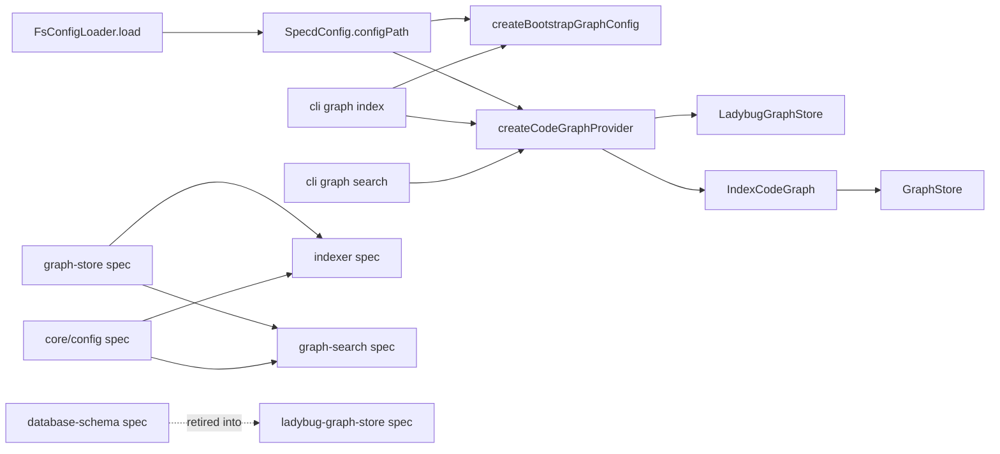

# Design: align-code-graph-specs-with-implementation

## Non-goals

- Introduce a new graph backend such as SQLite in this change. This change only prepares the specs and runtime seams so a future `SQLiteGraphStore` can exist without inheriting Ladybug-specific requirements.
- Change graph-search query semantics beyond removing Ladybug-specific wording from the specs. The CLI should remain delegated to `CodeGraphProvider.searchSymbols()` / `searchSpecs()`.
- Add new spec-to-code indexing logic for `COVERS`. This change only reserves the relation family in the abstract model and in the Ladybug schema.
- Perform an automatic filesystem migration of existing graph databases from `.specd/code-graph.lbug` to `{configPath}/graph`. The graph is derived state and may be rebuilt.
- Introduce backend-level locking semantics in `GraphStore` itself. The indexing coordination lock in this change is a shared CLI concern that exists to prevent noisy backend failures, not a new graph-store port capability.

## Affected areas

- `SpecdConfig` in [packages/core/src/application/specd-config.ts](/Users/monki/Documents/Proyectos/specd/packages/core/src/application/specd-config.ts)
  Change: add `readonly configPath: string` as a resolved project-level field alongside `projectRoot`, `storage`, and `workspaces`.
  Callers/dependents: consumed transitively by `resolveCliContext()`, `loadConfig()`, graph command context resolution, and any entrypoint that receives a loaded config. Direct fan-in is low at the type definition site, but transitive CLI fan-in is high because `resolveCliContext()` is used across change, schema, spec, project, and graph commands.
  Risk: HIGH.
  Note: any shape change here must preserve existing fields and defaults so non-graph commands remain unaffected.

- `FsConfigLoader.load()` and `SpecdYamlZodSchema` in [packages/core/src/infrastructure/fs/config-loader.ts](/Users/monki/Documents/Proyectos/specd/packages/core/src/infrastructure/fs/config-loader.ts)
  Change: parse optional top-level `configPath`, default it to `.specd/config`, resolve it relative to the config directory, validate that it remains inside the repo root, and return it in `SpecdConfig`.
  Callers/dependents: direct callers are `createConfigLoader()` and its tests; transitive dependents are all CLI/MCP/config-driven flows.
  Risk: HIGH.
  Note: this is the only place where the YAML field is normalized; everything else should consume the resolved value.

- `createBootstrapGraphConfig()` in [packages/cli/src/commands/graph/bootstrap-graph-config.ts](/Users/monki/Documents/Proyectos/specd/packages/cli/src/commands/graph/bootstrap-graph-config.ts)
  Change: synthesize `configPath` for bootstrap mode as `join(projectRoot, '.specd', 'config')` while keeping storage and workspace defaults unchanged.
  Callers/dependents: single direct caller `createBootstrapContext()` in `resolve-graph-cli-context.ts`.
  Risk: LOW.
  Note: bootstrap mode must derive the same graph/temp layout as configured mode so graph commands behave consistently.

- `createCodeGraphProvider()` in [packages/code-graph/src/composition/create-code-graph-provider.ts](/Users/monki/Documents/Proyectos/specd/packages/code-graph/src/composition/create-code-graph-provider.ts)
  Change: when passed `SpecdConfig`, instantiate `LadybugGraphStore` with `config.configPath` instead of `config.projectRoot`. Keep `CodeGraphOptions.storagePath` as the legacy escape hatch for tests and standalone use.
  Callers/dependents: direct callers are `withProvider()` and code-graph composition tests; transitive callers are all graph CLI commands.
  Risk: MEDIUM.
  Note: this is the handoff point between project config semantics and backend storage layout.

- `LadybugGraphStore` in [packages/code-graph/src/infrastructure/ladybug/ladybug-graph-store.ts](/Users/monki/Documents/Proyectos/specd/packages/code-graph/src/infrastructure/ladybug/ladybug-graph-store.ts)
  Change: reinterpret `storagePath` as the backend-owned config root; derive `dbPath` from `{storagePath}/graph/code-graph.lbug` and scratch/staging CSVs from `{storagePath}/tmp`.
  Callers/dependents: direct fan-in comes from `createCodeGraphProvider()` and infra tests only, but this adapter sits under every graph operation.
  Risk: HIGH.
  Note: this is where the current hardcoded `.specd/code-graph.lbug` and `.specd/tmp` assumptions are removed.

- `IndexCodeGraph.execute()` and `makeStageDir()` in [packages/code-graph/src/application/use-cases/index-code-graph.ts](/Users/monki/Documents/Proyectos/specd/packages/code-graph/src/application/use-cases/index-code-graph.ts)
  Change: stop rooting staged pass1/pass2 artifacts under `projectRoot/.specd/tmp`; derive the run-local stage directory from the store-owned config root instead. Preserve the current chunked staging design and cleanup behavior.
  Callers/dependents: direct caller is `CodeGraphProvider.index()`. The method is central to indexing but has low fan-in.
  Risk: MEDIUM.
  Note: this keeps the indexer coupled to the abstract store root rather than to Ladybug-specific filenames.

- `registerGraphIndex()` in [packages/cli/src/commands/graph/index-graph.ts](/Users/monki/Documents/Proyectos/specd/packages/cli/src/commands/graph/index-graph.ts)
  Change: update `--force` to call the abstract `GraphStore.recreate()` capability rather than deleting backend files directly, and acquire/release the shared graph indexing lock around the mutating indexing run.
  Callers/dependents: direct entrypoint for `specd graph index`.
  Risk: MEDIUM.
  Note: this command becomes the writer-side owner of the shared graph indexing lock.

- `registerGraphSearch()` in [packages/cli/src/commands/graph/search.ts](/Users/monki/Documents/Proyectos/specd/packages/cli/src/commands/graph/search.ts),
  `registerGraphHotspots()` in [packages/cli/src/commands/graph/hotspots.ts](/Users/monki/Documents/Proyectos/specd/packages/cli/src/commands/graph/hotspots.ts),
  `registerGraphImpact()` in [packages/cli/src/commands/graph/impact.ts](/Users/monki/Documents/Proyectos/specd/packages/cli/src/commands/graph/impact.ts),
  `registerGraphStats()` in [packages/cli/src/commands/graph/stats.ts](/Users/monki/Documents/Proyectos/specd/packages/cli/src/commands/graph/stats.ts),
  and shared graph CLI helpers under [packages/cli/src/commands/graph/](/Users/monki/Documents/Proyectos/specd/packages/cli/src/commands/graph)
  Change: keep the commands backend-agnostic but add a shared pre-provider guard that checks the graph indexing lock and fails fast with a retry-later message while indexing is in progress.
  Callers/dependents: these commands are registered from `packages/cli/src/index.ts`; `withProvider()` remains shared by the graph command family.
  Risk: MEDIUM.
  Note: this keeps concurrency coordination in the CLI layer instead of letting backend lock errors leak through command-by-command.

- `LanguageAdapter` in [packages/code-graph/src/domain/value-objects/language-adapter.ts](/Users/monki/Documents/Proyectos/specd/packages/code-graph/src/domain/value-objects/language-adapter.ts) and `PhpLanguageAdapter` in [packages/code-graph/src/infrastructure/tree-sitter/php-language-adapter.ts](/Users/monki/Documents/Proyectos/specd/packages/code-graph/src/infrastructure/tree-sitter/php-language-adapter.ts)
  Change: likely no runtime work remains because `extractSymbolsWithNamespace()` is already present in both the port and PHP adapter. The implementation task is limited to keeping tests/docs aligned if signatures or comments drift.
  Callers/dependents: `IndexCodeGraph.execute()` uses the optional fast path; PHP adapter is the only current implementation.
  Risk: LOW.

- Documentation files:
  - [docs/config/config-reference.md](/Users/monki/Documents/Proyectos/specd/docs/config/config-reference.md)
  - [docs/guide/configuration.md](/Users/monki/Documents/Proyectos/specd/docs/guide/configuration.md)
  - [docs/cli/cli-reference.md](/Users/monki/Documents/Proyectos/specd/docs/cli/cli-reference.md)
  - [packages/code-graph/README.md](/Users/monki/Documents/Proyectos/specd/packages/code-graph/README.md)
    Change: document `configPath`, the derived graph/temp directories, and the fact that `GraphStore` is abstract while `LadybugGraphStore` owns backend-specific schema/layout.
    Risk: LOW.

## New constructs

No new top-level runtime modules are required for this change. The implementation extends existing constructs in place:

- `SpecdConfig` in [packages/core/src/application/specd-config.ts](/Users/monki/Documents/Proyectos/specd/packages/core/src/application/specd-config.ts)
  Shape change:

  ```ts
  export interface SpecdConfig {
    readonly projectRoot: string
    readonly configPath: string
    readonly schemaRef: string
    readonly workspaces: readonly SpecdWorkspaceConfig[]
    readonly storage: SpecdStorageConfig
    ...
  }
  ```

  Responsibility: carry the resolved config-owned root for graph artifacts without changing storage semantics for changes/drafts/archive.

- `FsConfigLoader.load()` in [packages/core/src/infrastructure/fs/config-loader.ts](/Users/monki/Documents/Proyectos/specd/packages/core/src/infrastructure/fs/config-loader.ts)
  Shape change:

  ```ts
  async load(): Promise<SpecdConfig>
  ```

  with additional logic to produce:

  ```ts
  const resolvedConfigPath =
    data.configPath !== undefined
      ? path.resolve(configDir, data.configPath)
      : path.resolve(configDir, '.specd/config')
  ```

  Responsibility: normalize and validate `configPath` exactly once.

- `createBootstrapGraphConfig()` in [packages/cli/src/commands/graph/bootstrap-graph-config.ts](/Users/monki/Documents/Proyectos/specd/packages/cli/src/commands/graph/bootstrap-graph-config.ts)
  Shape change:

  ```ts
  export function createBootstrapGraphConfig(params: {
    readonly projectRoot: string
    readonly vcsRoot: string
  }): SpecdConfig
  ```

  returning a `SpecdConfig` that includes:

  ```ts
  configPath: join(params.projectRoot, '.specd', 'config')
  ```

  Responsibility: keep bootstrap-mode graph layout aligned with configured mode.

- `LadybugGraphStore` path getters in [packages/code-graph/src/infrastructure/ladybug/ladybug-graph-store.ts](/Users/monki/Documents/Proyectos/specd/packages/code-graph/src/infrastructure/ladybug/ladybug-graph-store.ts)
  Shape change:

  ```ts
  private get dbPath(): string {
    return join(this.storagePath, 'graph', 'code-graph.lbug')
  }

  private get bulkLoadTmpDir(): string {
    return join(this.storagePath, 'tmp')
  }
  ```

  Responsibility: own the Ladybug-specific file layout below the config-owned root.

- Shared graph CLI lock helper under [packages/cli/src/commands/graph/](/Users/monki/Documents/Proyectos/specd/packages/cli/src/commands/graph)
  Shape change:
  ```ts
  acquireGraphIndexLock(configPath: string): Promise<GraphIndexLockHandle>
  ensureGraphNotIndexing(configPath: string): Promise<void>
  ```
  with the lock file rooted under:
  ```ts
  join(configPath, 'graph', 'index.lock')
  ```
  Responsibility: centralize the lock filename, acquisition, release, and retry-later error text so all graph CLI commands behave consistently.

## Approach

1. Treat this change as two coupled threads:
   - spec structure cleanup: separate the abstract `GraphStore` contract from the concrete Ladybug backend, absorb `database-schema` into `ladybug-graph-store`, and keep `indexer` / `graph-search` storage-agnostic.
   - runtime support for `configPath`: remove the remaining hardcoded graph DB and temp locations from config loading, provider composition, indexer staging, and CLI `--force` cleanup.

2. Land the config path through the config model first.
   - Extend the YAML schema in `FsConfigLoader` with optional top-level `configPath`.
   - Resolve it relative to the config directory.
   - Enforce the same repo-root boundary used for storage paths.
   - Return it in `SpecdConfig`.
   - Mirror the same default in bootstrap mode so graph commands behave the same with or without `specd.yaml`.

3. Re-root graph persistence to the config-owned root.
   - `createCodeGraphProvider()` should pass `config.configPath` to `LadybugGraphStore`.
   - `LadybugGraphStore` then becomes the only place that knows the physical layout:
     - `{storagePath}/graph/code-graph.lbug`
     - `{storagePath}/graph/code-graph.lbug.wal`
     - `{storagePath}/graph/code-graph.lbug.lock`
     - `{storagePath}/tmp/*`
   - This preserves the abstract `GraphStore(storagePath)` contract while changing what the Ladybug adapter does with that root.

4. Align the indexer with the abstract store root rather than `projectRoot`.
   - Keep `IndexOptions.projectRoot` for repo-relative discovery/spec semantics.
   - Change staging helpers in `IndexCodeGraph` to derive `index-stage-*` from `this.store.storagePath`.
   - Preserve the existing staging format and cleanup behavior; only the root directory changes.

5. Introduce a shared graph CLI indexing lock.
   - Root the lock file under the derived graph persistence area, alongside the graph backend artifacts:
     - `{configPath}/graph/index.lock`
   - `graph index` acquires it before opening the provider for mutation work.
   - `graph index` releases it on normal completion and from signal-driven shutdown paths.
   - `graph search`, `graph hotspots`, `graph impact`, and `graph stats` check the lock before opening the provider and fail fast with a short retry-later message if it is present.
   - This is intentionally a CLI coordination mechanism, not a `GraphStore` concern.

6. Update CLI graph flows that still know backend details.
   - `graph index --force` must call `provider`/store recreation rather than deleting backend files directly.
   - read-only graph commands stay backend-agnostic; their runtime change is only the shared lock guard before provider open.

7. Leave the Ladybug/Lbug-specific semantics isolated.
   - No new generic `GraphStore` API is needed for `COVERS` yet.
   - `database-schema` is retired as a shim; `ladybug-graph-store` becomes the sole owner of physical schema, FTS shape, and schema versioning.
   - A future `SQLiteGraphStore` can implement the abstract port without inheriting Ladybug file layout or FTS wording.

8. Update docs immediately after code/spec changes.
   - `docs/config/config-reference.md` and `docs/guide/configuration.md` need a new `configPath` section and updated minimal examples.
   - `docs/cli/cli-reference.md` should explain that graph artifacts now live under the derived config path.
   - `docs/cli/cli-reference.md` should also describe the retry-later behavior when graph commands race an ongoing indexing run.
   - `packages/code-graph/README.md` should describe `GraphStore` as abstract and Ladybug as one implementation.

## Key decisions

- **Decision** → `configPath` is project-level and resolved by the config loader; graph code consumes the resolved absolute path, not raw YAML.  
  **Alternatives rejected** → Per-workspace graph roots were rejected because the graph store is project-wide today and the change would cascade into workspace selection, provider composition, and archive/state semantics with no immediate need.

- **Decision** → Keep `GraphStore.storagePath` as the backend-owned root and reinterpret it in `LadybugGraphStore` as `configPath`, not as the old project root.  
  **Alternatives rejected** → Adding separate `graphPath` / `tmpPath` constructor parameters to `GraphStore` was rejected because it would widen the abstract port for a concern only the concrete backend currently needs.

- **Decision** → Model destructive `--force` behavior through `GraphStore.recreate()` instead of deleting backend files from CLI code.  
  **Alternatives rejected** → Reusing `clear()` was rejected because it only describes logical data deletion inside an already-open store and does not capture backend recreation semantics. Keeping file deletion in CLI was rejected because it leaks adapter specifics and blocks future backends.

- **Decision** → Do not auto-migrate existing Ladybug files from `.specd/code-graph.lbug` to `{configPath}/graph`.  
  **Alternatives rejected** → Automatic move/copy on `open()` was rejected because the graph is derived state, migration failure modes are awkward, and this code path already proved fragile under load.

- **Decision** → Keep `graph-search` runtime code backend-agnostic and limit its implementation work to composition/tests/docs.  
  **Alternatives rejected** → Adding backend-conditional logic in the CLI was rejected because the current delegation through `CodeGraphProvider` is already the correct architecture and the change is normative, not functional.

- **Decision** → Put graph-command concurrency coordination in a shared CLI lock helper rooted at `{configPath}/graph/index.lock`.  
  **Alternatives rejected** → Relying on backend lock errors was rejected because the user experience is noisy and backend-specific. Moving the lock into `GraphStore` was rejected because the requirement is command-family coordination, not a portable graph-store capability.

- **Decision** → Keep `extractSymbolsWithNamespace()` as an optional adapter fast path rather than replacing `extractSymbols()` / `extractNamespace()` outright.  
  **Alternatives rejected** → Making the combined method mandatory was rejected because only PHP currently benefits, while other adapters already conform to the existing split contract.

## Trade-offs

- [Existing local graph files remain in the old location until rebuilt] → Document the new path, keep `--force` targeting the new location, and rely on re-indexing because the graph is reconstructible.
- [Config model change has wide transitive reach] → Keep `configPath` additive with a stable default so most callers only need updated mocks/fixtures, not behavior changes.
- [Index staging now depends on the store root] → Preserve the current `GraphStore` contract and use only `storagePath`, avoiding any dependency on Ladybug-only filenames from the application layer.
- [CLI lock is advisory rather than backend-enforced] → Keep the lock helper narrow in scope and user-facing; it improves predictability for the normal CLI path without pretending to solve every external writer.
- [Deprecated `database-schema` spec can linger] → Keep it as a shim only in this change and schedule removal once remaining references are gone.

## Spec impact

### `code-graph:code-graph/graph-store`

- Direct dependents: `code-graph:code-graph/indexer`, `code-graph:code-graph/staleness-detection`, `code-graph:code-graph/hotspots`, `code-graph:code-graph/traversal`, `code-graph:code-graph/composition`, and the retiring `code-graph:code-graph/database-schema`.
- Transitive dependents:
  - `graph-store` → `composition` → CLI graph commands
  - `graph-store` → `indexer` → `cli:cli/graph-index`
  - `graph-store` → `hotspots` / `traversal` → `cli:cli/graph-hotspots` / `cli:cli/graph-impact`
- Assessment:
  - `hotspots`, `traversal`, and `staleness-detection` remain satisfied because the abstract query/statistics contract is preserved.
  - `composition` remains satisfied because it still wires `LadybugGraphStore`; its wording may need a later cleanup if it over-explains backend specifics.
  - `indexer` and `graph-search` required deltas in this change because they previously referenced backend-specific schema/FTS details.

### `code-graph:code-graph/indexer`

- Direct dependents: `code-graph:code-graph/staleness-detection`, `code-graph:code-graph/composition`, `cli:cli/graph-index`.
- Transitive dependents:
  - `indexer` → `composition` → all runtime graph commands via `withProvider()`
- Assessment:
  - `staleness-detection` still holds because `lastIndexedRef` semantics do not change.
  - `cli:cli/graph-index` remains semantically valid but the runtime code must update `--force` cleanup to the new graph path.
  - No dependent spec needs a semantic update for staged disk artifacts because staging remains an implementation detail under bounded-memory chunking.

### `core:core/config`

- Direct dependents are broad across CLI and core, including `cli:cli/entrypoint`, `cli:cli/graph-index`, `cli:cli/graph-search`, `cli:cli/graph-stats`, `cli:cli/graph-impact`, `cli:cli/graph-hotspots`, `core:core/config-loader`, `core:core/workspace`, and `core:core/change`.
- Transitive dependents include most command specs because config loading sits underneath `resolveCliContext()`.
- Assessment:
  - `configPath` is additive with a default, so existing requirements remain satisfied unless a spec documents the exact full shape of `SpecdConfig`.
  - `cli:cli/graph-search` needed a delta because it referenced backend-specific FTS behavior.
  - `cli:cli/graph-index`, `cli:cli/graph-hotspots`, `cli:cli/graph-impact`, and `cli:cli/graph-stats` now also consume the derived graph root for shared lock coordination.

### `code-graph:code-graph/database-schema`

- Direct dependents before this change: `code-graph:code-graph/indexer`, `cli:cli/graph-search`.
- Transitive dependents: none meaningful beyond those two.
- Assessment:
  - Both direct dependents are updated in this change to stop relying on it.
  - The shim can be removed in a future cleanup change once no remaining spec references it.

## Dependency map



```text
┌───────────────────────┐
│ FsConfigLoader.load() │
└───────────┬───────────┘
            │ resolves
            ▼
┌───────────────────────┐
│ SpecdConfig.configPath│
└───────┬────────┬──────┘
        │        │
        │        └─────────────────────────────┐
        ▼                                      ▼
┌──────────────────────────┐         ┌─────────────────────────┐
│ createBootstrapGraph...  │         │ createCodeGraphProvider │
└──────────────┬───────────┘         └────────────┬────────────┘
               │                                  │
               │                                  ├──────────────▶┌─────────────────────┐
               │                                  │               │ LadybugGraphStore   │
               │                                  │               └─────────────────────┘
               │                                  │
               │                                  └──────────────▶┌─────────────────────┐
               │                                                  │ IndexCodeGraph      │
               │                                                  └─────────┬───────────┘
               │                                                            │ uses
               │                                                            ▼
               │                                                  ┌─────────────────────┐
               │                                                  │ GraphStore (port)   │
               │                                                  └─────────────────────┘
               │
      ┌────────▼────────┐                        ┌────────────────┐
      │ cli graph index │                        │ cli graph search│
      └─────────────────┘                        └────────────────┘

┌───────────────────┐      depends on      ┌────────────────────────┐
│ database-schema   │ - - - - - - - - - ▶ │ ladybug-graph-store    │
│ (deprecated shim) │                      └──────────┬─────────────┘
└───────────────────┘                                 │ implements
                                                      ▼
                                           ┌────────────────────────┐
                                           │ graph-store            │
                                           └───────┬────────┬───────┘
                                                   │        │
                                                   ▼        ▼
                                            ┌──────────┐  ┌─────────────┐
                                            │ indexer  │  │ graph-search│
                                            └──────────┘  └─────────────┘
```

## Migration / Rollback

- Rollout:
  1. Ship the `SpecdConfig.configPath` addition and bootstrap default together.
  2. Re-root `LadybugGraphStore`, `IndexCodeGraph` staging, and `graph index --force` to the derived graph/temp directories.
  3. Update docs and examples to show the new layout.
  4. Re-index locally to create a fresh graph under `{configPath}/graph`.

- Existing graph state:
  - do not move old `.specd/code-graph.lbug*` files automatically
  - treat them as obsolete derived artifacts
  - allow users to remove them manually or keep them until the next cleanup

- Rollback:
  1. Revert the `configPath` wiring and Ladybug path derivation.
  2. Rebuild the graph in the old location if needed.
  3. Remove `{configPath}/graph` and `{configPath}/tmp` artifacts only if they were created by the reverted build.

## Testing

### Automated tests

- [packages/core/test/infrastructure/fs/config-loader.spec.ts](/Users/monki/Documents/Proyectos/specd/packages/core/test/infrastructure/fs/config-loader.spec.ts)
  - add cases for omitted `configPath` defaulting to `.specd/config`
  - add cases for explicit `configPath`
  - add repo-boundary validation for `configPath` resolving outside the repo root

- [packages/code-graph/test/composition/code-graph-provider.spec.ts](/Users/monki/Documents/Proyectos/specd/packages/code-graph/test/composition/code-graph-provider.spec.ts)
  - assert that `createCodeGraphProvider(specdConfig)` passes `config.configPath` semantics through to the created store layout
  - preserve legacy `CodeGraphOptions.storagePath` behavior for tests/standalone callers

- [packages/code-graph/test/infrastructure/ladybug/ladybug-graph-store.spec.ts](/Users/monki/Documents/Proyectos/specd/packages/code-graph/test/infrastructure/ladybug/ladybug-graph-store.spec.ts)
  - add assertions that the database file and companion files live under `<storageRoot>/graph`
  - add assertions that bulk-load scratch files use `<storageRoot>/tmp`

- [packages/code-graph/test/application/use-cases/workspace-indexing.spec.ts](/Users/monki/Documents/Proyectos/specd/packages/code-graph/test/application/use-cases/workspace-indexing.spec.ts)
  - add/extend tests so staged `index-stage-*` artifacts are created under the store-owned temp root and removed after success
  - keep coverage for `extractSymbolsWithNamespace()` fast path

- [packages/cli/test/commands/graph-index.spec.ts](/Users/monki/Documents/Proyectos/specd/packages/cli/test/commands/graph-index.spec.ts)
  - add a `--force` test asserting cleanup targets `{configPath}/graph/code-graph.lbug*`
  - keep bootstrap/configured context behavior unchanged

- [packages/cli/test/commands/graph-search.spec.ts](/Users/monki/Documents/Proyectos/specd/packages/cli/test/commands/graph-search.spec.ts)
  - update config mocks if `SpecdConfig` now requires `configPath`
  - no new search logic tests are required beyond keeping backend-agnostic delegation intact

### Manual / E2E verification

- Run targeted test suites:
  - `pnpm --filter @specd/core test -- config-loader`
  - `pnpm --filter @specd/code-graph test`
  - `pnpm --filter @specd/cli test -- graph-index graph-search`

- Manual graph smoke test in this repo:
  1. set `configPath` in `specd.yaml` or rely on the default
  2. run `node packages/cli/dist/index.js graph index --config specd.yaml`
  3. confirm the graph DB appears under `{configPath}/graph`
  4. confirm staging / temp artifacts are created under `{configPath}/tmp` and cleaned on success
  5. run `node packages/cli/dist/index.js graph search "GraphStore" --config specd.yaml`
  6. confirm results still return normally through the backend-agnostic CLI path

- Manual bootstrap check:
  1. run `node packages/cli/dist/index.js graph index --path .`
  2. confirm bootstrap mode derives `.specd/config`, `.specd/config/graph`, and `.specd/config/tmp` under the repository root

- Documentation update steps:
  - update [docs/config/config-reference.md](/Users/monki/Documents/Proyectos/specd/docs/config/config-reference.md)
  - update [docs/guide/configuration.md](/Users/monki/Documents/Proyectos/specd/docs/guide/configuration.md)
  - update [docs/cli/cli-reference.md](/Users/monki/Documents/Proyectos/specd/docs/cli/cli-reference.md)
  - update [packages/code-graph/README.md](/Users/monki/Documents/Proyectos/specd/packages/code-graph/README.md)

These docs updates are required because the physical graph storage location and the abstract-vs-concrete store split are user-facing architecture/reference information.
