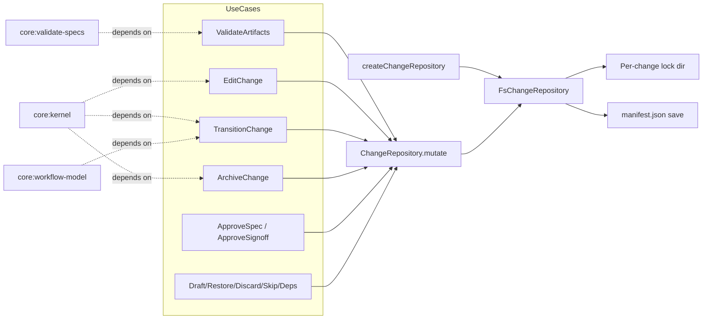

# Design: serialize-change-mutations

## Non-goals

- Add optimistic manifest revisioning or compare-and-swap semantics on top of serialized mutation. This change standardises one concurrency mechanism first: per-change serialized mutation in `ChangeRepository`.
- Serialize the whole CLI process or any adapter entrypoint. Coordination stays in the repository layer.
- Change artifact file concurrency rules (`saveArtifact()` already owns optimistic conflict detection and remains separate from manifest mutation).
- Introduce cross-repository or cross-change global locking. Different change names must remain independently mutable.

## Affected areas

- `ChangeRepository` in `packages/core/src/application/ports/change-repository.ts`
  Change: add a new abstract `mutate<T>(name, fn)` API and document the difference between snapshot reads and serialized mutations.
  Callers / dependents: the port is referenced in roughly 45 `packages/core/src` and `packages/core/test` files via imports or factory usage. Risk: HIGH.
  Note: this is the central application port for persisted change state, so the signature must remain minimal and backwards-compatible for all existing readers.

- `FsChangeRepository` in `packages/core/src/infrastructure/fs/change-repository.ts`
  Change: implement `mutate<T>()`, add internal per-change lock handling, and keep `get()`/`save()` semantics intact for read-only and low-level persistence callers.
  Callers / dependents: direct construction is contained behind `createChangeRepository()`. Risk: HIGH.
  Note: this is the only concrete implementation today, so correctness here determines whether the port contract is real or aspirational.

- `createChangeRepository()` in `packages/core/src/composition/change-repository.ts`
  Change: keep its public signature unchanged while constructing an `FsChangeRepository` that now supports `mutate()`.
  Callers / dependents: 20 composition call sites in `packages/core/src`. Risk: CRITICAL.
  Note: avoid widening factory options unless strictly necessary; this symbol is already a core hotspot.

- `ValidateArtifacts.execute()` in `packages/core/src/application/use-cases/validate-artifacts.ts`
  Change: move manifest persistence from trailing `save(change)` to repository mutation against fresh persisted state.
  Callers / dependents: kernel route `changes.validate`, spec dependents `core:archive-change` and `core:validate-specs`. Risk: HIGH.
  Note: this is the motivating race; it also performs the heaviest per-change manifest mutation (`invalidate`, `markComplete`, `setSpecDependsOn`).

- `EditChange.execute()` in `packages/core/src/application/use-cases/edit-change.ts`
  Change: apply `updateSpecIds(...)` through `mutate()`, keeping `scaffold()` / `unscaffold()` outside the critical section.
  Callers / dependents: kernel route `changes.edit`. Risk: MEDIUM.

- `DraftChange.execute()`, `RestoreChange.execute()`, `DiscardChange.execute()` in:
  - `packages/core/src/application/use-cases/draft-change.ts`
  - `packages/core/src/application/use-cases/restore-change.ts`
  - `packages/core/src/application/use-cases/discard-change.ts`
    Change: replace `get() -> entity mutation -> save()` with `mutate()` for event append + persisted relocation.
    Callers / dependents: kernel routes `changes.draft`, `changes.restore`, `changes.discard`. Risk: MEDIUM.

- `ApproveSpec.execute()` and `ApproveSignoff.execute()` in:
  - `packages/core/src/application/use-cases/approve-spec.ts`
  - `packages/core/src/application/use-cases/approve-signoff.ts`
    Change: record approval/signoff and lifecycle transition inside `mutate()`.
    Callers / dependents: kernel routes `specs.approveSpec` and `specs.approveSignoff`. Risk: MEDIUM.
    Note: hashing still depends on artifact file reads, so the implementation must balance fresh persisted state against lock hold time.

- `SkipArtifact.execute()` in `packages/core/src/application/use-cases/skip-artifact.ts`
  Change: persist skip recording through `mutate()`.
  Callers / dependents: kernel route `changes.skipArtifact`. Risk: LOW.

- `TransitionChange.execute()` in `packages/core/src/application/use-cases/transition-change.ts`
  Change: keep routing, requires checks, and hook orchestration outside the lock, but apply the final persisted lifecycle mutation through `mutate()`.
  Callers / dependents: kernel route `changes.transition`; dependent specs include `core:workflow-model` and `core:hook-execution-model`. Risk: HIGH.
  Note: this is the most subtle use case because it mixes read checks, hooks, and final persistence.

- `UpdateSpecDeps.execute()` in `packages/core/src/application/use-cases/update-spec-deps.ts`
  Change: persist `setSpecDependsOn(...)` through `mutate()`.
  Callers / dependents: kernel route `changes.updateSpecDeps`; consumed by `CompileContext`. Risk: MEDIUM.

- `ArchiveChange.execute()` in `packages/core/src/application/use-cases/archive-change.ts`
  Change: serialize only the initial transition to `archiving`, then continue with overlap checks, hooks, spec sync, and archive repository work outside the lock.
  Callers / dependents: kernel route `changes.archive`; dependent specs include `core:change-layout`, `core:archive-repository-port`, `core:list-archived`, `core:get-archived-change`, `core:template-variables`, `core:workflow-model`, `core:hook-execution-model`. Risk: HIGH.

- Developer docs in:
  - `docs/core/ports.md`
  - `docs/core/use-cases.md`
  - `docs/core/overview.md`
  - `docs/core/examples/implementing-a-port.md`
    Change: document the new `ChangeRepository.mutate()` contract, update use-case descriptions that currently imply `save(change)` as the persistence boundary, and extend the port implementation example so it stays aligned with the abstract class contract.
    Callers / dependents: human readers and future contributors rather than runtime code. Risk: MEDIUM for drift if left stale.

- Test support and coverage:
  - `packages/core/test/application/use-cases/helpers.ts`
  - `packages/core/test/infrastructure/fs/change-repository.spec.ts`
  - existing use-case specs under `packages/core/test/application/use-cases/*.spec.ts`
    Change: add `mutate()` support to the in-memory stub and extend repository/use-case tests for serialized persistence semantics.
    Callers / dependents: nearly every application use-case test uses the helper repo. Risk: HIGH for test churn, low for production behaviour.

## New constructs

- `mutate<T>(name: string, fn: (change: Change) => Promise<T> | T): Promise<T>`
  Location: `packages/core/src/application/ports/change-repository.ts`
  Shape:

  ```ts
  abstract mutate<T>(
    name: string,
    fn: (change: Change) => Promise<T> | T,
  ): Promise<T>
  ```

  Responsibility: provide the single serialized read-modify-write API for existing persisted changes.
  Relationships: implemented by `FsChangeRepository`; called by change-mutating use cases; does not replace `saveArtifact()`.

- `override async mutate<T>(name: string, fn: (change: Change) => Promise<T> | T): Promise<T>`
  Location: `packages/core/src/infrastructure/fs/change-repository.ts`
  Shape:

  ```ts
  override async mutate<T>(
    name: string,
    fn: (change: Change) => Promise<T> | T,
  ): Promise<T>
  ```

  Responsibility: acquire per-change exclusive access, load fresh persisted state, run the callback, persist on success, and always release the lock.
  Relationships: uses private lock helpers and existing `get()` / `save()` internals; remains hidden behind the port and factory.

- Private lock helpers in `FsChangeRepository`
  Location: `packages/core/src/infrastructure/fs/change-repository.ts`
  Shape:
  ```ts
  private async _withChangeLock<T>(name: string, fn: () => Promise<T>): Promise<T>
  private _lockDirPath(name: string): string
  private async _acquireLock(lockDir: string): Promise<void>
  private async _releaseLock(lockDir: string): Promise<void>
  private async _writeLockOwner(lockDir: string): Promise<void>
  private async _readLockOwner(lockDir: string): Promise<{ pid: number; acquiredAt: string } | null>
  private _isPidAlive(pid: number): boolean
  ```
  Responsibility: implement per-change mutual exclusion using the filesystem and process liveness checks.
  Relationships: internal only; no new composition wiring and no new exported surface.

## Approach

The implementation is a repository-centred concurrency fix with two usage patterns.

1. Extend the `ChangeRepository` port with `mutate<T>(name, fn)`. `get()` remains a snapshot read for callers; `save()` remains a low-level manifest persistence primitive; `mutate()` becomes the only repository API that promises serialized mutation of an existing persisted change.

2. Implement `FsChangeRepository.mutate()` as:
   - derive a stable repo-local lock root (private, no factory signature change), e.g. `path.join(path.dirname(this._changesPath), '.locks')`
   - compute a per-change lock directory such as `.locks/<change-name>.lock`
   - acquire the lock by `fs.mkdir(lockDir)`; on `EEXIST`, inspect lock owner metadata and wait/retry while the owner PID is alive
   - after lock acquisition, load the fresh persisted change with existing `get(name)` semantics
   - run the caller callback against that fresh `Change`
   - if the callback resolves, persist through existing `save(change)`
   - always remove the owner metadata and lock directory in `finally`

3. Keep lock ownership internal to `FsChangeRepository`. No CLI command, kernel, or use case learns about lock files or polling.

4. Migrate use cases in two groups:
   - Fully encapsulated mutations inside `mutate()`:
     - `draft-change`
     - `restore-change`
     - `discard-change`
     - `skip-artifact`
     - `update-spec-deps`
     - `approve-spec`
     - `approve-signoff`
     - `validate-artifacts`

   - Hybrid flows where non-manifest work stays outside the critical section:
     - `edit-change`: use `mutate()` for `updateSpecIds(...)`, then run `unscaffold()` / `scaffold()` after the manifest is persisted
     - `transition-change`: do schema lookups, task checks, and hook execution outside the lock, then use `mutate()` for the final persisted lifecycle mutation
     - `archive-change`: use `mutate()` only for `assertArchivable()` + transition to `archiving`, then proceed with overlap checks, hooks, spec sync, and `archiveRepository.archive(...)`

5. For `ValidateArtifacts`, preserve the existing validation pipeline but move the persisted state application into `mutate()`. The safe pattern is:
   - compute validation failures/warnings and any file-derived side effects as today
   - enter `mutate(input.name, fn)`
   - inside the callback, apply invalidation, `markComplete`, and `setSpecDependsOn` to the fresh persisted `Change`
   - return the result object from the callback so the repository persists the updated manifest before `execute()` returns

   This keeps the public result shape unchanged while eliminating last-writer-wins on the manifest.

6. For approvals, compute hashes against the same `Change` instance that is eventually persisted. The simplest safe implementation is to run hash computation from inside the mutation callback, because the callback already has the fresh persisted `Change` and the artifact file reads are bounded to that change.

7. Update the in-memory `StubChangeRepository` in tests to implement `mutate()` as `get -> callback -> save` without real locking. Unit tests care about contract shape and fresh persisted mutation semantics, not process-level locking.

8. Update documentation alongside code:
   - update `docs/core/ports.md` to add `ChangeRepository.mutate()` and clarify the division of responsibility between `get()`, `mutate()`, `save()`, and `saveArtifact()`
   - update `docs/core/use-cases.md` so the affected use-case sections describe repository mutation rather than bare trailing `save(change)` persistence
   - update `docs/core/overview.md` anywhere it summarises `ChangeRepository` or the affected use cases in a way that now implies the old persistence pattern
   - update `docs/core/examples/implementing-a-port.md` so custom `ChangeRepository` implementations include the new abstract `mutate()` method
   - no user-facing CLI reference changes are expected because command syntax and outputs do not change

This approach satisfies the modified specs:

- `core:core/change-repository-port` by defining `get()` vs `mutate()` semantics clearly
- all affected use-case specs by moving persisted mutations to `mutate()`
- `verify` scenarios by preserving fresh-state application and partial-progress behaviour
- `_global` architecture by keeping concurrency and filesystem I/O inside infrastructure, not in domain or adapters

## Key decisions

- **Decision**: implement serialized mutation in `ChangeRepository`, not in CLI or kernel.
  **Rationale**: the shared resource is persisted change state; keeping coordination in the repository satisfies the architecture boundary and covers every entrypoint.
  **Alternatives rejected**: CLI-level locking, because it leaks persistence concerns upward and misses non-CLI callers.

- **Decision**: add `mutate()` instead of overloading `save()`.
  **Rationale**: `save()` already means “persist this manifest”; changing it into an implicit lock-bearing read-modify-write primitive would make current semantics ambiguous.
  **Alternatives rejected**: “teach callers to call `save()` differently” and low-level `withLock(...)`, because both expose the mechanism more than the intent.

- **Decision**: keep the lock implementation private to `FsChangeRepository`.
  **Rationale**: no other layer should know about lock directories, polling, or stale-lock recovery.
  **Alternatives rejected**: new shared lock service or composition-level lock injection. That adds API surface without another adapter needing it today.

- **Decision**: use a filesystem lock directory plus owner metadata and PID liveness checks.
  **Rationale**: `fs.mkdir()` is atomic across processes, works with the current filesystem-only architecture, and PID checks allow stale lock cleanup after crashed processes.
  **Alternatives rejected**: plain lock files with no owner metadata (stale forever), in-memory mutexes (single process only), and external lock daemons (far beyond v1 scope).

- **Decision**: keep `createChangeRepository()` signature unchanged.
  **Rationale**: it is already a high-fan-in composition symbol. The lock root can be derived privately from repository paths.
  **Alternatives rejected**: adding `locksPath` to public options immediately. That increases composition churn without a demonstrated need.

- **Decision**: use hybrid migration for `edit-change`, `transition-change`, and `archive-change`.
  **Rationale**: hooks, scaffolding, and archive-time spec sync are too slow or too broad to hold a per-change manifest lock around them.
  **Alternatives rejected**: wrapping those entire use cases in one giant `mutate()` callback, which would over-serialize long-running operations and worsen contention.

## Trade-offs

- [Longer lock hold time in `validate-artifacts` and approval flows] → Keep locking scoped per change, not global, and avoid extra re-reads once inside the callback.
- [Stale lock directories after abrupt process death] → Store owner PID metadata and reap locks whose owner process no longer exists.
- [Potential drift between pre-lock checks and final persisted mutation in hybrid use cases] → Re-check the persisted-state-sensitive conditions inside the `mutate()` callback before applying the final mutation.
- [More test churn across many use-case specs] → Centralise most test helper changes in `packages/core/test/application/use-cases/helpers.ts` and add focused assertions instead of rewriting entire suites.

## Spec impact

### `core:core/change-repository-port`

- Direct dependents:
  - `core:kernel`
  - `core:change`
  - `core:get-status`
  - `core:get-hook-instructions`
  - `core:run-step-hooks`
  - `core:compile-context`
  - `core:list-changes`
  - `core:list-drafts`
  - `core:list-discarded`
  - `core:create-change`
  - `core:preview-spec`
  - `core:archive-repository-port`
- Transitive dependents:
  - `core:get-status` → CLI status commands
  - `core:run-step-hooks` / `core:get-hook-instructions` → `core:hook-execution-model`, `core:template-variables`
  - `core:kernel` → all composition and adapter entrypoints
- Assessment:
  - No dependent spec needs a delta because existing read APIs (`get`, `list`, `changePath`, `artifact`, `saveArtifact`) remain valid.
  - `core:change` remains satisfied because auto-invalidation on `get()` still works; `mutate()` adds behaviour, it does not remove existing drift detection.

### `core:core/validate-artifacts`

- Direct dependents:
  - `core:archive-change`
  - `core:validate-specs`
- Transitive dependents:
  - `core:archive-change` → `core:change-layout`, `core:list-archived`
- Assessment:
  - No downstream spec needs updating because `ValidateArtifacts` keeps the same input, result shape, and failure model.
  - The only changed behaviour is stronger persistence safety, which is invisible to callers except that lost updates stop occurring.

### Use-case specs updated in this change

- `core:core/edit-change`
- `core:core/draft-change`
- `core:core/restore-change`
- `core:core/discard-change`
- `core:core/approve-spec`
- `core:core/approve-signoff`
- `core:core/skip-artifact`
- `core:core/transition-change`
- `core:core/update-spec-deps`
- `core:core/archive-change`

- Direct dependents:
  - chiefly `core:kernel`
  - plus `core:workflow-model` and `core:hook-execution-model` for `transition-change` / `archive-change`
  - plus `core:get-archived-change`, `core:list-archived`, `core:archive-repository-port`, `core:change-layout`, `core:template-variables` for `archive-change`
- Assessment:
  - No dependent requirement text needs changing because names, constructor wiring, public inputs, and outputs stay stable.
  - The modified specs tighten internal persistence semantics only, so downstream specs that describe invocation or lifecycle behaviour remain satisfied.

## Dependency map



```
┌──────────────────────────────┐
│ core:kernel / use-case files │
└───────┬───────────┬──────────┘
        │           │
        │           ├──────────────▶┌──────────────────────┐
        │           │               │ TransitionChange     │
        │           ├──────────────▶│ ArchiveChange        │
        │           │               │ Edit / Draft / ...   │
        │           │               └──────────┬───────────┘
        │           │                          │
        │           └──────────────▶┌──────────▼───────────┐
        │                           │ ChangeRepository     │
        │                           │ mutate(name, fn)     │
        │                           └──────────┬───────────┘
        │                                      │
        │                                      ▼
        │                           ┌──────────────────────┐
        └──────────────────────────▶│ FsChangeRepository   │
                                    │  _withChangeLock()   │
                                    │  save()/get()        │
                                    └───────┬───────┬──────┘
                                            │       │
                                  lock dir  │       │ manifest write
                                            ▼       ▼
                                     ┌─────────┐ ┌──────────────┐
                                     │ .locks/ │ │ manifest.json│
                                     └─────────┘ └──────────────┘

┌────────────────────┐    depends on    ┌──────────────────────┐
│ core:validate-specs│ ─ ─ ─ ─ ─ ─ ─ ─▶ │ core:validate-       │
└────────────────────┘                  │ artifacts            │
                                        └──────────────────────┘

┌────────────────────┐    depends on    ┌──────────────────────┐
│ core:workflow-model│ ─ ─ ─ ─ ─ ─ ─ ─▶ │ core:transition-     │
└────────────────────┘                  │ change               │
                                        └──────────────────────┘
```

## Migration / Rollback

- Migration:
  - ship `ChangeRepository.mutate()` and `FsChangeRepository` lock handling first
  - migrate all affected use cases in the same changeset so the port is not introduced half-used
  - update test stubs and integration tests in the same commit to keep the tree green
- Rollback:
  - revert the use cases back to `get() -> save()` and remove `mutate()` from the port + implementation as a single rollback unit
  - no manifest schema or on-disk data migration is involved, so rollback is code-only

## Testing

**Automated tests**

- `packages/core/test/infrastructure/fs/change-repository.spec.ts`
  - add `mutate()` round-trip coverage: missing change throws, successful callback persists result, thrown callback does not persist
  - add concurrency integration coverage: two concurrent `mutate()` calls on the same change serialize and both updates survive in order
  - add stale-lock recovery coverage by creating a lock dir with dead owner metadata and confirming a later mutation can recover

- `docs/core/ports.md`
- `docs/core/use-cases.md`
- `docs/core/overview.md`
- `docs/core/examples/implementing-a-port.md`
  - update all four docs as part of the same change so public developer documentation matches the new repository contract and use-case persistence model

- `packages/core/test/application/use-cases/helpers.ts`
  - implement `StubChangeRepository.mutate()` so every use-case suite can exercise the new port contract without custom mocks

- `packages/core/test/application/use-cases/validate-artifacts.spec.ts`
  - add scenarios proving validation persists via `mutate()` and preserves partial progress on the fresh persisted change

- `packages/core/test/application/use-cases/edit-change.spec.ts`
  - add assertions that effective scope changes call `mutate()` and apply on fresh `specIds`

- `packages/core/test/application/use-cases/draft-change.spec.ts`
- `packages/core/test/application/use-cases/restore-change.spec.ts`
- `packages/core/test/application/use-cases/discard-change.spec.ts`
- `packages/core/test/application/use-cases/skip-artifact.spec.ts`
- `packages/core/test/application/use-cases/update-spec-deps.spec.ts`
  - update persistence assertions from `save()` to `mutate()` semantics

- `packages/core/test/application/use-cases/approve-spec.spec.ts`
- `packages/core/test/application/use-cases/approve-signoff.spec.ts`
  - assert that approval/signoff event recording and lifecycle transition happen inside repository mutation

- `packages/core/test/application/use-cases/transition-change.spec.ts`
  - add coverage that hooks stay outside the lock but the final persisted state change uses `mutate()`

- `packages/core/test/application/use-cases/archive-change.spec.ts`
  - add coverage that the initial transition to `archiving` happens via `mutate()` before hooks/spec sync

**Manual / E2E verification**

- Create a draft test change and run two validations in parallel against different artifacts/specs:

  ```bash
  node packages/cli/dist/index.js change validate serialize-change-mutations core:core/change-repository-port --artifact specs &
  node packages/cli/dist/index.js change validate serialize-change-mutations core:core/validate-artifacts --artifact specs &
  wait
  node packages/cli/dist/index.js change status serialize-change-mutations --format json
  ```

  Expected: both validations persist their `validatedHash` updates; `specs` remains `complete`, not last-writer-wins.

- Run a mixed operation race against a scratch change:

  ```bash
  node packages/cli/dist/index.js change draft <name> --reason "test" &
  node packages/cli/dist/index.js change deps <name> core:core/change-repository-port --add core:core/change &
  wait
  ```

  Expected: one operation waits, both effects are visible in history / manifest order after completion.

- Force-kill a process during a locked mutation in a local dev harness, then rerun a second mutation.
  Expected: stale lock detection clears the orphaned lock and the next mutation proceeds.

- Run the targeted automated suites plus project lint/typecheck as required by `_global/testing`, `_global/conventions`, and `_global/docs`.
  Expected: new exported `mutate()` contract and any added helper types/methods carry JSDoc, no default exports are introduced, and no layer inversion appears.

## Open questions

- None. The remaining implementation choices are mechanical within the constraints above.
