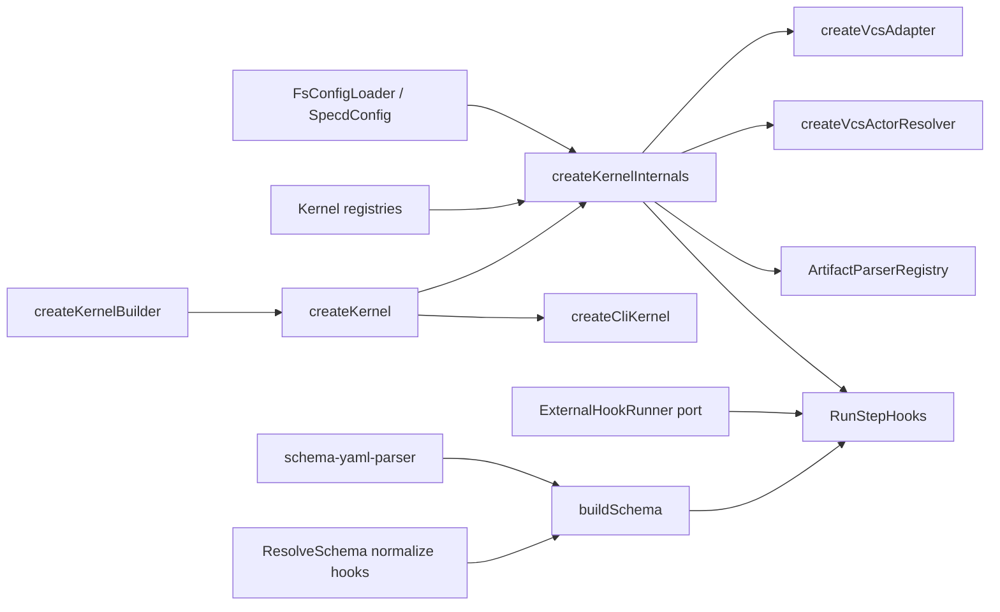

# Design: extensible-kernel-adapter-registry

## Non-goals

- No new CLI commands such as `specd adapters list` are added in this change.
- No new built-in external backends are shipped; this change introduces seams and registries, not `git/http/s3/docker/http` implementations inside core.
- The `VcsAdapter` and `ActorResolver` port contracts do not change; extensibility happens in composition and detection, not in their methods.
- A constructed kernel does not become mutable; all extensibility remains pre-construction only.

## Affected areas

- `createKernel()` in `packages/core/src/composition/kernel.ts`
  Change: extend `KernelOptions`, expose `kernel.registry`, inject external runners into `RunStepHooks`, and export the builder.
  Callers: 33 direct, 38 transitive · Risk: CRITICAL.
  Note: this is the primary hotspot; the `createKernel(config)` path must keep working unchanged.

- `createKernelInternals()` in `packages/core/src/composition/kernel-internals.ts`
  Change: stop hardcoding `fs`, the built-in parser registry, and fixed VCS/actor chains; build merged registries and use them for repositories, parsers, and dispatch.
  Callers: absorbed by `createKernel` · Risk: HIGH because it sits on the same critical path.

- `createVcsAdapter()` in `packages/core/src/composition/vcs-adapter.ts`
  Change: turn the fixed `git -> hg -> svn -> null` chain into an `externals + builtIns` provider list.
  Callers: 8 direct · Risk: HIGH.

- `createVcsActorResolver()` in `packages/core/src/composition/actor-resolver.ts`
  Change: apply the same pattern as VCS while preserving the current lazy/sync overload when `cwd` is omitted.
  Callers: 9 direct, 3 transitive · Risk: CRITICAL.

- `RunStepHooks` in `packages/core/src/application/use-cases/run-step-hooks.ts`
  Change: extend the constructor to receive external registries/runners, add collection and dispatch of explicit external hooks, and preserve fail-fast/fail-soft semantics.
  Callers: 9 direct, 10 transitive · Risk: CRITICAL.

- `HookEntry` and workflow parsing in:
  `packages/core/src/domain/value-objects/workflow-step.ts`
  `packages/core/src/infrastructure/schema-yaml-parser.ts`
  `packages/core/src/application/use-cases/resolve-schema.ts`
  `packages/core/src/domain/services/build-schema.ts`
  Change: add the `external` variant, its YAML shape, and its normalization for overrides.
  Callers: `buildSchema` has 9 direct dependents · Risk: HIGH.

- `SpecdConfig` and `FsConfigLoader` in:
  `packages/core/src/application/specd-config.ts`
  `packages/core/src/infrastructure/fs/config-loader.ts`
  Change: preserve not only resolved `fs` paths but also the adapter name and opaque config block for `specs`, `schemas`, `changes`, `drafts`, `discarded`, and `archive`.
  Spec ripple: `core:core/config` has direct dependents in CLI, code-graph, and several core use cases.

- `createArtifactParserRegistry()` in `packages/core/src/infrastructure/artifact-parser/registry.ts`
  Change: turn the built-in registry into the base of an additive merge with external parsers and fail clearly for unknown formats.
  Callers: reached through kernel/validate/archive/preview · Risk: MEDIUM.

- Public composition surface in:
  `packages/core/src/composition/index.ts`
  `packages/core/src/index.ts`
  `packages/cli/src/kernel.ts`
  Change: export the builder and registry types; `createCliKernel()` still passes only `extraNodeModulesPaths`.
  Risk: MEDIUM. The CLI helper should not change behavior, it only needs to compile with the new types.

- `config show` CLI contract in:
  `packages/cli/src/commands/config/show.ts`
  Change: keep text rendering as a concise resolved-path view while relying on direct `SpecdConfig` serialization in JSON/TOON so the new adapter bindings surface automatically.
  Risk: LOW. This is primarily a contract-alignment concern for CLI output after the `SpecdConfig` shape change.

- Documentation surface in:
  `docs/config/config-reference.md`
  `docs/guide/configuration.md`
  `docs/guide/workflow.md`
  `docs/schemas/schema-format.md`
  `docs/core/ports.md`
  Change: document adapter registries, the builder API, and the new external hook YAML shape.

## New constructs

- `packages/core/src/application/ports/external-hook-runner.ts`
  Shape:

  ```ts
  import { type HookResult, type TemplateVariables } from './hook-runner.js'

  export interface ExternalHookDefinition {
    readonly id: string
    readonly externalType: string
    readonly config: Readonly<Record<string, unknown>>
  }

  export interface ExternalHookRunner {
    acceptedTypes(): readonly string[]
    run(hook: ExternalHookDefinition, variables: TemplateVariables): Promise<HookResult>
  }
  ```

  Responsibility: application contract for explicit non-shell hooks.
  Relationships: consumed by `RunStepHooks`; registered through `KernelOptions` and `KernelBuilder`; does not replace `HookRunner`.

- `packages/core/src/application/errors/external-hook-type-not-registered-error.ts`
  Shape:

  ```ts
  export class ExternalHookTypeNotRegisteredError extends SpecdError {
    override get code(): string
    constructor(externalType: string)
  }
  ```

  Responsibility: clear failure when no runner accepts an `externalType`.
  Relationships: thrown by `RunStepHooks`.

- `packages/core/src/application/errors/registry-conflict-error.ts`
  Shape:

  ```ts
  export class RegistryConflictError extends SpecdError {
    override get code(): string
    constructor(category: string, name: string)
  }
  ```

  Responsibility: represent collisions between built-ins and external registrations or between externals.
  Relationships: used by kernel and builder merge helpers.

- `packages/core/src/composition/kernel-registries.ts`
  Shape:

  ```ts
  export interface SpecStorageFactory {
    create(
      context: SpecRepositoryContext,
      options: Readonly<Record<string, unknown>>,
    ): SpecRepository
  }
  export interface SchemaStorageFactory {
    create(
      context: SchemaRepositoryContext,
      options: Readonly<Record<string, unknown>>,
    ): SchemaRepository
  }
  export interface ChangeStorageFactory {
    create(
      context: ChangeRepositoryContext,
      options: Readonly<Record<string, unknown>>,
    ): ChangeRepository
  }
  export interface ArchiveStorageFactory {
    create(
      context: ArchiveRepositoryContext,
      options: Readonly<Record<string, unknown>>,
    ): ArchiveRepository
  }
  export interface VcsProvider {
    readonly name: string
    detect(cwd: string): Promise<VcsAdapter | null>
  }
  export interface ActorProvider {
    readonly name: string
    detect(cwd: string): Promise<ActorResolver | null>
  }
  export interface KernelRegistryView {
    readonly storages: {
      readonly specs: ReadonlyMap<string, SpecStorageFactory>
      readonly schemas: ReadonlyMap<string, SchemaStorageFactory>
      readonly changes: ReadonlyMap<string, ChangeStorageFactory>
      readonly archive: ReadonlyMap<string, ArchiveStorageFactory>
    }
    readonly parsers: ArtifactParserRegistry
    readonly vcsProviders: readonly VcsProvider[]
    readonly actorProviders: readonly ActorProvider[]
    readonly externalHookRunners: ReadonlyMap<string, ExternalHookRunner>
  }
  ```

  Responsibility: centralize types and merge helpers for the extensible kernel model.
  Relationships: used by `kernel.ts`, `kernel-internals.ts`, `kernel-builder.ts`, `vcs-adapter.ts`, and `actor-resolver.ts`.

- `packages/core/src/composition/kernel-builder.ts`
  Shape:

  ```ts
  export interface KernelBuilder {
    registerSpecStorage(adapter: string, factory: SpecStorageFactory): this
    registerSchemaStorage(adapter: string, factory: SchemaStorageFactory): this
    registerChangeStorage(adapter: string, factory: ChangeStorageFactory): this
    registerArchiveStorage(adapter: string, factory: ArchiveStorageFactory): this
    registerParser(format: string, parser: ArtifactParser): this
    registerVcsProvider(provider: VcsProvider): this
    registerActorProvider(provider: ActorProvider): this
    registerExternalHookRunner(name: string, runner: ExternalHookRunner): this
    build(): Promise<Kernel>
  }

  export function createKernelBuilder(
    config: SpecdConfig,
    base?: Partial<KernelOptions>,
  ): KernelBuilder
  ```

  Responsibility: fluent surface that accumulates exactly the same registrations as `KernelOptions`.
  Relationships: delegates to `createKernel(config, accumulatedOptions)`; does not reimplement wiring.

- New adapter-binding types inside `packages/core/src/application/specd-config.ts`
  Shape:
  ```ts
  export interface SpecdAdapterBinding {
    readonly adapter: string
    readonly config: Readonly<Record<string, unknown>>
  }
  ```
  Plus new fields:
  ```ts
  interface SpecdWorkspaceConfig {
    readonly specsAdapter: SpecdAdapterBinding
    readonly schemasAdapter: SpecdAdapterBinding | null
  }
  interface SpecdStorageConfig {
    readonly changesAdapter: SpecdAdapterBinding
    readonly draftsAdapter: SpecdAdapterBinding
    readonly discardedAdapter: SpecdAdapterBinding
    readonly archiveAdapter: SpecdAdapterBinding
  }
  ```
  Responsibility: preserve the adapter name and opaque config already resolved to absolute paths when the adapter is `fs`.
  Relationships: consumed by `createKernelInternals`; the current `*Path` fields remain for compatibility with the built-in `fs` path.

## Approach

1. Introduce an explicit registry layer in composition and make `KernelOptions` the single extension input.
   `KernelOptions` will no longer contain only `extraNodeModulesPaths`; it will accept additive registries for storages, parsers, providers, and external runners.
   `createKernel(config)` will continue to delegate to built-ins only when `options` is `undefined`.

2. Keep built-in wiring as data, not as hardcoded `switch` logic inside `createKernelInternals`.
   The built-in path will be modeled as base registries:
   - `fs` storages for specs/schemas/changes/archive
   - `markdown|yaml|json|plaintext` parsers
   - `git|hg|svn` VCS providers
   - `git|hg|svn` actor providers
   - no built-in external runners
     Then merge with external registrations, rejecting collisions by name.

3. Preserve the adapter name and opaque block in `SpecdConfig`, not only flattened `fs` paths.
   `FsConfigLoader` will keep validating and resolving `fs` paths to absolute paths, but it will also return `specsAdapter`, `schemasAdapter`, `changesAdapter`, `draftsAdapter`, `discardedAdapter`, and `archiveAdapter`.
   Legacy fields (`specsPath`, `schemasPath`, `changesPath`, `archivePath`, etc.) remain to avoid forcing a broad rewrite of unaffected use cases.
   Validation against registered names does not happen in `FsConfigLoader`, because external registries only exist in `createKernel(config, options)` or in the builder.

4. Change `createKernelInternals()` so it selects factories by adapter name.
   For each workspace:
   - `specsAdapter.adapter` resolves a `SpecStorageFactory`
   - `schemasAdapter.adapter` resolves a `SchemaStorageFactory`
     For global storage:
   - `changesAdapter.adapter` resolves a `ChangeStorageFactory`
   - `archiveAdapter.adapter` resolves an `ArchiveStorageFactory`
     The built-in `fs` path will continue to use `createSpecRepository('fs', ...)`, `createSchemaRepository('fs', ...)`, `createChangeRepository('fs', ...)`, and `createArchiveRepository('fs', ...)`.
     If an adapter name is missing from the merged registry, `createKernelInternals()` fails immediately with a clear error.

5. Generalize VCS/actor autodetection to provider chains while preserving binary compatibility.
   `createVcsAdapter(cwd?: string, providers?: readonly VcsProvider[])`:
   - runs external `providers` in order
   - if none returns an adapter, runs the current built-in chain
   - if none detects anything, returns `NullVcsAdapter`
     `createVcsActorResolver` follows the same pattern but preserves the current overload:
   - without `cwd`, return a lazy resolver
   - with `cwd`, resolve immediately

6. Extend the hook model with a third explicit variant in the domain.
   YAML:

   ```yaml
   - id: notify-docker
     external:
       type: docker
       config:
         image: node:22
         command: pnpm test
   ```

   Domain:

   ```ts
   type HookEntry =
     | { id: string; type: 'run'; command: string }
     | { id: string; type: 'instruction'; text: string }
     | {
         id: string
         type: 'external'
         externalType: string
         config: Readonly<Record<string, unknown>>
       }
   ```

   `schema-yaml-parser.ts` and `resolve-schema.ts` will normalize the nested YAML shape `external: { type, config }` into the domain shape, just as they do today for `run` and `instruction`.
   `buildSchema()` only validates the semantic shape; checking whether the type is registered happens at runtime against the kernel's merged registry.

7. Keep `HookRunner` shell-only and extend `RunStepHooks` with external dispatch.
   `RunStepHooks` will receive:

   ```ts
   constructor(
     changes: ChangeRepository,
     archive: ArchiveRepository,
     hooks: HookRunner,
     externalHookRunners: ReadonlyMap<string, ExternalHookRunner>,
     schemaProvider: SchemaProvider,
   )
   ```

   Collection:
   - `run` hooks still go through `_hooks.run()`
   - `instruction` hooks are still ignored
   - `external` hooks are dispatched to the runner whose `acceptedTypes()` contains the normalized `externalType`
     Resolution:
   - if no runner accepts the type, throw `ExternalHookTypeNotRegisteredError`
   - if more than one runner accepts the same type in the merged registry, `createKernel()` fails while building the `externalType` index
     Result:
   - external hooks return `HookResult`, so `RunStepHooksResult` does not change
   - pre-phase remains fail-fast and post-phase remains fail-soft

8. Expose merged registries without exposing new internal concrete classes.
   `Kernel` will add:

   ```ts
   readonly registry: KernelRegistryView
   ```

   The builder is a thin wrapper over `KernelOptions`, not a second wiring path.

9. Update public docs alongside implementation.
   The minimum documentation updates are:
   - builder API and `Kernel.registry` in `docs/core/ports.md` or `docs/core/overview.md`
   - adapter configuration and opaque blocks in `docs/config/config-reference.md` and `docs/guide/configuration.md`
   - nested external hook YAML and its semantics in `docs/schemas/schema-format.md` and `docs/guide/workflow.md`

## Key decisions

- **Keep `createKernel(config, options)` as the primitive and make the builder delegate to that path** -> avoids two distinct composition models and guarantees semantic equivalence.
  **Alternatives rejected** -> giving the builder its own wiring path; rejected because it would duplicate decisions, tests, and bugs.

- **Separate `ExternalHookRunner` from `HookRunner`** -> preserves the shell-only responsibility of the internal runner and avoids contaminating its contract with non-shell backends.
  **Alternatives rejected** -> extending `HookRunner.run()` with a discriminant; rejected because it would break a stable port and mix two execution models.

- **Use the YAML form `{ id, external: { type, config } }` for external hooks** -> keeps the top-level workflow entry keyed by mutually exclusive hook kinds while giving the external backend its own structured payload.
  **Alternatives rejected** -> `{ id, external, config }` at the same level; rejected because the backend-specific payload belongs under the `external` entry itself. `{ type: 'external', ... }` in YAML is also rejected because the current parser is already based on mutually exclusive keys.

- **Validate adapter/parser/external type names in kernel/runtime, not in the config loader** -> the loader does not know about external registries yet.
  **Alternatives rejected** -> making `FsConfigLoader` aware of registries; rejected because it breaks the config-loader/composition separation.

- **Model storage registries by capability (`specs`, `schemas`, `changes`, `archive`)** -> matches the already-specified builder methods and avoids forcing an adapter to implement irrelevant capabilities.
  **Alternatives rejected** -> a single monolithic storage adapter interface with four required methods; rejected because it is more rigid and harder to register partially.

- **Reject ambiguous `externalType` ownership at construction time** -> `RunStepHooks` needs deterministic dispatch.
  **Alternatives rejected** -> “first registered wins”; rejected because the ambiguity would stay hidden and be hard to debug.

## Trade-offs

- `[Compatibility debt]` -> `SpecdConfig` will have a transition window where legacy `*Path` fields coexist with the new adapter bindings.
  Mitigation: limit legacy field use to untouched call sites and document that the kernel should read only the new bindings.

- `[More composition types]` -> several new registry/provider/factory interfaces are added.
  Mitigation: concentrate them in `composition/kernel-registries.ts` and export only what is necessary from `composition/index.ts`.

- `[Runtime validation instead of startup validation for unknown adapter names]` -> some errors will surface while constructing the kernel, not while loading YAML.
  Mitigation: fail as early as possible in `createKernelInternals()` and cover the path with config + kernel tests.

## Spec impact

### `core:core/kernel`

- Direct dependents: `core:core/approve-signoff`, `core:core/approve-spec`, `core:core/get-archived-change`, `core:core/get-status`, `core:core/list-archived`, `core:core/list-changes`, `core:core/list-discarded`, `core:core/list-drafts`
- Transitive note: the real hotspot is the symbol (`createKernel`), more than spec `dependsOn`.
- Assessment: no additional delta is required now; these specs still consume `Kernel` as a surface, and their expected behavior does not change.

### `core:core/composition`

- Direct dependents: `core:core/kernel`, `core:core/vcs-adapter`, `core:core/actor-resolver`, `core:core/config-loader`, `core:core/edit-change`, `core:core/skip-artifact`, `core:core/update-spec-deps`, `core:core/approve-spec`, `core:core/approve-signoff`
- Transitive: through `core:core/kernel` it reaches most of the core surface.
- Assessment: the only additional delta already accounted for is `core:core/kernel-builder`; consumer specs do not need changes as long as composition stays manual and backward-compatible.

### `core:core/config`

- Direct dependents: several CLI commands (`cli:cli/change-context`, `cli:cli/config-show`, `cli:cli/project-update`, etc.), `code-graph/indexer`, `core:core/run-step-hooks`, `core:core/get-active-schema`, `core:core/resolve-schema`
- Assessment: ripple is high; that is why the design keeps legacy fields and makes the change additive in `SpecdConfig`.

### `core:core/storage`

- Direct dependents: `core:core/archive-change`, `core:core/change`, `core:core/change-repository-port`, `core:core/spec-repository-port`, `core:core/validate-artifacts`, `core:core/validate-specs`
- Assessment: no additional delta is needed if the factories still return the same ports.

### `core:core/schema-format`

- Direct dependents: `core:core/build-schema`, `core:core/resolve-schema`, `core:core/run-step-hooks`, `core:core/get-hook-instructions`, `core:core/workflow-model`, several `cli/schema-*` commands
- Assessment: any change here must ship together with parser + normalization + runtime dispatch; there is no safe way to do it partially.

### `core:core/hook-execution-model`

- Direct dependents: `core:core/archive-change`, `core:core/get-hook-instructions`, `core:core/run-step-hooks`, `core:core/transition-change`, `cli:cli/change-run-hooks`, `cli:cli/change-transition`, `cli:cli/change-archive`
- Assessment: these specs remain satisfied if the external hook inherits exactly the current pre/post semantics.

### `core:core/hook-runner-port`

- Direct dependents: `core:core/run-step-hooks`, `core:core/template-variables`
- Assessment: they do not need extra deltas; the separation with `ExternalHookRunner` preserves the shell-only contract.

### `core:core/artifact-parser-port`

- Direct dependents: `core:core/compile-context`, `core:core/preview-spec`
- Assessment: no further changes are required if the registry remains `ReadonlyMap<string, ArtifactParser>`.

### `core:core/vcs-adapter`

- Direct dependents: `core:core/actor-resolver`, `core:core/vcs-adapter-port`
- Assessment: `vcs-adapter-port` remains satisfied because the port does not change; only the detection path changes.

### `core:core/actor-resolver`

- Direct dependents: `core:core/actor-resolver-port`
- Assessment: no additional delta; the port is preserved.

### `core:core/run-step-hooks`

- Direct dependents: `cli:cli/change-run-hooks`, `core:core/archive-change`, `core:core/kernel`, `core:core/template-variables`, `core:core/transition-change`
- Assessment: this is the main functional ripple point. `GetHookInstructions` does not change semantics; `ArchiveChange` and `TransitionChange` only need to keep treating any hook failure through the same `RunStepHooksResult`.

## Dependency map



```text
┌──────────────────────────────┐
│ FsConfigLoader / SpecdConfig │
└──────────────┬───────────────┘
               │ adapter names + opaque config
               ▼
┌──────────────────────────────┐        ┌──────────────────────────┐
│ createKernelInternals        │◀──────▶│ Kernel registries        │
│ [HIGH inside createKernel]   │        │ storages/providers/etc.  │
└───────┬───────────┬──────────┘        └─────────────┬────────────┘
        │           │                                  │
        │           │                                  │ accumulated by
        │           │                                  ▼
        │           │                        ┌──────────────────────────┐
        │           └───────────────────────▶│ createKernelBuilder      │
        │                                    └─────────────┬────────────┘
        ▼                                                  │ delegates
┌────────────────────┐                                     ▼
│ createVcsAdapter   │                              ┌───────────────────┐
│ [HIGH]             │                              │ createKernel      │
└────────────────────┘                              │ [CRITICAL]        │
┌────────────────────┐                              └────────┬──────────┘
│ createVcsActor     │                                       │
│ Resolver [CRITICAL]│                                       │
└────────────────────┘                                       ▼
┌────────────────────┐                              ┌───────────────────┐
│ ArtifactParserReg. │                              │ RunStepHooks      │
└────────────────────┘                              │ [CRITICAL]        │
                                                    └──────┬─────┬──────┘
                                                           │     │
                                      shell run hooks ─────┘     └─────▶ ExternalHookRunner
                                                           ▲
                        schema-yaml-parser ─▶ ResolveSchema normalize ─▶ buildSchema [HIGH]

Spec ripple:
core:composition ─────▶ core:kernel ─────▶ core:run-step-hooks
core:schema-format ───▶ core:run-step-hooks / core:get-hook-instructions
core:hook-execution-model ─▶ core:transition-change / core:archive-change / cli:change-run-hooks
```

## Migration / Rollback

- No persisted data migration is required.
- Rollout:
  1. land registries and new ports
  2. switch `createKernelInternals()` to the registry-driven path
  3. change hook model/parser/runtime dispatch
  4. export the builder and update docs
- Rollback:
  - return to `createKernel(config)` without external registrations
  - remove `external: { ... }` YAML hooks from schemas/overrides
  - leave only built-in `fs` adapters in config
- Safety: as long as no external registries or external hooks are used, behavior must remain identical to today.

## Testing

**Automated tests**

- `packages/core/test/composition/kernel.spec.ts` new
  Covers all `verify` scenarios for `core:core/kernel` introduced in this change:
  `KernelOptions supports additive registries`, `Kernel exposes merged registries`, `Kernel rejects invalid registry references`.

- `packages/core/test/composition/kernel-builder.spec.ts` new
  Covers every scenario in `core:core/kernel-builder/verify.md`:
  accumulation, fluent chaining, `build()` equivalence with `createKernel`, conflict rejection, base registration state.

- `packages/core/test/composition/kernel-internals.spec.ts` extend
  Add cases for:
  - selection of storage factories by adapter name
  - unknown storage adapter name
  - merged external parser registry visible from the kernel internals path
  - duplicate external hook runner accepted types rejected during index construction

- `packages/core/test/composition/vcs-adapter.spec.ts` extend
  Covers new `core:core/vcs-adapter` verify scenarios:
  external providers before built-ins, built-in fallback after unmatched externals.

- `packages/core/test/composition/actor-resolver.spec.ts` extend
  Covers new `core:core/actor-resolver` verify scenarios:
  external providers before built-ins, built-in fallback after unmatched externals.

- `packages/core/test/application/use-cases/run-step-hooks.spec.ts` extend
  Covers all new `core:core/run-step-hooks`, `core:core/hook-execution-model`, and `core:core/external-hook-runner-port` scenarios:
  external hook dispatch, accepted-type routing, unknown external type, pre fail-fast, post fail-soft, workflow-compatible result shape.

- `packages/core/test/application/use-cases/get-hook-instructions.spec.ts` extend
  Verifies that explicit external hooks are not returned as `instruction:` hooks and that existing behavior remains unchanged.

- `packages/core/test/infrastructure/schema-yaml-parser.spec.ts` extend
  Covers `core:core/schema-format` scenarios:
  valid nested `external: { type, config }`, missing `id`, missing `external.type`, malformed external config shape.

- `packages/core/test/domain/services/build-schema.spec.ts` extend
  Covers the new `HookEntry` variant and semantic validation for workflow hook construction.

- `packages/core/test/infrastructure/fs/config-loader.spec.ts` extend
  Covers `core:core/config` scenarios:
  named adapter preserved in resolved config, adapter-specific opaque block preserved, unknown adapter deferred to the kernel-level validation path.

- `packages/core/test/infrastructure/artifact-parser/registry.spec.ts` new
  Covers `core:core/artifact-parser-port` scenarios:
  additive parser registration preserves built-ins, unknown parser format failure.

**Manual / E2E verification**

- Run `pnpm --filter @specd/core test`
  Expected: the new and extended suites above pass with no regressions.

- Run `pnpm --filter @specd/core lint`
  Expected: new types, exports, and JSDoc satisfy global conventions.

- Run a builder smoke script with a fake parser, fake VCS provider, fake actor provider, and fake external hook runner.
  Expected: `kernel.registry` shows built-ins plus externals, and `build()` matches `createKernel(config, options)`.

- Run a schema-resolution smoke test with a workflow hook using:
  ```yaml
  - id: notify
    external:
      type: docker
      config:
        image: node:22
        command: pnpm test
  ```
  Expected: `GetHookInstructions` ignores it, `RunStepHooks` dispatches it through the registered external runner, and an unknown `external` value fails clearly.
