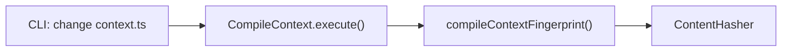

# Design: context-fingerprint

## Non-goals

- Persisting fingerprint across chat sessions (agent starts fresh each session)
- Fingerprint for non-context commands (e.g., `change status`, `change list`)

## Affected areas

### `packages/core/src/application/use-cases/compile-context.ts`

**Change:** Add fingerprint calculation and early-return logic to `CompileContext.execute()`.

- Add `fingerprint` parameter to `CompileContextInput`
- Add `_calculateFingerprint()` private method
- Add early-return logic when `fingerprint` matches
- Update `CompileContextResult` with `contextFingerprint` and `status` fields

**Callers:** CLI `change context` command (1 direct). Risk: LOW.

### `packages/cli/src/commands/change/context.ts`

**Change:** Add `--fingerprint` CLI option, pass to use case, handle `status: 'unchanged'`.

- Add `--fingerprint <hash>` option
- Pass fingerprint to `kernel.changes.compile.execute()`
- Handle `status: 'unchanged'` in both text and JSON output modes

**Callers:** Direct CLI invocation only. Risk: LOW.

### `dev/ai-agents/skills/` (skill files)

**Change:** Update skills to store fingerprint from first call, pass on subsequent calls.

Skills to update:

- `specd` — main entry point skill
- `specd-design` — uses `change context` multiple times
- `specd-implement` — uses `change context` on entry
- `specd-verify` — uses `change context` on entry
- `specd-archive` — uses `change context` on entry

**Pattern:** Agent stores fingerprint in conversation window. If a fingerprint exists (from a previous skill or even the same skill's prior invocation), the agent passes it to the first `change context` call. The CLI only returns full context if the fingerprint is omitted or doesn't match — "first call" vs "subsequent call" is not a CLI concern.

## New constructs

### `compileContextFingerprint()` — pure function in `packages/core/src/application/use-cases/_shared/compile-context-fingerprint.ts`

```typescript
export interface FingerprintInput {
  readonly specIds: readonly string[]
  readonly contextEntries: readonly ContextEntry[]
  readonly contextIncludeSpecs: readonly string[]
  readonly contextExcludeSpecs: readonly string[]
  readonly workspaces: Readonly<
    Record<string, { contextIncludeSpecs?: string[]; contextExcludeSpecs?: string[] }>
  >
  readonly step: string
  readonly schemaVersion: number
  readonly followDeps: boolean
  readonly depth?: number
  readonly sections?: ReadonlyArray<'rules' | 'constraints' | 'scenarios'>
}

export function compileContextFingerprint(input: FingerprintInput): string {
  // Returns SHA-256 hash prefixed with 'sha256:'
}
```

**Responsibility:** Canonicalize all fingerprint inputs into a stable string representation, hash with SHA-256.

**Relationships:**

- Input: Uses `ContextEntry[]` from `compile-context.ts`
- Output: Returns hash string consumed by `CompileContext.execute()`

## Approach

### 1. Add fingerprint calculation function

Create `packages/core/src/application/use-cases/_shared/compile-context-fingerprint.ts` with a pure `compileContextFingerprint()` function.

Canonicalization steps:

1. Sort `specIds` alphabetically
2. For context `file` entries, hash file content (not path); `instruction` entries verbatim
3. Sort `contextIncludeSpecs` and `contextExcludeSpecs`
4. Sort workspace names, then their patterns
5. Include `step`, `schemaVersion`
6. Include `followDeps` (boolean), `depth` (if set), `sections` (sorted if set)

Hash the canonical string with SHA-256, prefix with `sha256:`.

### 2. Update `CompileContextInput` and `CompileContextResult`

```typescript
// In compile-context.ts
export interface CompileContextInput {
  // ... existing fields ...
  readonly fingerprint?: string // Added
}

export interface CompileContextResult {
  readonly contextFingerprint: string // Added
  readonly status: 'changed' | 'unchanged' // Added
  // ... existing fields ...
}
```

### 3. Update `CompileContext.execute()`

The fingerprint is calculated **at the end**, after all other fields are computed. This ensures the agent always receives `stepAvailable`, `blockingArtifacts`, `availableSteps`, and `warnings` — only `projectContext` and `specs` are omitted if the fingerprint matches.

```typescript
async execute(input: CompileContextInput): Promise<CompileContextResult> {
  // ... existing setup: schema guard, spec collection, tier classification ...

  // --- Step availability (needed by agent even when context unchanged) ---
  const schemaWorkflowStep = schema.workflowStep(input.step)
  let stepAvailable = true
  const blockingArtifacts: string[] = []

  if (schemaWorkflowStep !== null) {
    for (const requiredId of schemaWorkflowStep.requires) {
      const reqStatus = change.effectiveStatus(requiredId)
      if (reqStatus !== 'complete' && reqStatus !== 'skipped') {
        stepAvailable = false
        blockingArtifacts.push(requiredId)
      }
    }
  }

  // --- Available steps (needed by agent even when context unchanged) ---
  const availableSteps = /* ... compute all steps ... */

  // --- Project context and spec entries ---
  const projectContext: ProjectContextEntry[] = /* ... compute project context ... */
  const specs: ContextSpecEntry[] = /* ... compute spec entries ... */

  // --- Calculate fingerprint (after all fields are ready) ---
  const fingerprintInput = {
    specIds: change.specIds,
    contextEntries: input.config.context ?? [],
    contextIncludeSpecs: input.config.contextIncludeSpecs ?? [],
    contextExcludeSpecs: input.config.contextExcludeSpecs ?? [],
    workspaces: input.config.workspaces ?? {},
    step: input.step,
    schemaVersion: schema.version(),
    followDeps: input.followDeps ?? false,
    depth: input.depth,
    sections: input.sections,
  }
  const currentFingerprint = compileContextFingerprint(fingerprintInput)

  // If fingerprint matches, omit context content but keep everything else
  if (input.fingerprint !== undefined && input.fingerprint === currentFingerprint) {
    return {
      contextFingerprint: currentFingerprint,
      status: 'unchanged',
      stepAvailable,
      blockingArtifacts,
      projectContext: [],       // omitted — agent uses cached
      specs: [],                // omitted — agent uses cached
      availableSteps,
      warnings: [],            // warnings computed above
    }
  }

  // Fingerprint mismatch or not provided — return full result
  return {
    contextFingerprint: currentFingerprint,
    status: 'changed',
    stepAvailable,
    blockingArtifacts,
    projectContext,
    specs,
    availableSteps,
    warnings,
  }
}
```

### 4. Update CLI command

In `packages/cli/src/commands/change/context.ts`:

```typescript
.option('--fingerprint <hash>', 'skip if context unchanged')
```

The CLI does not track whether this is a "first call" or "subsequent call" — it simply compares the provided fingerprint against the calculated one.

Handle `status: 'unchanged'`:

- **text mode**: Output `Context unchanged since last call.`
- **json mode**: Output `{ contextFingerprint, status: 'unchanged' }` only

## Key decisions

**Fingerprint calculated before step availability check** → This is intentional. Fingerprint represents the logical context inputs (specs, config, flags). Step availability depends on change state which can change independently. This is correct behavior.

**SHA-256 as hash algorithm** → Industry standard, available via Node.js `crypto` module. Sufficient collision resistance for this use case.

**File content hashed, not path** → If a context file path is reused but content changes, fingerprint must change.

**Workspace patterns sorted** → Pattern order in config is not semantically significant for context compilation, so sorting ensures consistent fingerprint across identical configurations.

**`--format` not included in fingerprint** → The fingerprint represents logical context content. Two identical context states should have the same fingerprint regardless of how it's rendered.

## Trade-offs

[Minimal fingerprint hash collision] → SHA-256 collisions are computationally infeasible for this use case. Acceptable.

[Agent stores fingerprint in memory] → If agent crashes mid-session, fingerprint is lost. Agent requests full context next time. Acceptable — first call in any session needs full context anyway.

## Spec impact

### `cli:cli/change-context`

- Direct impact: command signature, output format
- No ripple effect — other specs do not depend on `change-context` command behavior

### `core:core/compile-context`

- Direct impact: input interface, result interface, execute logic
- Transitive dependents that use `CompileContextResult`:
  - Skills that call `change context` — they will receive new fields (backwards compatible, optional)
  - No other use cases depend on `CompileContextResult` directly

## Dependency map



```
┌───────────────────────┐
│ CLI: change context.ts │
└───────────┬───────────┘
            │
            ▼
┌───────────────────────┐
│ CompileContext.execute()│
│ (compile-context.ts)   │
└───────────┬───────────┘
            │
            ▼
┌───────────────────────┐
│ compileContextFingerprint()
│ (_shared/)             │
└───────────┬───────────┘
            │
            ▼
┌───────────────────────┐
│ ContentHasher          │
│ (existing port)        │
└───────────────────────┘
```

## Testing

### Automated tests

**New test file:** `packages/core/test/application/use-cases/compile-context-fingerprint.test.ts`

1. **Same inputs produce same fingerprint**
   - Given identical specIds, config, step, flags → fingerprint matches

2. **Different specIds produce different fingerprint**
   - Given different specIds → fingerprint differs

3. **Different step produces different fingerprint**
   - Given different step → fingerprint differs

4. **Fingerprint match triggers early return**
   - Given matching fingerprint in input → result.status is 'unchanged' and empty arrays

5. **Fingerprint mismatch returns full context**
   - Given non-matching fingerprint → result.status is 'changed' with full context

6. **--format does not affect fingerprint**
   - Given same context with different format flags → fingerprint matches

### Manual / E2E verification

```bash
# First call — no fingerprint
node packages/cli/dist/index.js change context my-change designing --format json
# Expect: full context with contextFingerprint

# Second call — matching fingerprint
node packages/cli/dist/index.js change context my-change designing --fingerprint sha256:<from-first-call> --format json
# Expect: { contextFingerprint, status: 'unchanged' }

# Third call — changed context
node packages/cli/dist/index.js change context my-change implementing --fingerprint sha256:<from-first-call> --format json
# Expect: full context with different fingerprint, status: 'changed'

# Text mode unchanged
node packages/cli/dist/index.js change context my-change designing --fingerprint sha256:<from-first-call>
# Expect: "Context unchanged since last call."
```

## Open questions

_none_
