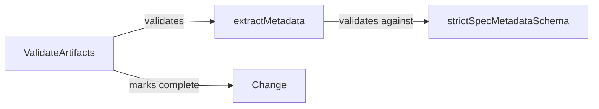

# Design: validate-metadata-extraction

## Affected areas

### `packages/cli/src/commands/change/validate.ts`

- **Change**: Make specPath optional for change-scoped artifacts
- **Impact**: Low — modify flag validation logic
- **Details**: When `--artifact` targets a `scope: change` artifact, allow running without specPath
- **Approach**:
  1. Get the schema from kernel
  2. If `--artifact` is provided, look up the artifact in the schema
  3. If artifact's `scope === 'change'`, skip the specPath requirement
  4. If artifact's `scope === 'spec'`, keep existing validation (specPath required)
  5. Pass `undefined` as specPath to ValidateArtifacts when validating change-scoped artifact

### `packages/core/src/application/use-cases/validate-artifacts.ts`

Three changes:

1. **Scope validation to input specPath** (around line 120):
   - When `input.specPath` is provided, only validate artifacts belonging to that spec
   - Skip artifacts from other specs — they are not yet created and should not cause failures
   - This ensures validation only checks artifacts for the spec being validated

2. **Missing non-optional artifact detection** (around line 346):
   - Currently: `if (validationContent === null) continue` — skips silently
   - Change: Check `!artifactType.optional` before continuing; record failure if file missing and not optional

3. **Add metadataExtraction validation** (after structural validation, around line 355):
   - Get `schema.metadataExtraction()`
   - Build ASTs/renderers for current artifact
   - Call `extractMetadata(extraction, astsByArtifact, renderers, transforms, artifactType.id)`
   - Validate result against `strictSpecMetadataSchema`
   - If invalid, add to `failures` array

- **Impact**: Medium — adds new validation step and fixes existing bugs
- **Callers**: Called via `kernel.changes.validate`

### `packages/core/src/domain/services/extract-metadata.ts`

- **Change**: Add optional `targetArtifactId` parameter to filter extraction
- **Impact**: Low — function signature extension, no breaking changes
- **Callers**: Used by `ValidateArtifacts`, `CompileContext`, `GenerateSpecMetadata`, `GetProjectContext`

## New constructs

None — no new files or classes. Changes are additions to existing functions.

### Function signature change

**`extractMetadata()` in `packages/core/src/domain/services/extract-metadata.ts`**:

```typescript
export function extractMetadata(
  extraction: MetadataExtraction,
  astsByArtifact: ReadonlyMap<string, { root: SelectorNode }>,
  renderers: ReadonlyMap<string, SubtreeRenderer>,
  transforms?: ReadonlyMap<string, (values: string[]) => string[]>,
  targetArtifactId?: string, // NEW: optional filter
): ExtractedMetadata
```

When `targetArtifactId` is provided, only extract fields where `extraction.field.artifact === targetArtifactId`.

## Approach

### Change 1: Missing non-optional artifact detection

In `validate-artifacts.ts` around line 346, change from:

```typescript
// Nothing to validate — skip
if (validationContent === null) continue
```

To:

```typescript
// Nothing to validate — check if optional
if (validationContent === null) {
  if (!artifactType.optional) {
    failures.push({
      artifactId: artifactType.id,
      description: `Required artifact file missing: ${file.filename}`,
    })
    artifactFailed = true
  }
  continue
}
```

### Change 2: MetadataExtraction validation

1. **Modify `extractMetadata`** to accept optional `targetArtifactId` parameter
2. **Add validation step in `ValidateArtifacts`** after structural validation:
   - Get `schema.metadataExtraction()`
   - If defined, build ASTs/renderers for current artifact
   - Call `extractMetadata(extraction, astsByArtifact, renderers, transforms, artifactType.id)`
   - Validate result against `strictSpecMetadataSchema`
   - If invalid, add to `failures` array

3. **Integration point**: Around line 355 in validate-artifacts.ts, after structural validation and before `markComplete`

## Key decisions

**Decision**: Filter at extractMetadata level, not post-extract
→ **Rationale**: Avoids extracting unnecessary fields; more efficient
→ **Alternatives rejected**: Post-filter after full extraction — wasteful

## Trade-offs

None significant — additive change with no behavioral regressions.

## Spec impact

- `core:core/validate-artifacts` — modified to add new requirement
- No dependent specs affected — this adds validation, doesn't change existing behavior

## Dependency map



```
┌────────────────────┐       ┌─────────────────┐
│ ValidateArtifacts  │──────▶│ extractMetadata │
│ (validate-artifacts│       │ (new param)     │
│  .ts)              │       └────────┬────────┘
└────────────────────┘                │
                                      ▼
                            ┌─────────────────────┐
                            │ strictSpecMetadata  │
                            │ Schema              │
                            └─────────────────────┘
```

## Testing

**Unit tests for missing non-optional artifact detection**:

- Add test for missing non-optional file → failure
- Add test for missing optional file → pass (skipped silently)

**Unit tests for `extractMetadata`**:

- Add test for `targetArtifactId` filtering — extracts only matching artifact fields

**Unit tests for `ValidateArtifacts`**:

- Add test for metadataExtraction validation passes
- Add test for metadataExtraction validation fails with invalid metadata
- Add test for validation runs only for targeted artifact

**Manual verification**:

1. Create change with missing required artifact file → validation should fail
2. Create change with malformed verify.md (missing scenario THEN)
3. Run `change validate --artifact verify` — should fail with metadata validation error

## Open questions

None — approach is clear from code inspection.
