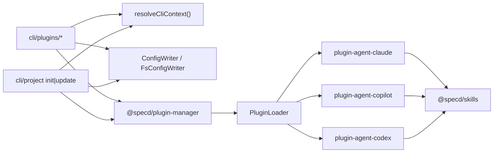

---
release:
  cli:cli/plugins-install: minor
  cli:cli/plugins-list: minor
  cli:cli/plugins-show: minor
  cli:cli/plugins-update: minor
  core:core/config: minor
  core:core/config-writer-port: minor
  cli:cli/project-init: minor
  cli:cli/project-update: minor
  cli:cli/plugins-uninstall: minor
  plugin-agent-claude:plugin-agent: minor
  plugin-agent-copilot:plugin-agent: minor
  plugin-agent-codex:plugin-agent: minor
  plugin-manager:install-plugin-use-case: minor
  plugin-manager:uninstall-plugin-use-case: minor
  plugin-manager:update-plugin-use-case: minor
  plugin-manager:list-plugins-use-case: minor
  plugin-manager:load-plugin-use-case: minor
  plugin-manager:plugin-repository-port: minor
  plugin-manager:specd-plugin-type: minor
  plugin-manager:agent-plugin-type: minor
  plugin-manager:plugin-errors: minor
  plugin-manager:plugin-loader: minor
  skills:skill: minor
  skills:skill-bundle: minor
  skills:skill-repository: minor
  skills:list-skills: minor
  skills:get-skill: minor
  skills:resolve-bundle: minor
  skills:skill-repository-port: minor
  skills:skill-repository-infra: minor
  skills:skill-templates-source: minor
---

# Design: plugin-system-phase-1

## Non-goals

- Introduce storage-plugin or format-plugin implementations in this phase. Phase 1 is limited to the agent-plugin foundation plus the canonical `@specd/skills` prompt library.
- Add plugin types beyond `agent`. The plugin taxonomy remains intentionally narrow until the agent contract is stable.
- Preserve the current `skills` CLI surface as a first-class workflow. The replacement path is `plugins *`, with `project init` and `project update` moved onto the same orchestration model.

## Affected areas

- `packages/core/src/application/ports/config-writer.ts`
  Change: replace the current skills-manifest contract (`recordSkillInstall`, `readSkillsManifest`) with plugin-oriented operations (`addPlugin`, `removePlugin`, `listPlugins`) while keeping `initProject()`.
  Callers / dependents: current callers are `packages/cli/src/commands/project/init.ts` and `packages/cli/src/commands/project/update.ts`; future plugin commands become new callers. Risk: HIGH.
  Note: this is the persistence boundary for `specd.yaml`, so the design must keep YAML mutation in core and out of `@specd/plugin-manager`.

- `packages/core/src/infrastructure/fs/config-writer.ts`
  Change: stop persisting the `skills` manifest and instead read/write `plugins.<type>` arrays in `specd.yaml`.
  Callers / dependents: all `ConfigWriter` callers depend on its serialization semantics. Risk: HIGH.
  Note: this is an existing integration point with non-trivial filesystem and YAML behavior, so regressions here affect `project init` and `project update`.

- `packages/core/src/application/use-cases/record-skill-install.ts`, `packages/core/src/application/use-cases/get-skills-manifest.ts`, and related exports in `packages/core/src/application/use-cases/index.ts`, `packages/core/src/composition/kernel.ts`
  Change: remove or retire the skills-manifest workflow and stop exposing it through the core kernel used by the CLI.
  Callers / dependents: `project init` and `project update` currently call these use cases. Risk: MEDIUM.
  Note: these are cleanup points that must be removed together with the old CLI path to avoid dual workflows.

- `packages/skills/src/index.ts`
  Change: replace the current flat `{ name, description, content }` API with the new domain/application/infrastructure structure required by the `skills:*` specs.
  Callers / dependents: current dependents are the `skills` CLI commands and `project init` / `project update`. Risk: HIGH.
  Note: the package is currently effectively a stub, so the main risk is not breakage inside `@specd/skills` itself but incomplete migration of its callers.

- `packages/plugins/claude/src/index.ts`, `packages/plugins/copilot/src/index.ts`, `packages/plugins/codex/src/index.ts`
  Change: retire the old stub packages in favor of the new top-level packages `packages/plugin-agent-claude/`, `packages/plugin-agent-copilot/`, and `packages/plugin-agent-codex/`.
  Callers / dependents: package manifests and imports will be updated repo-wide. Risk: MEDIUM.
  Note: the old stubs contain no implementation, but leaving them in place would create duplicate identities and unclear ownership.

- `packages/cli/src/commands/project/init.ts`
  Change: remove the direct `@specd/skills` + `KNOWN_AGENTS` file-writing path, replace `--agent` with `--plugin`, and delegate post-init installation to the new plugin flow.
  Callers / dependents: this command is a user-facing entrypoint with broad behavioral coverage in tests. Risk: HIGH.
  Hotspot note: the command currently coordinates banner rendering, interactive flow, config creation, and file writes in one module, so the refactor must preserve observable output and exit semantics.

- `packages/cli/src/commands/project/update.ts`
  Change: remove the skills-manifest reinstall logic and delegate to plugin update orchestration using the plugins declared in `specd.yaml`.
  Callers / dependents: this command is another user-facing entrypoint with integration-heavy behavior and existing tests. Risk: HIGH.
  Hotspot note: it currently depends on `resolveCliContext()`, `kernel.project.getSkillsManifest`, and direct file writes, so the redesign must change both dependencies and output shape together.

- `packages/cli/src/helpers/known-agents.ts`
  Change: delete the hardcoded agent directory map and move install-path responsibility into the concrete agent plugins.
  Callers / dependents: imported by `project init` and `project update`; likely referenced by the old `skills install` path. Risk: MEDIUM.
  Note: this is one of the explicit issue drivers, so the design must make its removal part of the implementation plan rather than incidental cleanup.

- `packages/cli/src/commands/skills/install.ts`, `packages/cli/src/commands/skills/list.ts`, `packages/cli/src/commands/skills/show.ts`, `packages/cli/src/commands/skills/update.ts`, and their test coverage in `packages/cli/test/commands/skills.spec.ts`, `packages/cli/test/commands/skills-update.spec.ts`
  Change: remove the old command family from the CLI surface and replace it with `plugins/*` commands plus updated tests.
  Callers / dependents: CLI command registration and help output. Risk: MEDIUM.
  Note: this is a public CLI contract change and must be paired with docs updates in `docs/cli/`.

- `packages/cli/src/helpers/cli-context.ts`
  Change: keep the config + kernel loading pattern, but use it from the new plugin commands while plugin package loading happens outside `@specd/core`.
  Callers / dependents: many CLI commands import this helper; direct fan-in is high in the code graph. Risk: HIGH.
  Hotspot note: `resolveCliContext()` is a CRITICAL hotspot in the graph results, so the plugin commands should reuse it rather than inventing a parallel config-loading path.

- `packages/cli/src/formatter.ts`
  Change: no signature changes are planned, but all new plugin commands will depend on `parseFormat()` and `output()` for text/json/toon parity.
  Callers / dependents: CRITICAL hotspot with broad CLI fan-in. Risk: HIGH.
  Note: the design keeps plugin command output compatible with existing formatter semantics instead of creating custom serializers.

## New constructs

- `packages/plugin-manager/src/domain/types/specd-plugin.ts`
  Shape:

  ```ts
  export type PluginType = 'agent'

  export interface ConfigSchemaEntry {
    readonly type: 'string' | 'boolean' | 'number'
    readonly description: string
    readonly default?: unknown
    readonly required?: boolean
  }

  export interface PluginContext {
    readonly projectRoot: string
    readonly config: Record<string, unknown>
    readonly typeContext: unknown
  }

  export interface SpecdPlugin {
    readonly name: string
    readonly type: PluginType
    readonly version: string
    readonly configSchema: Record<string, ConfigSchemaEntry>
    init(context: PluginContext): Promise<void>
    destroy(): Promise<void>
  }
  ```

  Responsibility: define the base plugin contract with no I/O.
  Relationships: lives in the domain layer of `@specd/plugin-manager`; depended on by `AgentPlugin`, the loader, and all concrete agent packages.

- `packages/plugin-manager/src/domain/types/agent-plugin.ts`
  Shape:

  ```ts
  export interface InstallOptions {
    readonly skills?: string[]
    readonly variables?: Record<string, string>
  }

  export interface InstallResult {
    readonly installed: Array<{ skill: string; path: string }>
    readonly skipped: Array<{ skill: string; reason: string }>
  }

  export interface AgentPlugin extends SpecdPlugin {
    readonly type: 'agent'
    install(projectRoot: string, options?: InstallOptions): Promise<InstallResult>
    uninstall(projectRoot: string, options?: InstallOptions): Promise<void>
  }
  ```

  Responsibility: refine the base plugin contract for agent-specific install/uninstall behavior.
  Relationships: depended on by plugin-manager use cases and the concrete Claude/Copilot/Codex packages.

- `packages/plugin-manager/src/domain/errors/plugin-not-found.ts`, `packages/plugin-manager/src/domain/errors/plugin-validation.ts`
  Shape:

  ```ts
  export class PluginNotFoundError extends SpecdError {
    readonly pluginName: string
  }

  export class PluginValidationError extends SpecdError {
    readonly pluginName: string
    readonly fields: string[]
  }
  ```

  Responsibility: provide typed error reporting for manifest resolution and contract validation.
  Relationships: thrown by the loader, surfaced by load/list/install/update CLI flows.

- `packages/plugin-manager/src/application/use-cases/install-plugin.ts`, `uninstall-plugin.ts`, `update-plugin.ts`, `list-plugins.ts`, `load-plugin.ts`
  Shape:

  ```ts
  export interface InstallPluginInput {
    readonly pluginName: string
    readonly projectRoot: string
    readonly options?: Record<string, unknown>
  }

  export interface InstallPluginOutput {
    readonly success: boolean
    readonly message: string
    readonly data?: unknown
  }

  export class InstallPlugin {
    constructor(private readonly loader: PluginLoader) {}
    execute(input: InstallPluginInput): Promise<InstallPluginOutput>
  }
  ```

  Responsibility: orchestrate plugin loading and plugin method invocation without mutating project config.
  Relationships: sit in the application layer of `@specd/plugin-manager`; CLI commands own config reads/writes around them.

- `packages/plugin-manager/src/application/ports/plugin-repository.ts`
  Shape:

  ```ts
  export interface PluginRepository {
    addPlugin(type: string, name: string, config?: Record<string, unknown>): Promise<void>
    removePlugin(type: string, name: string): Promise<void>
    listPlugins(type?: string): Promise<Array<{ name: string; config?: Record<string, unknown> }>>
  }
  ```

  Responsibility: document the storage-side shape expected by the plugin layer, even though the CLI will bridge it to `ConfigWriter`.
  Relationships: referenced by the spec surface and by CLI integration code; no direct infrastructure implementation is required in `@specd/plugin-manager` in phase 1.

- `packages/plugin-manager/src/infrastructure/loader/plugin-loader.ts`
  Shape:

  ```ts
  export interface PluginLoader {
    load(pluginName: string): Promise<SpecdPlugin>
  }

  export function createPluginLoader(options: {
    projectRoot: string
    extraNodeModulesPaths?: readonly string[]
  }): PluginLoader
  ```

  Responsibility: read `specd-plugin.json`, validate it with Zod, import the package, call `create()`, and validate the returned runtime contract.
  Relationships: the single infrastructure boundary in `@specd/plugin-manager`; used by all plugin-manager use cases.

- `packages/skills/src/domain/skill.ts`
  Shape:

  ```ts
  export interface SkillTemplate {
    readonly filename: string
    getContent(): Promise<string>
  }

  export interface Skill {
    readonly name: string
    readonly description: string
    readonly templates: SkillTemplate[]
  }
  ```

  Responsibility: replace the current flat skill DTO with lazy template-based domain types.
  Relationships: depended on by `SkillRepository`, `list-skills`, and `get-skill`.

- `packages/skills/src/domain/skill-bundle.ts`
  Shape:

  ```ts
  export interface ResolvedFile {
    readonly filename: string
    readonly content: string
  }

  export interface SkillBundle {
    readonly name: string
    readonly description: string
    readonly files: readonly ResolvedFile[]
    install(targetDir: string): Promise<void>
    uninstall(targetDir: string): Promise<void>
  }
  ```

  Responsibility: represent the resolved installable bundle, including file operations defined by the spec.
  Relationships: produced by the repository and consumed by agent plugins.

- `packages/skills/src/application/ports/skill-repository.ts`
  Shape:

  ```ts
  export interface SharedFile {
    readonly filename: string
    readonly content: string
    readonly skills: readonly string[]
  }

  export interface SkillRepository {
    list(): readonly Skill[]
    get(name: string): Skill | undefined
    getBundle(name: string, variables?: Record<string, string>): SkillBundle
    listSharedFiles(): readonly SharedFile[]
  }
  ```

  Responsibility: define the application boundary for loading metadata, bundles, and shared-file metadata.
  Relationships: implemented by the fs infrastructure, consumed by the `skills:*` use cases and concrete plugins.

- `packages/skills/src/application/use-cases/list-skills.ts`, `get-skill.ts`, `resolve-bundle.ts`
  Shape:

  ```ts
  export class ListSkills {
    constructor(private readonly repository: SkillRepository) {}
    execute(_: Record<string, never>): Promise<{ skills: readonly Skill[] }>
  }

  export class GetSkill {
    constructor(private readonly repository: SkillRepository) {}
    execute(input: { name: string }): Promise<{ skill: Skill } | { error: 'NOT_FOUND' }>
  }

  export class ResolveBundle {
    constructor(private readonly repository: SkillRepository) {}
    execute(input: {
      name: string
      variables?: Record<string, string>
    }): Promise<{ bundle: SkillBundle }>
  }
  ```

  Responsibility: express the public behavior required by the `skills:*` specs while keeping the package hexagonal.
  Relationships: exported from `@specd/skills` and used by agent packages and CLI code where needed.

- `packages/skills/src/infrastructure/repository/skill-repository.ts` and `template-reader.ts`
  Shape:

  ```ts
  export function createSkillRepository(): SkillRepository
  ```

  plus an internal `TemplateReader` that returns `SkillTemplate` instances backed by `node:fs/promises`.
  Responsibility: read the `packages/skills/templates/` tree, scan `templates/shared/*.meta.json`, and resolve bundles with variable substitution.
  Relationships: infrastructure-only; used by the exported factory and by concrete agent plugins.

- `packages/plugin-agent-claude/src/domain/types/claude-plugin.ts`, `frontmatter.ts`, `frontmatter/*.ts`, `application/use-cases/install-skills.ts`, `src/index.ts`, `specd-plugin.json`
  Shape:

  ```ts
  export interface Frontmatter {
    readonly name?: string
    readonly description: string
    readonly when_to_use?: string
    readonly argument_hint?: string
    readonly disable_model_invocation?: boolean
    readonly user_invocable?: boolean
    readonly allowed_tools?: string
    readonly model?: string
    readonly effort?: string
    readonly context?: string
    readonly agent?: string
    readonly hooks?: Record<string, unknown>
    readonly paths?: string
    readonly shell?: string
  }

  export function create(): AgentPlugin
  ```

  Responsibility: own Claude-specific install path resolution, frontmatter injection, and bundle installation into `{projectRoot}/.claude/skills/`.
  Relationships: depends on `@specd/skills` for bundle resolution and on `plugin-manager` contracts for the runtime interface.

- `packages/plugin-agent-copilot/src/index.ts`, `specd-plugin.json` and `packages/plugin-agent-codex/src/index.ts`, `specd-plugin.json`
  Shape:

  ```ts
  export function create(): AgentPlugin
  ```

  with placeholder implementations that satisfy the `AgentPlugin` contract while intentionally skipping real install behavior.
  Responsibility: provide spec-compliant stubs so `plugins list/show` and config flows can see these packages as valid agent plugins in phase 1.
  Relationships: same contract as Claude, but behavior intentionally constrained to stub semantics.

- `packages/cli/src/commands/plugins/install.ts`, `list.ts`, `show.ts`, `update.ts`, `uninstall.ts`
  Shape: Commander registration functions matching the existing CLI command pattern, each using `resolveCliContext()`, `parseFormat()`, and `output()`.
  Responsibility: expose the new public CLI surface for plugin management.
  Relationships: orchestrate `ConfigWriter` + plugin-manager use cases; replace the old `skills/*` command family.

## Approach

1. **Convert config persistence first.**
   Update `ConfigWriter` and `FsConfigWriter` so the repo has a stable, plugin-oriented persistence API (`plugins.agents`) before any CLI command or plugin package depends on it. This removes the old `skills` manifest path at the root of the redesign.

2. **Build `@specd/skills` as the canonical prompt library.**
   Replace the flat `content` API with lazy templates, `SkillBundle`, variable substitution, and shared-file scanning. This satisfies the `skills:*` specs and gives the concrete plugins a stable source of installable content.

3. **Introduce `@specd/plugin-manager` as a pure orchestration package.**
   Keep config I/O out of plugin-manager. Its only infrastructure is plugin loading and runtime validation. The CLI remains responsible for reading declared plugins from config and persisting config mutations around install/uninstall operations.

4. **Implement concrete agent packages after the shared layers exist.**
   Claude is the only full implementation in phase 1 because the design requires real frontmatter injection and a real target directory. Copilot and Codex ship as contract-valid stubs so the CLI and config model can treat them consistently without inventing unimplemented install behavior.

5. **Refactor the CLI last, but in one coherent slice.**
   Add `plugins/*` commands, refactor `project init` and `project update` onto the new plugin flow, then remove `skills/*` commands and `known-agents.ts`. Doing this as one slice avoids a half-migrated CLI where both orchestration models exist at once.

6. **Pair all public-surface changes with tests and docs in the same implementation slice.**
   The new commands require `docs/cli/*`; the changed `ConfigWriter` contract requires `docs/core/*`; all new classes and functions require JSDoc. This is not cleanup work to postpone.

Every requirement in the scoped specs has a direct implementation path in this approach:

- CLI command contracts map to new `packages/cli/src/commands/plugins/*.ts` and the `project init/update` refactor.
- `skills:*` contracts map to the new `@specd/skills` package split.
- `plugin-manager:*` contracts map to the new `@specd/plugin-manager` package.
- `plugin-agent-*` contracts map to the new top-level agent packages.
- `core:core/config*` deltas map to `ConfigWriter` and `FsConfigWriter`.

## Key decisions

- **Keep config mutation in `@specd/core`** → the proposal and specs explicitly place `specd.yaml` writes behind `ConfigWriter`, so `@specd/plugin-manager` stays pure and testable.
  **Alternatives rejected** → letting plugin-manager or the CLI write YAML directly would violate the architecture and config specs and recreate the coupling this change is supposed to remove.

- **Use top-level `packages/plugin-agent-*` packages instead of extending `packages/plugins/*`** → the proposal already commits to the top-level package move, and it keeps package naming aligned with spec IDs and workspace config.
  **Alternatives rejected** → leaving the old package locations in place would preserve stub package names and muddle the migration story.

- **Treat `@specd/skills` as a template/bundle library, not a CLI-facing content dump** → this matches the spec set and shifts agent-specific metadata to the plugins that own the target environment.
  **Alternatives rejected** → continuing to export raw markdown strings would keep frontmatter and install-path concerns in the wrong layer.

- **Implement Claude fully, Copilot/Codex as contract-valid stubs** → phase 1 needs a real end-to-end example plus enough package shape for discovery and config, but not three simultaneous environment-specific integrations.
  **Alternatives rejected** → leaving Copilot/Codex as empty stubs would fail the new specs; fully implementing them now would widen the phase beyond the agreed scope.

- **Replace the old `skills` CLI surface instead of maintaining dual command families** → the issue and proposal frame `plugins *` as the replacement interface, and maintaining both would double docs/tests and keep obsolete behavior alive.
  **Alternatives rejected** → aliasing `skills *` to `plugins *` in phase 1 would dilute the migration and prolong the old mental model.

## Trade-offs

- **[High-risk config refactor]** → mitigate with focused tests on `ConfigWriter` and `project init/update` before wiring new commands.
- **[Package move churn]** → mitigate by doing package manifest / import rewrites in one slice and deleting the old `packages/plugins/*` stubs only after the new packages compile.
- **[Plugin loader depends on package availability in `node_modules`]** → mitigate by keeping that responsibility explicit in CLI command behavior and error messages rather than hiding it behind speculative auto-install logic.
- **[Copilot/Codex stubs may disappoint users expecting working installs]** → mitigate by making `plugins show` / docs explicit that those packages are placeholders in phase 1.

## Spec impact

### `core:core/config`

- Direct dependents surfaced in context/graph: CLI entry/config flows consume project config widely, but the plugin declaration change is additive and localized to `plugins.agents`.
- Assessment: the scoped delta already covers the new `plugins` section and `ConfigWriter` contract; no additional spec ripple needs to be added to the change.

### `core:core/config-writer-port`

- Direct dependents: `project init`, `project update`, and future plugin CLI commands.
- Assessment: all known dependents that need requirement changes are already in scope as `cli:cli/project-init`, `cli:cli/project-update`, and the new `cli:cli/plugins-*` specs. No further spec additions are required.

### `cli:cli/project-init`

- Direct dependents: none surfaced as downstream command specs; this is a leaf CLI contract.
- Assessment: the delta is self-contained. No extra spec updates are needed beyond the plugin install dependency already captured.

### `cli:cli/project-update`

- Direct dependents: none surfaced as downstream command specs; this is also a leaf CLI contract.
- Assessment: the delta is self-contained. No extra spec updates are needed beyond the plugin update dependency already captured.

No additional dependent spec surfaced by the compiled context requires a new delta in this phase. The ripple has already been absorbed into the current scoped specs.

## Dependency map



```
┌──────────────────────┐     ┌──────────────────────────┐
│ cli/plugins/*        │────▶│ resolveCliContext()      │
└──────────┬───────────┘     │ [HIGH fan-in hotspot]    │
           │                 └──────────┬───────────────┘
           │                            │
           │                            ▼
           │                 ┌──────────────────────────┐
           ├────────────────▶│ ConfigWriter / FsConfig  │
           │                 │ write `plugins.agents`   │
┌──────────▼───────────┐     └──────────────────────────┘
│ cli/project init     │
│ cli/project update   │────▶┌──────────────────────────┐
└──────────────────────┘     │ @specd/plugin-manager    │
                             │ use cases + loader       │
                             └──────────┬───────────────┘
                                        │
                     ┌──────────────────┼──────────────────┐
                     ▼                  ▼                  ▼
            ┌────────────────┐ ┌────────────────┐ ┌────────────────┐
            │ plugin-agent-  │ │ plugin-agent-  │ │ plugin-agent-  │
            │ claude         │ │ copilot        │ │ codex          │
            └──────┬─────────┘ └──────┬─────────┘ └──────┬─────────┘
                   │                  │                  │
                   └──────────┬───────┴───────┬──────────┘
                              ▼               ▼
                      ┌─────────────────────────────┐
                      │ @specd/skills               │
                      │ templates + bundles         │
                      └─────────────────────────────┘
```

## Migration / Rollback

- Migration is a repo-internal refactor plus a public CLI contract change. Implement it as a single branch slice: new packages and commands land before old `skills/*` commands are removed from registration.
- Rollback path: restore the pre-change command registration and `ConfigWriter` skills-manifest methods, then remove the new plugin packages from the workspace. Because this phase does not migrate stored data beyond additive `plugins.agents` entries in `specd.yaml`, rollback is mainly code-level rather than data-level.

## Testing

**Automated tests**

- `packages/core/test/infrastructure/fs/config-writer.spec.ts`
  Verify `addPlugin()`, `removePlugin()`, and `listPlugins()` mutate/read `plugins.agents` correctly, preserve unrelated YAML, and remain idempotent where required.

- `packages/skills/test/domain/skill-bundle.spec.ts`
  Verify `SkillBundle.install()` and `uninstall()` semantics, including idempotent uninstall behavior.

- `packages/skills/test/infrastructure/skill-repository.spec.ts`
  Verify `list()`, `get()`, `getBundle()`, variable substitution, and `listSharedFiles()` against the real template tree.

- `packages/plugin-manager/test/infrastructure/plugin-loader.spec.ts`
  Verify manifest validation, missing plugin handling, runtime contract validation, and `create()` loading behavior.

- `packages/plugin-manager/test/application/install-plugin.spec.ts`
  Verify install/update/list/load/uninstall orchestration around the loader and plugin interfaces.

- `packages/plugin-agent-claude/test/install-skills.spec.ts`
  Verify Claude frontmatter injection, `.claude/skills/` target resolution, and selected-skill filtering.

- `packages/cli/test/commands/plugins.spec.ts`
  Add a new command-suite covering `plugins install/list/show/uninstall` text/json behavior, already-installed handling, error continuation, and config mutation calls.

- `packages/cli/test/commands/plugins-update.spec.ts`
  Add update-specific cases for filtered vs full update, idempotent output, and failure handling.

- `packages/cli/test/commands/project-init.spec.ts`
  Replace `--agent` expectations with `--plugin`, cover interactive plugin selection, and assert delegation to plugin installation rather than direct skill writes.

- `packages/cli/test/commands/project-update.spec.ts`
  Replace skills-manifest expectations with plugin update orchestration and `plugins:`-prefixed output.

**Manual / E2E verification**

- Run `pnpm test` and `pnpm lint`.
- Run `node packages/cli/dist/index.js project init --plugin @specd/plugin-agent-claude --format text` in a temp project and verify:
  - `specd.yaml` contains `plugins.agents`.
  - `.claude/skills/` contains generated markdown files with frontmatter.
- Run `node packages/cli/dist/index.js plugins list --format json` and verify declared plugin status, type, and version reporting.
- Run `node packages/cli/dist/index.js project update --format json` and verify the output groups plugin update results under `plugins`.
- Run `node packages/cli/dist/index.js plugins uninstall @specd/plugin-agent-claude` and verify files are removed and config is updated.

**Docs and lint constraints**

- Add new CLI docs for `docs/cli/plugins-install.md`, `plugins-list.md`, `plugins-show.md`, `plugins-update.md`, and `plugins-uninstall.md`.
- Update existing `docs/cli/project-init.md` and `docs/cli/project-update.md` for the plugin flow.
- Update `docs/core/config.md` and the `ConfigWriter` reference under `docs/core/` to reflect `plugins.agents` and the new port contract.
- All new exported functions, interfaces, classes, and methods in `plugin-manager`, `skills`, and the agent packages must carry full JSDoc to satisfy the docs/eslint global specs.
