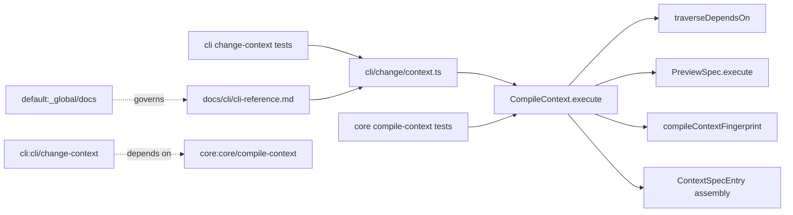

# Design: fix-compile-context-output

## Non-goals

- Do not change `project context` output contracts outside `specd change context`.
- Do not add a new top-level `contextMode` field to the structured output; the per-spec `mode` field remains the source of truth.
- Do not broaden cycle-handling changes beyond `CompileContext` dependency traversal.
- Do not change `PreviewSpec`'s public ordering contract; `CompileContext` should reuse it rather than invent a different ordering rule.

## Affected areas

- `CompileContext.execute()` in [packages/core/src/application/use-cases/compile-context.ts](/Users/monki/Documents/Proyectos/specd/packages/core/src/application/use-cases/compile-context.ts:165)
  Change: seed the collected spec set with `change.specIds` and `change.specDependsOn` values before pattern collection, protect `change.specIds` from excludes, preserve deterministic cross-source ordering, replace the implicit `spec.md`-only rendering path with ordered multi-artifact rendering, derive merged metadata previews for section-filtered output, and compute the fingerprint from the fully assembled logical result.
  Callers: 21 direct dependents, 12 indirect, 2 transitive from the graph impact report. Risk: CRITICAL.
  Note: this is the integration point for context assembly, tiering, preview fallback, metadata extraction, availability, and fingerprinting; any ordering or shape regression propagates into CLI adapters and hook/template consumers.

- `PreviewSpec.execute()` in [packages/core/src/application/use-cases/preview-spec.ts](/Users/monki/Documents/Proyectos/specd/packages/core/src/application/use-cases/preview-spec.ts:1)
  Change: keep returning the merged per-file artifact set in stable order so `CompileContext` can derive either full multi-file output or metadata previews from the same merged source.
  Callers: 4 direct dependents, 3 indirect, 1 transitive from local code search and spec references. Risk: HIGH.
  Note: the key design constraint is to reuse `PreviewSpec` as the source of merged artifacts, not to reimplement delta application inside `CompileContext`.

- `traverseDependsOn()` in [packages/core/src/application/use-cases/\_shared/depends-on-traversal.ts](/Users/monki/Documents/Proyectos/specd/packages/core/src/application/use-cases/_shared/depends-on-traversal.ts:51)
  Change: keep cycle detection as an internal traversal stop condition and stop emitting `cycle` warnings.
  Callers: 12 direct dependents, 8 indirect, 1 transitive from the graph impact report. Risk: CRITICAL.
  Note: this helper is shared traversal logic, so the change must stay behaviorally narrow: only suppress cycle warnings, keep missing-metadata and unknown-workspace warnings intact.

- `compileContextFingerprint()` and `FingerprintInput` in [packages/core/src/application/use-cases/\_shared/compile-context-fingerprint.ts](/Users/monki/Documents/Proyectos/specd/packages/core/src/application/use-cases/_shared/compile-context-fingerprint.ts:1)
  Change: replace the current input-subset hash with canonical serialization of the assembled logical `CompileContext` result for the selected flags.
  Callers: currently used by `CompileContext`. Risk: HIGH.
  Note: the helper must stay deterministic and format-agnostic while still changing when emitted `projectContext`, `specs`, `availableSteps`, `warnings`, `stepAvailable`, or `blockingArtifacts` change.

- `registerChangeContext()` in [packages/cli/src/commands/change/context.ts](/Users/monki/Documents/Proyectos/specd/packages/cli/src/commands/change/context.ts:12)
  Change: text rendering must start with the literal fingerprint line `Context Fingerprint: <sha...>`, print it even for `status: 'unchanged'`, and label each rendered spec entry explicitly as `full` or `summary` without relying on title mutation.
  Callers: 5 direct dependents, 3 indirect, 1 transitive from the graph impact report. Risk: MEDIUM.
  Note: `json` and `toon` remain direct structured output paths; only text rendering changes.

- `CompileContext` tests in [packages/core/test/application/use-cases/compile-context.spec.ts](/Users/monki/Documents/Proyectos/specd/packages/core/test/application/use-cases/compile-context.spec.ts:1)
  Change: add and update tests for mandatory seed inclusion, protected `specIds`, silent cycles, cross-source deduplication/order, preview-plus-metadata behavior, and output-based fingerprint drift.
  Callers: test-only. Risk: LOW.

- `change context` CLI tests in [packages/cli/test/commands/change-context.spec.ts](/Users/monki/Documents/Proyectos/specd/packages/cli/test/commands/change-context.spec.ts:1)
  Change: update expectations for fingerprint-first text output, unchanged text output, explicit mode labels, and no cycle warning rendering.
  Callers: test-only. Risk: LOW.

- CLI reference in [docs/cli/cli-reference.md](/Users/monki/Documents/Proyectos/specd/docs/cli/cli-reference.md:214)
  Change: document the fingerprint-first text behavior and clarify that fingerprinting follows the logical context produced by result-shaping flags, not the output format.
  Callers: human readers only. Risk: LOW.

- Global docs spec in [specs/\_global/docs/spec.md](/Users/monki/Documents/Proyectos/specd/specs/_global/docs/spec.md:95)
  Change: tighten `Requirement: CLI documentation` so command reference docs must be updated when output or caching semantics are part of the command contract.
  Callers: all CLI reference updates. Risk: LOW.

## Approach

`CompileContext.execute()` will be refactored so collection and rendering use one ordered, deduplicated pipeline instead of the current split between `sourceMap`, `includedSpecs`, and `dependsOnAdded`.

Implementation order:

1. Build two ordered seed collections at the start of `execute()`:
   - `change.specIds` in manifest order
   - unique values from `change.specDependsOn` in encounter order
     These seeds become the first entries of the collected set and populate `sourceMap` immediately.

2. Apply project and workspace include/exclude patterns on top of that seed set.
   - Excludes may remove include-pattern entries.
   - Excludes must not remove `change.specIds`.
   - `change.specDependsOn` entries remain seeded members of the collected context, but in `lazy` mode they are rendered as `summary`, not Tier 1 `full`.

3. Keep `dependsOn` traversal as a separate discovery phase, but merge discoveries through the same deduplicating ordered map used for the rest of the collection.
   - Already-seeded or already-included specs stay at their earlier position.
   - New traversal discoveries append after include-pattern matches.
   - Source priority remains `specIds > specDependsOn > dependsOnTraversal > includePattern`.

4. Update `traverseDependsOn()` so ancestor revisits return early without pushing a warning entry.
   - Do not touch warning behavior for missing metadata or unknown workspaces.
   - Do not change depth handling.

5. Split full-content rendering into two explicit paths:
   - **Artifact-rendering path** when `sections` is absent: render all schema artifacts with `scope: spec`; if `spec.md` exists it comes first, all remaining files follow in alphabetical order.
   - **Section-rendering path** when `sections` is present: render only the selected metadata-derived sections (`rules`, `constraints`, `scenarios`) rather than raw files.
     Summary entries still omit `content`.

6. For specs in `change.specIds`, keep `PreviewSpec.execute()` as the source of merged artifacts, but normalize those merged files back into the same rendering pipeline:
   - If `sections` is absent, concatenate the ordered merged files with filename labels.
   - If `sections` is present, derive a metadata preview from the merged artifact set using the schema's extraction declarations, so merged `verify.md` / other spec-scoped artifacts can influence `rules`, `constraints`, and `scenarios`.
   - If preview is unavailable or fails, fall back to the base artifact set and emit the existing preview warning.

7. For non-preview full-mode specs:
   - When `sections` is absent, render ordered base artifact files directly rather than metadata sections.
   - When `sections` is present, keep the existing metadata-first with extraction fallback path.

8. Move fingerprint generation to the end of `CompileContext.execute()` and feed it a canonical payload derived from the logical changed-result shape:
   - `stepAvailable`
   - `blockingArtifacts`
   - `projectContext`
   - `specs`
   - `availableSteps`
   - `warnings`
   - any result-shaping inputs that change those emitted fields are already reflected here through the assembled output
     `status` and `contextFingerprint` themselves are excluded from the hash to avoid circularity.

9. Update the CLI text renderer in `packages/cli/src/commands/change/context.ts`:
   - first line: `Context Fingerprint: <sha...>`
   - unchanged path: fingerprint line, blank line, `Context unchanged since last call.`
   - full spec blocks: keep `### Spec: <specId>` and add a separate `Mode: full` line; the block body now comes from the ordered multi-file content produced by `CompileContext`
   - summary table/entries: include a visible summary marker independent of title, for example a `Mode` column or `Mode: summary` line
   - keep `json`/`toon` as structured output without extra top-level fields

10. Update docs in `docs/cli/cli-reference.md` to match the implemented text behavior and fingerprint semantics, including the fact that full spec content may span multiple spec-scoped files while section flags switch to metadata-derived rendering.

This approach satisfies the modified requirements without changing architectural boundaries: context assembly stays in the core use case, traversal stays in the shared helper, and formatting stays in the CLI adapter.

## Key decisions

- **Fingerprint the assembled logical result, not a hand-curated input subset** -> This matches the user's requirement directly and closes blind spots such as `specDependsOn`, warnings, and availability changes.
  **Alternatives rejected** -> Keeping the existing input-based hash and only adding more fields was rejected because it still relies on anticipating every future output-affecting input.

- **Keep `mode` per spec instead of adding a top-level context-mode field** -> JSON already exposes the per-spec distinction, and the main ambiguity was text-mode visibility.
  **Alternatives rejected** -> Adding `compiledMode` or `contextMode` top-level was rejected because it adds parallel state without helping readers understand individual entries.

- **Represent text-mode mode visibility outside the title** -> A dedicated line or column is robust even when metadata titles are absent or incomplete.
  **Alternatives rejected** -> Decorating headings or titles with `[full]`/`[summary]` was rejected because title extraction can be missing or partial.

- **Unify merged previews and section filtering through metadata extraction instead of raw-file shortcuts** -> This avoids special-case behavior where merged specs ignore `sections`, especially `--scenarios`.
  **Alternatives rejected** -> Keeping a raw `spec.md`/first-file shortcut for merged previews was rejected because it is schema-dependent and bypasses the same flow used by non-preview specs.

- **Treat full spec content as ordered spec-scoped artifacts, not a canonical file** -> This matches the schema model and existing `PreviewSpec` ordering contract.
  **Alternatives rejected** -> Treating `spec.md` as the single canonical display source was rejected because it fails on schemas with different artifact layouts and hides other `scope: spec` files.

- **Limit docs updates to the CLI reference** -> The behavioral change is specific to `change context` output and caching semantics.
  **Alternatives rejected** -> Broad doc rewrites in guide sections were rejected because they add churn without changing the workflow model.

## Trade-offs

- `[Result-based fingerprinting cost]` -> The fingerprint can only be computed after assembling the logical result. Mitigation: keep canonical serialization simple and deterministic; the command already assembles this data on changed responses.
- `[Text rendering becomes more verbose]` -> Adding fingerprint and mode labels lengthens text output. Mitigation: keep labels single-line and avoid new wrapper sections.
- `[Seed semantics for specDependsOn become more visible]` -> Always seeding `change.specDependsOn` may surface more collected specs than before, even though in `lazy` mode they stay `summary`. Mitigation: make tiering, ordering, deduplication, and source priority explicit in tests so the wider visibility is intentional and stable.
- `[Merged metadata preview adds extraction work]` -> Section-filtered rendering for previewed specs now requires metadata extraction over merged artifacts instead of reusing a raw merged file string. Mitigation: scope that extra work only to full-mode specs with `sections` present.

## Spec impact

### `core:core/compile-context`

- Direct dependents found in specs:
  - `core:core/kernel`
  - `core:core/workflow-model`
  - `core:core/get-project-context`
  - `core:core/update-spec-deps`
  - `cli:cli/change-deps`
  - `cli:cli/project-context`
  - `cli:cli/change-context`
- Transitive dependents:
  - via `cli:cli/change-context`, the user-facing CLI contract depends on the structured result shape
  - via `core:core/get-project-context` and `cli:cli/project-context`, the shared `ContextSpecEntry` model is reused elsewhere
- Assessment:
  - `cli:cli/change-context` is already in scope and is updated.
  - `core:core/get-project-context` and `cli:cli/project-context` remain satisfied because this change does not alter `ContextSpecEntry` fields or require project-context text normalization.
  - `core:core/kernel`, `core:core/workflow-model`, `core:core/update-spec-deps`, and `cli:cli/change-deps` reference compile-context semantics at a higher level and remain satisfied after this tightening; no additional spec deltas are required.

### `cli:cli/change-context`

- Direct dependents found in specs: none beyond user and docs references.
- Assessment:
  - No downstream spec requires updates because the change is confined to this command's output contract.

### `default:_global/docs`

- Direct dependents found in specs:
  - no explicit spec dependents beyond documentation consumers
- Assessment:
  - the modified requirement only tightens the expectation for command reference completeness
  - no additional spec deltas are required because no other spec references CLI doc output semantics as a dependency contract

## Dependency map



```text
┌─────────────────────────────────────┐
│ cli/src/commands/change/context.ts │
│ registerChangeContext()            │
└───────────────┬─────────────────────┘
                │ text formatting + structured passthrough
                ▼
┌─────────────────────────────────────┐
│ core/src/application/use-cases/    │
│ compile-context.ts                 │
│ CompileContext.execute() [HIGH]    │
└───────┬───────────────┬─────────────┘
        │               │
        │               ├──────────────────────▶ ┌──────────────────────────────┐
        │               │                        │ _shared/compile-context-     │
        │               │                        │ fingerprint.ts               │
        │               │                        │ canonical output hash        │
        │               │                        └──────────────────────────────┘
        │               │
        │               ├──────────────────────▶ ┌──────────────────────────────┐
        │               │                        │ PreviewSpec.execute()        │
        │               │                        │ merged specIds content       │
        │               │                        └──────────────────────────────┘
        │               │
        │               └──────────────────────▶ ┌──────────────────────────────┐
        │                                        │ _shared/depends-on-          │
        │                                        │ traversal.ts                 │
        │                                        │ silent cycle cut             │
        │                                        └──────────────────────────────┘
        │
        ├──────────────────────────────▶ ┌─────────────────────────────────────┐
        │                               │ core/test/.../compile-context.spec │
        │                               └─────────────────────────────────────┘
        │
        └──────────────────────────────▶ ┌─────────────────────────────────────┐
                                        │ cli/test/.../change-context.spec   │
                                        └─────────────────────────────────────┘

┌──────────────────────────┐   depends on   ┌────────────────────────────┐
│ cli:cli/change-context   │ ─ ─ ─ ─ ─ ─ ─▶ │ core:core/compile-context │
└──────────────────────────┘                └────────────────────────────┘

┌──────────────────────────┐   governs      ┌────────────────────────────┐
│ default:_global/docs     │ ─ ─ ─ ─ ─ ─ ─▶ │ docs/cli/cli-reference.md │
└──────────────────────────┘                └────────────────────────────┘
```

## Testing

**Automated tests**

- Update [packages/core/test/application/use-cases/compile-context.spec.ts](/Users/monki/Documents/Proyectos/specd/packages/core/test/application/use-cases/compile-context.spec.ts)
  - add a scenario where `change.specIds` survives matching exclude rules
  - add a scenario where a `change.specDependsOn` value appears without include-pattern support and stays `summary` in `lazy`
  - update the cycle test to assert no warning is emitted
  - add a cross-source dedup/order test covering seed + include + traversal
  - add multi-artifact full-render tests covering `spec.md`-first ordering and alphabetical fallback when `spec.md` is absent
  - add merged-preview section-filter tests showing that `sections: ['scenarios']` can surface scenarios from merged artifacts
  - add fingerprint drift tests for:
    - `specDependsOn` changing emitted specs
    - warnings changing emitted output
    - step availability changing emitted output
    - result-shaping flags (`followDeps`, `depth`, `sections`) changing emitted output
    - `--format` remaining irrelevant at the use-case level

- Update [packages/cli/test/commands/change-context.spec.ts](/Users/monki/Documents/Proyectos/specd/packages/cli/test/commands/change-context.spec.ts)
  - assert text output starts with `Context Fingerprint: <sha...>`
  - assert unchanged text output still starts with `Context Fingerprint: <sha...>`
  - assert full-mode text rendering includes an explicit full marker
  - assert summary rendering includes an explicit summary marker and keeps the `specd spec show` guidance
  - assert warnings from stale metadata still print, but pure cycle traversal does not produce a warning line

**Manual / E2E verification**

- Run:
  - `node packages/cli/dist/index.js change validate fix-compile-context-output core:core/compile-context --artifact specs --format json`
  - `node packages/cli/dist/index.js change validate fix-compile-context-output cli:cli/change-context --artifact specs --format json`
  - `node packages/cli/dist/index.js change validate fix-compile-context-output core:core/compile-context --artifact verify --format json`
  - `node packages/cli/dist/index.js change validate fix-compile-context-output cli:cli/change-context --artifact verify --format json`
  - targeted Vitest for core and CLI command tests after implementation
- Then exercise `change context` manually against a fixture change:
  - call once in text mode and confirm line 1 is `Context Fingerprint: <sha...>`
  - call again with `--fingerprint <returned-hash>` and confirm text prints the same fingerprint line + unchanged message only
  - call with a spec that has multiple `scope: spec` files and confirm full-mode text renders them in stable order (`spec.md` first if present, then alphabetical)
  - call with `--scenarios` against a change-scoped spec with merged preview data and confirm scenarios from merged artifacts are shown
  - call with `--follow-deps`, `--depth 1`, and section flags to confirm the fingerprint changes only when the logical result changes
  - confirm a cycle in dependency traversal does not surface a warning line

Docs note:

- update [docs/cli/cli-reference.md](/Users/monki/Documents/Proyectos/specd/docs/cli/cli-reference.md:214) to reflect fingerprint-first text output and result-shaped fingerprint semantics
- keep the docs update aligned with [specs/\_global/docs/spec.md](/Users/monki/Documents/Proyectos/specd/specs/_global/docs/spec.md:95) after tightening `Requirement: CLI documentation`

## Open questions

_none_
