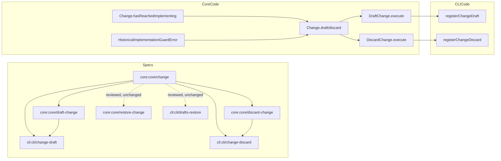

# Design: prevent-draft-discard-after-implementation

## Non-goals

- Detect whether a change has actually modified code files.
- Change the semantics of `restore`, archiving, approval gates, or general lifecycle transitions outside draft/discard.
- Introduce a new storage-level marker in `manifest.json`; the temporary signal remains derived from append-only history.
- Rewrite broader CLI documentation beyond the sections affected by `change draft` and `change discard`.

## Affected areas

- `draft()` in `packages/core/src/domain/entities/change.ts`
  Change: add the historical implementation guard and an explicit `force` bypass while preserving event emission semantics.
  Callers: 9 direct, 1 transitive · Risk: HIGH
  Note: this is a core domain operation used both by application use cases and direct repository/entity tests, so signature changes must remain backwards-compatible for existing three-argument and two-argument call sites.

- `discard()` in `packages/core/src/domain/entities/change.ts`
  Change: add the same historical implementation guard and explicit `force` bypass for irreversible discard operations.
  Callers: 9 direct, 1 transitive · Risk: HIGH
  Note: because discard is terminal, error messaging must be explicit about spec/code divergence risk.

- `Change` entity state helpers in `packages/core/src/domain/entities/change.ts`
  Change: add a derived historical-implementation signal so the guard is computed once in the domain layer instead of duplicated across use cases.
  Callers: internal entity logic plus tests · Risk: MEDIUM
  Note: this keeps the invariant inside the rich domain entity, aligned with `default:_global/architecture`.

- `DraftChange` in `packages/core/src/application/use-cases/draft-change.ts`
  Change: widen `DraftChangeInput` with `force?: boolean` and pass the flag through to `change.draft(...)`.
  Callers: 2 direct, 1 transitive · Risk: MEDIUM
  Note: the use case remains thin and does not re-implement the invariant.

- `DiscardChange` in `packages/core/src/application/use-cases/discard-change.ts`
  Change: widen `DiscardChangeInput` with `force?: boolean` and pass the flag through to `change.discard(...)`.
  Callers: 2 direct, 1 transitive · Risk: MEDIUM
  Note: no composition changes are required because constructor wiring is unchanged.

- `registerChangeDraft()` in `packages/cli/src/commands/change/draft.ts`
  Change: add Commander support for `--force`, propagate it to the kernel input only when present, and keep the success output contract unchanged.
  Callers / dependents: 4 direct, 1 transitive · Risk: MEDIUM
  Note: command errors are already routed through `handleError()`, so a new `SpecdError` subtype is sufficient for structured CLI error output.

- `registerChangeDiscard()` in `packages/cli/src/commands/change/discard.ts`
  Change: add Commander support for `--force`, propagate it to the kernel input only when present, and keep the success output contract unchanged.
  Callers / dependents: 5 direct, 1 transitive · Risk: MEDIUM
  Note: retain the existing explicit empty-`--reason` CLI validation; the new guard is additive.

- `packages/core/src/domain/errors/index.ts`
  Change: export the new domain error so it reaches `@specd/core` consumers through the existing package root export chain.
  Risk: LOW

- `packages/core/test/domain/entities/change.spec.ts`
  Change: replace permissive draft/discard assumptions with guard-aware coverage, and add assertions for the derived historical implementation signal.
  Risk: MEDIUM

- `packages/core/test/application/use-cases/draft-change.spec.ts`
  Change: add use-case coverage for rejection without `force` and success with `force`.
  Risk: LOW

- `packages/core/test/application/use-cases/discard-change.spec.ts`
  Change: add use-case coverage for rejection without `force` and success with `force`.
  Risk: LOW

- `packages/core/test/infrastructure/fs/change-repository.spec.ts`
  Change: add one integration-level persistence case showing that a historically implemented change can still move into `drafts/` or `discarded/` when the entity method is called with `force`.
  Risk: LOW

- `packages/cli/test/commands/change-draft.spec.ts`
  Change: add `--force` option coverage, ensure the kernel input includes `force: true` only when passed, and assert the guarded failure message path.
  Risk: LOW

- `packages/cli/test/commands/change-discard.spec.ts`
  Change: add `--force` option coverage, ensure the kernel input includes `force: true` only when passed, and assert the guarded failure message path.
  Risk: LOW

- `packages/cli/test/commands/change.spec.ts`
  Change: update the aggregate command suite because it duplicates draft/discard coverage and currently asserts the old contract.
  Risk: LOW

- `docs/cli/cli-reference.md`
  Change: update `change draft` and `change discard` sections to document `--force` and the new guarded failure semantics.
  Risk: LOW

- `docs/guide/workflow.md`
  Change: update the drafting/discarding guidance so it no longer states those operations are always available regardless of historical implementation, and fix the stale command examples in that section while touching it.
  Risk: LOW

## New constructs

- `HistoricalImplementationGuardError` in `packages/core/src/domain/errors/historical-implementation-guard-error.ts`
  Shape:

  ```ts
  export type GuardedChangeOperation = 'draft' | 'discard'

  export class HistoricalImplementationGuardError extends SpecdError {
    override get code(): string
    get operation(): GuardedChangeOperation

    constructor(operation: GuardedChangeOperation, changeName: string)
  }
  ```

  Responsibility: represent the domain invariant that draft/discard is blocked once a change has ever reached `implementing`, unless forced.
  Relationships: thrown by `Change`; surfaced unchanged through use cases; handled generically by CLI `handleError()`.

- `hasReachedImplementing` getter in `packages/core/src/domain/entities/change.ts`
  Shape:

  ```ts
  get hasReachedImplementing(): boolean
  ```

  Responsibility: derive the temporary implementation signal by scanning append-only history for any `transitioned` event whose `to` field is `implementing`.
  Relationships: consumed by entity guard logic and directly asserted in domain tests.

- `assertCanLeaveWorkflow(operation, force = false)` private helper in `packages/core/src/domain/entities/change.ts`
  Shape:
  ```ts
  private assertCanLeaveWorkflow(operation: 'draft' | 'discard', force?: boolean): void
  ```
  Responsibility: centralize the shared guard used by `draft()` and `discard()`, including construction of the user-facing domain error message.
  Relationships: called only from `draft()` and `discard()`; depends on `hasReachedImplementing`.

## Approach

The implementation stays layered:

1. Add a domain-level historical signal to `Change`, derived purely from history with no new persisted field.
2. Introduce a domain error that explains why draft/discard is blocked after historical implementation.
3. Update `Change.draft()` and `Change.discard()` to call a shared guard before appending events.
4. Widen `DraftChangeInput` and `DiscardChangeInput` with `force?: boolean` and thread the flag into the entity methods.
5. Add `--force` to `change draft` and `change discard`, forwarding it only when present so existing CLI behavior stays unchanged for default calls.
6. Update tests at domain, application, CLI, and one repository integration point.
7. Update CLI documentation and workflow guidance to match the new contract.

This covers the changed requirements:

- `core:core/change`
  - `Requirement: Historical implementation detection` maps to `Change.hasReachedImplementing`.
  - `Requirement: Drafting and discarding` maps to guarded `draft()` / `discard()` plus force bypass.
- `core:core/draft-change` and `core:core/discard-change`
  - Input contract changes map to `force?: boolean` on the input interfaces.
  - Guard requirements map to pass-through into the entity invariant rather than duplicate checks.
- `cli:cli/change-draft` and `cli:cli/change-discard`
  - Signature changes map to Commander `--force` options.
  - Error-case changes map to propagated `HistoricalImplementationGuardError`.

No schema, repository port, or kernel wiring changes are needed. The kernel already exposes the same use-case objects, and `handleError()` already handles arbitrary `SpecdError` subtypes with exit code 1 and structured JSON/toon output.

## Key decisions

- **Decision**: enforce the guard in `Change`, not in `DraftChange` / `DiscardChange`.
  **Rationale**: the repository's global constraints require rich domain entities to defend their own invariants; "cannot leave the workflow after historical implementation unless forced" is a domain rule, not a delivery concern.
  **Alternatives rejected**: use-case-only checks were rejected because they would duplicate the invariant and leave direct entity callers in tests or other use cases with inconsistent behavior.

- **Decision**: use a dedicated domain error instead of `InvalidStateTransitionError`.
  **Rationale**: draft/discard is orthogonal to lifecycle state, so the failure is not a lifecycle transition error. A dedicated `SpecdError` subtype gives a clearer machine-readable contract and better CLI messages.
  **Alternatives rejected**: reusing `InvalidStateTransitionError` was rejected because no lifecycle transition is happening; reusing `InvalidChangeError` was rejected because that error currently represents invalid construction/state shape, not an operation-specific guard.

- **Decision**: keep the signal derived from history instead of adding a manifest field.
  **Rationale**: the user explicitly wants a temporary pragmatic heuristic, and append-only history already contains the only available source of truth.
  **Alternatives rejected**: persisting a new boolean marker was rejected because it would duplicate derivable history and create another consistency problem.

- **Decision**: add `force?: boolean` as the trailing optional parameter on `Change.draft()` and `Change.discard()`.
  **Rationale**: this preserves existing call sites while allowing use cases and tests to opt into the bypass explicitly.
  **Alternatives rejected**: replacing the signatures with options objects was rejected because it would force a broad churn across repository and domain tests for little gain in this narrow change.

- **Decision**: update `docs/guide/workflow.md` while touching the drafting/discarding guidance.
  **Rationale**: the guide already contains stale command examples in the exact section affected by this behavior change, so leaving it untouched would preserve known incorrect guidance.
  **Alternatives rejected**: updating only `docs/cli/cli-reference.md` was rejected because the workflow guide also makes normative statements about drafting/discarding behavior.

## Trade-offs

- `[False positives from the heuristic]` → A change that once reached `implementing` but never actually modified code will still be blocked. Mitigation: `--force` exists as the explicit escape hatch.
- `[Additional domain API surface]` → `Change.draft()` and `Change.discard()` gain another optional parameter. Mitigation: place it at the end so existing callers remain source-compatible.
- `[More command/test duplication]` → CLI behavior is covered in both dedicated test files and the aggregate `change.spec.ts`. Mitigation: update both suites instead of trying to consolidate test structure inside this change.

## Spec impact

### `core:core/change`

- Direct dependents reviewed:
  - `core:core/draft-change`
  - `core:core/discard-change`
  - `core:core/restore-change`
  - `cli:cli/change-draft`
  - `cli:cli/change-discard`
  - `cli:cli/drafts-restore`
- Assessment:
  - `core:core/draft-change` and `core:core/discard-change` must change and are already in scope.
  - `cli:cli/change-draft` and `cli:cli/change-discard` must change and are already in scope.
  - `core:core/restore-change` remains satisfied because restoring an already drafted change is unchanged; the new guard affects only entering `drafts/` or `discarded/`, not leaving `drafts/`.
  - `cli:cli/drafts-restore` remains satisfied for the same reason.
- Result: no additional spec scope is required.

### `core:core/draft-change`

- Direct dependent reviewed:
  - `cli:cli/change-draft`
- Assessment:
  - The CLI must expose `--force` and propagate it. Already in scope.

### `core:core/discard-change`

- Direct dependent reviewed:
  - `cli:cli/change-discard`
- Assessment:
  - The CLI must expose `--force` and propagate it. Already in scope.

## Dependency map



```text
┌──────────────────────┐
│ core:core/change     │
│  - historical signal │
│  - draft/discard     │
└──────────┬───────────┘
           │
     ┌─────┴─────┐
     ▼           ▼
┌────────────┐ ┌──────────────┐
│ draft-     │ │ discard-     │
│ change spec│ │ change spec  │
└─────┬──────┘ └──────┬───────┘
      │               │
      ▼               ▼
┌────────────┐   ┌──────────────┐
│ change     │   │ change       │
│ draft CLI  │   │ discard CLI  │
└─────┬──────┘   └──────┬───────┘
      │                 │
      ▼                 ▼
┌──────────────┐  ┌──────────────┐
│ DraftChange  │  │ DiscardChange│
│ execute()    │  │ execute()    │
└─────┬────────┘  └──────┬───────┘
      │                  │
      └────────┬─────────┘
               ▼
     ┌──────────────────────┐
     │ Change.draft/discard │
     │  [HIGH risk]         │
     │  uses derived signal │
     └──────────┬───────────┘
                ▼
     ┌──────────────────────┐
     │ HistoricalImplGuard  │
     │ Error                │
     └──────────────────────┘

Reviewed, unchanged:
  core:restore-change ─────▶ cli:drafts-restore
```

## Testing

### Automated tests

- `packages/core/test/domain/entities/change.spec.ts`
  - add `hasReachedImplementing` scenarios for no-history, after `implementing`, and after `implementing → designing`
  - replace permissive draft/discard expectations with:
    - reject draft without `force` after historical implementation
    - allow draft with `force`
    - reject discard without `force` after historical implementation
    - allow discard with `force`

- `packages/core/test/application/use-cases/draft-change.spec.ts`
  - add a case where the repository returns a change that has previously reached `implementing` and `execute({ name })` rejects with `HistoricalImplementationGuardError`
  - add a case where `execute({ name, force: true })` succeeds

- `packages/core/test/application/use-cases/discard-change.spec.ts`
  - add the symmetric rejection/success cases for `force`

- `packages/core/test/infrastructure/fs/change-repository.spec.ts`
  - add one save/move test showing a change with historical implementation can still be moved to `drafts/` when `change.draft(actor, reason, true)` is used
  - add one save/move test showing a change with historical implementation can still be moved to `discarded/` when `change.discard(reason, actor, supersededBy, true)` is used

- `packages/cli/test/commands/change-draft.spec.ts`
  - assert `--force` is accepted and forwarded as `{ force: true }`
  - assert the flag is omitted from the kernel input when not passed
  - assert a mocked `HistoricalImplementationGuardError` exits with code 1 and the expected stderr message

- `packages/cli/test/commands/change-discard.spec.ts`
  - assert `--force` is accepted and forwarded as `{ force: true }`
  - assert a mocked `HistoricalImplementationGuardError` exits with code 1 and the expected stderr message

- `packages/cli/test/commands/change.spec.ts`
  - update the aggregate `change draft` / `change discard` suites with the same forwarding and guarded-error assertions so the broader command regression suite remains green

### Manual / E2E verification

- Run targeted tests first:
  - `pnpm test -- --run packages/core/test/domain/entities/change.spec.ts`
  - `pnpm test -- --run packages/core/test/application/use-cases/draft-change.spec.ts`
  - `pnpm test -- --run packages/core/test/application/use-cases/discard-change.spec.ts`
  - `pnpm test -- --run packages/cli/test/commands/change-draft.spec.ts`
  - `pnpm test -- --run packages/cli/test/commands/change-discard.spec.ts`

- Run full repo gates expected by the workflow hooks:
  - `pnpm test`
  - `pnpm lint`

- CLI smoke in a temporary fixture project whose change manifest contains an `implementing` transition:
  - `node packages/cli/dist/index.js change draft <name>`
    Expected: exit code 1 and an error explaining that implementation may already exist and specs/code could be left out of sync.
  - `node packages/cli/dist/index.js change draft <name> --force`
    Expected: success and `drafted change <name>`.
  - `node packages/cli/dist/index.js change discard <name> --reason "cleanup"`
    Expected: exit code 1 with the same guard rationale.
  - `node packages/cli/dist/index.js change discard <name> --reason "cleanup" --force`
    Expected: success and `discarded change <name>`.

- Documentation verification:
  - confirm `docs/cli/cli-reference.md` shows `--force` in both command tables and mentions the guarded failure case
  - confirm `docs/guide/workflow.md` no longer claims draft/discard is always available once implementation may already exist

## Open questions

- none
