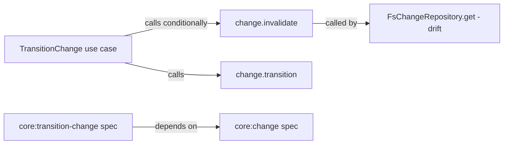

# Design: skip-invalidation-designing-to-designing

## Non-goals

- Changing drift detection logic (handled at the repository layer, not in `TransitionChange`)
- Modifying the `Change.invalidate()` domain method or its semantics
- Adding new causes for invalidation events

## Affected areas

- `TransitionChange.execute()` in `packages/core/src/application/use-cases/transition-change.ts:226-247`
  - The condition at line 229 currently reads: `if (effectiveTarget === 'designing' && freshChange.state !== 'drafting')`
  - Change: add `&& freshChange.state !== 'designing'` to the condition
  - When `invalidated = false`, the existing `else` branch calls `freshChange.transition(effectiveTarget, actor)` — no change needed there
  - Callers: `transition-change.spec.ts` tests, CLI transition command
  - Risk: LOW — the fix narrows an existing condition; all other transition paths remain unchanged

- `packages/core/test/application/use-cases/transition-change.spec.ts:1735-1787`
  - Existing tests cover `implementing → designing` (with invalidation), `designing` without approvals (no invalidation), and `drafting → designing` (no invalidation)
  - Change: add a new test for `designing → designing` asserting no invalidation occurs
  - Risk: LOW — additive test coverage

- `packages/core/test/domain/entities/change.spec.ts`
  - The `Change.invalidate()` method itself is not modified, but existing tests assert its behavior
  - Change: no code changes needed; `invalidate()` is not called for `designing → designing` after the fix
  - Risk: NONE

## New constructs

None. This change modifies an existing condition — no new files, classes, or interfaces.

## Approach

The fix is a single condition change in `TransitionChange.execute()`. The current code invalidates artifacts when transitioning to `designing` from any state except `drafting`. The fix adds `designing` to the exclusion list.

**Before:**

```ts
if (effectiveTarget === 'designing' && freshChange.state !== 'drafting') {
  freshChange.invalidate(...)
  invalidated = true
}
```

**After:**

```ts
if (effectiveTarget === 'designing' && freshChange.state !== 'drafting' && freshChange.state !== 'designing') {
  freshChange.invalidate(...)
  invalidated = true
}
```

When the condition is false (either `drafting → designing` or `designing → designing`), `invalidated` remains `false` and `freshChange.transition(effectiveTarget, actor)` is called, which appends the `transitioned` event normally.

This covers:

- **Req: Transition to designing from any state** (core:core/transition-change) — the spec now states that `designing → designing` MUST NOT invalidate, and the condition enforces this
- **Req: Lifecycle** (core:core/change) — the spec clarifies that `designing → designing` is a state-preserving re-entry that MUST NOT trigger approval invalidation or artifact downgrade

Drift detection continues to work independently — `FsChangeRepository.get()` checks file hashes on every load and auto-invalidates when content changes, regardless of lifecycle transitions.

## Key decisions

**Decision**: Exclude `designing` from invalidation via condition rather than adding a new state-preserving path.
**Alternatives rejected**: Checking drift before invalidating — this would couple drift detection (a repository concern) into the transition use case (an application concern). The current separation of concerns is correct; the fix belongs in the condition, not in adding drift awareness to `TransitionChange`.

## Trade-offs

- **Minimal condition change is safe but not the only possible approach** — we could add a more general "transition type" concept (state-preserving vs. state-changing), but that would be over-engineering for a single edge case. The three-state exclusion (`drafting`, `designing`, everything else) is clear and self-documenting.

## Spec impact

### `core:core/transition-change`

- Direct dependents: `core:core/change`, `core:core/compile-context`, `core:core/get-status`, `core:core/archive-change`
- `core:core/change` — also modified in this change (Lifecycle requirement updated)
- `core:core/compile-context` — reads change state but does not reference invalidation logic; unaffected
- `core:core/get-status` — reads invalidation events for status display; unaffected (no new invalidation cause)
- `core:core/archive-change` — transitions from `archivable`; unaffected

### `core:core/change`

- Direct dependents: `core:core/change-manifest`, `core:core/transition-change`, `core:core/validate-artifacts`, `core:core/edit-change`
- All transient dependents: unaffected — the `Change` entity's `invalidate()` method is unchanged; only `TransitionChange` calls it conditionally

No additional specs need modification.

## Dependency map

```
┌──────────────────────┐       ┌───────────────────────────┐
│ TransitionChange      │──────▶│ change.invalidate()       │
│ (use case)            │       │ (domain entity method)    │
│ [MODIFIED condition]  │       │ [UNCHANGED]               │
└──────────┬───────────┘       └──────────┬────────────────┘
           │                               │
           │ calls                         │ called by
           ▼                               ▼
┌──────────────────────┐       ┌───────────────────────────┐
│ change.transition() │       │ FsChangeRepository.get()  │
│ (domain entity)      │       │ (drift detection)         │
│ [UNCHANGED]          │       │ [UNCHANGED]               │
└──────────────────────┘       └───────────────────────────┘

┌──────────────────────┐  depends on  ┌──────────────────────┐
│ core:transition-change│─────────────▶│ core:change           │
│ (spec)                │              │ (spec)                │
└──────────────────────┘              └──────────────────────┘
```



## Testing

### Automated tests

- `packages/core/test/application/use-cases/transition-change.spec.ts`
  - **Add** `describe('designing to designing')` block with:
    - `it('does not invalidate when transitioning from designing to designing')` — create a change in `designing` state, transition to `designing`, assert `change.invalidate` spy is not called, and `change.state` remains `designing`
    - `it('does not downgrade artifacts when transitioning from designing to designing')` — create a change in `designing` with validated artifacts, transition to `designing`, assert all artifact file states remain `complete`
    - `it('does not clear approvals when transitioning from designing to designing')` — create a change in `designing` with an active spec approval, transition to `designing`, assert `activeSpecApproval` is still defined

  These map to verify scenarios in `core:core/transition-change`:
  - Scenario: "Transition from designing to designing does not invalidate"
  - Scenario: "Transition from drafting to designing does not invalidate" (existing test already covers this)

- `packages/core/test/domain/entities/change.spec.ts`
  - No changes needed — `Change.invalidate()` is not modified. Existing tests for `invalidate` continue to pass.

### Manual / E2E verification

1. Create a change and transition it to `designing`
2. Validate some artifacts to mark them `complete`
3. Run `specd change transition <name> designing` again
4. Verify that artifact states remain `complete` and no `invalidated` event is appended to history

## Open questions

None.
