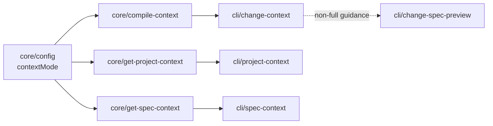

# Design: context-display-mode-config

## Non-goals

- Add compatibility aliasing for `contextMode: lazy` (explicitly out of scope; `lazy` is removed).
- Change dependency traversal semantics (`--follow-deps` / `--depth`) beyond the new display-shape rules.
- Change `change spec-preview` behavior; this change only routes users to that command from non-full context output.

## Affected areas

### Core context compiler

- `CompileContext` in `packages/core/src/application/use-cases/compile-context.ts`
  Change: replace `lazy|full` rendering model with `list|summary|full|hybrid`, add `includeChangeSpecs` input, and update structured entry shapes to support `mode: 'list'`.
  Dependents: graph impact for `CompileContext` reports `directDependents: 24`, `indirectDependents: 16`, `riskLevel: CRITICAL`.
  Risk: this is a high fan-out integration point used by context-related use cases and CLI adapters.

- `CompileContextInput`, `CompileContextConfig`, `ContextSpecEntry` in the same file
  Change: widen mode unions, add `includeChangeSpecs?: boolean`, and allow list-shaped entries without `title/description/content`.
  Risk: signature changes ripple into callers and tests.

### Project and spec context use cases

- `GetProjectContext` in `packages/core/src/application/use-cases/get-project-context.ts`
  Change: stop forcing `mode: 'full'`; render according to `contextMode` (`hybrid` resolves as `full` here because there is no change-scoped tier).
  Dependents: graph impact reports `directDependents: 19`, `indirectDependents: 19`, `riskLevel: CRITICAL`.

- `GetSpecContext` in `packages/core/src/application/use-cases/get-spec-context.ts`
  Change: add mode-aware output shaping (list/summary/full) and ensure section flags only affect full-shaped entries.
  Risk: JSON/text output contracts in CLI tests must be updated together.

### Config typing and validation

- `SpecdConfig` in `packages/core/src/application/specd-config.ts`
  Change: update `contextMode` type from `'full' | 'lazy'` to `'list' | 'summary' | 'full' | 'hybrid'` and update docs/comments.
  Dependents: graph impact for `SpecdConfig` reports `riskLevel: HIGH` with downstream composition/type usage.

- `SpecdYamlZodSchema` in `packages/core/src/infrastructure/fs/config-loader.ts`
  Change: update `contextMode` enum validation to new values and reject `lazy`.
  Risk: startup validation behavior is user-visible and must be tested thoroughly.

### CLI command adapters

- `registerChangeContext` in `packages/cli/src/commands/change/context.ts`
  Change: add `--include-change-specs`; pass `includeChangeSpecs` to core use case; render explicit mode labels for list/summary/full; update non-full guidance to `specd change spec-preview <change-name> <specId>`.
  Dependents: graph impact reports `directDependents: 6`, `indirectDependents: 3`, `riskLevel: HIGH`.

- `registerProjectContext` in `packages/cli/src/commands/project/context.ts`
  Change: pass `contextMode` to `GetProjectContext`; render list/summary/full output sections distinctly.

- `registerSpecContext` in `packages/cli/src/commands/spec/context.ts`
  Change: render mode label and mode-dependent field sets; keep `--rules/--constraints/--scenarios` active only when entry is full-shaped.

### Test surfaces

- Core tests:
  - `packages/core/test/application/use-cases/compile-context.spec.ts`
  - `packages/core/test/application/use-cases/get-project-context.spec.ts`
  - `packages/core/test/application/use-cases/get-spec-context.spec.ts`
  - `packages/core/test/infrastructure/fs/config-loader.spec.ts`
- CLI tests:
  - `packages/cli/test/commands/change-context.spec.ts`
  - `packages/cli/test/commands/project-context.spec.ts`
  - `packages/cli/test/commands/spec-context.spec.ts`

### Documentation updates required

- `docs/config/config-reference.md` (new `contextMode` values, `lazy` removal, default behavior).
- `docs/cli/cli-reference.md` and/or command sections (`change context`, `project context`, `spec context`, new `--include-change-specs` flag).
- `docs/guide/_sections/getting-started/context-compilation.md` (display modes and non-full retrieval guidance via `change spec-preview`).

## New constructs

- `ContextDisplayMode` union (or equivalent widened mode alias) in core context types:

  ```ts
  type ContextDisplayMode = 'list' | 'summary' | 'full' | 'hybrid'
  ```

  Responsibility: shared vocabulary across config parsing, use cases, and CLI rendering.

- `includeChangeSpecs` input support in `CompileContext.execute()`:

  ```ts
  interface CompileContextInput {
    includeChangeSpecs?: boolean
  }
  ```

  Responsibility: control direct `change.specIds` seeding independently from include-pattern and dependency traversal.

- Optional helper renderers in CLI context commands (internal functions, no new public API):
  - `renderListEntry(...)`
  - `renderSummaryEntry(...)`
  - `renderFullEntry(...)`
    Responsibility: keep text output consistent and explicit across mode variants.

## Approach

1. Update config contracts first.
   - Widen `contextMode` types in `specd-config.ts`.
   - Update zod enum in `config-loader.ts` to `list|summary|full|hybrid`.
   - Remove any residual code-path/documentation references that treat `lazy` as accepted.

2. Refactor `CompileContext` collection and classification.
   - Add `includeChangeSpecs` input with default `false`.
   - Make direct `change.specIds` seeding conditional on `includeChangeSpecs === true`.
   - Keep `change.specDependsOn` seeding and traversal behavior intact.
   - Replace mode resolution logic with:
     - `list` => all list entries
     - `summary` => all summary entries
     - `full` => all full entries
     - `hybrid` => full only for direct change specs included via `includeChangeSpecs`, summary for all others
   - Keep section filtering full-only; list/summary must ignore section flags.

3. Propagate display-mode behavior to non-change context use cases.
   - `GetProjectContext`: mode-aware entry shaping; `hybrid` behaves as `full`.
   - `GetSpecContext`: mode-aware entry shaping for root and dependencies; section filters only for full.

4. Update CLI adapters to pass and present new semantics.
   - `change context`:
     - add `--include-change-specs`
     - pass `includeChangeSpecs: Boolean(flag)`
     - render mode labels and non-full guidance using `change spec-preview`.
   - `project context` and `spec context`:
     - pass configured `contextMode` into use cases
     - render list/summary/full variants explicitly.

5. Align tests with new requirement scenarios.
   - Replace lazy-era assertions with list/summary/full/hybrid coverage.
   - Add regression cases for:
     - `includeChangeSpecs=false` reinjection through include patterns/traversal
     - section flags ignored in list/summary
     - lazy rejected in config loading.

6. Update docs before closing design.
   - Reflect new mode semantics and migration path from `lazy`.
   - Document `--include-change-specs`.
   - Document non-full retrieval path via `specd change spec-preview`.

## Key decisions

**Decision:** Remove `lazy` with no fallback alias.
Rationale: explicit user requirement and cleaner mode model.
Alternatives rejected: alias `lazy -> hybrid` (would preserve ambiguity and hidden compatibility branches).

**Decision:** Default direct change-spec seeding to opt-in (`includeChangeSpecs=false`).
Rationale: separates “change scope” from “compiled context scope” and allows lighter contexts by default.
Alternatives rejected: keep always-on seeding and add exclusion controls (more complex and opposite of requested behavior).

**Decision:** Keep section flags as full-content filters only.
Rationale: list/summary entries do not include full content blocks to filter.
Alternatives rejected: deriving synthetic list/summary subsets from section flags (would violate requested fixed shape behavior).

**Decision:** Apply new display modes to all context commands.
Rationale: user confirmed scope across `change context`, `project context`, and `spec context`.
Alternatives rejected: limit changes to `change context` only (would leave inconsistent UX/contracts).

## Trade-offs

- Breaking config change: existing projects with `contextMode: lazy` will fail startup validation until migrated.
  Mitigation: docs + release note guidance to move to `hybrid` (or `summary`/`full`/`list` as desired).

- Broader refactor surface across core + CLI + tests.
  Mitigation: stage changes by contract order (config -> core use cases -> CLI -> tests) and keep mode logic centralized.

- More explicit text output can be longer.
  Mitigation: keep list/summary tables concise and only print full content for full-mode entries.

## Spec impact

### `core:core/compile-context`

- Directly changed to redefine rendering and seeding semantics.
- Ripple handled in this same change by including:
  - `core:core/get-project-context`
  - `core:core/get-spec-context`
  - `cli:cli/change-context`
  - `cli:cli/project-context`
  - `cli:cli/spec-context`

### `core:core/config`

- Directly changed for accepted/default `contextMode` values and startup validation constraints.
- Ripple handled in implementation via `SpecdConfig` typing + `FsConfigLoader` validation updates.

### CLI specs

- `cli:cli/change-context` updated for new flag and output guidance.
- `cli:cli/project-context` and `cli:cli/spec-context` updated for mode-aware rendering.
- `cli:cli/change-spec-preview` remains unchanged but becomes the explicit retrieval path for non-full entries.

No additional spec scope changes are required at design time: the current spec set already covers the behavioral ripple identified via graph/context analysis.

## Dependency map



```
┌──────────────────────────────┐
│ core/specd-config + loader   │
│ contextMode: list|summary|   │
│ full|hybrid (lazy removed)   │
└──────────────┬───────────────┘
               │
     ┌─────────┼─────────┐
     ▼         ▼         ▼
┌──────────┐ ┌──────────┐ ┌──────────┐
│Compile   │ │GetProject│ │GetSpec   │
│Context   │ │Context   │ │Context   │
│[CRITICAL]│ │[CRITICAL]│ │mode-aware│
└─────┬────┘ └─────┬────┘ └─────┬────┘
      │            │            │
      ▼            ▼            ▼
┌──────────────┐ ┌──────────────┐ ┌──────────────┐
│cli change    │ │cli project   │ │cli spec      │
│context [HIGH]│ │context       │ │context       │
└─────┬────────┘ └──────────────┘ └──────────────┘
      │
      └──── guidance ────▶ specd change spec-preview
```

## Migration / Rollback

Migration:

1. Replace `contextMode: lazy` in `specd.yaml` with one of:
   - `hybrid` to keep legacy tier-like behavior
   - `summary` (new default behavior when omitted)
   - `full` or `list` as needed.
2. If change-scoped direct spec seeding is needed, use `specd change context ... --include-change-specs`.
3. For non-full entries, use `specd change spec-preview <change-name> <specId>` to inspect merged full content.

Rollback:

1. Revert core + CLI mode changes together (partial rollback would break adapter/use-case contracts).
2. Restore previous `contextMode` acceptance and old rendering behavior.
3. Re-run CLI/core context command tests to verify contract restoration.

## Testing

### Automated tests

- `packages/core/test/infrastructure/fs/config-loader.spec.ts`
  - Accept `list`, `summary`, `full`, `hybrid`
  - Reject `lazy` and other invalid values
  - Reject workspace-level `contextMode`
  - (Req: `core:core/config` context mode + startup validation scenarios)

- `packages/core/test/application/use-cases/compile-context.spec.ts`
  - `contextMode` default summary when omitted
  - list/summary/full/hybrid mode shaping
  - `includeChangeSpecs` false/true direct seeding behavior
  - reinjection via include pattern and traversal when `includeChangeSpecs=false`
  - section flags ignored in list/summary
  - (Req: `core:core/compile-context` updated input/display/scenario set)

- `packages/core/test/application/use-cases/get-project-context.spec.ts`
  - mode-aware shaping and section-filter scope
  - hybrid == full behavior in project context
  - (Req: `core:core/get-project-context`)

- `packages/core/test/application/use-cases/get-spec-context.spec.ts`
  - mode-aware shaping for root/dependencies
  - section flags only for full mode
  - stale metadata behavior remains compatible with mode shape
  - (Req: `core:core/get-spec-context`)

- `packages/cli/test/commands/change-context.spec.ts`
  - parse/pass `--include-change-specs`
  - text output mode labels for full/summary/list
  - non-full guidance points to `change spec-preview`
  - section flags do not alter list/summary shape
  - (Req: `cli:cli/change-context`)

- `packages/cli/test/commands/project-context.spec.ts`
  - mode-aware output sections
  - section flags only affect full mode
  - (Req: `cli:cli/project-context`)

- `packages/cli/test/commands/spec-context.spec.ts`
  - explicit mode labels and mode-dependent JSON/text shape
  - section flags no-op in list/summary
  - (Req: `cli:cli/spec-context`)

### Manual / E2E verification

1. `node packages/cli/dist/index.js change context context-display-mode-config designing --format text`
   - Verify mode labels are explicit.
2. Same command with `--include-change-specs`.
   - Verify direct change specs are included as configured.
3. Run with `--rules --constraints` under list/summary/full configs.
   - Verify only full mode is filtered.
4. `node packages/cli/dist/index.js project context --format text`
   - Verify list/summary/full rendering according to config.
5. `node packages/cli/dist/index.js spec context core:core/config --format json`
   - Verify mode-shaped JSON fields.
6. `node packages/cli/dist/index.js change spec-preview context-display-mode-config core:core/config`
   - Verify guided command returns merged full content.

## Open questions

_none_
