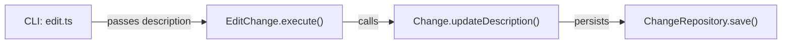

# Design: change-edit-description

## Non-goals

- This change does NOT modify the CLI command signature — `--description` already exists
- This change does NOT add new behavior beyond updating description
- This change does NOT affect spec dependencies or workspace derivation

## Affected areas

### `packages/core/src/application/use-cases/edit-change.ts`

- **Location**: `EditChangeInput` interface and `EditChange.execute()` method
- **Change**: Add `description` field to input interface and implement description update logic
- **Impact**: Low — single method modification, no callers affected externally

### `packages/core/src/domain/entities/change.ts`

- **Location**: `Change` entity
- **Change**: Add `updateDescription(description: string, actor: Actor)` method
- **Impact**: Low — new method on existing entity

### `packages/cli/src/commands/change/edit.ts`

- **Location**: Line ~91 where description is passed to execute
- **Change**: Already passing description — verify it works after use case update
- **Impact**: None — no code changes needed

## New constructs

### `EditChangeInput.description`

```typescript
interface EditChangeInput {
  readonly name: string
  readonly addSpecIds?: string[]
  readonly removeSpecIds?: string[]
  readonly description?: string // NEW: optional description field
}
```

### `Change.updateDescription()`

```typescript
class Change {
  updateDescription(description: string, actor: Actor): void {
    this.#description = description
    this.#mutations.push({
      type: 'description-updated',
      description,
      actor: actor.identity,
      timestamp: Date.now(),
    })
  }
}
```

### `EditChange.execute()` logic update

All changes MUST be inside `mutate()` for atomicity.

**Current code** (lines 66-78):

```typescript
async execute(input: EditChangeInput): Promise<EditChangeResult> {
  const change = await this._changes.get(input.name)
  // ... throw ChangeNotFoundError if null ...

  const hasChanges = (hasDescriptionChange || hasSpecChanges)
  if (!hasChanges) {
    return { change, invalidated: false }  // NO MUTATE - needs to change
  }

  const actor = await this._actor.identity()
  const persisted = await this._changes.mutate(input.name, (freshChange) => {
    // ... spec mutation logic ...
  })
  // ... post-mutate logic ...
}
```

**Modification** — unify all logic inside mutate:

1. Always call `mutate()` when there are ANY changes (description or specs)
2. Description update happens inside mutate callback
3. No early return without mutate

```typescript
async execute(input: EditChangeInput): Promise<EditChangeResult> {
  const change = await this._changes.get(input.name)
  if (change === null) {
    throw new ChangeNotFoundError(input.name)
  }

  const hasDescriptionChange = input.description !== undefined
  const hasSpecChanges =
    (input.addSpecIds !== undefined && input.addSpecIds.length > 0) ||
    (input.removeSpecIds !== undefined && input.removeSpecIds.length > 0)

  // NEW: Any changes go through mutate for atomicity
  if (!hasDescriptionChange && !hasSpecChanges) {
    return { change, invalidated: false }
  }

  const actor = await this._actor.identity()
  const persisted = await this._changes.mutate(input.name, (freshChange) => {
    // Case: Spec changes
    if (hasSpecChanges) {
      const specIds = [...freshChange.specIds]

      if (input.removeSpecIds !== undefined) {
        for (const id of input.removeSpecIds) {
          const idx = specIds.indexOf(id)
          if (idx === -1) {
            throw new SpecNotInChangeError(id, input.name)
          }
          specIds.splice(idx, 1)
        }
      }

      if (input.addSpecIds !== undefined) {
        for (const id of input.addSpecIds) {
          if (!specIds.includes(id)) {
            specIds.push(id)
          }
        }
      }

      const currentSpecIds = freshChange.specIds
      const specIdsChanged = /* existing logic */

      if (specIdsChanged) {
        const removedSpecIds = currentSpecIds.filter((id) => !specIds.includes(id))
        freshChange.updateSpecIds(specIds, actor)
      }
    }

    // Case: Description update (always inside mutate)
    if (hasDescriptionChange) {
      freshChange.updateDescription(input.description, actor)
    }

    // Determine invalidation based on whether updateSpecIds was actually called
    // (not just whether specIds were provided in input)
    const invalidated = specIdsChanged

    return { change: freshChange, invalidated, removedSpecIds: [] }
  })

  // ... post-mutate logic (unscaffold, scaffold) ...
  return { change: persisted.change, invalidated: persisted.invalidated }
}
```

**Note:** Post-mutate logic (unscaffold, scaffold, lines 120-128) is NOT modified.

## Approach

1. Add `description` field to `EditChangeInput` interface in `edit-change.ts`
2. Add `updateDescription()` method to `Change` entity in `change.ts`
3. Update `EditChange.execute()`:
   - **No changes**: early return WITHOUT mutate (no mutation needed) ✓
   - **Any changes** (description or specs or both): single `mutate()` call ✓
   - Inside mutate callback: apply spec changes first, then description
4. Verify CLI passes description correctly (line ~91 already correct)
5. Run tests to verify all three cases

## Key decisions

- **Description does not invalidate**: Following existing spec `cli:cli/change-edit` requirement "Updating `--description` alone does not trigger invalidation"
- **Description as metadata only**: No approval implications, just informational update

## Trade-offs

- No significant trade-offs identified
- Implementation is straightforward addition to existing code flow

## Spec impact

No existing specs are modified in their requirements — this change updates the implementation to match the documented spec behavior.

## Dependency map



```
┌─────────────┐     ┌──────��──────────┐     ┌───────────┐
│ edit.ts    │────▶│ EditChange     │────▶│ Change   │
│ (CLI)      │     │ .execute()    │     │ entity   │
└─────────────┘     └─────────────────┘     └───────────┘
                                                  │
                                                  ▼
                                           ┌───────────────┐
                                           │ ChangeRepo   │
                                           │ .save()     │
                                           └───────────────┘
```

## Migration / Rollback

No migration needed — purely additive change to existing behavior.

## Testing

### Automated tests

1. **Update existing `edit-change.spec.ts`**:
   - Add scenario: "description-only update: given change, when description provided with no spec changes, then description updated, invalidated false"
   - Add scenario: "spec + description together: given change, when addSpecIds and description both provided, then both applied"

2. **Unit test for entity**:
   - Add test for `updateDescription()` method in `change.spec.ts`

### Manual verification

```bash
# Before: description should be "Original description"
specd change edit my-change --description "New description" --format json

# Verify output shows updated description without invalidation
# Expected: invalidated = false
```

## Open questions

None — implementation is straightforward.
