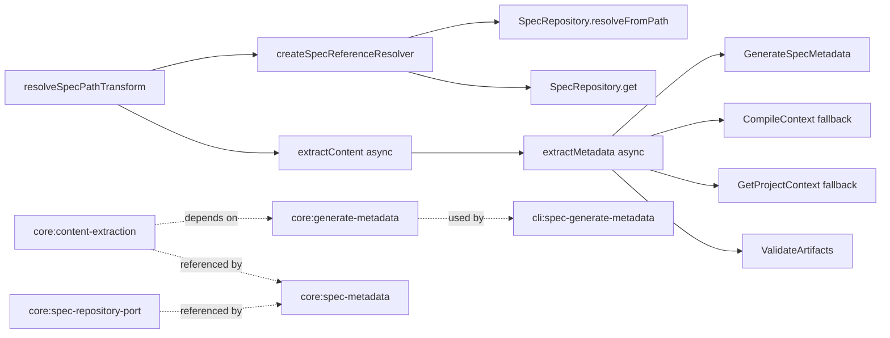

# Design: refactor-async-spec-reference-resolution

## Non-goals

- Do not change the schema DSL for `metadataExtraction`; `transform: resolveSpecPath` and arg interpolation stay declarative and backwards-compatible.
- Do not change the `SpecRepository` port surface. The existing async `resolveFromPath()` contract and current `crossWorkspaceHint` result remain the repository-facing API.
- Do not change the metadata file format, archive lifecycle, or CLI UX for `spec generate-metadata`.
- Do not make unrelated parsing or selector-matching services async; the async boundary is confined to extraction and the callers that already orchestrate metadata fallback.

## Affected areas

- `extractContent()` in `packages/core/src/domain/services/content-extraction.ts`
  Change: return `Promise<string[] | GroupedExtraction[] | StructuredExtraction[]>` and await registered transforms in every extraction mode.
  Callers: 8 direct dependents, 8 transitive dependents via `extractMetadata()` and application use cases. Risk: CRITICAL.
  Note: this is the hotspot that propagates the contract change into grouped extraction, structured extraction, field extraction, and transform error handling.

- `extractMetadata()` in `packages/core/src/domain/services/extract-metadata.ts`
  Change: become async and await `extractContent()` from all helper paths (`extractSingle`, `extractArray`, `extractMultiEntryArray`, `extractMultiEntryGrouped`, `extractMultiEntryStructured`).
  Callers: 6 direct dependents, 8 transitive dependents. Risk: HIGH.
  Note: this is the shared orchestration point used by `GenerateSpecMetadata`, `CompileContext`, `GetProjectContext`, `ValidateArtifacts`, and `_shared/depends-on-traversal.ts`.

- `resolveSpecPathTransform` in `packages/core/src/composition/extractor-transforms/resolve-spec-path.ts`
  Change: stop doing workspace-local path math; treat canonical IDs locally and delegate relative-path normalization to an async resolver supplied through transform context.
  Callers: 4 direct dependents, 7 indirect dependents. Risk: HIGH.
  Note: this removes the `_global -> default` hardcode and the buggy “same-workspace unless extra `..` remains” logic.

- `createExtractorTransformContext()` in `packages/core/src/application/use-cases/_shared/extractor-transform-context.ts`
  Change: carry a prebuilt async spec-reference resolver in the opaque context bag alongside origin metadata.
  Callers: `GenerateSpecMetadata`, `CompileContext`, `GetProjectContext`, `ValidateArtifacts`, and `_shared/depends-on-traversal.ts`. Risk: MEDIUM.
  Note: the graph under-reports this helper, but `rg` shows every metadata-fallback path constructs the context here, so it is the single injection point for the new runtime dependency.

- `GenerateSpecMetadata.execute()` in `packages/core/src/application/use-cases/generate-spec-metadata.ts`
  Change: build per-artifact transform contexts with repository-backed resolution support and await `extractMetadata()`.
  Callers: core use case entry plus CLI `spec generate-metadata`. Risk: MEDIUM.
  Note: this is where the reported `../../_global/architecture/spec.md` bug must normalize to `default:_global/architecture`.

- Metadata fallback callers
  Files: `packages/core/src/application/use-cases/compile-context.ts`, `packages/core/src/application/use-cases/get-project-context.ts`, `packages/core/src/application/use-cases/validate-artifacts.ts`, `packages/core/src/application/use-cases/_shared/depends-on-traversal.ts`.
  Change: all fallback extraction paths must await `extractMetadata()` and build the same resolver context as `GenerateSpecMetadata`.
  Callers: core change/context validation flows. Risk: HIGH.
  Note: these paths already run inside async use cases, so the propagation is mechanical but wide.

- Kernel/composition wiring
  Files: `packages/core/src/composition/use-cases/*.ts`, `packages/core/src/composition/kernel-registries.ts`, `packages/core/src/composition/extractor-transforms/index.ts`, and constructor call sites in tests/helpers.
  Change: pass workspace-prefix metadata into use cases so they can assemble repository-backed cross-workspace resolvers.
  Callers: kernel builders and test fixtures. Risk: MEDIUM.

- Tests and docs
  Files: `packages/core/test/domain/services/extract-metadata.spec.ts`, `packages/core/test/application/use-cases/generate-spec-metadata.spec.ts`, `packages/core/test/application/use-cases/compile-context.spec.ts`, `packages/core/test/application/use-cases/get-project-context.spec.ts`, `packages/core/test/application/use-cases/validate-artifacts.spec.ts`, plus docs under `docs/core/`, `docs/schemas/`, and `docs/guide/`.
  Change: convert extraction assertions to `await`, add cross-workspace async resolution coverage, and document the async transform contract.
  Risk: MEDIUM.

## New constructs

- `ExtractorTransformResult` in `packages/core/src/domain/services/content-extraction.ts`
  Shape:

  ```ts
  export type ExtractorTransformResult = string | Promise<string>
  ```

  Responsibility: make the async return contract explicit without repeating the union across the runtime.
  Relationships: used by `ExtractorTransform`, `executeRegisteredTransform()`, and the service docs exported from `domain/services/index.ts`.

- `SpecReferenceResolver` in `packages/core/src/application/use-cases/_shared/spec-reference-resolver.ts`
  Shape:

  ```ts
  export type SpecReferenceResolver = (candidate: string) => Promise<string | null>

  export interface SpecWorkspaceRoute {
    readonly workspace: string
    readonly prefixSegments: readonly string[]
  }

  export interface CreateSpecReferenceResolverInput {
    readonly originWorkspace: string
    readonly originSpecPath: SpecPath
    readonly repositories: ReadonlyMap<string, SpecRepository>
    readonly workspaceRoutes: readonly SpecWorkspaceRoute[]
  }

  export function createSpecReferenceResolver(
    input: CreateSpecReferenceResolverInput,
  ): SpecReferenceResolver
  ```

  Responsibility: resolve a relative spec artifact path to a canonical spec ID by combining the origin repository's `resolveFromPath()` result with workspace-prefix routing and repository existence checks.
  Relationships: created by application use cases, stored in extractor transform context, consumed only by `resolveSpecPathTransform`.

- Optional `options` parameter on `createExtractorTransformContext()` in `packages/core/src/application/use-cases/_shared/extractor-transform-context.ts`
  Shape:

  ```ts
  export interface ExtractorTransformContextOptions {
    readonly resolveSpecReference?: SpecReferenceResolver
  }

  export function createExtractorTransformContext(
    originWorkspace: string,
    originSpecPath: string,
    artifactId: string,
    artifactFilename: string,
    options?: ExtractorTransformContextOptions,
  ): ExtractorTransformContext
  ```

  Responsibility: keep the domain-facing context bag opaque while giving built-in transforms an application-assembled async resolver.
  Relationships: called by every metadata extraction/fallback use case.

## Approach

The implementation is a contract-first refactor.

First, change the domain extraction runtime so transforms may return either `string` or `Promise<string>`. `extractContent()` becomes async, and every internal helper that currently loops over values synchronously becomes `async` and awaits transform execution in place. The extraction engine stays pure in the architectural sense: it still owns no repositories, no filesystem access, and no side effects. The only awaited work is the caller-injected transform callback.

Second, change `extractMetadata()` to await the async extraction runtime. This is a straight propagation step, but it must cover every helper path so single-value fields, arrays, grouped sections, and structured scenarios all behave consistently. This is what satisfies the updated `core:core/content-extraction` and `core:core/generate-metadata` requirements and verification scenarios about awaited transforms and awaited field transforms.

Third, move spec-reference normalization out of path math in `resolve-spec-path.ts` and into a shared application-level resolver factory. The new `createSpecReferenceResolver()` will:

1. Strip any fragment from the candidate.
2. Ask the origin repository to resolve the candidate with `resolveFromPath(candidate, originSpecPath)`.
3. If the repository returns `{ specId }`, return it immediately.
4. If the repository returns `{ crossWorkspaceHint }`, match that hint against configured workspace routes.
5. For each matched route, derive the logical `SpecPath` candidate:
   - prefix-backed route: keep the prefix segments in the logical path
   - no-prefix route selected by workspace name: strip the leading workspace selector segment
6. Verify existence with `targetRepo.get(candidatePath)`.
7. Return the first canonical `<workspace>:<specPath>` that exists; otherwise return `null`.

This design deliberately keeps two concerns separate:

- repository adapters decide how a path escapes the origin workspace via `resolveFromPath()`
- application orchestration decides which other workspace that escape hint points to, using logical workspace routes from config instead of fs paths or hardcoded `_global` behavior

Fourth, update `resolveSpecPathTransform` to become a thin async adapter:

- canonical `workspace:capability-path` values are still normalized locally with `parseSpecId()` and `SpecPath.parse()`
- relative candidates are handed to `context.get('resolveSpecReference')`
- candidate order remains `value` first, then interpolated args, matching the current spec and docs
- if no candidate resolves, the transform still throws one aggregated failure message wrapped by `ExtractorTransformError`

Fifth, propagate the new resolver context through every metadata extraction caller:

- `GenerateSpecMetadata`
- `CompileContext` fallback rendering
- `CompileContext` fallback `dependsOn` traversal
- `GetProjectContext` fallback extraction
- `ValidateArtifacts` metadata-extraction validation path

All of those flows already have async boundaries, so the work is mostly:

- build `workspaceRoutes` once from config/composition input
- pass them to the use case constructor
- build `resolveSpecReference` once per origin spec
- include it in each artifact's transform context
- `await extractMetadata(...)`

Finally, update docs to reflect the new runtime contract. The code change is internal, but the exported service signatures in `docs/core/services.md`, transform semantics in `docs/schemas/schema-format.md` and `docs/guide/selectors.md`, and error behavior in `docs/core/errors.md` all describe the old sync-only contract today.

## Key decisions

**Make extraction async instead of adding a sync-only workaround** → the transform contract must be able to await repository-backed normalization. This aligns the runtime with the existing async `SpecRepository` port instead of inventing a partial parallel abstraction.
**Alternatives rejected** → keep `extractContent()` sync and patch only `resolveSpecPath`; this fixes the current bug but preserves the wrong architectural seam and still blocks non-fs adapters.

**Keep repository access outside the domain service** → `extractContent()` remains generic and pure; application use cases prebuild the resolver and pass it through the opaque context bag.
**Alternatives rejected** → import `SpecRepository` directly into `content-extraction.ts`; this would violate the architecture spec by moving port awareness into the domain service.

**Use `resolveFromPath()` only for the origin hop and `repo.get()` for cross-workspace confirmation** → the current port already says callers should try other repositories when they receive `crossWorkspaceHint`, so the resolver can reuse that contract without changing the port.
**Alternatives rejected** → extend `SpecRepository` now with a cross-workspace API; the current change scope and specs explicitly keep the port contract unchanged.

**Route escaped hints through configured workspace prefixes and explicit workspace selectors** → this supports workspaces with prefixes and workspaces without prefixes, while refusing to guess when a cross-workspace hint has no explicit target.
**Alternatives rejected** → infer destination workspace from fs paths or hardcode `_global`; that reintroduces backend coupling and the current bug shape.

## Trade-offs

- [Wide async propagation] → Keep the refactor narrow by changing only extraction services and already-async callers; do not spread async changes into selector matching or parsers.
- [Cross-workspace hint ambiguity for workspaces without prefixes] → Require the escaped path to identify the target workspace explicitly when no prefix disambiguates it; unresolved ambiguity becomes an explicit extraction error.
- [Context bag now carries a function] → Keep the key optional and transform-specific so other extractors remain unaffected; document the required key in `resolveSpecPathTransform` JSDoc and service docs.
- [More constructor inputs in use cases and composition] → Introduce a reusable `SpecWorkspaceRoute[]` value rather than ad hoc maps per caller.

## Spec impact

### `core:core/content-extraction`

- Direct dependents: `core:core/generate-metadata`, `core:core/schema-format`, `core:core/build-schema`, `core:core/spec-metadata`, `core:core/archive-change`, `core:core/list-specs`, `default:_global/spec-layout`
- Transitive dependents: `core:core/kernel`, `cli:cli/spec-generate-metadata`
- Assessment:
  `core:core/generate-metadata` needed a delta because it explicitly describes extraction/runtime behavior and now must await async transforms.
  `core:core/schema-format`, `core:core/build-schema`, and `core:core/list-specs` remain satisfied because they depend on extractor declarations and summary behavior, not on a synchronous return contract.
  `core:core/spec-metadata` remains satisfied because it states that metadata fallback uses the extraction engine; it does not constrain whether that engine is sync or async.
  `default:_global/spec-layout` remains satisfied because dependency labels and canonical spec IDs are unchanged; only the runtime behind `resolveSpecPath` changes.

### `core:core/generate-metadata`

- Direct dependents: `core:core/kernel`, `cli:cli/spec-generate-metadata`
- Transitive dependents: none beyond those adapter-facing specs in the current tree
- Assessment:
  No additional delta is needed. `core:core/kernel` only requires the use case to be exposed and shared through kernel composition; constructor dependency changes are internal. `cli:cli/spec-generate-metadata` already describes an async command path delegating to the core use case and does not constrain the internal normalization mechanism.

### `core:core/spec-repository-port`

- Direct dependents: `core:core/spec-metadata`
- Transitive dependents: `cli:cli/spec-generate-metadata` through metadata generation flows
- Assessment:
  No delta is required beyond the no-op already in scope. The existing port contract already allows async path resolution plus `crossWorkspaceHint`; this change only alters how callers compose that information.

## Dependency map



```
┌──────────────────────────┐
│ resolveSpecPathTransform │
│        [HIGH]            │
└─────────────┬────────────┘
              │ awaits
              ▼
┌──────────────────────────┐
│ createSpecReference      │
│ Resolver()               │
└───────┬───────────┬──────┘
        │           │
        │           └───────────────▶┌──────────────────────┐
        │                            │ targetRepo.get()     │
        ▼                            └──────────────────────┘
┌──────────────────────┐
│ originRepo.          │
│ resolveFromPath()    │
└──────────┬───────────┘
           │
           ▼
┌──────────────────────────┐
│ extractContent() [CRIT]  │
└─────────────┬────────────┘
              ▼
┌──────────────────────────┐
│ extractMetadata() [HIGH] │
└──────┬────────┬─────┬────┘
       │        │     │
       ▼        ▼     ▼
   ┌──────┐ ┌──────┐ ┌──────┐
   │ GSM  │ │  CC  │ │ GPC  │
   └──────┘ └──────┘ └──────┘
                 │
                 ▼
               ┌──────┐
               │  VA  │
               └──────┘

┌─────────────────────────┐   depends on   ┌────────────────────────┐
│ core:generate-metadata  │───────────────▶│ core:content-extraction│
└─────────────────────────┘                └────────────────────────┘
             │
             └──────────────▶┌────────────────────────────┐
                             │ cli:spec-generate-metadata │
                             └────────────────────────────┘
```

## Testing

Automated tests:

- Update `packages/core/test/domain/services/extract-metadata.spec.ts`
  Cover awaited extractor transforms, awaited field transforms, rejected transform promises, and the new async `extractContent()` / `extractMetadata()` signatures.

- Add `packages/core/test/application/use-cases/_shared/spec-reference-resolver.spec.ts`
  Cover same-workspace resolution, `_global` prefix routing, workspace-name routing for no-prefix workspaces, ambiguous cross-workspace hints returning `null`, and missing-target specs.

- Update `packages/core/test/application/use-cases/generate-spec-metadata.spec.ts`
  Add the regression case for `core/actor-resolver-port` with `../../_global/architecture/spec.md`, plus a case proving the use case awaits an async transform before assembling metadata.

- Update `packages/core/test/application/use-cases/compile-context.spec.ts`
  Keep the existing fallback traversal scenarios but convert them to awaited extraction and add one cross-workspace fallback dependency scenario.

- Update `packages/core/test/application/use-cases/get-project-context.spec.ts`
  Cover follow-deps fallback using the async resolver path.

- Update `packages/core/test/application/use-cases/validate-artifacts.spec.ts`
  Cover metadata-extraction validation when the transform returns a promise and when it fails to normalize a dependency.

- Update composition/kernel tests and helper fixtures under `packages/core/test/application/use-cases/helpers.ts`
  Add workspace-route inputs to SUT builders and ensure fake repositories expose async `resolveFromPath()` / `get()` behavior expected by the new resolver.

Documentation:

- Update `docs/core/services.md` and `docs/core/overview.md` for the async signatures of `extractContent()` and `extractMetadata()`.
- Update `docs/core/errors.md` to mention rejected transform promises as `ExtractorTransformError` causes.
- Update `docs/schemas/schema-format.md` and `docs/guide/selectors.md` to describe that transform callbacks may resolve asynchronously while schema declarations remain unchanged.
- Update `docs/core/ports.md` if the explanation of `resolveFromPath()` needs to clarify how callers consume `crossWorkspaceHint`.

Manual / E2E verification:

- Run `pnpm test --filter @specd/core -- extract-metadata generate-spec-metadata compile-context get-project-context validate-artifacts spec-repository`
  Expected: all updated suites pass with awaited extraction behavior and no sync-contract failures.

- Run `node packages/cli/dist/index.js spec generate-metadata core:core/actor-resolver-port --format json`
  Expected: generated metadata contains `default:_global/architecture` in `dependsOn`, never `core:_global/architecture`.

- Run `node packages/cli/dist/index.js change validate refactor-async-spec-reference-resolution core:core/content-extraction --artifact design`
  Expected: the artifact validates cleanly after the design file is written.

- Spot-check generated docs references by searching for stale sync-only signatures after the code/doc changes:
  `rg "function extract(Content|Metadata)|=> string" docs/core docs/schemas docs/guide`
  Expected: no stale documentation for extractor transform return types.
