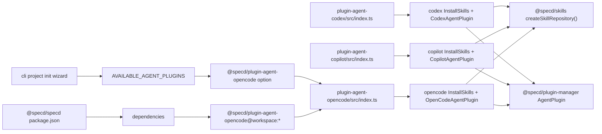

# Design: complete-agent-plugins-codex-copilot-open-code

## Non-goals

- Rework `@specd/plugin-manager` contracts (`AgentPlugin`, `InstallOptions`, `InstallResult`) beyond consumption by agent plugins.
- Change `@specd/skills` template source format (templates remain frontmatter-free).
- Introduce global (`~/.copilot/skills`) installation mode in this change; scope is project-local install paths only.

## Affected areas

- `packages/plugin-agent-codex/src/index.ts`
  Change: replace stub runtime object with composition entry point (`InstallSkills` + `CodexAgentPlugin`).
  Impact: changed symbol `create` has low current fan-in; risk is mainly behavioral parity with Claude install/uninstall semantics.

- `packages/plugin-agent-copilot/src/index.ts`
  Change: same as codex, but with Copilot frontmatter model and `.github/skills` target.
  Impact: same profile as codex; low integration fan-in, medium behavioral risk if frontmatter keys are wrong.

- `packages/plugin-agent-codex/specd-plugin.json`, `packages/plugin-agent-copilot/specd-plugin.json`
  Change: remove "stub" description and align manifests with real plugin behavior.

- `packages/plugin-agent-opencode/` (currently empty directory)
  Change: create complete package structure (`package.json`, `tsconfig.json`, `specd-plugin.json`, `src/**`, `test/**`) matching agent-plugin pattern.
  Impact: additive package; no runtime callers yet, but it becomes part of plugin loading surface via config.

- `packages/cli/src/commands/project/init.ts` (`AVAILABLE_AGENT_PLUGINS`)
  Change: extend known interactive wizard options to include `@specd/plugin-agent-opencode`.
  Impact: low fan-in local symbol, but directly controls compliance with `cli:cli/project-init` verify scenario for known plugin options.

- `packages/cli/test/commands/project-init.spec.ts`
  Change: add coverage for known plugin option set including Open Code in interactive selection flow.
  Impact: medium test impact; ensures wizard regression is caught.

- `packages/specd/package.json`
  Change: add `@specd/plugin-agent-opencode` to `dependencies` with `workspace:*`.
  Impact: distribution surface change for `@specd/specd`; no runtime code path, but release/package integrity risk if omitted.

- `docs/cli/project-init.md`, `docs/cli/cli-reference.md`
  Change: align `project init` docs with current CLI contract (`--plugin` workflow, known plugin package names, and Open Code inclusion).
  Impact: medium documentation impact; prevents user-facing mismatch between documented and real flags/options.

- `docs/guide/_sections/getting-started/usage.md`, `docs/guide/_sections/getting-started/setting-up.md`
  Change: replace outdated `--agent` setup examples with current plugin-based init examples and include Open Code.
  Impact: onboarding impact; avoids broken quick-start commands.

- `docs/core/config.md`, `docs/config/examples/approvals-and-workflow-hooks.md`
  Change: update plugin declaration examples and plugin package naming to current `@specd/plugin-agent-*` family.
  Impact: configuration guidance impact; avoids stale naming in config docs.

- `packages/specd/README.md`
  Change: update package table plugin entries and status text to include `@specd/plugin-agent-opencode` and current package names.
  Impact: package-level documentation integrity; aligns metapackage docs with implementation scope.

- `packages/plugin-agent-codex/test/install-skills.spec.ts`, `packages/plugin-agent-copilot/test/install-skills.spec.ts`, `packages/plugin-agent-opencode/test/install-skills.spec.ts`
  Change: new integration-style tests for install/uninstall/frontmatter behavior.
  Impact: medium test impact; validates behavior promised by updated specs.

- `packages/plugin-agent-claude/src/**` (reference-only, no intended writes)
  Use as implementation blueprint; avoid behavioral regressions by keeping Claude untouched in this change.

Graph note: multi-file impact analysis reports overall `MEDIUM` risk focused on agent plugin install/frontmatter pathways and shared plugin-manager type contracts.

## New constructs

- `packages/plugin-agent-codex/src/application/use-cases/install-skills.ts`
  Shape:
  - `class InstallSkills`
  - `execute(projectRoot: string, options?: InstallOptions): Promise<InstallResult>`
  - private helpers for frontmatter rendering (`renderFrontmatter`, `appendYamlField`)
    Responsibility: resolve requested skills via `@specd/skills`, inject Codex frontmatter, write markdown to `.codex/skills/<skill>/`.
    Relationships: depends on `createSkillRepository()` and codex frontmatter map.

- `packages/plugin-agent-codex/src/domain/types/frontmatter.ts`
  Shape:
  - `interface Frontmatter { name: string; description: string }`
    Responsibility: codify exact Codex-supported field set (no extras).

- `packages/plugin-agent-codex/src/domain/frontmatter/index.ts`
  Shape:
  - `const skillFrontmatter: Readonly<Record<string, Frontmatter>>`
    Responsibility: per-skill frontmatter source for codex install pipeline.

- `packages/plugin-agent-codex/src/domain/types/codex-plugin.ts`
  Shape:
  - `type InstallOperation = (projectRoot: string, options?: InstallOptions) => Promise<InstallResult>`
  - `class CodexAgentPlugin implements AgentPlugin`
  - methods: `name`, `type`, `version`, `configSchema`, `init`, `destroy`, `install`, `uninstall`
    Responsibility: runtime adapter for codex plugin contract and uninstall semantics under `.codex/skills`.

- `packages/plugin-agent-copilot/src/application/use-cases/install-skills.ts`
  Shape mirrors codex install use case.
  Responsibility: same flow with Copilot frontmatter and `.github/skills` target.

- `packages/plugin-agent-copilot/src/domain/types/frontmatter.ts`
  Shape:
  - `interface Frontmatter { name: string; description: string; license?: string; 'allowed-tools'?: string; 'user-invocable'?: boolean; 'disable-model-invocation'?: boolean }`
    Responsibility: model full supported Copilot field set from spec.

- `packages/plugin-agent-copilot/src/domain/frontmatter/index.ts`
  Shape mirrors codex map.

- `packages/plugin-agent-copilot/src/domain/types/copilot-plugin.ts`
  Shape mirrors codex runtime class with Copilot naming/path.

- `packages/plugin-agent-opencode/package.json`
  Shape mirrors other agent packages:
  - package name `@specd/plugin-agent-opencode`
  - ESM export map
  - deps on `@specd/plugin-manager` and `@specd/skills`

- `packages/plugin-agent-opencode/tsconfig.json`, `packages/plugin-agent-opencode/specd-plugin.json`
  Responsibility: compiler and plugin manifest wiring for new package.

- `packages/plugin-agent-opencode/src/index.ts`
  Shape:
  - `create(): AgentPlugin` named export
    Responsibility: compose `InstallSkills` with `OpenCodeAgentPlugin`.

- `packages/plugin-agent-opencode/src/application/use-cases/install-skills.ts`
  Shape mirrors codex/copilot.
  Responsibility: install skills under `.opencode/skills` with Open Code field filtering.

- `packages/plugin-agent-opencode/src/domain/types/frontmatter.ts`
  Shape:
  - `interface Frontmatter { name: string; description: string; license?: string; compatibility?: string; metadata?: Record<string, string> }`

- `packages/plugin-agent-opencode/src/domain/frontmatter/index.ts`
  Shape mirrors other agents.

- `packages/plugin-agent-opencode/src/domain/types/opencode-plugin.ts`
  Shape mirrors codex/copilot runtime class with Open Code path.

- Tests:
  - `packages/plugin-agent-codex/test/install-skills.spec.ts`
  - `packages/plugin-agent-copilot/test/install-skills.spec.ts`
  - `packages/plugin-agent-opencode/test/install-skills.spec.ts`
    Responsibility: scenario coverage for install path, field filtering, and uninstall behavior.

## Approach

1. Lift Claude implementation pattern into codex and copilot packages:
   - split `src/index.ts` into composition-only entrypoint
   - add domain runtime class and dedicated install use case
   - add frontmatter type + map per runtime
   - keep uninstall logic in runtime class with filtered/all modes.

2. Create full Open Code package from zero, reusing the same package architecture:
   - scaffold manifests (`package.json`, `tsconfig.json`, `specd-plugin.json`)
   - implement runtime + install use case + frontmatter model
   - add tests equivalent to codex/copilot scenarios.

3. Keep `@specd/skills` as source of frontmatter-free templates; all frontmatter injection remains plugin-owned.

4. Update CLI project-init known plugin options:
   - extend `AVAILABLE_AGENT_PLUGINS` in `packages/cli/src/commands/project/init.ts`
   - keep existing wizard flow and install delegation unchanged.

5. Update `@specd/specd` metapackage dependencies:
   - add `@specd/plugin-agent-opencode: workspace:*` in `packages/specd/package.json`
   - keep existing dependency set for Claude/Copilot/Codex unchanged.

6. Implement explicit frontmatter filtering:
   - codex: emit only `name`, `description`
   - copilot: emit required core + optional supported CLI fields
   - opencode: emit required core + optional `license`, `compatibility`, `metadata`
   - unknown fields are ignored by construction (typed maps + explicit render list).

7. Add tests mapping directly to verify scenarios for each changed/new spec.

8. Apply documentation updates for touched surfaces:
   - update `docs/cli/project-init.md` and `docs/cli/cli-reference.md` so `project init` examples/options use `--plugin` and include `@specd/plugin-agent-opencode`.
   - update `docs/guide/_sections/getting-started/usage.md` and `docs/guide/_sections/getting-started/setting-up.md` to remove stale `--agent` examples.
   - update `docs/core/config.md` and `docs/config/examples/approvals-and-workflow-hooks.md` to use current plugin package names.
   - update `packages/specd/README.md` package matrix to reflect current agent plugin packages and Open Code support.

## Key decisions

- **Decision:** keep plugin runtime class + install use-case split (same pattern as Claude).
  **Alternatives rejected:** single-file object literal per plugin (too much duplicated behavior, harder to test and evolve).

- **Decision:** retain per-plugin frontmatter maps in domain layer.
  **Alternatives rejected:** centralized shared frontmatter registry in `@specd/skills` (violates spec that templates stay runtime-agnostic and plugin-owned).

- **Decision:** project-local Copilot install root is `.github/skills/`.
  **Alternatives rejected:** `~/.copilot/skills` in this change (outside project scope; harder reproducibility in CI/team workflows).

- **Decision:** add Open Code as full sibling package `plugin-agent-opencode`.
  **Alternatives rejected:** piggyback Open Code behavior in codex or copilot package (breaks plugin isolation and manifest clarity).

## Trade-offs

- [Behavior duplication across three plugin packages] → mitigate with near-identical internal structure and helper naming; keep logic simple and explicit.
- [YAML frontmatter rendering differences per runtime] → mitigate with typed field lists and explicit renderer allowlists per plugin.
- [Config churn in `specd.yaml`] → mitigate by limiting changes to plugin declaration list and preserving existing workspace semantics.

## Spec impact

### `plugin-agent-codex:plugin-agent` (modified)

- Direct dependent specs discovered: none.
- Transitive dependents discovered: none.
- Impact conclusion: requirement changes stay local to codex plugin implementation; no additional spec deltas needed.

### `plugin-agent-copilot:plugin-agent` (modified)

- Direct dependent specs discovered: none.
- Transitive dependents discovered: none.
- Impact conclusion: requirement changes stay local to copilot plugin implementation; no additional spec deltas needed.

### `skills:skill-templates-source` (modified)

- Direct dependent specs discovered: none via metadata references.
- Transitive dependents discovered: none.
- Impact conclusion: this change clarifies matrix expectations but does not force downstream spec edits in current catalog.

### `cli:cli/project-init` (modified)

- Direct dependent specs discovered: none in current catalog.
- Transitive dependents discovered: none.
- Impact conclusion: requirement update is local to CLI project-init command behavior and tests.

## Dependency map



```
┌────────────────────────────┐            ┌────────────────────────────┐
│ cli project init wizard    │            │ @specd/specd package.json  │
│ AVAILABLE_AGENT_PLUGINS    │            │ dependencies               │
└───────────────┬────────────┘            └───────────────┬────────────┘
                │                                         │
                ▼                                         ▼
     ┌────────────────────────────┐             ┌────────────────────────────┐
     │ @specd/plugin-agent-       │             │ @specd/plugin-agent-       │
     │ opencode option            │             │ opencode@workspace:*        │
     └───────────────┬────────────┘             └───────────────┬────────────┘
                     │                                          │
                     └──────────────────────┬───────────────────┘
                                            ▼
                             ┌───────────────────────────────────┐
                             │ plugin-agent-opencode/src/index   │
                             └─────────────────┬─────────────────┘
                                               ▼
                            ┌────────────────────────────────────┐
                            │ InstallSkills + AgentPlugin        │
                            └───────────────┬────────────────────┘
                                            │
                     ┌──────────────────────▼──────────────────────┐
                     │ @specd/skills + @specd/plugin-manager types │
                     └──────────────────────────────────────────────┘
```

## Migration / Rollback

- Migration:
  - add/create `plugin-agent-opencode` package files
  - switch codex/copilot from stub to real runtime/install classes
  - extend `specd.yaml` plugin declarations.

- Rollback:
  - revert `specd.yaml` plugin declaration additions
  - restore codex/copilot `src/index.ts` stubs
  - remove `packages/plugin-agent-opencode/` package if rollout is aborted.

## Testing

Automated tests:

- `packages/plugin-agent-codex/test/install-skills.spec.ts`
  - scenario: `create()` returns valid `AgentPlugin`
  - scenario: install writes into `.codex/skills/<skill>/...`
  - scenario: markdown output includes only `name` and `description`
  - scenario: uninstall removes selected skills and full tree.

- `packages/plugin-agent-copilot/test/install-skills.spec.ts`
  - scenario: install writes into `.github/skills/<skill>/...`
  - scenario: emitted frontmatter supports `name`, `description`, optional `license`, `allowed-tools`, `user-invocable`, `disable-model-invocation`
  - scenario: uninstall semantics match contract.

- `packages/plugin-agent-opencode/test/install-skills.spec.ts`
  - scenario: named `create()` factory
  - scenario: install workflow reads skills, resolves map, prepends frontmatter, writes `.opencode/skills`
  - scenario: frontmatter field filtering for Open Code supported keys
  - scenario: uninstall selected/all paths behavior.

- `packages/cli/test/commands/project-init.spec.ts`
  - scenario: interactive known plugin option set includes `@specd/plugin-agent-opencode`
  - scenario: existing `--plugin` install flow remains functional with Open Code package name.

- `packages/specd/package.json` validation entry
  - scenario: dependency map includes `@specd/plugin-agent-opencode` with `workspace:*`
  - note: this is a manifest assertion (no runtime unit harness currently in `packages/specd`).

- config wiring tests (CLI/plugin loading surface):
  - validate plugin declarations in `specd.yaml` are loadable for codex/copilot/opencode.

Manual / E2E verification:

- Run targeted tests:
  - `pnpm test --filter @specd/plugin-agent-codex`
  - `pnpm test --filter @specd/plugin-agent-copilot`
  - `pnpm test --filter @specd/plugin-agent-opencode`
- Run monorepo checks:
  - `pnpm test`
  - `pnpm lint`
- Local smoke:
  - instantiate each plugin with `create()`
  - run `install()` against temp project root
  - inspect generated skill directories and frontmatter blocks
  - run `uninstall()` with and without `skills` filter and confirm cleanup.
  - run interactive `specd project init` once and confirm Open Code appears in the plugin selector.
  - inspect `packages/specd/package.json` to confirm `@specd/plugin-agent-opencode: workspace:*` is present.

## Open questions

_none_
