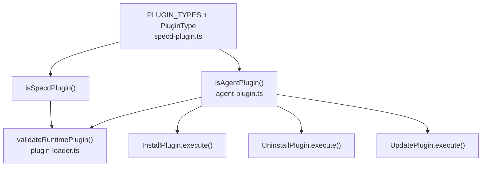

# Design: plugin-type-validation

## Affected areas

### Domain types

- `PluginType` in `packages/plugin-manager/src/domain/types/specd-plugin.ts:4`
  Change: replace `type PluginType = 'agent'` with const array + derived type. Add `isSpecdPlugin` function export.
  Callers: `SpecdPlugin` interface (same file), `AgentPlugin` (via re-export), plugin-loader.ts, all plugin packages · Risk: HIGH
  Note: this is a foundational type — all plugin packages reference it. The change is additive (new const + function), existing code continues to compile.

- `isAgentPlugin` in `packages/plugin-manager/src/infrastructure/loader/plugin-loader.ts:288`
  Change: move to `packages/plugin-manager/src/domain/types/agent-plugin.ts` as an exported pure function.
  Callers: `validateRuntimePlugin` (same file), soon all three use cases · Risk: MEDIUM
  Note: moving from infrastructure to domain — follows architecture spec (pure functions in domain).

### Application use cases

- `InstallPlugin.execute()` in `packages/plugin-manager/src/application/use-cases/install-plugin.ts:61`
  Change: add `isAgentPlugin` check before calling `install()`. Remove `as AgentPlugin` cast.
  Callers: `installPluginsWithKernel` (cli) · Risk: MEDIUM

- `UninstallPlugin.execute()` in `packages/plugin-manager/src/application/use-cases/uninstall-plugin.ts:41`
  Change: add `isAgentPlugin` check before calling `uninstall()`. Remove `as AgentPlugin` cast.
  Callers: `registerPluginsUninstall` (cli) · Risk: MEDIUM

- `UpdatePlugin.execute()` in `packages/plugin-manager/src/application/use-cases/update-plugin.ts:61`
  Change: add `isAgentPlugin` check before calling `install()`. Remove `as AgentPlugin` cast.
  Callers: `updatePluginsWithKernel` (cli) · Risk: MEDIUM

### Infrastructure loader

- `validateRuntimePlugin()` in `packages/plugin-manager/src/infrastructure/loader/plugin-loader.ts:123`
  Change: import `isSpecdPlugin` and `isAgentPlugin` from domain instead of using local copies. Add explicit rejection for unknown types.
  Callers: `load()` (same file) · Risk: MEDIUM

- Local `isSpecdPlugin()` and `isAgentPlugin()` in `packages/plugin-manager/src/infrastructure/loader/plugin-loader.ts:268-295`
  Change: remove both local functions, import from domain instead.

## New constructs

### `PLUGIN_TYPES` const array

- **Location:** `packages/plugin-manager/src/domain/types/specd-plugin.ts`
- **Shape:**
  ```typescript
  export const PLUGIN_TYPES = ['agent'] as const
  ```
- **Responsibility:** Single source of truth for known plugin types at runtime.
- **Relationships:** `PluginType` derives from it. `isSpecdPlugin` checks against it.

### `isSpecdPlugin()` type guard

- **Location:** `packages/plugin-manager/src/domain/types/specd-plugin.ts`
- **Shape:**
  ```typescript
  export function isSpecdPlugin(value: unknown): value is SpecdPlugin
  ```
- **Responsibility:** Validates that a runtime value satisfies the `SpecdPlugin` contract AND that its `type` field is a known type in `PLUGIN_TYPES`.
- **Relationships:** Used by `validateRuntimePlugin` in the loader. Previously a private function in `plugin-loader.ts`, now exported from domain.

### `isAgentPlugin()` type guard

- **Location:** `packages/plugin-manager/src/domain/types/agent-plugin.ts`
- **Shape:**
  ```typescript
  export function isAgentPlugin(value: SpecdPlugin): value is AgentPlugin
  ```
- **Responsibility:** Validates that a `SpecdPlugin` satisfies the `AgentPlugin` extension contract (type === 'agent', has install/uninstall).
- **Relationships:** Used by `validateRuntimePlugin` in the loader and by `InstallPlugin`, `UninstallPlugin`, `UpdatePlugin` use cases.

## Approach

1. **Domain layer first** — add `PLUGIN_TYPES` const, update `PluginType` derivation, export `isSpecdPlugin` from `specd-plugin.ts`, export `isAgentPlugin` from `agent-plugin.ts`.
2. **Infrastructure layer** — update `plugin-loader.ts` to import type guards from domain, remove local copies, update `validateRuntimePlugin` to use imported guards.
3. **Application layer** — add `isAgentPlugin` checks in each of the three use cases before calling install/uninstall, throw `PluginValidationError` on failure.
4. **Index exports** — ensure `domain/types/index.ts` re-exports the new functions.

All changes are internal to `@specd/plugin-manager`. No API breaking changes — the public exports (`PluginType`, `SpecdPlugin`, `AgentPlugin`) remain the same shape; new exports are additive.

## Key decisions

**Decision:** `PLUGIN_TYPES` as const array derives `PluginType`
→ Single source of truth. Adding a type means one string change. Both compile-time and runtime stay in sync.
→ **Alternatives rejected:** keeping `PluginType` as a hardcoded literal — no runtime access; separate enum — adds indirection for no benefit.

**Decision:** Type guards in domain, not infrastructure
→ They are pure functions operating on domain types. The architecture spec mandates pure domain functions live in `domain/`. Infrastructure importing from domain follows the correct dependency direction.
→ **Alternatives rejected:** keeping guards private in infrastructure — prevents use cases from accessing them; re-exporting from infrastructure — violates layering.

**Decision:** Use cases check `isAgentPlugin` themselves, not just rely on the loader
→ Defense in depth. The loader validates once at load time, but the use cases are the chokepoint for the install/uninstall operations. If the loader ever returns a non-agent plugin (e.g. after a refactor), the use case still guards correctly.
→ **Alternatives rejected:** relying solely on loader validation — single point of failure.

## Spec impact

All 6 modified specs (`specd-plugin-type`, `agent-plugin-type`, `install-plugin-use-case`, `uninstall-plugin-use-case`, `update-plugin-use-case`, `plugin-loader`) have no external dependents beyond the plugin-manager workspace. The `plugin-manager:plugin-errors` spec (transitive dependent) is unaffected — we reuse the existing `PluginValidationError`.

## Dependency map



```
┌──────────────────────────┐
│ PLUGIN_TYPES + PluginType│
│ specd-plugin.ts          │
└──────┬──────────┬────────┘
       │          │
       ▼          ▼
┌────────────┐  ┌──────────────┐
│ isSpecd    │  │ isAgent      │
│ Plugin()   │  │ Plugin()     │
└─────┬──────┘  └──┬──────┬────┘
      │            │      │
      ▼            │      ▼
┌──────────────┐   │   ┌──────────────┐
│ validate     │   │   │ Install      │
│ Runtime      │   │   │ Plugin       │
│ Plugin()     │   │   └──────────────┘
│ [loader.ts]  │   │   ┌──────────────┐
└──────────────┘   ├──▶│ Uninstall    │
                   │   │ Plugin       │
                   │   └──────────────┘
                   │   ┌──────────────┐
                   └──▶│ Update       │
                       │ Plugin       │
                       └──────────────┘
```

## Testing

### Automated tests

- `packages/plugin-manager/test/domain/types/is-specd-plugin.spec.ts` — new file
  - Test `isSpecdPlugin` returns `true` for valid SpecdPlugin with known type
  - Test `isSpecdPlugin` returns `false` for valid shape but unknown type (Req: isSpecdPlugin type guard, Scenario: Rejects unknown plugin type)
  - Test `isSpecdPlugin` returns `false` for missing properties

- `packages/plugin-manager/test/domain/types/is-agent-plugin.spec.ts` — new file
  - Test `isAgentPlugin` returns `true` for valid AgentPlugin
  - Test `isAgentPlugin` returns `false` for SpecdPlugin without install method (Req: isAgentPlugin type guard, Scenario: Rejects plugin without install method)
  - Test `isAgentPlugin` returns `false` for plugin with wrong type (Req: isAgentPlugin type guard, Scenario: Rejects plugin with wrong type)

- `packages/plugin-manager/test/application/use-cases/install-plugin.spec.ts` — new file
  - Test throws `PluginValidationError` when plugin is not AgentPlugin (Req: Error handling, Scenario: Non-agent plugin rejected)
  - Test successful install flow

- `packages/plugin-manager/test/application/use-cases/uninstall-plugin.spec.ts` — new file
  - Test throws `PluginValidationError` when plugin is not AgentPlugin
  - Test successful uninstall flow

- `packages/plugin-manager/test/application/use-cases/update-plugin.spec.ts` — new file
  - Test throws `PluginValidationError` when plugin is not AgentPlugin
  - Test successful update flow

### Manual / E2E verification

1. Run `pnpm test` — all existing and new tests pass
2. Run `pnpm lint` — no new lint errors
3. Verify `isSpecdPlugin` and `isAgentPlugin` are properly exported: `node -e "const m = require('@specd/plugin-manager'); console.log(typeof m.isSpecdPlugin, typeof m.isAgentPlugin)"`
