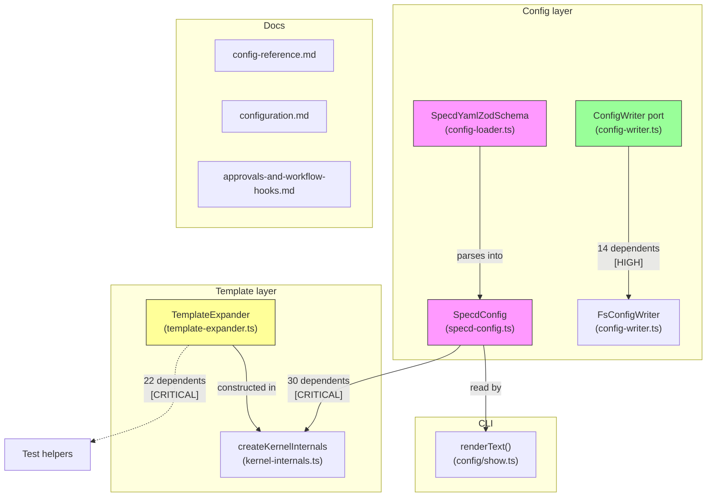

# Design: fix-config-compliance

## Non-goals

- Template functions / pipe syntax in TemplateExpander — out of scope
- Changing how ConfigWriter reads/writes plugins internally — only the port interface changes
- Modifying plugin-manager or CLI plugin commands beyond config-loader integration
- Creating derived directories ({configPath}/graph, tmp) — not the config loader's responsibility

## Affected areas

### packages/core/src/infrastructure/fs/config-loader.ts

- **`SpecdYamlZodSchema`** (line ~222): remove `artifactRules` field from Zod schema. Add `plugins` Zod schema with `agents` array validation. Remove `artifactRules` extraction (line ~654).
- **`WorkspaceRawZodSchema`**: add `.refine()` to produce specific error message for `contextMode` inside workspace entries instead of generic Zod strict error.
- **Callers**: `FsConfigLoader` is consumed by CLI and MCP adapters.
- **Impact**: `FsConfigLoader` has 0 direct dependents (instantiated at entry points only). Risk: **LOW**.

### packages/core/src/application/specd-config.ts

- **`SpecdConfig` interface** (line ~146): remove `artifactRules` field, add `plugins` field with type `{ agents?: ReadonlyArray<{ name: string; config?: Readonly<Record<string, unknown>> }> }`.
- **Callers**: 30 direct dependents across all composition use cases and CLI commands.
- **Impact**: CRITICAL fan-out (30 files), but effective risk is **LOW** — removing an optional field that only `config show` reads, and adding a new optional field that existing consumers can ignore.

### packages/core/src/application/ports/config-writer.ts

- **`ConfigWriter.addPlugin`** (line ~51): signature already has `config?` parameter in implementation. Update the port interface to match: `addPlugin(configPath: string, type: string, name: string, config?: Record<string, unknown>): Promise<void>`.
- **Callers**: 14 direct dependents (`AddPlugin`, `InitProject`, `ListPlugins`, `RemovePlugin` use cases + composition + tests).
- **Impact**: HIGH fan-out, but effective risk is **LOW** — the implementation already accepts the param. This is a spec-code alignment, not a behavior change.

### packages/core/src/infrastructure/fs/config-writer.ts

- **`FsConfigWriter.addPlugin`** (line ~96): already accepts `config?`. No code change needed — only the port interface spec changes.

### packages/cli/src/commands/config/show.ts

- **`renderText()`** (line ~13): remove the `artifactRules` display block. Add `plugins` display block showing agent names.
- **Callers**: 3 direct (`registerConfigShow`, test files). Risk: **MEDIUM** — text output change needs test updates in `cli:test/commands/config-show.spec.ts`.

### packages/core/src/domain/services/template-expander.ts

- **`TemplateExpander` class** (line ~36): add optional `onUnknown` callback to constructor. In `_replace()`, when a token is not resolved, invoke the callback with the token string before returning the preserved token.
- **Callers**: 10 direct + 12 transitive dependents. Construction is centralized in `kernel-internals.ts` — single site to update.
- **Impact**: CRITICAL fan-out, but effective risk is **MEDIUM** — the callback is optional and backwards-compatible. However, test helpers in `core:test/application/use-cases/helpers.ts` construct `TemplateExpander` and may need the new param. Affected test files: `get-artifact-instruction.spec.ts`, `get-hook-instructions.spec.ts`, `run-step-hooks.spec.ts`, `hook-runner.spec.ts`, `kernel-builder.spec.ts`, `kernel.spec.ts`.

### packages/core/src/composition/kernel-internals.ts

- **`createKernelInternals()`** (line ~314): where `TemplateExpander` is constructed. Add `onUnknown` callback to constructor call.
- **Impact**: Single construction site. Risk: **LOW**.

### core:test/application/use-cases/helpers.ts

- **`makeHookRunner()`**, **`makeRunStepHooks()`**, and other helpers that construct `TemplateExpander` instances in tests. These may need to pass (or explicitly omit) the `onUnknown` callback to satisfy the updated constructor signature.
- **Impact**: Test-only change. The callback is optional so existing calls compile without changes, but explicit construction sites should be audited.

### docs/config/config-reference.md

- Remove `artifactRules` section (line ~46, lines ~279-293).
- Remove any reference to `skills` manifest.

### docs/guide/configuration.md

- Remove `artifactRules` section (lines ~534-545).

### docs/config/examples/approvals-and-workflow-hooks.md

- Remove `artifactRules` from example (lines ~71, ~104).

### Not affected: `ArtifactRules` domain interface

- The `ArtifactRules` interface in `core:src/domain/value-objects/artifact-type.ts` is a **schema-level concept** (pre/post rules on artifact types). It is NOT the same as the `artifactRules` config field being removed. The domain value object has 11 direct + 85 indirect dependents and must NOT be touched by this change.

## New constructs

### `OnUnknownVariable` type

- **Location**: `packages/core/src/domain/services/template-expander.ts`
- **Shape**: `type OnUnknownVariable = (token: string) => void`
- **Responsibility**: callback invoked when a template token cannot be resolved. Informational only.

### `plugins` field on `SpecdConfig`

- **Location**: `packages/core/src/application/specd-config.ts`
- **Shape**: `readonly plugins?: Readonly<{ agents?: ReadonlyArray<{ name: string; config?: Readonly<Record<string, unknown>> }> }>`
- **Responsibility**: validated plugin declarations from `specd.yaml`, available to kernel and CLI.

## Approach

### 1. Remove artifactRules

Delete from bottom up: CLI display -> SpecdConfig interface -> Zod schema -> extraction logic. Then remove docs.

### 2. Add plugins to Zod schema

Add `plugins` validation to `SpecdYamlZodSchema` in config-loader.ts. Extract into `SpecdConfig.plugins`. The existing ConfigWriter implementation already handles the YAML read/write — only the validation gap needs closing.

### 3. Fix contextMode workspace error (R5)

Add a `.refine()` on `WorkspaceRawZodSchema` (or a post-validation check) that produces the specific message: "`contextMode` is not valid inside a workspace — it is a project-level setting". The current `.strict()` already rejects it, but with a generic message.

### 4. Add onUnknown callback to TemplateExpander

Add optional `onUnknown?: OnUnknownVariable` to `TemplateExpander` constructor. Store as private field. In `_replace()`, after determining a token is unresolved, call `this._onUnknown?.(token)`. Update composition layer to pass a warning callback. Backwards compatible — existing callers that don't pass it get the same silent behavior.

### 5. Update ConfigWriter port spec

Update the `ConfigWriter` interface in `config-writer.ts` to include the `config?` parameter on `addPlugin`. The implementation already has it — this is a spec-code alignment.

### 6. Remove skills manifest from spec

The `Skills manifest` requirement in `specs/core/config/spec.md` gets removed via delta. No code to remove — it was never implemented.

### 7. Add missing tests

Add test cases to `config-loader.spec.ts` for:

- R2: local config standalone validation
- R5: contextMode workspace error message specificity
- R10: schemaPlugins parsing
- R11: schemaOverrides parsing
- R15: approvals parsing
- R16: llmOptimizedContext parsing

Add test case to `template-expander.spec.ts` for:

- R9: unknown variable warning callback

## Key decisions

- **artifactRules: complete removal, not deprecation.** The field was replaced by `schemaOverrides` but never cleaned up. No migration path — `schemaOverrides` already covers its use cases. **Alternatives rejected**: deprecation warning (unnecessary indirection — no known consumer).
- **skills manifest: remove from spec.** Skills were superseded by the plugin system. The requirement is obsolete. **Alternatives rejected**: implement the requirement (would duplicate plugin functionality).
- **plugins validation: bring into Zod schema.** ConfigWriter bypasses validation by reading YAML directly. Bringing it into the schema catches structural errors at load time. **Alternatives rejected**: leave as-is (validation gap is the bug).
- **R5 contextMode error: use Zod `.refine()`.** The current `.strict()` rejects it generically. A `.refine()` produces the spec-specific message. **Alternatives rejected**: post-validation string replacement (brittle).
- **R9 unknown variables: optional callback, not error.** The spec says "a warning is emitted". An optional `onUnknown` callback is backwards-compatible and lets the composition layer decide the logging mechanism. **Alternatives rejected**: throw on unknown (breaks existing templates), console.warn directly (couples domain to I/O).

## Trade-offs

- **[SpecdConfig CRITICAL fan-out]** 30 direct dependents, but all changes are additive (new optional field) or subtractive (removed optional field). No behavioral change propagates → Mitigated by TypeScript compiler: removing the field from the interface causes compile errors only at sites that read it, which is `config show` only.
- **[TemplateExpander CRITICAL fan-out]** 10 direct + 12 transitive dependents, but the change is a strictly additive optional constructor param → Mitigated by backwards compatibility: existing calls compile without changes. Test helpers should be audited but most won't need edits.
- **[ConfigWriter HIGH fan-out]** 14 dependents, but this is a port interface alignment — the implementation already matches → Mitigated by zero runtime change.

## Spec impact

### `core:core/config` (modified in this change)

- Direct dependents (via `dependsOn`): `core:core/config-loader`, `core:core/composition`, `cli:cli/config-show`, `core:core/template-variables`, `core:core/config-writer-port`
- All five are already in this change's scope with delta files. No untracked ripple.

### `core:core/template-variables` (modified in this change)

- Direct dependents: `core:core/config` (circular dependency group — both in change scope)
- No external dependents outside change scope.

### `core:core/config-writer-port` (modified in this change)

- Direct dependents: `core:core/config` (already in scope)
- No external dependents outside change scope.

### No untracked spec ripple

All specs that depend on the modified specs are already included in this change. No additional specs need to be added to the change scope.

## Dependency map



```
┌─────────────────────────────────────────────────────────┐
│                    Config Layer                          │
│                                                         │
│  ┌──────────────────┐      ┌──────────────────┐        │
│  │ SpecdYamlZod     │─────▶│ SpecdConfig      │        │
│  │ Schema           │      │                  │        │
│  │ [remove AR]      │      │ [remove AR,      │        │
│  │ [add plugins]    │      │  add plugins]    │        │
│  │ [add refine]     │      └────────┬─────────┘        │
│  └──────────────────┘               │                  │
│                                     │ 30 dependents     │
│                            ┌────────▼─────────┐        │
│                            │ All composition   │        │
│                            │ use cases [LOW    │        │
│                            │ effective risk]   │        │
│                            └──────────────────┘        │
│                                                         │
│  ┌──────────────────┐      ┌──────────────────┐        │
│  │ ConfigWriter     │─────▶│ FsConfigWriter   │        │
│  │ port             │      │ [no change]      │        │
│  │ [align sig]      │      └──────────────────┘        │
│  │ 14 deps [HIGH]   │                                   │
│  └──────────────────┘                                   │
└─────────────────────────────────────────────────────────┘

┌─────────────────────────────────────────────────────────┐
│                  Template Layer                          │
│                                                         │
│  ┌──────────────────┐      ┌──────────────────┐        │
│  │ TemplateExpander │─────▶│ kernel-internals │        │
│  │ [add onUnknown]  │      │ [pass callback]  │        │
│  │ 22 deps          │      └──────────────────┘        │
│  │ [CRITICAL]       │                                   │
│  └───────┬──────────┘                                   │
│          │ single construction site → LOW effective     │
└──────────┼──────────────────────────────────────────────┘
           │
  ┌────────▼─────────┐
  │ Test helpers     │
  │ (may need audit) │
  └──────────────────┘

┌──────────────────┐
│ CLI              │
│ config/show.ts   │──▶ config-show.spec.ts
│ [remove AR,      │
│  add plugins]    │
│ [MEDIUM]         │
└──────────────────┘

┌──────────────────────────────────────────────┐
│ Docs [LOW risk]                              │
│ config-reference.md ── [remove AR, skills]   │
│ configuration.md    ── [remove AR]           │
│ approvals-hooks.md  ── [remove AR from ex.]  │
└──────────────────────────────────────────────┘
```

## Testing

### Unit tests

- **config-loader.spec.ts**: 6 new test cases (R2, R5, R10, R11, R15, R16)
- **template-expander.spec.ts**: 1 new test case for `onUnknown` callback
- **Existing tests for `artifactRules` removal**: verify that configs containing `artifactRules` are rejected

### Test helper audit

- **`core:test/application/use-cases/helpers.ts`**: audit all `TemplateExpander` construction sites (`makeHookRunner`, `makeRunStepHooks`, etc.). The callback is optional so most will compile without changes, but verify no test relies on unknown-variable behavior silently.
- **`cli:test/commands/config-show.spec.ts`**: update text output assertions — remove `artifactRules` expectations, add `plugins` expectations.

### Manual verification

- `specd config show` in text mode: no `artifactRules` section, `plugins` section appears
- `specd config show` in json mode: `artifactRules` absent from output
- `specd schema show`: unchanged — schema loading does not touch config

## Documentation updates

- Remove `artifactRules` from `docs/config/config-reference.md`
- Remove `artifactRules` from `docs/guide/configuration.md`
- Remove `artifactRules` from `docs/config/examples/approvals-and-workflow-hooks.md`
- Remove references to `skills` manifest from config docs
- Update ADR 0010 if it references `artifactRules` as a current feature (it already notes overlap with `schemaOverrides`)
