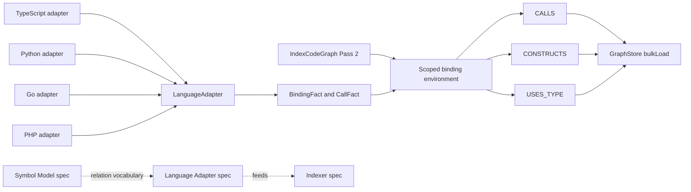

# Design: multi-language-call-resolution

## Non-goals

- Do not add fuzzy/global inference, reflection support, runtime container ID resolution, monkey-patching inference, interprocedural alias propagation, or whole-program data flow.
- Do not put TypeScript, Python, Go, PHP, or framework-specific semantics in `IndexCodeGraph`.
- Do not require custom adapters to implement scoped binding support immediately; new adapter methods remain optional.
- Do not add more relation types beyond `USES_TYPE` and `CONSTRUCTS` in this iteration.
- Do not model runtime DI containers or service locators unless the target type is statically explicit and deterministic.
- Do not remove `upstream` or `downstream` CLI direction values; they remain compatibility values while `dependents` and `dependencies` become the preferred aliases.

## Affected areas

- `LanguageAdapter` in `packages/code-graph/src/domain/value-objects/language-adapter.ts`
  Change: add optional pure `extractBindingFacts()` and `extractCallFacts()` methods and import/export the new value-object types.
  Impact: graph impact reports 3 direct dependents, 4 indirect dependents, risk MEDIUM. Keep the methods optional so existing custom adapters remain source-compatible.

- `ImportDeclaration` in `packages/code-graph/src/domain/value-objects/import-declaration.ts`
  Change: add optional `kind?: ImportDeclarationKind` and represent file-only imports with empty `localName`/`originalName` instead of fake symbols.
  Impact: consumed by `LanguageAdapter` and `IndexCodeGraph.resolveImports()`. This must be additive; existing declarations with no `kind` are treated as `named`.

- `RelationType` and relation validation in `packages/code-graph/src/domain/value-objects/relation-type.ts` and `packages/code-graph/src/domain/value-objects/relation.ts`
  Change: add `Constructs = 'CONSTRUCTS'` and `UsesType = 'USES_TYPE'` to the closed relation type set. `createRelation()` remains unchanged but must accept the new enum values through `isRelationType()`.
  Impact: `createRelation()` risk MEDIUM for the domain function. Relation-type tests and any code that enumerates relation types must be updated.

- `IndexCodeGraph` in `packages/code-graph/src/application/use-cases/index-code-graph.ts`
  Change: extend Pass 2 to collect binding/call facts, build a scoped binding environment, resolve additional `IMPORTS`, `CALLS`, `CONSTRUCTS`, `USES_TYPE`, and hierarchy relations, and merge those relations with existing adapter relations.
  Impact: graph impact reports 13 direct dependents, 6 indirect dependents, risk CRITICAL. Keep constructor signature unchanged and isolate changes inside Pass 2 helper methods.

- Graph-store implementations and contract tests:
  `packages/code-graph/src/domain/ports/graph-store.ts`
  `packages/code-graph/src/infrastructure/sqlite/sqlite-graph-store.ts`
  `packages/code-graph/src/infrastructure/ladybug/ladybug-graph-store.ts`
  `packages/code-graph/test/domain/ports/graph-store.contract.ts`
  Change: no public GraphStore method signature changes, but tests must prove `USES_TYPE` and `CONSTRUCTS` relations persist, query, traverse, and bulk-load like other relation types. If a backend has hardcoded relation filters or schema constraints, update them.
  Impact: backend relation handling is high-impact because all traversal/impact features depend on persisted relation edges.

- Traversal and impact domain services:
  `packages/code-graph/src/domain/services/get-upstream.ts`
  `packages/code-graph/src/domain/services/get-downstream.ts`
  `packages/code-graph/src/domain/services/analyze-impact.ts`
  `packages/code-graph/src/domain/services/analyze-file-impact.ts`
  `packages/code-graph/src/domain/services/compute-hotspots.ts`
  Change: verify these services traverse generic relations and do not filter out `USES_TYPE` or `CONSTRUCTS`. If they do filter by relation type, include the two new relation types in dependency traversal for impact/hotspots.
  Impact: this is the reason to add explicit relation types; impact analysis must include static type and construction dependencies.

- Built-in adapters:
  `packages/code-graph/src/infrastructure/tree-sitter/typescript-language-adapter.ts`
  `packages/code-graph/src/infrastructure/tree-sitter/python-language-adapter.ts`
  `packages/code-graph/src/infrastructure/tree-sitter/go-language-adapter.ts`
  `packages/code-graph/src/infrastructure/tree-sitter/php-language-adapter.ts`
  Change: implement deterministic binding and call fact extraction for all current built-in languages, plus import-declaration gaps from issue 52.
  Impact: adapter-local tests already exist for all four languages. Keep existing `extractRelations()` behavior working while new facts feed shared resolution.

- Public exports:
  `packages/code-graph/src/domain/value-objects/index.ts`
  `packages/code-graph/src/index.ts`
  Change: export the new value-object types that are referenced by the public `LanguageAdapter` interface.
  Impact: package API grows additively.

- CLI graph impact command:
  `packages/cli/src/commands/graph/impact.ts`
  Change: normalize `--direction dependents` to `upstream` and `--direction dependencies` to `downstream` before calling the `CodeGraphProvider`. Preserve `upstream`, `downstream`, and `both` as accepted compatibility values.
  Impact: localized CLI parser change. `registerGraphImpactCommand()` already owns option parsing and provider calls; add a small typed helper such as `parseImpactDirection(raw: string | undefined): 'upstream' | 'downstream' | 'both'` with JSDoc and no provider access on invalid values.

- Tests:
  `packages/code-graph/test/domain/value-objects/import-declaration.spec.ts` (new)
  `packages/code-graph/test/domain/value-objects/binding-fact.spec.ts` (new)
  `packages/code-graph/test/domain/value-objects/call-fact.spec.ts` (new)
  `packages/code-graph/test/domain/value-objects/relation-type.spec.ts`
  `packages/code-graph/test/domain/services/scoped-binding-environment.spec.ts` (new)
  `packages/code-graph/test/domain/services/traversal.spec.ts`
  `packages/code-graph/test/domain/services/compute-hotspots.spec.ts`
  `packages/code-graph/test/infrastructure/tree-sitter/typescript-language-adapter.spec.ts`
  `packages/code-graph/test/infrastructure/tree-sitter/python-language-adapter.spec.ts`
  `packages/code-graph/test/infrastructure/tree-sitter/go-language-adapter.spec.ts`
  `packages/code-graph/test/infrastructure/tree-sitter/php-language-adapter.spec.ts`
  `packages/code-graph/test/application/use-cases/workspace-indexing.spec.ts`
  `packages/cli/test/commands/graph-impact.spec.ts`
  Change: add focused unit tests for value objects/services/adapters and integration-level indexer scenarios.

- Documentation and workflow templates:
  `packages/code-graph/README.md`
  `docs/cli/cli-reference.md`
  `packages/skills/templates/shared/shared.md`
  `packages/skills/templates/specd-design/SKILL.md`
  `packages/skills/templates/specd-implement/SKILL.md`
  Change: update the relation list to include `USES_TYPE`, `CONSTRUCTS`, and current hierarchy relations; describe deterministic scoped binding support; update graph-impact wording so user-facing docs and skills prefer `--direction dependents` and `--direction dependencies`, while documenting `upstream` and `downstream` as compatibility values. No separate `docs/` code-graph guide exists today; if one is added before implementation, update it too.

## New constructs

- `packages/code-graph/src/domain/value-objects/source-location.ts`
  Shape:

  ```ts
  export interface SourceLocation {
    readonly filePath: string
    readonly line: number
    readonly column: number
    readonly endLine: number | undefined
    readonly endColumn: number | undefined
  }
  ```

  Responsibility: represent source locations for binding and call facts. It does not resolve symbols.
  Relationships: used by `BindingFact`, `BindingScope`, and `CallFact`.

- `packages/code-graph/src/domain/value-objects/binding-fact.ts`
  Shape:

  ```ts
  export const BindingScopeKind = {
    File: 'file',
    Class: 'class',
    Method: 'method',
    Function: 'function',
    Block: 'block',
  } as const
  export type BindingScopeKind = (typeof BindingScopeKind)[keyof typeof BindingScopeKind]

  export const BindingSourceKind = {
    Local: 'local',
    Parameter: 'parameter',
    ReturnType: 'return-type',
    Property: 'property',
    ClassManaged: 'class-managed',
    Inherited: 'inherited',
    FileGlobal: 'file-global',
    ImportedType: 'imported-type',
    FrameworkManaged: 'framework-managed',
    ConstructorCall: 'constructor-call',
    Alias: 'alias',
    Receiver: 'receiver',
  } as const
  export type BindingSourceKind = (typeof BindingSourceKind)[keyof typeof BindingSourceKind]

  export interface BindingScope {
    readonly id: string
    readonly kind: BindingScopeKind
    readonly filePath: string
    readonly parentId: string | undefined
    readonly ownerSymbolId: string | undefined
    readonly start: SourceLocation
    readonly end: SourceLocation | undefined
  }

  export interface BindingFact {
    readonly name: string
    readonly filePath: string
    readonly scopeId: string
    readonly sourceKind: BindingSourceKind
    readonly location: SourceLocation
    readonly targetName: string | undefined
    readonly targetSymbolId: string | undefined
    readonly targetFilePath: string | undefined
    readonly metadata: Readonly<Record<string, unknown>> | undefined
  }
  ```

  Responsibility: encode deterministic adapter facts as immutable data. It does not perform lookup or graph writes.
  Relationships: produced by adapters; consumed by scoped binding environment service.

- `packages/code-graph/src/domain/value-objects/call-fact.ts`
  Shape:

  ```ts
  export const CallForm = {
    Free: 'free',
    Member: 'member',
    Static: 'static',
    Constructor: 'constructor',
  } as const
  export type CallForm = (typeof CallForm)[keyof typeof CallForm]

  export interface CallFact {
    readonly filePath: string
    readonly scopeId: string | undefined
    readonly callerSymbolId: string | undefined
    readonly form: CallForm
    readonly name: string
    readonly receiverName: string | undefined
    readonly targetName: string | undefined
    readonly arity: number | undefined
    readonly location: SourceLocation
    readonly metadata: Readonly<Record<string, unknown>> | undefined
  }

  export interface ResolvedDependency {
    readonly sourceSymbolId: string
    readonly targetSymbolId: string
    readonly relationType:
      | typeof RelationType.Calls
      | typeof RelationType.Constructs
      | typeof RelationType.UsesType
    readonly reason: string
    readonly location: SourceLocation
  }
  ```

  Responsibility: normalize call and construction syntax before shared resolution. `relationType` separates ordinary invocation (`CALLS`), instantiation (`CONSTRUCTS`), and static type usage (`USES_TYPE`).
  Relationships: produced by adapters; resolved by `resolveDependencyFacts()`.

- `packages/code-graph/src/domain/value-objects/import-declaration-kind.ts`
  Shape:

  ```ts
  export const ImportDeclarationKind = {
    Named: 'named',
    Namespace: 'namespace',
    Default: 'default',
    SideEffect: 'side-effect',
    Dynamic: 'dynamic',
    Require: 'require',
    Blank: 'blank',
  } as const
  export type ImportDeclarationKind =
    (typeof ImportDeclarationKind)[keyof typeof ImportDeclarationKind]
  ```

  Responsibility: classify import forms without changing resolution responsibility.
  Relationships: optional field on `ImportDeclaration`.

- `packages/code-graph/src/domain/services/scoped-binding-environment.ts`
  Shape:

  ```ts
  export interface SymbolLookup {
    findByName(name: string, filePrefix?: string): readonly SymbolNode[]
    findByFile(filePath: string): readonly SymbolNode[]
  }

  export interface BuildScopedBindingEnvironmentInput {
    readonly filePath: string
    readonly symbols: readonly SymbolNode[]
    readonly imports: readonly ImportDeclaration[]
    readonly importMap: ReadonlyMap<string, string>
    readonly scopes: readonly BindingScope[]
    readonly facts: readonly BindingFact[]
    readonly symbolLookup: SymbolLookup
  }

  export interface ScopedBindingEnvironment {
    lookup(name: string, scopeId: string | undefined): readonly BindingFact[]
    resolveTargetSymbol(fact: BindingFact): SymbolNode | undefined
    resolveReceiver(call: CallFact): readonly BindingFact[]
  }

  export function buildScopedBindingEnvironment(
    input: BuildScopedBindingEnvironmentInput,
  ): ScopedBindingEnvironment

  export function resolveDependencyFacts(input: {
    readonly environment: ScopedBindingEnvironment
    readonly bindingFacts: readonly BindingFact[]
    readonly callFacts: readonly CallFact[]
    readonly symbols: readonly SymbolNode[]
    readonly symbolLookup: SymbolLookup
  }): readonly ResolvedDependency[]
  ```

  Responsibility: pure shared lookup, shadowing, receiver binding, deterministic call-candidate selection, type-use selection, and constructor selection. It does not import infrastructure, read files, or know concrete language IDs.
  Relationships: called by `IndexCodeGraph` Pass 2; tested independently with in-memory symbol fixtures.

## Approach

1. Add relation types first.
   Add `RelationType.Constructs = 'CONSTRUCTS'` and `RelationType.UsesType = 'USES_TYPE'` to `packages/code-graph/src/domain/value-objects/relation-type.ts`. Update relation-type tests and any documentation that enumerates relation types.

2. Add immutable value objects.
   Create `SourceLocation`, `BindingScope`, `BindingFact`, `CallFact`, `ResolvedDependency`, and `ImportDeclarationKind`. Export them from `packages/code-graph/src/domain/value-objects/index.ts` and `packages/code-graph/src/index.ts`. Add JSDoc for every exported symbol per the global docs spec.

3. Extend `ImportDeclaration` additively.
   Add `readonly kind?: ImportDeclarationKind | undefined`. Keep `localName`, `originalName`, `specifier`, and `isRelative` required. For file-only imports, adapters set `localName: ''` and `originalName: ''`. Treat `undefined` as `ImportDeclarationKind.Named` in indexer helpers.

4. Extend `LanguageAdapter` additively.
   Add optional methods:

   ```ts
   extractBindingFacts?(
     filePath: string,
     content: string,
     symbols: SymbolNode[],
     imports: ImportDeclaration[],
   ): BindingFact[]

   extractCallFacts?(filePath: string, content: string, symbols: SymbolNode[]): CallFact[]
   ```

   These methods remain synchronous and pure. Built-in adapters implement them; custom adapters can omit them.

5. Implement the shared environment as a pure domain service.
   `buildScopedBindingEnvironment()` sorts facts by scope depth/source location and resolves shadowing by walking `scopeId -> parentId`. Imported names are represented as binding facts from `importMap`; adapter facts can reference `targetName` and let `resolveTargetSymbol()` use `SymbolLookup.findByName()`.

6. Implement `resolveDependencyFacts()`.
   - Free/member/static call facts emit `RelationType.Calls` only when the target callable symbol is deterministic.
   - Constructor call facts emit `RelationType.Constructs` when the constructed class/type symbol is deterministic.
   - Binding facts with `Parameter`, `ReturnType`, `Property`, `ImportedType`, or other static type-reference sources emit `RelationType.UsesType` when the referenced type symbol is deterministic.
   - Any resolved dependency whose `sourceSymbolId` equals `targetSymbolId` is dropped before returning results. The resolver should treat this as noise, not as a lower-confidence edge, because a symbol cannot be its own impact dependent.
   - Runtime-only or ambiguous facts emit no relation.

7. Update `IndexCodeGraph` Pass 2.
   In the existing Pass 2 loop, after `resolveImports()`:
   - call `adapter.extractBindingFacts?.(prefixedPath, content, symbols, imports) ?? []`
   - call `adapter.extractCallFacts?.(prefixedPath, content, symbols) ?? []`
   - build import-derived binding facts from `importMap`
   - build the scoped binding environment with a `SymbolLookup` wrapper around the existing `SymbolIndex`
   - call `resolveDependencyFacts()` and convert each `ResolvedDependency` into `RelationType.Calls`, `RelationType.Constructs`, or `RelationType.UsesType`
   - keep existing `adapter.extractRelations()` output and existing file imports
   - filter any adapter or shared-resolution symbol relation where `source === target` before staging, so old adapter backstops cannot reintroduce self-edges
   - de-duplicate relations by `source:type:target` inside the chunk before staging

8. Update import resolution for file-only imports.
   Refactor `resolveImports()` internally so relative and package specifiers can produce file-level `IMPORTS` even when there is no imported symbol. For `kind` values `side-effect`, `dynamic`, `require`, and `blank`, skip `importMap` population and resolve only `fileImports` when the target file can be determined.

9. Adapter-specific implementation.
   TypeScript/TSX/JavaScript/JSX:
   - add import declarations for side-effect imports, string-literal `import()`, and string-literal `require()`
   - add binding facts for constructor parameters, typed parameters, return types, class fields, constructor parameter properties, `this`, imports used as type names, and local `const x = new X()` aliases
   - add call facts for free calls, member calls, static/namespace calls, and `new X()` constructor calls
   - emit enough facts for constructor injection to become `USES_TYPE` and `new X()` to become `CONSTRUCTS`
   - add `tsconfig` path/baseUrl support through adapter-owned resolver helpers; keep file reads outside extraction methods, most likely via `resolveRelativeImportPath()` or a new cached resolver used from existing optional resolution methods

   Python:
   - add import declarations for string-literal `importlib.import_module()` and `__import__()`
   - normalize `import x.y` accessible binding names so shared lookup knows whether `x` or `x.y` is visible
   - add binding facts for `self`, `cls`, annotated parameters/attributes/returns, constructor-like calls, and simple aliases from known bindings
   - map annotations to `USES_TYPE` and deterministic construction to `CONSTRUCTS`
   - keep monkey patching and dynamic module names out of persisted graph output

   Go:
   - add import facts for grouped, aliased, dot, and blank imports
   - map alias imports to receiver/package binding facts
   - add call facts for selector expressions `pkg.Func()` and `obj.Method()`
   - add deterministic constructor-like calls/composite literals when they identify known types as `CONSTRUCTS`
   - add type references in parameters, returns, fields, and interfaces as `USES_TYPE`
   - represent blank imports as file-only dependencies only

   PHP:
   - preserve existing require/include, dynamic loader, framework-managed alias, and loaded-instance behavior
   - add `extractBindingFacts()` and `extractCallFacts()` as an adapter-facing representation of the same deterministic facts
   - map `new X()` and deterministic framework class construction to `CONSTRUCTS`
   - map typed parameters/properties/returns and framework-managed deterministic type bindings to `USES_TYPE`
   - migrate only covered alias flows into shared facts first; keep existing `extractRelations()` as a compatibility backstop until tests show parity

10. Update graph stores and traversal.
    If SQLite or Ladybug store code enumerates relation types, include `CONSTRUCTS` and `USES_TYPE`. Add contract tests that bulk-load, query, upstream/downstream traverse, and hotspot-count these relations. Impact analysis must treat both relation types as dependency edges.

11. Add user-facing graph-impact direction aliases.
    In `packages/cli/src/commands/graph/impact.ts`, add a parser/normalizer that accepts:
    - `dependents` -> `upstream`
    - `dependencies` -> `downstream`
    - `upstream` -> `upstream`
    - `downstream` -> `downstream`
    - `both` -> `both`

    The normalizer must run before the graph provider is opened so invalid values fail as CLI usage errors without graph access. Keep provider calls typed as `upstream | downstream | both`, because the code-graph domain API does not need alias vocabulary. Add tests in `packages/cli/test/commands/graph-impact.spec.ts` for both aliases and an invalid direction value.

12. Update user-facing graph-impact terminology.
    Update `docs/cli/cli-reference.md` so the `graph impact` section lists `dependents|dependencies|upstream|downstream|both`, explains `dependents` and `dependencies` as preferred values, and labels `upstream`/`downstream` as compatibility values. Update `packages/skills/templates/shared/shared.md`, `packages/skills/templates/specd-design/SKILL.md`, and `packages/skills/templates/specd-implement/SKILL.md` so blast-radius/dependent queries use `--direction dependents` or the term dependents, and no template says "downstream dependents".

## Key decisions

**Decision:** add `USES_TYPE` and `CONSTRUCTS` now.
**Alternatives rejected:** overloading `CALLS` would improve impact counts but lose semantic precision and require a later migration. `USES_TYPE` is necessary for ports/interfaces and constructor injection; `CONSTRUCTS` separates instantiation from invocation.

**Decision:** add optional adapter methods instead of changing required adapter behavior.
**Alternatives rejected:** making the methods mandatory would break custom adapters and increase migration cost. Keeping all scoped logic inside adapters would duplicate environment behavior across languages and contradict issue 54.

**Decision:** represent side-effect/dynamic/require/blank imports with an optional `ImportDeclaration.kind`.
**Alternatives rejected:** fake local names would pollute import maps and make call resolution noisy. A separate import fact model would duplicate `ImportDeclaration` and require more indexer plumbing.

**Decision:** keep scoped binding value objects in `domain/value-objects` and the builder in `domain/services`.
**Alternatives rejected:** putting the builder in infrastructure would violate layering and make it harder to test. Putting it entirely in application would make the core lookup algorithm less reusable and mix orchestration with domain logic.

**Decision:** keep existing `extractRelations()` during migration.
**Alternatives rejected:** replacing all adapter relation extraction in one step would be high risk, especially for PHP dynamic loader behavior that already has broad coverage.

**Decision:** add `dependents` and `dependencies` as CLI direction aliases while keeping `upstream` and `downstream` compatible.
**Alternatives rejected:** only changing docs would leave the CLI harder to use and would not satisfy the confirmed user expectation. Removing `upstream`/`downstream` would break existing automation. Keeping "downstream dependents" would preserve existing wording but is semantically wrong for impact analysis.

## Trade-offs

- [Risk] `IndexCodeGraph` is CRITICAL impact and already stages Pass 2 output.
  Mitigation: keep constructor/API stable, isolate new logic in helpers, add integration tests in `workspace-indexing.spec.ts`, and de-duplicate relations before staging.

- [Risk] Adding relation types can reveal hardcoded relation assumptions in stores, traversal, CLI, or docs.
  Mitigation: update relation-type tests, GraphStore contract tests, traversal tests, hotspot tests, README, and any backend-specific relation filters in the same implementation.

- [Risk] TypeScript path aliases require config-aware resolution while extraction methods must stay pure.
  Mitigation: keep any `tsconfig` file reads inside adapter-owned resolver methods that are already allowed to perform resolution work, with per-root caching.

- [Risk] PHP behavior can regress if existing alias maps are removed too aggressively.
  Mitigation: first emit shared facts while retaining existing `extractRelations()` output; migrate only after parity tests pass.

- [Risk] Type references can be noisy if every annotation is emitted without resolution discipline.
  Mitigation: emit `USES_TYPE` only when the target resolves deterministically to a known symbol.

- [Risk] Scoped binding can produce self-relations when the owner symbol is also the resolved type/call target, as seen in formal graph checks for `TemplateExpander`.
  Mitigation: filter `sourceSymbolId === targetSymbolId` inside `resolveDependencyFacts()` and again before Pass 2 relation staging; add resolver, indexer, and graph smoke assertions that no self-edge is persisted.

- [Risk] File-only import resolution could over-report external dependencies.
  Mitigation: emit `IMPORTS` only when a workspace file target resolves; unresolved external packages remain dropped.

- [Risk] Adding direction aliases can create split terminology between CLI and code-graph domain APIs.
  Mitigation: normalize aliases only in the CLI command layer and keep provider/domain APIs on the existing `upstream | downstream | both` union.

## Spec impact

### `code-graph:code-graph/symbol-model`

Direct affected dependents in this change: `code-graph:code-graph/language-adapter` and `code-graph:code-graph/indexer`. Both are updated with deltas to consume the new value-object vocabulary and the widened relation vocabulary. `code-graph:code-graph/graph-store`, `code-graph:code-graph/traversal`, and `code-graph:code-graph/hotspots` do not need requirement changes if they treat relation types generically, but their tests must prove `USES_TYPE` and `CONSTRUCTS` work as normal dependency edges.

### `code-graph:code-graph/language-adapter`

Direct affected dependent in this change: `code-graph:code-graph/indexer`. The indexer delta adds Pass 2 use of binding/call facts and maps them to `CALLS`, `CONSTRUCTS`, and `USES_TYPE`. Custom adapter compatibility is preserved by making the new methods optional.

### `code-graph:code-graph/indexer`

The indexer still depends on `graph-store`, `language-adapter`, `symbol-model`, `workspace-integration`, and `core:core/config`. The design intentionally changes the relation vocabulary but does not change workspace path semantics or config fields.

### `cli:cli/graph-impact`

The command gains preferred aliases: `dependents` maps to existing upstream analysis and `dependencies` maps to existing downstream analysis. The code-graph provider/domain semantics do not change; only the CLI command accepts and normalizes the alias vocabulary.

### `skills:skill-templates-source`

The bundled workflow templates must stop asking for downstream dependents. Skills that need blast radius should either say dependents or invoke `specd graph impact ... --direction dependents`; skills should reserve `dependencies` / `downstream` for dependency queries.

### `default:_global/docs`

No global documentation requirement changes are needed. The spec is included because the existing CLI documentation requirement owns `docs/cli/cli-reference.md`, and this change updates an existing command's documented semantics.

## Dependency map



```
+----------------------+      +----------------------------+
| Built-in adapters    |      | Symbol model value objects |
| TS/Python/Go/PHP     |----->| BindingFact / CallFact     |
+----------+-----------+      +-------------+--------------+
           |                                |
           v                                v
+----------------------+      +----------------------------+
| IndexCodeGraph       |----->| Scoped binding environment |
| Pass 2 orchestration |      | pure domain service        |
+----------+-----------+      +-------------+--------------+
           |                                |
           +--------------+-----------------+
                          v
                 +--------------------------+
                 | Relation[]               |
                 | CALLS / CONSTRUCTS       |
                 | USES_TYPE / IMPORTS      |
                 | EXTENDS / IMPLEMENTS     |
                 | OVERRIDES                |
                 +------------+-------------+
                              |
                              v
                 +--------------------------+
                 | GraphStore + traversal   |
                 | impact counts these      |
                 | dependency edges         |
                 +--------------------------+
```

## Migration / Rollback

The implementation widens the relation vocabulary but does not require a stored-data migration if backends store relation types as strings. Existing graph stores can be cleared and re-indexed to populate richer relations.

If a backend has a hardcoded relation-type constraint, the implementation must update it in the same change. Rollback is to remove `USES_TYPE` and `CONSTRUCTS` emissions and re-index; persisted rows with those types should be removed by a full graph clear/re-index.

## Testing

Automated tests:

- `packages/code-graph/test/domain/value-objects/relation-type.spec.ts`
  Assert `RelationType` includes `UsesType` and `Constructs`, and `isRelationType()` accepts `USES_TYPE` and `CONSTRUCTS`.

- `packages/code-graph/test/domain/value-objects/import-declaration.spec.ts`
  Covers file-only side-effect imports, default `kind` compatibility, and named import preservation.

- `packages/code-graph/test/domain/value-objects/binding-fact.spec.ts`
  Covers immutable binding facts, scope kinds, source kinds, workspace-prefixed paths, and runtime-only exclusions.

- `packages/code-graph/test/domain/value-objects/call-fact.spec.ts`
  Covers free/member/static/constructor call facts and readonly properties.

- `packages/code-graph/test/domain/services/scoped-binding-environment.spec.ts`
  Covers lexical lookup, shadowing, imported type lookup, receiver resolution, constructor call resolution to `CONSTRUCTS`, type annotation resolution to `USES_TYPE`, ambiguous receiver dropping, `sourceSymbolId === targetSymbolId` self-relation filtering, and no store access.

- `packages/code-graph/test/domain/ports/graph-store.contract.ts`
  Add relation persistence cases for `USES_TYPE` and `CONSTRUCTS` so SQLite and Ladybug both prove bulk-load/query behavior.

- `packages/code-graph/test/domain/services/traversal.spec.ts` and `packages/code-graph/test/domain/services/compute-hotspots.spec.ts`
  Assert traversal, impact, and hotspot calculations include `USES_TYPE` and `CONSTRUCTS` as dependency edges.

- `packages/code-graph/test/infrastructure/tree-sitter/typescript-language-adapter.spec.ts`
  Add cases for side-effect imports, string-literal `import()`, string-literal `require()`, constructor parameter type annotations as `USES_TYPE` candidates, `new TemplateExpander(builtins)` as a `CONSTRUCTS` candidate, member calls through bound receivers, `this` bindings, `extends`, and `implements`.

- `packages/code-graph/test/infrastructure/tree-sitter/python-language-adapter.spec.ts`
  Add cases for `importlib.import_module("pkg.mod")`, `__import__("pkg.mod")`, `import x.y` accessible names, annotated `self`/`cls` receiver facts, type annotations as `USES_TYPE` candidates, deterministic constructor-like calls as `CONSTRUCTS`, and unresolved dynamic module names being dropped.

- `packages/code-graph/test/infrastructure/tree-sitter/go-language-adapter.spec.ts`
  Add cases for grouped imports, alias imports, dot imports, blank imports, `pkg.Func()`, `obj.Method()`, composite literals as `CONSTRUCTS`, parameter/field/interface type references as `USES_TYPE`, and unresolved selector calls being dropped.

- `packages/code-graph/test/infrastructure/tree-sitter/php-language-adapter.spec.ts`
  Add parity cases proving existing CakePHP/CodeIgniter/framework-managed aliases are emitted as shared binding/call facts while existing relations remain stable, with `new X()` producing `CONSTRUCTS` and typed signatures producing `USES_TYPE` where PHP syntax provides them.

- `packages/code-graph/test/application/use-cases/workspace-indexing.spec.ts`
  Add integration cases where indexing resolves:
  - `constructor(expander: TemplateExpander)` as a `USES_TYPE` relation
  - `new TemplateExpander(builtins)` as a deterministic `CONSTRUCTS` relation
  - `HookRunner` and `GraphStore` port/interface usage through type annotations where symbols are resolvable
  - file-only imports as `IMPORTS` without fake local symbols
  - a resolver self-edge candidate is filtered before store staging and does not appear in persisted relations

- `packages/cli/test/commands/graph-impact.spec.ts`
  Add CLI command tests for direction aliases:
  - `--direction dependents` calls provider impact analysis with normalized `upstream`
  - `--direction dependencies` calls provider impact analysis with normalized `downstream`
  - `--direction upstream`, `--direction downstream`, and `--direction both` remain accepted
  - invalid values such as `--direction sideways` fail with code 1 before provider access

- Documentation / template checks:
  Use `rg "downstream dependents|downstream impact" docs/cli packages/skills/templates` to confirm ambiguous wording was removed. Use `rg "--direction downstream" docs/cli packages/skills/templates` to review remaining downstream mentions and confirm they describe dependencies, not dependents.

Edge-case test matrix:

- TypeScript import edges:
  - side-effect import to resolvable relative file emits `IMPORTS` and no import-map entry
  - side-effect import to unresolved file emits no relation and no error
  - `import('./literal.js')` emits `IMPORTS` when resolvable
  - `import(variableName)` emits no relation
  - `require('./literal.js')` emits `IMPORTS` when resolvable
  - `require(variableName)` emits no relation
  - `require.resolve('./x')` is not treated as a runtime dependency unless explicitly supported
  - type-only imports can still support `USES_TYPE` but must not create false `CALLS`
  - namespace import `import * as ns from './mod.js'` supports `ns.fn()` resolution when deterministic
  - default import supports member calls only when the target symbol is deterministic

- TypeScript type/constructor edges:
  - constructor parameter `constructor(repo: UserRepo)` emits `USES_TYPE`
  - ordinary parameter `save(repo: UserRepo)` emits `USES_TYPE`
  - return type `make(): UserRepo` emits `USES_TYPE`
  - class field `private readonly repo: UserRepo` emits `USES_TYPE`
  - constructor parameter property `constructor(private repo: UserRepo)` emits `USES_TYPE`
  - generic type `Repository<User>` emits `USES_TYPE` for both resolvable type symbols where possible
  - union/intersection types emit one `USES_TYPE` per resolvable member
  - built-in types like `string`, `Promise`, `Array` emit no project graph edge unless they resolve to workspace symbols
  - `new UserRepo()` emits `CONSTRUCTS`
  - `new ns.UserRepo()` emits `CONSTRUCTS` when namespace binding resolves
  - optional chaining `repo?.save()` emits `CALLS` only when receiver binding resolves
  - computed member calls `repo[method]()` emit no relation

- Python edges:
  - `import package.module` binds the accessible local name correctly
  - `from package import Class as Alias` emits alias-aware bindings
  - relative imports across `__init__.py` layouts resolve deterministically
  - `importlib.import_module("pkg.mod")` emits `IMPORTS`
  - `importlib.import_module(name)` emits no relation
  - `__import__("pkg.mod")` emits `IMPORTS`
  - constructor call `Service()` emits `CONSTRUCTS` when the class resolves
  - annotated parameter `repo: UserRepo` emits `USES_TYPE`
  - annotated return `-> UserRepo` emits `USES_TYPE`
  - attribute annotation `self.repo: UserRepo` emits `USES_TYPE`
  - monkey-patched attributes and dynamic `getattr()` calls emit no graph edge
  - `super().method()` emits `CALLS` only when hierarchy/receiver resolution is deterministic

- Go edges:
  - grouped imports produce one declaration per import
  - aliased import `models "pkg/models"` supports `models.NewUser()` resolution
  - dot import supports free call resolution only when unambiguous
  - blank import `_ "pkg/driver"` emits file-level `IMPORTS` but no callable binding
  - selector call `pkg.Func()` emits `CALLS`
  - composite literal `UserRepo{}` emits `CONSTRUCTS` when the type resolves
  - pointer composite literal `&UserRepo{}` emits `CONSTRUCTS`
  - parameter type `repo UserRepo` emits `USES_TYPE`
  - return type `func New() UserRepo` emits `USES_TYPE`
  - struct field `Repo UserRepo` emits `USES_TYPE`
  - interface embedding emits `USES_TYPE` or hierarchy relation only when it preserves semantics
  - unresolved selector `obj.Method()` emits no relation when receiver type is unknown

- PHP edges:
  - `require_once 'literal.php'` emits `IMPORTS`
  - `require_once $path` emits no relation
  - `use App\Service as Svc` supports alias-aware type and constructor resolution
  - `new Svc()` emits `CONSTRUCTS`
  - typed parameter `Svc $svc` emits `USES_TYPE`
  - typed property `private Svc $svc` emits `USES_TYPE`
  - return type `: Svc` emits `USES_TYPE`
  - CakePHP `$uses = ['Article']` emits deterministic framework binding facts
  - `$this->Article->save()` emits `CALLS` only when the target method resolves
  - runtime service IDs like `$container->get($id)` emit no relation
  - framework string IDs emit relations only when resolver rules map them deterministically to files/symbols

- Shared environment and graph edges:
  - inner scope binding shadows outer scope binding
  - local alias from known binding preserves target
  - local alias from unknown binding emits no relation
  - duplicate candidate symbols with equal confidence emit no relation rather than a random relation
  - source-target self-relations are dropped before graph persistence
  - relation de-duplication preserves one `source:type:target` edge
  - `CALLS`, `CONSTRUCTS`, and `USES_TYPE` between the same source/target can coexist because their semantics differ
  - `GraphStore.bulkLoad()` persists `USES_TYPE` and `CONSTRUCTS`
  - upstream/downstream traversal includes `USES_TYPE` and `CONSTRUCTS`
  - hotspot scoring includes `USES_TYPE` and `CONSTRUCTS` as dependency signals
  - `graph impact --symbol TemplateExpander` reports constructor injection and construction dependents after re-indexing

Manual / E2E verification:

- Run `pnpm --filter @specd/code-graph test`.
- Run `pnpm typecheck`.
- Rebuild and run `node packages/cli/dist/index.js graph index --force --format json` from the repo root.
- Run impact checks for the concrete issue examples:
  - `node packages/cli/dist/index.js graph impact --symbol TemplateExpander --direction dependents --format json`
  - `node packages/cli/dist/index.js graph impact --symbol HookRunner --direction dependents --format json`
  - `node packages/cli/dist/index.js graph impact --symbol GraphStore --direction dependents --format json`
- Expected result: each symbol has deterministic upstream dependents when source relationships exist. `TemplateExpander` should include both `USES_TYPE` from constructor injection and `CONSTRUCTS` from `new TemplateExpander(...)`; ports/interfaces such as `HookRunner` and `GraphStore` should be reachable through `USES_TYPE`.
- Also inspect `TemplateExpander` affected symbols/relations and confirm it is not reported as its own dependent; a `TemplateExpander -> TemplateExpander` edge means the self-relation filter failed.
- Run compatibility smoke checks with `--direction upstream` and `--direction downstream` to confirm existing automation still works.

Documentation:

- Update `packages/code-graph/README.md` to mention `USES_TYPE`, `CONSTRUCTS`, hierarchy relations already present in the model, and deterministic scoped binding support.
- Update `docs/cli/cli-reference.md` so `graph impact` documents `dependents` and `dependencies` as preferred direction values, with `upstream` and `downstream` preserved as compatibility values.
- Update `packages/skills/templates/shared/shared.md`, `packages/skills/templates/specd-design/SKILL.md`, and `packages/skills/templates/specd-implement/SKILL.md` so workflow guidance uses dependents/dependencies terminology and uses `--direction dependents` for blast-radius/dependent queries.
- No `docs/` code-graph guide exists in the current tree. If a guide is introduced before implementation, update it in the same change.

Global spec compliance:

- Architecture: domain value objects and services remain pure; `IndexCodeGraph` orchestrates; adapters keep language-specific parsing; no infrastructure import is introduced into domain/application.
- Conventions: ESM named exports only, kebab-case files, strict TypeScript, no `any`, public return types explicit.
- Testing: Vitest tests under `packages/code-graph/test`, no snapshots, explicit assertions.
- Docs: JSDoc required on all exported types/functions and README update required because the public adapter API and relation vocabulary grow.
