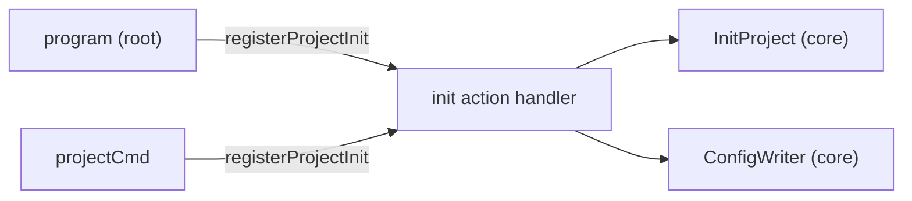

# Design: cli-init-alias

## Non-goals

- Changing or removing the existing `specd project init` command path.
- Adding aliases for other `project` subcommands (`context`, `update`, `dashboard`).
- Modifying any domain or application layer code.

## Affected areas

- `registerProjectInit()` in `packages/cli/src/commands/project/init.ts:40`
  Change: none to the function itself — it already parameterises the parent command.
  Callers: 1 direct (`packages/cli/src/index.ts:172`) · Risk: LOW
  Note: adding a second call site on the root program does not affect the existing one.

- `packages/cli/src/index.ts:167-175`
  Change: add `registerProjectInit(program)` after the project command group registration block (line 175). This registers `init` as a top-level command in addition to the existing `project init` subcommand.
  Impact: `cli:src/index.ts` has 57 direct dependents (CRITICAL risk) but the change is purely additive — no existing imports, registrations, or handlers are modified. The existing test suite (`cli:test/entrypoint.spec.ts`) covers the root program behavior and will need a new test for the `init` alias.

## New constructs

None. The change reuses the existing `registerProjectInit()` function with a different parent command.

## Approach

1. In `packages/cli/src/index.ts`, after line 175 (`registerProjectDashboard(projectCmd)`), add `registerProjectInit(program)`. This registers the `init` subcommand directly on the root Commander program.

2. Commander resolves `specd init` to the action handler registered by `registerProjectInit`, which is the same handler used by `specd project init`. No delegation logic is needed.

3. Both `specd init` and `specd project init` produce identical behavior because they share the same action handler, flags, interactive wizard, and output formatting.

This satisfies:

- **Req: Command signature** (project-init spec) — both forms documented in the signature block.
- **Req: Top-level init alias** (entrypoint spec) — `specd init` available as a top-level command.
- **Req: Excess arguments rejected** (entrypoint spec) — `registerProjectInit` already calls `.allowExcessArguments(false)`, so the top-level `init` inherits this behavior.

## Key decisions

**Decision:** Reuse `registerProjectInit(program)` instead of creating a redirect or separate handler.
**Rationale:** The function is already parameterised by parent command. Adding a second registration is one line, no duplication, no new files.
**Alternatives rejected:**

- Commander `.alias()` — only works within the same hierarchy level, not cross-level (root vs nested).
- `program.parseAsync(['project', 'init'])` redirect — adds overhead and complexity.
- Separate thin handler file — unnecessary duplication.

## Trade-offs

- [Two registrations of the same subcommand name] → Commander handles this without conflict. The `init` command appears in both `specd --help` (top-level) and `specd project --help` (nested). This is intentional — both paths are documented and supported.
- [Help text shows `init` at root level] → May cause users to miss the full `project` command group. Mitigated by the description text that indicates it initializes a specd project, which is self-explanatory.

## Spec impact

### `cli:cli/project-init`

- Direct dependents: `cli:cli/entrypoint` (via `## Spec Dependencies`)
- The delta adds the alias to the "Command signature" requirement and updates examples.
- `cli:cli/entrypoint` is already in the change scope and receives its own delta.

### `cli:cli/entrypoint`

- Direct dependents: `core:core/config`
- The delta adds a "Top-level init alias" requirement. `core:core/config` is unaffected — the init command's config handling does not change.

No ripple effects beyond the two specs in scope.

## Dependency map



```
┌──────────────────┐       ┌───────────────────┐
│ program (root)   │──────▶│ registerProject   │
│ [NEW call site]  │       │ Init()            │
└──────────────────┘       │                   │
┌──────────────────┐       │  ┌─────────────┐  │
│ projectCmd       │──────▶│  │ init action │  │
│ [existing]       │       │  │ handler     │  │
└──────────────────┘       │  └──────┬──────┘  │
                           └─────────┼─────────┘
                                     │
                    ┌────────────────┼────────────────┐
                    ▼                                 ▼
              ┌───────────┐                    ┌──────────────┐
              │InitProject│                    │ConfigWriter  │
              │ (core)    │                    │ (core)       │
              └───────────┘                    └──────────────┘

┌────────────────────┐  depends on  ┌────────────────────┐
│ cli:cli/project    │─ ─ ─ ─ ─ ─ ▶│ cli:cli/entrypoint │
│ -init              │              └────────────────────┘
└────────────────────┘
```

## Testing

### Automated tests

- `packages/cli/test/commands/project-init.spec.ts` — add test cases for `specd init`:
  - `specd init --workspace default --workspace-path specs/` exits 0 and writes `specd.yaml`
  - `specd init --format json` produces valid JSON with expected keys
  - `specd init` with an existing config and no `--force` exits 1
  - `specd init --force` overwrites existing config

- `packages/cli/test/entrypoint.spec.ts` — add test case:
  - `specd --help` includes `init` in the top-level command list

### Manual / E2E verification

1. Run `specd --help` — confirm `init` appears as a top-level command.
2. Run `specd init --workspace default --workspace-path specs/` in a clean directory — confirm it writes `specd.yaml` and exits 0.
3. Run `specd init --format json` — confirm JSON output matches `specd project init --format json`.
4. Run `specd init extra-arg` — confirm it exits 1 with a usage error (excess arguments rejected).
5. Run `specd project init --workspace default --workspace-path specs/` — confirm existing behavior unchanged.

### Documentation updates

- `docs/cli/` reference should be regenerated or manually updated to include `specd init` in the command listing. This is a minor documentation sync, not a structural change.
