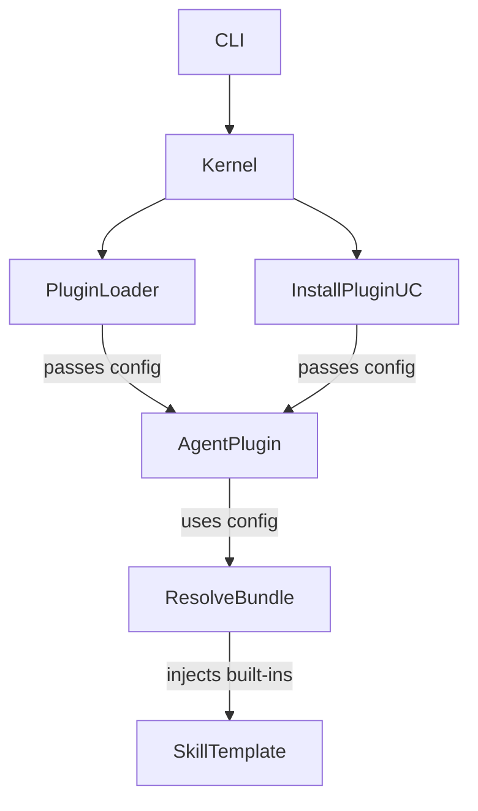

# Design: refactor-agent-plugin-config

## Affected areas

- `PluginContext` in `packages/plugin-manager/src/domain/types/specd-plugin.ts`
  Change: replace `projectRoot`, `config` (Record), and `typeContext` with `readonly config: SpecdConfig`.
  Callers: 12 transitive dependents · Risk: CRITICAL
  Note: This is a breaking change for all plugin `init` methods and affects all plugin-manager use cases.

- `AgentPlugin` in `packages/plugin-manager/src/domain/types/agent-plugin.ts`
  Change: update `install()` and `uninstall()` to accept `SpecdConfig` instead of `projectRoot: string`; rename `InstallOptions` and `InstallResult` to `AgentInstallOptions` and `AgentInstallResult`.
  Callers: 5 direct · Risk: HIGH
  Note: Core contract for all agent plugins and their corresponding installation tests.

- `ListPlugins` and `LoadPlugin` use cases in `packages/plugin-manager/src/application/use-cases/`
  Change: update context construction to pass `SpecdConfig`.
  Risk: MEDIUM

- `InstallPlugin` use case in `packages/plugin-manager/src/application/use-cases/install-plugin.ts`
  Change: update input and behavior to handle `SpecdConfig`.
  Callers: CLI installation command · Risk: MEDIUM

- `ResolveBundle` use case in `packages/skills/src/application/use-cases/resolve-bundle.ts`
  Change: implement built-in variable injection (`{{projectRoot}}`, `{{configPath}}`, `{{schemaRef}}`) when `SpecdConfig` is provided.
  Callers: Plugin installation logic and CLI · Risk: MEDIUM

- `PluginLoader` in `packages/plugin-manager/src/infrastructure/loader/index.ts`
  Change: update factory call to pass `SpecdConfig`.
  Callers: PluginManager/Kernel · Risk: HIGH

- **CLI Wiring** in `packages/cli/src/commands/` (install, list, update, init)
  Change: update call sites to pass the fully-resolved `SpecdConfig` instead of just `projectRoot`.
  Risk: MEDIUM

- All Agent Plugins (`packages/plugin-agent-*`)
  Change: update implementation to use the new `SpecdConfig`-based interfaces.
  Risk: HIGH

## New constructs

- `PluginLoaderOptions` in `packages/plugin-manager/src/infrastructure/loader/index.ts`
  Shape: `interface PluginLoaderOptions { readonly config: SpecdConfig }`
  Responsibility: Provide necessary context to the plugin factory during instantiation.

## Approach

1. **Domain Update**: Refactor `SpecdPlugin` and `AgentPlugin` interfaces in `plugin-manager`. Rename agent-specific types.
2. **Infrastructure Update**: Update `PluginLoader` to accept and propagate `SpecdConfig`.
3. **Application Update**:
   - Update plugin-manager use cases (`install`, `uninstall`, `update`, `list`, `load`).
   - Update `ResolveBundle` in `skills` to handle built-in variables.
4. **Plugin Implementation**: Systematically update all agent plugins to match the new contracts.
5. **Kernel/CLI Integration**: Update the CLI commands and the Kernel to propagate the fully-resolved `SpecdConfig`.

## Key decisions

- **Decision** → Use `SpecdConfig` as the single source of truth for plugin context.
- **Decision** → Automatically inject `{{projectRoot}}`, `{{configPath}}`, and `{{schemaRef}}` in all skills.
- **Decision** → Remove `typeContext` entirely as it is currently unused and redundant with `SpecdConfig`.

## Dependency map

## Testing

**Automated tests**:

- `packages/plugin-manager/test/domain/types/agent-plugin.spec.ts`: update type guard tests.
- `packages/plugin-manager/test/application/use-cases/install-plugin.spec.ts`: verify `SpecdConfig` propagation.
- `packages/skills/test/application/use-cases/resolve-bundle.spec.ts`: add tests for automatic variable injection.
- Integration tests for each agent plugin to ensure they correctly use the new configuration object.
- CLI command tests (`packages/cli/test/commands/plugins.spec.ts`) to verify config propagation.

**Manual / E2E verification**:

- Run `specd project init` and select an agent plugin to verify installation.
- Run a change workflow (e.g., `specd change new`) to verify that installed skills correctly resolve built-in variables.
