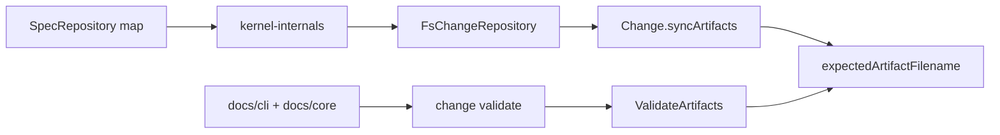

# Design: enforce-artifact-path-validation

## Non-goals

- Do not change delta syntax or archive merge semantics.
- Do not make the CLI infer artifact paths. Path selection remains a core responsibility.
- Do not accept both `specs/...` and `deltas/...` for the same spec-scoped artifact.

## Affected areas

- `Change.syncArtifacts()` in `packages/core/src/domain/entities/change.ts`
  Change: accept precomputed spec-existence data and update stale spec-scoped filenames to the expected path while preserving file key, state, and `validatedHash`.
  Impact: central manifest artifact map path; graph impact is CRITICAL because `Change` is used across status, transition, approval, archive, validation, and CLI flows. Keep the method pure and backward-compatible for callers without existence data.

- New pure filename resolver in `packages/core/src/domain/services/artifact-filename.ts`
  Change: centralize expected artifact filename computation for change-scoped artifacts, new spec files, and existing delta-capable specs.
  Impact: used by `Change.syncArtifacts()` and `ValidateArtifacts`; no I/O and no infrastructure imports.

- `FsChangeRepository` in `packages/core/src/infrastructure/fs/change-repository.ts`
  Change: pass spec-existence data into artifact sync during `save()` and `_manifestToChange()`, remove fallback discovery that treats a missing direct file as permission to validate a delta, and normalize stale manifest filenames to the expected path.
  Impact: high coupling storage adapter. Must preserve atomic manifest writes, serialized `mutate()`, and legacy load behavior.

- `createChangeRepository()` and kernel storage wiring in `packages/core/src/composition/change-repository.ts` and `packages/core/src/composition/kernel-internals.ts`
  Change: add optional `resolveSpecExists(specId): Promise<boolean>` to the fs change storage options and wire it from the existing per-workspace `SpecRepository` map in kernel composition.
  Impact: composition-only dependency on spec repositories; no application layer imports infrastructure.

- `ValidateArtifacts` in `packages/core/src/application/use-cases/validate-artifacts.ts`
  Change: compute the expected filename for the requested spec/artifact before reading disk, validate only that file, fail when it is missing, and return structured `files` metadata. Missing-file failures include `filename`.
  Impact: public use-case result type changes. Keep `failures` and `warnings` intact for existing callers.

- `change validate` in `packages/cli/src/commands/change/validate.ts`
  Change: render `file:` and `missing:` lines from `ValidateArtifactsResult.files`, include the `spec-preview` note in text output, and include `files` in JSON/TOON output for single and batch modes.
  Impact: CLI output contract changes; batch mode must aggregate the same file metadata per spec.

- Tests under `packages/core/test/domain/entities/change.spec.ts`, `packages/core/test/infrastructure/fs/change-repository.spec.ts`, `packages/core/test/application/use-cases/validate-artifacts.spec.ts`, and `packages/cli/test/commands/change-validate.spec.ts`
  Change: add focused coverage for expected paths, stale manifest normalization, missing expected delta failures, and CLI rendering.

- Documentation in `docs/cli/cli-reference.md` and `docs/core/use-cases.md`
  Change: update the documented `change validate` output contract and `ValidateArtifactsResult` shape because both are public behavior.

Graph impact: `specd graph impact --changes` reports 124 changed symbols across 6 planned files, 400 potentially affected symbols in 105 files, risk `CRITICAL`. Implementation must avoid broad signature breaks and add regression tests at domain, infrastructure, application, and CLI layers.

## New constructs

- `packages/core/src/domain/services/artifact-filename.ts`

  ```typescript
  export interface ExpectedArtifactFilenameInput {
    readonly artifactType: ArtifactType
    readonly key: string
    readonly specExists?: boolean
  }

  export function expectedArtifactFilename(input: ExpectedArtifactFilenameInput): string
  ```

  Responsibility: return the single change-directory filename for one artifact file. For `scope: "change"`, return `path.basename(artifactType.output)`. For `scope: "spec"`, parse `key` as a spec ID and return `deltas/<workspace>/<capability-path>/<output-basename>.delta.yaml` only when `artifactType.delta === true` and `specExists === true`; otherwise return `specs/<workspace>/<capability-path>/<output-basename>`.

- `ValidationFileResult` in `packages/core/src/application/use-cases/validate-artifacts.ts`

  ```typescript
  export type ValidationFileStatus = 'validated' | 'missing' | 'skipped'

  export interface ValidationFileResult {
    readonly artifactId: string
    readonly key: string
    readonly filename: string
    readonly status: ValidationFileStatus
  }
  ```

  Responsibility: describe the exact file path considered by validation so adapters can report it without recomputing paths.

- Extended validation result shape:

  ```typescript
  export interface ValidateArtifactsResult {
    readonly passed: boolean
    readonly failures: ValidationFailure[]
    readonly warnings: ValidationWarning[]
    readonly files: ValidationFileResult[]
  }

  export interface ValidationFailure {
    readonly artifactId: string
    readonly description: string
    readonly filename?: string
  }
  ```

- Optional fs change repository resolver:

  ```typescript
  export interface FsChangeRepositoryConfig extends ChangeRepositoryConfig {
    readonly resolveSpecExists?: (specId: string) => Promise<boolean>
  }
  ```

  Responsibility: let infrastructure compute spec-existence data before calling the pure domain sync method.

## Approach

1. Implement `expectedArtifactFilename()` as the only path formatter for artifact filenames. It covers `core:core/change-layout` requirements for one expected path and keeps the domain layer pure.

2. Extend `Change.syncArtifacts(artifactTypes, specExistence?)` so new spec-scoped files use `expectedArtifactFilename()`. If an existing file entry's filename differs from the expected filename and existence data is available, replace only the filename while preserving state and hash. This satisfies `core:core/change-manifest` for both new manifests and legacy stale manifests.

3. Wire `resolveSpecExists` into the fs change storage factory in kernel composition. `FsChangeRepository.save()` and `_manifestToChange()` build a `Map<string, boolean>` for the current `change.specIds` before syncing artifacts. Standalone composition that lacks spec repositories may keep the old default, but kernel-backed CLI paths get correct manifests before commands return.

4. In `ValidateArtifacts.execute()`, compute `expectedFilename` for each candidate file using the requested spec's existence and artifact definition. Use this expected filename for reading artifacts, delta parsing, hash computation, missing-file checks, and `files` result entries. Do not derive a delta path by probing an alternate location after a direct file is missing.

5. For existing delta-capable specs, load only the expected delta file and apply it to the base artifact from `SpecRepository`. For new specs, load only the expected direct file under `specs/...`. This satisfies `core:core/validate-artifacts` and prevents the direct-file false positive described by the user.

6. Update `change validate` output to render:
   - success: `file: <filename>` for validated/skipped files and the `specd change spec-preview <name> <specId>` note
   - failure: `missing: <filename>` for missing expected files, error/warning lines, and the same preview note
   - structured formats: include `files` unchanged from core

7. Update docs where public contracts changed: `docs/cli/cli-reference.md` for CLI output, and `docs/core/use-cases.md` for `ValidateArtifactsResult.files` and `ValidationFailure.filename`.

## Key decisions

**Decision** -> centralize path selection in a pure domain service. **Alternatives rejected** -> duplicating path construction in repository, validator, and CLI would recreate the current drift; putting spec lookup inside the domain entity would violate the no-I/O domain rule.

**Decision** -> pass spec-existence facts into `Change.syncArtifacts()` instead of passing repositories. **Alternatives rejected** -> injecting `SpecRepository` into the domain entity violates architecture; making the CLI repair manifests would leave non-CLI callers wrong.

**Decision** -> add structured `files` metadata to `ValidateArtifactsResult`. **Alternatives rejected** -> parsing failure descriptions in the CLI is brittle and would not support successful validated path reporting.

## Trade-offs

- [Risk] The `Change` entity and fs repository are CRITICAL hotspots. -> Mitigation: keep existing public shapes additive where possible, preserve old behavior when `resolveSpecExists` is absent, and add tests around current lifecycle/state behavior.
- [Risk] Legacy stale manifests may have a direct file and no delta file. -> Mitigation: normalize manifest filename to the expected delta path while preserving state/hash semantics; validation then fails clearly if that expected file is missing.
- [Risk] Output changes can break scripts that parse text output. -> Mitigation: append path/note lines without changing the first success/failure line, and expose structured `files` for robust consumers.

## Spec impact

### `core:core/change-layout`

- Direct dependents found in specs: `core:core/preview-spec`.
- Assessment: preview already depends on layout for locating deltas and new spec files. The new expected-path rule aligns with preview behavior and does not require a preview-spec delta.

### `core:core/change-manifest`

- Direct dependents found in specs: `core:core/change-layout`, `core:core/change`, `core:core/spec-id-format`, `core:core/storage`, `core:core/change-repository-port`, `cli:cli/change-deps`.
- Assessment: persisted `filename` semantics are narrowed, not renamed. Existing lifecycle, event sourcing, spec ID, and storage requirements remain valid. No additional spec deltas are needed.

### `core:core/validate-artifacts`

- Direct dependents found in specs: `core:core/kernel`, `core:core/validate-specs`, `core:core/archive-change`.
- Assessment: validate result shape is additive and validation behavior is stricter for missing expected deltas. Archive already relies on validation as a gate and does not need a requirement change. Kernel mapping remains `changes.validate -> ValidateArtifacts`.

### `cli:cli/change-validate`

- No spec dependents found by repository search beyond the changed spec itself.
- Assessment: CLI behavior changes are fully contained in this spec and its docs.

## Dependency map



```
┌────────────────────┐       ┌────────────────────┐
│ SpecRepository map │──────▶│ kernel-internals   │
└────────────────────┘       └──────────┬─────────┘
                                        │ resolveSpecExists
                                        ▼
┌────────────────────┐       ┌────────────────────┐
│ FsChangeRepository │──────▶│ Change.syncArtifacts│
└──────────┬─────────┘       └──────────┬─────────┘
           │                            │
           │                            ▼
           │                 ┌────────────────────┐
           └────────────────▶│ expected filename  │
                             └──────────┬─────────┘
                                        │
┌────────────────────┐       ┌──────────▼─────────┐
│ change validate CLI│◀──────│ ValidateArtifacts  │
└──────────┬─────────┘       └────────────────────┘
           │
           ▼
┌────────────────────┐
│ docs/cli + core    │
└────────────────────┘
```

## Migration / Rollback

Existing manifests with stale `specs/...` filenames are normalized on load/save when spec existence can be resolved. Rollback is code-only: revert the resolver usage and `files` output additions. No permanent spec files are migrated; archive continues to consume `specs/...` for new artifacts and `deltas/...` for existing artifacts.

## Testing

Automated tests:

- `packages/core/test/domain/entities/change.spec.ts`
  Cover `Change.syncArtifacts()` creating `deltas/.../*.delta.yaml` for existing delta-capable specs, `specs/...` for new specs, preserving state/hash on filename normalization, and not treating paths as interchangeable.

- `packages/core/test/infrastructure/fs/change-repository.spec.ts`
  Cover create/load persistence with `resolveSpecExists`, legacy stale filename normalization, and scaffold directory creation matching the manifest path.

- `packages/core/test/application/use-cases/validate-artifacts.spec.ts`
  Cover missing expected delta failure even when a direct file exists, successful existing delta validation, successful new direct-file validation, `ValidationFailure.filename`, and `ValidateArtifactsResult.files` statuses.

- `packages/cli/test/commands/change-validate.spec.ts`
  Cover text success `file:` lines plus `spec-preview` note, text failure `missing:` line plus note, JSON success/failure including `files`, and batch output preserving per-spec file metadata.

- Documentation checks are manual unless the repo has a docs test for generated CLI reference.

Manual / E2E verification:

1. Create a change for an existing spec with `specs` artifact and inspect `.specd/changes/<id>/manifest.json`; the `specs` file entry must be `deltas/<workspace>/<capability-path>/spec.md.delta.yaml`.
2. Place only `specs/<workspace>/<capability-path>/spec.md` for that existing spec and run `node packages/cli/dist/index.js change validate <name> <specId> --artifact specs`; output must report `missing: deltas/.../spec.md.delta.yaml`.
3. Add the expected delta and rerun validation; output must report `file: deltas/.../spec.md.delta.yaml` and include the `spec-preview` note.
4. Run `node packages/cli/dist/index.js change validate <name> <specId> --artifact specs --format json`; output must include `files`.
5. Run `pnpm --filter @specd/core test`, `pnpm --filter @specd/cli test`, and the repository lint/typecheck commands used by CI.
