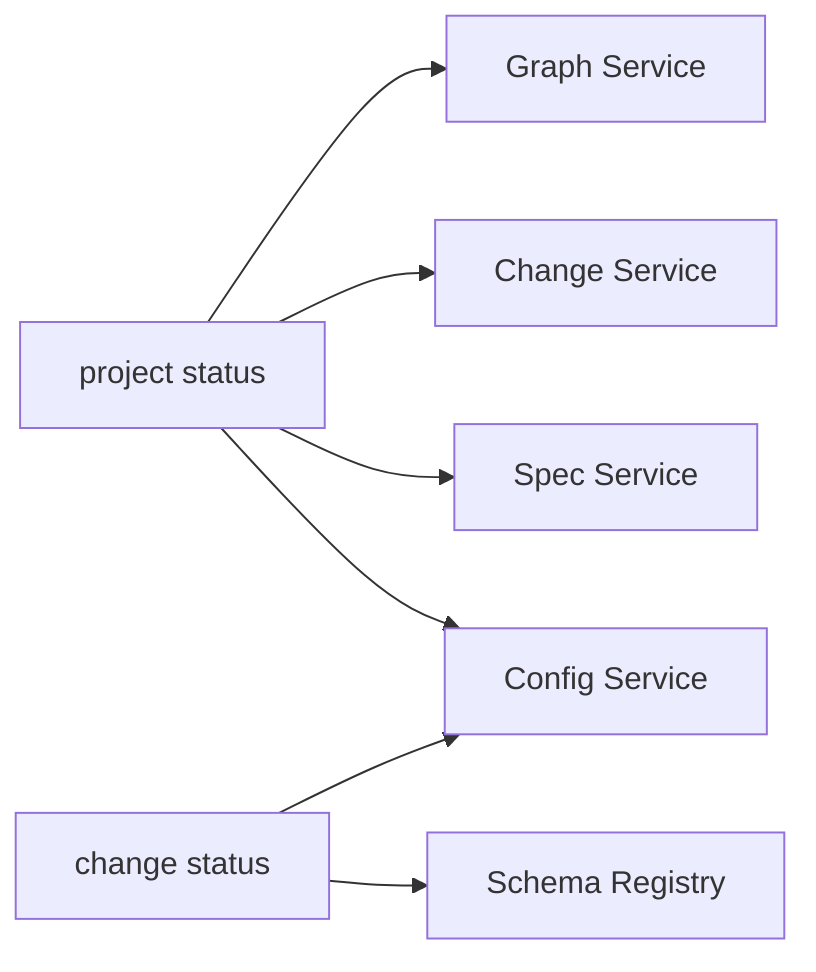

# Design: project-status-command

## Non-goals

- Replace `project dashboard` command — they are separate commands
- Auto-index graph — caller decides whether to index

## Affected areas

### New command implementation

- `packages/cli/src/commands/project/` — new `status.ts` file for the `project status` command
- `packages/cli/src/commands/project/index.ts` — register the new subcommand
- `packages/cli/src/commands/project/dashboard.ts` — may need to refactor to share code with status command

### Change status enhancement

- `packages/cli/src/commands/change/status.ts` — add `schema.artifactDag` and `approvalGates` to JSON output
- May need to call schema registry to get artifact DAG info

### Graph integration

- `packages/cli/src/commands/project/status.ts` — integrate with existing graph stats command
- May need to refactor graph stats to be importable/reusable

## New constructs

### `project status` command

- **Location**: `packages/cli/src/commands/project/status.ts`
- **Shape**:
  ```typescript
  export const projectStatusCommand = {
    name: 'status',
    description: 'Display consolidated project status',
    options: [
      { name: '--context', description: 'Include project context references' },
      { name: '--graph', description: 'Include extended graph stats' },
      { name: '--format', description: 'Output format: text|json|toon', default: 'text' },
    ],
    execute: async (ctx, options) => {
      // Gather all data and output
    },
  }
  ```
- **Responsibility**: Consolidate project state (workspaces, specs, changes, graph, context) into single output
- **Relationships**: Uses existing CLI infrastructure, graph service

### Schema-derived fields in change status

- **Location**: `packages/cli/src/commands/change/status.ts`
- **Shape**:
  ```typescript
  // Add to GetStatusResult serialization:
  schema: {
    name: string,
    version: number,
    artifactDag: Array<{
      id: string,
      scope: 'change' | 'spec',
      optional: boolean,
      requires: string[],
      hasTaskCompletionCheck: boolean,
      output: string
    }>
  }
  ```
- **Responsibility**: Include schema-derived data in change status JSON output
- **Relationships**: Requires access to schema registry

### Approval gates in change status

- **Location**: `packages/cli/src/commands/change/status.ts`
- **Shape**:
  ```typescript
  // Add to output:
  approvalGates: {
    specEnabled: boolean,
    signoffEnabled: boolean
  }
  ```
- **Responsibility**: Report which approval gates are enabled
- **Relationships**: Reads from project config

## Approach

### Phase 1: Implement `project status` command

1. Create `packages/cli/src/commands/project/status.ts`
2. Gather data from:
   - Config service (workspaces, ownership)
   - Spec service (spec counts)
   - Change service (active, drafts, discarded)
   - Graph service (freshness, stats if --graph)
   - Context service (references if --context)
3. Output in requested format (text/json/toon)

### Phase 2: Enhance `change status`

1. Modify status serialization to include:
   - Schema artifact DAG (from schema registry)
   - Approval gates (from config)
2. Add tests for new fields

### Phase 3: Update skills (outside this change)

- Update skill templates to use new commands
- This will be documented but implemented separately

## Key decisions

**Decision** → Consolidate project status into new command vs extend dashboard

- **Rationale**: Dashboard has different purpose (summary view), status is for programmatic consumption
- **Alternatives rejected**: Extend dashboard — would confuse the two use cases

**Decision** → Include graph freshness always, stats behind flag

- **Rationale**: Graph staleness is critical for skills to know whether to re-index
- **Alternatives rejected**: All behind flags — would require skills to always pass flags

## Spec impact

This change modifies `cli:cli/change-status` spec:

- Existing scenarios in verify.md remain valid
- New requirements for schema-derived fields and approval gates are additive

No other specs are affected.

## Dependency map



```
┌─────────────────┐     ┌────────────────┐
│project status   │────▶│ Config Service │
└─────────────────┘     └────────────────┘
         │                      │
         ▼                      ▼
┌─────────────────┐     ┌────────────────┐
│ Spec Service    │     │Change Service  │
└─────────────────┘     └────────────────┘
         │
         ▼
┌─────────────────┐
│ Graph Service   │
└─────────────────┘
```

```
┌─────────────────┐     ┌────────────────┐
│change status    │────▶│ Schema Registry│
└─────────────────┘     └────────────────┘
         │
         ▼
┌─────────────────┐
│ Config Service  │
└─────────────────┘
```

## Testing

### Automated tests

- `packages/cli/test/commands/project/status.spec.ts`:
  - Test text output format
  - Test JSON output includes all required fields
  - Test --graph flag includes extended stats
  - Test --context flag includes references
- `packages/cli/test/commands/change/status.spec.ts`:
  - Test JSON output includes schema.artifactDag
  - Test JSON output includes approvalGates

### Manual / E2E verification

1. Run `specd project status` — verify text output
2. Run `specd project status --format json` — verify JSON structure
3. Run `specd project status --graph` — verify extended stats
4. Run `specd project status --context` — verify context references
5. Run `specd change status <name> --format json` — verify new fields

## Open questions

- Should `project status` auto-index graph if stale? (No — caller decides)
- Should we deprecate `project dashboard` eventually? (Future decision)
