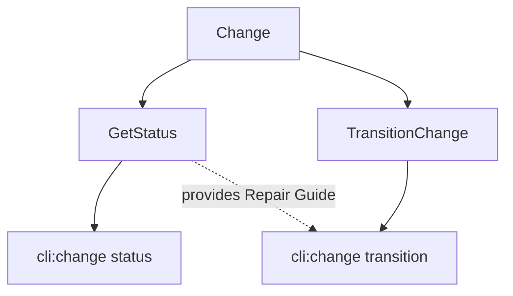

# Design: improve-specd-diagnostics-and-ux

## Affected areas

- `Change` entity in `packages/core/src/domain/entities/change.ts`
  - Change: Add `pending-parent-artifact-review` state to `ChangeArtifact` and `ArtifactFile`. Update `effectiveStatus` logic to propagate parent review status recursively.
  - Callers: Core domain logic, repositories, and all use cases reading change state. Risk: HIGH.
- `GetStatus` use case in `packages/core/src/application/use-cases/get-status.ts`
  - Change: Add `blockers` identification and `nextAction` recommendation logic. Extend `GetStatusResult` and `ReviewSummary` interfaces.
  - Callers: CLI, MCP, and other delivery mechanisms. Risk: MEDIUM.
- `TransitionChange` use case in `packages/core/src/application/use-cases/transition-change.ts`
  - Change: Enhance `InvalidStateTransitionError` with structured reason including `status` and `blockedBy` for recursive parent review blocks.
  - Callers: CLI `change transition` command. Risk: MEDIUM.
- `ValidateArtifacts` use case in `packages/core/src/application/use-cases/validate-artifacts.ts`
  - Change: Ensure `complete` status clears recursive blocks.
- `change status` CLI command in `packages/cli/src/commands/change/status.ts`
  - Change: Render Artifact DAG (ASCII tree), Blockers section, and Next Action recommendation in text mode. Add new fields to JSON/Toon output.
- `change transition` CLI command in `packages/cli/src/commands/change/transition.ts`
  - Change: Render Repair Guide on failure using `nextAction` data. Surface detailed approval-gate reasons.
- `change validate` CLI command in `packages/cli/src/commands/change/validate.ts`
  - Change: Rename `warning` labels to `note` in text and JSON outputs.

## New constructs

- **Interface: `NextAction`** in `packages/core/src/application/use-cases/get-status.ts`:
  ```typescript
  export interface NextAction {
    targetStep: ChangeState
    actionType: 'cognitive' | 'mechanical'
    reason: string
    command: string | null
  }
  ```
- **Interface: `TransitionBlocker`** (Extended) in `packages/core/src/application/use-cases/get-status.ts`:
  ```typescript
  export interface TransitionBlocker {
    code: string
    message: string
  }
  ```

## Approach

1. **Core Domain**: Update `Change` entity to support the new `pending-parent-artifact-review` state and recursive `effectiveStatus` propagation. This ensures the "truth" of artifact availability is consistent across all use cases.
2. **Use Cases**:
   - Update `GetStatus` to derive blockers (drift, missing, review required) and recommend the logical next action based on the state machine.
   - Update `TransitionChange` to propagate detailed error contexts (which artifact is blocking and why).
3. **CLI Rendering**:
   - Implement the Artifact DAG tree rendering in `change status`.
   - Implement the "Repair Guide" logic in `change transition` that calls `GetStatus` on failure to provide actionable instructions.
   - Global search-and-replace for "warning" -> "note" in validation serializers.

## Key decisions

- **Decision** → Propagate parent review status recursively via `effectiveStatus`. Rationale: Prevents agents from attempting to fix a child artifact when the root cause is an upstream redesign.
- **Decision** → Use `GetStatus` as the source of truth for the Repair Guide in `change transition`. Rationale: Avoids duplicating the recommendation engine logic in multiple commands.

## Trade-offs

- [Risk] → ASCII tree rendering complexity in CLI. Mitigation: Use a standard tree-traversal algorithm and a simple visual legend.
- [Risk] → `effectiveStatus` recursion performance. Mitigation: Artifact DAGs are typically small (< 20 nodes), so O(N) traversal is negligible.

## Dependency map



```
┌──────────┐      ┌───────────┐      ┌───────────────┐
│  Change  │◀─────┤ GetStatus │◀─────┤ cli:status    │
│  Entity  │      └───────────┘      └───────────────┘
└────┬─────┘            ▲
     │                  │
     ▼           ┌──────────────┐    ┌───────────────┐
┌────────────┐   │ Transition   │◀───┤ cli:transition│
│  Validate  │◀──┤ Change       │    └───────────────┘
│  Artifacts │   └──────────────┘
└────────────┘
```

## Testing

**Automated tests**:

- `packages/core/test/domain/entities/change.spec.ts`: Verify `effectiveStatus` recursive propagation.
- `packages/core/test/application/use-cases/get-status.spec.ts`: Verify `blockers` and `nextAction` derivation.
- `packages/core/test/application/use-cases/transition-change.spec.ts`: Verify structured error reasons for recursive blocks.
- `packages/cli/test/commands/change-status.spec.ts`: Verify text-mode DAG and Blockers rendering.
- `packages/cli/test/commands/change-validate.spec.ts`: Verify "note" labeling instead of "warning".

**Manual / E2E verification**:

1. Create a change with multiple specs.
2. Force a redesign from `implementing` back to `designing`.
3. Run `specd change status` and verify the DAG shows `[~]` for children of `pending-review` parents.
4. Run `specd change transition ready` and verify the Repair Guide shows `! REVIEW_REQUIRED`.
