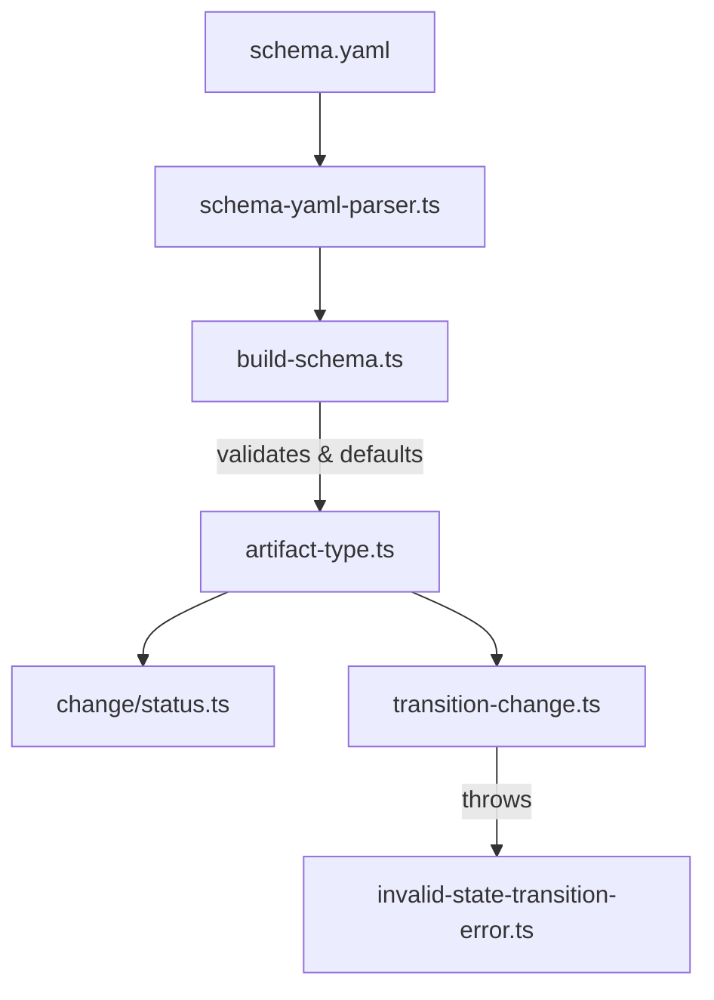

# Design: schema-artifact-hastasks

## Non-goals

- This design does not change how tasks are discovered or tracked within the file content.
- No change to the underlying regex matching logic in `TransitionChange` (except for default patterns).

## Affected areas

- `ArtifactYaml` in `packages/core/src/infrastructure/schema-yaml-parser.ts`
  Change: Add optional `hasTasks: z.boolean().optional()` to the Zod schema `artifactYamlSchema`.
  Risk: LOW.
- `ArtifactType` in `packages/core/src/domain/value-objects/artifact-type.ts`
  Change: Add `hasTasks: boolean` to `ArtifactTypeProps` and as a readonly property in the `ArtifactType` class. Update constructor.
  Impact: Central domain model.
- `buildSchema` in `packages/core/src/domain/services/build-schema.ts`
  Changes:
  1. Pass the `hasTasks` value from raw YAML data to the `ArtifactType` constructor in `buildArtifactType`.
  2. Implement semantic validation: Iterate through `workflow` steps and their `requiresTaskCompletion` arrays. For each artifact ID, verify that the corresponding `ArtifactType` has `hasTasks: true`. Throw `SchemaValidationError` (inherits from `SpecdError`) if violated.
  3. **Default Patterns**: If `hasTasks: true` but `taskCompletionCheck` is missing patterns in the YAML, populate `ArtifactType` with standard markdown checkbox patterns.
- `TransitionFailureReason` in `packages/core/src/domain/errors/invalid-state-transition-error.ts`
  Change: Add `{ type: 'missing-task-capability', artifactId: string }` to the union. Update `buildMessage` to handle it.
- `TransitionChange` in `packages/core/src/application/use-cases/transition-change.ts`
  Changes:
  1. Update `execute()` loop for `requiresTaskCompletion`.
  2. **Runtime Invariant Check**: If an artifact ID is in `requiresTaskCompletion` but its `ArtifactType` has `hasTasks: false`, throw `InvalidStateTransitionError` with reason `missing-task-capability`.
  3. Use `artifactType.hasTasks` as the master switch to run `_checkTaskCompletionForArtifact`.
- `renderDag` in `packages/cli/src/commands/change/status.ts`
  Change: Refactor the DAG rendering to use `artifactType.hasTasks` and display the ` [hasTasks]` tag.
- `packages/schema-std/schema.yaml`
  Change: Add `hasTasks: true` to the `tasks` artifact definition.

## New constructs

No new files or classes. The change adds properties, validation logic, and error types to existing constructs.

## Approach

1. **Infrastructure Update**: Modify the Zod schema in `core`.
2. **Domain Update**: Update `ArtifactType` and add default patterns logic. Update `InvalidStateTransitionError` reasons.
3. **Validation Update**: Implement the semantic check in `buildSchema` (early fail).
4. **Application Update**: Implement task gating and defensive runtime checks in `TransitionChange`.
5. **CLI Update**: Update the status command to display the new tag in the DAG.
6. **Schema Update**: Update `@specd/schema-std`.

## Key decisions

- **Decision** → `hasTasks` is the master switch.
  Rationale: Clear intent and prevents accidental gating.
- **Decision** → Defaults to `false`.
- **Decision** → Double validation (Defensive Programming).
  Rationale: Check invariant both at schema load (config error) and at runtime (system invariant).
- **Decision** → Use `InvalidStateTransitionError` for capability check.
  Rationale: It's a transition block due to invalid configuration/state mismatch, fits the existing error model perfectly.

## Spec impact

### `core:core/schema-format`

- Ripple: any tool reading the schema YAML needs updated Zod definitions.

### `core:core/transition-change`

- Ripple: callers handling transition errors should be aware of the new `missing-task-capability` reason.

### `cli:cli/change-status`

- Ripple: UI change in the status output.

## Dependency map

## Testing

**Automated tests**:

- `packages/core/test/infrastructure/schema-yaml-parser.spec.ts`: Verify `hasTasks` is correctly parsed.
- `packages/core/test/domain/services/build-schema.spec.ts`:
  - Verify `ArtifactType` gets default patterns when `hasTasks: true`.
  - Verify `buildSchema` throws `SchemaValidationError` when `requiresTaskCompletion` references an artifact with `hasTasks: false`.
- `packages/core/test/application/use-cases/transition-change.spec.ts`:
  - Verify transitions are gated correctly based on the new `hasTasks` flag.
  - Verify `InvalidStateTransitionError` with `missing-task-capability` is thrown if `hasTasks` is false but artifact is in `requiresTaskCompletion`.
- `packages/cli/test/commands/change-status.spec.ts`: Verify the `[hasTasks]` tag appears in the DAG and JSON output.

**Manual / E2E verification**:

1. Create a change with an artifact having `hasTasks: true`.
2. Confirm `[hasTasks]` tag is visible.
3. Verify task gating works using standard markdown checkboxes even with no `taskCompletionCheck` block.
4. Verify schema error when `requiresTaskCompletion` points to an artifact with `hasTasks: false`.
