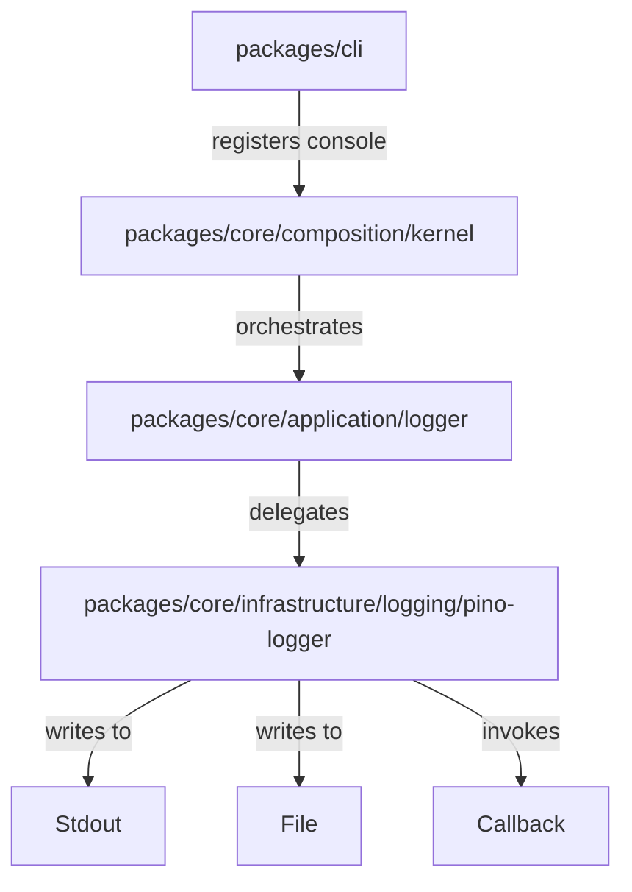

# Design: 20260428-unified-logging-system

## Non-goals

- Immediate migration of all `console.log` calls in the project (this will be done incrementally).
- Implementation of complex remote transports (S3, Datadog, etc.) in this phase.

## Affected areas

- **`createKernel()`** in `packages/core/src/composition/kernel.ts`
  - Change: Add logic to initialize the static `Logger` proxy at the beginning of the function. Support `additionalDestinations` in `KernelOptions`.
  - Impact: CRITICAL. This is the composition root for all delivery mechanisms.
- **`SpecdConfig`** in `packages/core/src/application/specd-config.ts`
  - Change: Add an optional `logging` section to the root of the configuration interface.
  - Impact: CRITICAL. Affects configuration loading and all downstream consumers of the config object.
- **`FsConfigLoader`** in `packages/core/src/infrastructure/fs/config-loader.ts`
  - Change: Update the Zod validation schema to support the new `logging` section and its defaults.
- **`createCliKernel()`** in `packages/cli/src/kernel.ts`
  - Change: Resolve console verbosity from flags and pass a `LogDestination` for the console to the Kernel.

## New constructs

### 1. Interfaces and Data Structures (Core Port)

**Location**: `packages/core/src/application/ports/logger.port.ts`

```typescript
export type LogLevel = 'trace' | 'debug' | 'info' | 'warn' | 'error' | 'fatal' | 'silent'
export type LogFormat = 'json' | 'pretty'

export interface LogEntry {
  readonly timestamp: Date
  readonly level: LogLevel
  readonly message: string
  readonly context: Record<string, unknown>
  readonly error?: Error
}

export interface LogDestination {
  readonly target: 'console' | 'file' | 'callback'
  readonly level: LogLevel
  readonly format: LogFormat
  readonly path?: string // Required if target === 'file'
  readonly onLog?: (entry: LogEntry) => void // Required if target === 'callback'
}

export interface LoggerPort {
  log(message: string, context?: object): void
  info(message: string, context?: object): void
  debug(message: string, context?: object): void
  warn(message: string, context?: object): void
  error(message: string, context?: object, error?: Error): void
  fatal(message: string, context?: object, error?: Error): void
  trace(message: string, context?: object): void
  child(context: object): LoggerPort
}
```

### 2. Ambient Proxy (Core Application)

**Location**: `packages/core/src/application/logger.ts`

- Provides the static `Logger` object that implements `LoggerPort`.
- Defaults to a "Null Object" implementation that is silent during unit tests.

### 3. Pino Adapter (Core Infrastructure)

**Location**: `packages/core/src/infrastructure/logging/pino-logger.ts`

- Implements `LoggerPort` by wrapping a `pino` instance.
- Uses `pino.multistream` to dispatch logs to multiple `LogDestination` entries.
- Maps internal Pino events to the formal `LogEntry` structure for `callback` targets.
- Exports a `createDefaultLogger(destinations: LogDestination[]): LoggerPort` factory.

## Approach

1.  **Contract Definition**: Define the hierarchical specs and the formal `LogEntry` / `LogDestination` interfaces in the core.
2.  **Infrastructure Implementation**: Build the `PinoLogger` adapter. It will handle the complexity of Node.js streams and formatting (using `pino-pretty` for console output).
3.  **Kernel Orchestration**:
    - The Kernel reads `specd.yaml` to identify the project-wide file log requirements.
    - It resolves the absolute log path using `configPath`.
    - It combines the file destination with any `additionalDestinations` passed via `KernelOptions`.
    - It initializes the static `Logger` proxy before any other component is created.
4.  **CLI Integration**: The CLI determines if it needs a console output (standard execution) or a callback (potential dashboard UI), maps its verbosity flags to levels, and hands the destination over to the Kernel.

## Key decisions

- **Decision** → Use a Static Proxy instead of manual constructor injection.
- **Rationale** → Logging is a ubiquitous cross-cutting concern. Injecting it into dozens of classes would create significant noise without improving business logic. The hexagonal boundary is maintained by keeping the Core dependent only on its own `LoggerPort` interface.
- **Alternatives rejected** → Pure Dependency Injection (too much boilerplate) and Domain Events (too complex for simple diagnostic logging).

## Trade-offs

- **[Risk]** → Global state coupling through the `Logger` object.
- **Mitigation** → The proxy is owned by the Core's application layer and its implementation is set exclusively by the composition root (Kernel), making it easy to mock or silence in tests.

## Dependency map



```
┌──────────────┐       ┌──────────────┐
│     CLI      │──────▶│    Kernel    │
└──────────────┘       └──────┬───────┘
                              │ initializes
                              ▼
                       ┌──────────────┐
                       │ LoggerProxy  │
                       └──────┬───────┘
                              │ delegates
                              ▼
                       ┌──────────────┐
                       │ PinoAdapter  │
                       └──────┬───────┘
            ┌─────────────────┼─────────────────┐
            ▼                 ▼                 ▼
      ┌───────────┐     ┌───────────┐     ┌───────────┐
      │  Stdout   │     │   File    │     │ Callback  │
      └───────────┘     └───────────┘     └───────────┘
```

## Testing

### Automated tests

- **`logger-port.spec.ts`**: Verify proxy delegation and that the default implementation does not throw.
- **`pino-logger.spec.ts`**: Verify that destinations receive the correct levels and formats using stream mocks. Verify `LogEntry` mapping for callbacks.
- **`kernel-logging.spec.ts`**: Verify the Kernel correctly merges `SpecdConfig` (file) and `KernelOptions` (additional) destinations.
- **`config-loader.spec.ts`**: Test Zod validation for the new `logging` root section in `specd.yaml`.

### Manual / E2E verification

1. Run `specd status` (no flags) -> Verify `.specd/log/specd.log` is created with `info` level JSON entries.
2. Run `specd -vv status` -> Verify console shows `trace` logs while the file remains at `info`.
3. Remove `logging` from `specd.yaml` -> Verify system falls back to default `info` file logging.

## Open Questions

- Should the log file be rotated automatically? (Out of scope for this initial change).
