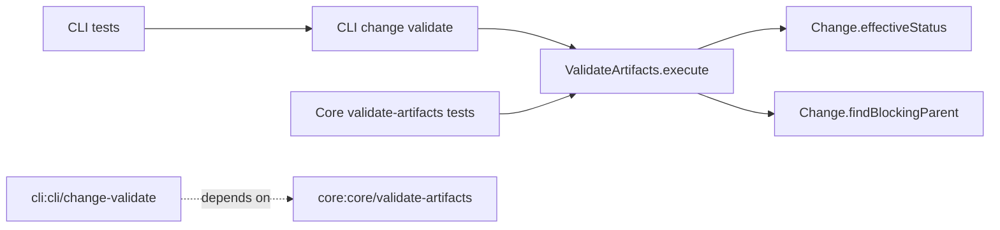

# Design: change-validate-blocker-diagnostics

## Non-goals

- Redesigning lifecycle transition semantics.
- Changing artifact status computation in `Change.effectiveStatus()`.
- Introducing new CLI flags or output fields for `change validate`.

## Affected areas

- `packages/core/src/application/use-cases/validate-artifacts.ts`
  Change: replace generic dependency-block failure text with status-aware review-oriented diagnostics.
  Symbols: `ValidateArtifacts.execute()` and dependency-block branch in per-artifact validation loop.
  Impact: primary behavior change source for `change validate` failures.

- `packages/cli/src/commands/change/validate.ts`
  Change: keep passthrough rendering semantics for core failure descriptions; adjust only if needed to preserve enriched messages exactly.
  Symbols: `executeSingle()`, `executeBatch()`, and `toValidateResult()` output path.
  Impact: user-facing text output and JSON payload compatibility.

- `packages/cli/test/commands/change-validate.spec.ts`
  Change: add/adjust assertions for status-aware dependency-block diagnostics.
  Impact: protects CLI output contract.

- `packages/core/test/application/use-cases/validate-artifacts.spec.ts`
  Change: add scenarios for status-aware blocker messages (`missing`, `in-progress`, `pending-review`, `drifted-pending-review`, and `pending-parent-artifact-review` with parent context).
  Impact: protects core diagnostic semantics.

- `packages/core/src/domain/errors/invalid-state-transition-error.ts` (reference only)
  Change: no direct change required unless wording constants/helpers are extracted; used as style baseline for review-blocker language.
  Impact: optional reuse target for message consistency.

- `docs/cli/cli-reference.md` and `docs/core/use-cases.md`
  Change: document the richer dependency-block diagnostics for validate flow if command/use-case behavior text becomes outdated.
  Impact: keeps operator docs aligned with behavior.

## New constructs

No new files or public types are required.

If message composition complexity grows, add one private helper in `ValidateArtifacts`:

- Location: `packages/core/src/application/use-cases/validate-artifacts.ts`
- Shape:
  `private _dependencyBlockedDescription(args: { artifactId: string; dependencyId: string; dependencyStatus: ArtifactStatus; blockedByParent?: { artifactId: string; status: ArtifactStatus } | null }): string`
- Responsibility: produce one canonical dependency-block diagnostic string for validation failures.
- Relationships: called only by `ValidateArtifacts.execute()`; no API surface change.

## Approach

1. Update dependency-block branch in `ValidateArtifacts.execute()`.

- Current branch checks `artifactType.requires.find(...)` and emits generic message.
- Replace with status-aware branch:
  - compute `dependencyStatus = change.effectiveStatus(reqId)` for the blocking dependency.
  - if `dependencyStatus === 'pending-parent-artifact-review'`, call `change.findBlockingParent(artifactType.id)` and include parent blocker info when available.
  - for `pending-review` and `drifted-pending-review`, describe as review blockers (not generic incompleteness).
  - for `missing` and `in-progress`, include explicit status in message.

2. Keep failure transport unchanged.

- Do not change `ValidationFailure` shape.
- Keep enriched diagnostics in `description` so CLI text/json/toon remain backward-compatible structurally.

3. Confirm CLI passthrough behavior.

- Ensure `change validate` text path still prints `error: <artifactId> — <description>` without rewriting `description`.
- Ensure JSON/toon include the same description string.

4. Update tests in core and CLI.

- Core: add targeted assertions for each blocker status family.
- CLI: add command-level expectations that enriched descriptions are surfaced verbatim.

5. Docs sync.

- If wording in docs claims generic incomplete dependency errors, update docs to reflect status-aware diagnostics.

Coverage mapping to changed requirements/scenarios:

- `core:core/validate-artifacts` (Dependency order check) → step 1 + core tests.
- `cli:cli/change-validate` (Output on failure passthrough) → step 3 + CLI tests.

## Key decisions

- **Keep enrichment in core, not CLI** → core owns validation semantics; CLI should stay formatter-only.
  Alternatives rejected: CLI-side string assembly (duplicates logic and diverges from non-CLI consumers).

- **Reuse transition-style language patterns without coupling use cases** → align operator mental model while keeping `ValidateArtifacts` independent.
  Alternatives rejected: hard dependency from validate use case to transition error type.

- **No result schema expansion** → preserve compatibility with existing `failures[]` payload shape.
  Alternatives rejected: adding structured blocker fields now (larger cross-surface change).

## Trade-offs

- [String-based diagnostics remain hard to parse programmatically] → Mitigation: keep wording deterministic and include explicit status tokens.
- [Potential wording drift between transition and validate over time] → Mitigation: add tests that pin review-blocker phrasing.

## Spec impact

### `core:core/validate-artifacts`

- Direct dependents (declared in `Spec Dependencies`):
  - `core:core/kernel`
  - `core:core/archive-change`
  - `core:core/validate-specs`
  - `cli:cli/change-validate`
- Transitive dependents: `core:core/kernel` and `cli:cli/change-validate` propagate this use-case behavior to runtime command surfaces.
- Assessment: no additional spec requirement deltas required for dependents; behavior change is diagnostic phrasing and remains within existing contracts.

### `cli:cli/change-validate`

- No additional direct dependents identified that require requirement updates.
- Assessment: command behavior contract is still compatible; only failure description quality is tightened.

## Dependency map



```
┌──────────────────────────────────────┐
│ core: ValidateArtifacts.execute()    │
└───────────────┬──────────────────────┘
                │ uses
                ▼
      ┌──────────────────────┐
      │ effectiveStatus(req) │
      └──────────┬───────────┘
                 │ if pending-parent-artifact-review
                 ▼
      ┌──────────────────────┐
      │ findBlockingParent() │
      └──────────┬───────────┘
                 │ enriched description
                 ▼
┌──────────────────────────────────────┐
│ cli: change validate output          │
│ error: <artifact> — <description>    │
└───────────────┬──────────────────────┘
                │ asserted by
     ┌──────────┴──────────┐
     ▼                     ▼
┌──────────────┐    ┌───────────────────┐
│ core tests   │    │ cli command tests │
└──────────────┘    └───────────────────┘

spec dependency: cli:cli/change-validate ─ ─ ─▶ core:core/validate-artifacts
```

## Testing

Automated tests:

- `packages/core/test/application/use-cases/validate-artifacts.spec.ts`
  - add scenario: dependency status `missing` appears in failure description.
  - add scenario: dependency status `in-progress` appears in failure description.
  - add scenario: dependency status `pending-review` appears as review blocker.
  - add scenario: dependency status `drifted-pending-review` appears as review blocker.
  - add scenario: `pending-parent-artifact-review` includes parent blocker artifact and status.

- `packages/cli/test/commands/change-validate.spec.ts`
  - add scenario: CLI text output preserves enriched core description for dependency-block failure.
  - add scenario: CLI JSON output preserves same enriched description.

Manual / E2E verification:

1. `node packages/cli/dist/index.js change validate <change> <specId> --artifact verify --format text`
   Expected: failure line includes explicit blocker status and review wording when applicable.
2. Repeat with `--format json`.
   Expected: `failures[].description` matches text-mode semantics.
3. Run full package tests for touched areas:
   - `pnpm --filter @specd/core test`
   - `pnpm --filter @specd/cli test`

Documentation updates if needed:

- Update `docs/cli/cli-reference.md` section for `change validate` failure diagnostics.
- Update `docs/core/use-cases.md` section for `ValidateArtifacts` dependency-block behavior.

Global-spec compliance notes:

- Architecture: changes remain in application/adapter layers; no domain I/O added.
- Conventions/eslint: no default exports, strict typing, no `any`.
- Testing: add unit coverage for new behavior and keep deterministic assertions.

## Open questions

_none_
