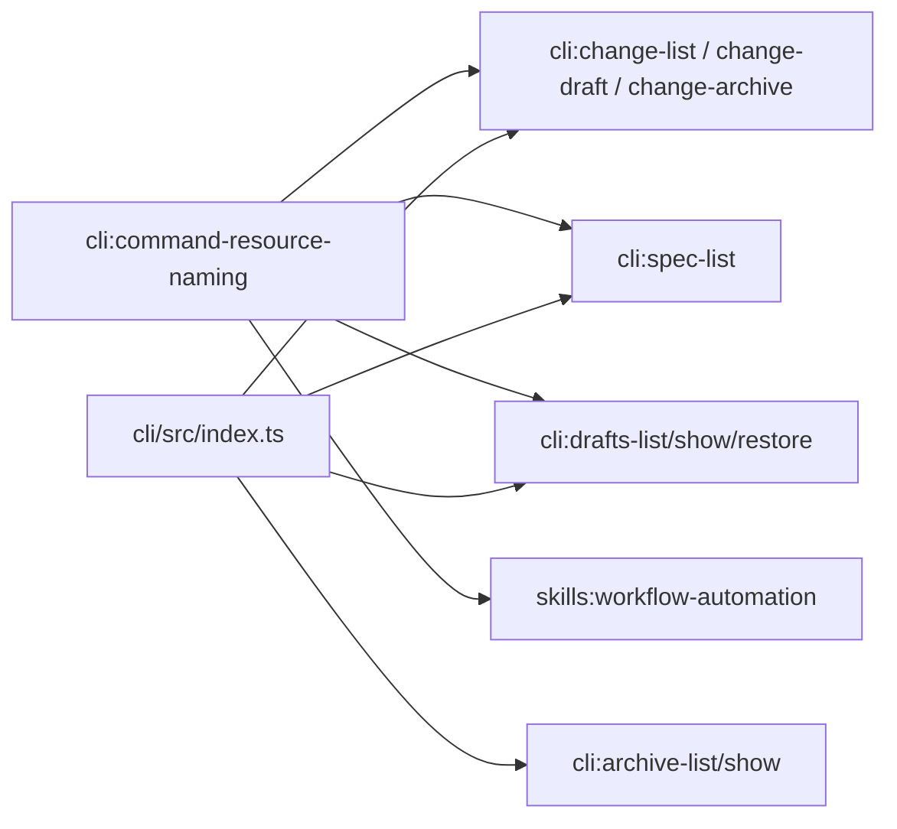

# Design: pluralize-cli-resource-commands

## Non-goals

- Renaming internal domain entities (`Change`, `Spec`, etc.) in `@specd/core`.
- Removing singular command groups in this change.
- Changing non-countable command groups.

## Affected areas

- `packages/cli/src/index.ts`
  Change: register plural canonical command groups (`changes`, `specs`, `archives`, `drafts`) as primary and keep singular aliases.
  Impact: high entrypoint fan-out (touches all command registration wiring).

- `packages/cli/src/commands/change/*.ts`
  Change: update command registration parents from singular to canonical plural where needed; keep alias registrations.
  Impact: medium-high; these modules are direct integration points for lifecycle operations.

- `packages/cli/src/commands/spec/*.ts`
  Change: expose `specs` canonical group while preserving `spec` alias.
  Impact: medium; shared by both human workflows and agent automation.

- `packages/cli/src/commands/archive/list.ts`, `packages/cli/src/commands/archive/show.ts`
  Change: expose `archives` canonical group while preserving `archive` alias.
  Impact: medium; user-facing historical browsing commands.

- `packages/cli/src/commands/drafts/*.ts` and `packages/cli/src/commands/change/draft.ts`
  Change: preserve `drafts` as canonical and add `draft` alias handling.
  Impact: medium; grouped command entrypoints and examples.

- `packages/cli/src/formatter.ts` (`output`)
  Impact analysis anchor: `graph impact --symbol output --direction dependents` reports CRITICAL fan-in with wide CLI/test coverage. We avoid behavior changes here and restrict changes to command registration/help strings.

- `docs/cli/**` and command examples across `docs/**`
  Change: all displayed commands move to canonical plural forms; singulars may appear only as aliases.

- `.codex/skills/**/SKILL.md` and related shared notes
  Change: workflow examples move to canonical plural command groups.

## New constructs

- `specs/cli/cli/command-resource-naming/spec.md`
  Responsibility: normative policy for canonical plural command groups and singular aliases.

- `specs/cli/cli/command-resource-naming/verify.md`
  Responsibility: verification scenarios for canonical/alias behavior and docs/help display rules.

## Approach

1. Introduce `cli:cli/command-resource-naming` as the governing policy spec.
2. Update affected CLI specs/deltas (`change-draft`, `drafts-*`, `change-list`, `spec-list`, `change-archive`) to reference canonical plural groups and explicit aliases.
3. Implement CLI registration changes in `packages/cli/src/index.ts` and command registration modules:
   - canonical parents: `changes`, `specs`, `archives`, `drafts`
   - aliases: `change`, `spec`, `archive`, `draft`
4. Keep handlers/use-cases unchanged; only routing/help surface changes.
5. Update docs and skills to display canonical plural commands.
6. Expand/adjust tests to assert canonical command discovery and alias equivalence.

## Key decisions

- **Plural canonical groups at CLI surface** -> consistent user mental model and predictable command discovery.
  **Alternatives rejected**: keep mixed naming; rejected because inconsistency remains.

- **Singular aliases retained** -> no workflow breakage.
  **Alternatives rejected**: removing singular groups now; rejected because it is a breaking change.

- **No formatter/output contract changes** -> avoid regressions in high fan-in symbol paths.
  **Alternatives rejected**: output-level compatibility messaging; rejected per user direction (aliases shown as aliases only).

## Trade-offs

- [Temporary dual vocabulary] -> Mitigation: docs and skills present only canonical forms as primary.
- [Command tree complexity from aliases] -> Mitigation: centralize alias registration near root command wiring and cover with command-discovery tests.

## Spec impact

Modified specs are CLI-facing and align under new dependency `cli:cli/command-resource-naming`.

- Direct dependent updated in this change: `skills:workflow-automation` (agent command examples).
- No core domain spec behavior changes are required because semantics stay intact; only command-group naming/routing surface changes.

## Dependency map



```
┌────────────────────────────────────┐
│ cli:command-resource-naming (new) │
└───────────────┬────────────────────┘
                │
   ┌────────────┼─────────────┬───────────────┐
   ▼            ▼             ▼               ▼
┌──────────┐ ┌──────────┐ ┌────────────┐ ┌────────────────────┐
│ changes  │ │ specs    │ │ drafts     │ │ skills automation  │
│ commands │ │ commands │ │ commands   │ │ examples           │
└────┬─────┘ └────┬─────┘ └────┬───────┘ └────────────────────┘
     │            │            │
     ▼            ▼            ▼
┌──────────────────────────────────────────────┐
│ packages/cli/src/index.ts command tree      │
│ canonical: changes/specs/archives/drafts    │
│ aliases:   change/spec/archive/draft         │
└──────────────────────────────────────────────┘
```

## Testing

Automated tests:

- Update/add command registration tests in `packages/cli/test/commands/list-commands.spec.ts`.
- Update targeted command tests:
  - `packages/cli/test/commands/change-list.spec.ts`
  - `packages/cli/test/commands/change-draft.spec.ts`
  - `packages/cli/test/commands/change-archive.spec.ts`
  - `packages/cli/test/commands/spec-list.spec.ts`
  - `packages/cli/test/commands/drafts-*.spec.ts`
  - `packages/cli/test/commands/archive-list.spec.ts`
  - `packages/cli/test/commands/archive-show.spec.ts`
- Add alias-equivalence assertions: canonical and alias invocations return equivalent stdout/stderr/exit codes for same args.

Manual verification:

- Run help and sample commands for canonical groups and aliases:
  - `specd changes list` and `specd change list`
  - `specd specs list` and `specd spec list`
  - `specd archives list` and `specd archive list`
  - `specd drafts list` and `specd draft list`
- Confirm docs pages show canonical plurals as primary examples.
- Confirm skills examples use canonical plurals.

## Open questions

_none_
