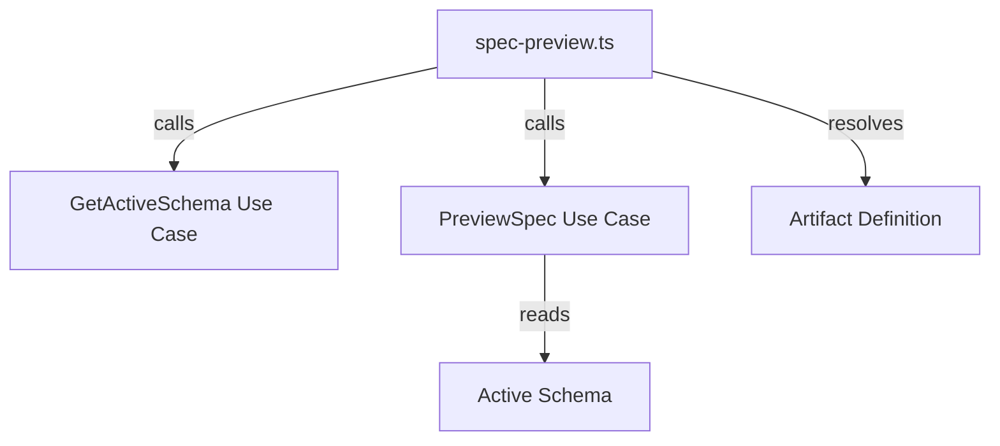

# Design: change-spec-preview-artifact-flag

## Affected areas

- `registerChangeSpecPreview` in `packages/cli/src/commands/change/spec-preview.ts`
  - Change: Update command signature to add `.option('--artifact <name>', ...)` and update action logic to filter `result.files` based on the resolved artifact filename.
  - Callers: 1 (main CLI entrypoint) · Risk: LOW
  - Impact: Only affects the `change spec-preview` command output.

## Approach

1.  **Command Signature**: Add the `--artifact <name>` option to the Commander command in `registerChangeSpecPreview`.
2.  **Artifact Resolution**: Inside the action handler, if `opts.artifact` is present:
    - Fetch the active schema using `kernel.specs.getActiveSchema.execute()`.
    - Resolve the artifact definition via `schema.artifact(opts.artifact)`.
    - Validate that the artifact exists and its scope is `spec`.
    - Identify the target filename using `path.basename(artifactType.output)`.
3.  **Result Filtering**:
    - Filter the `result.files` array from the `PreviewSpec` use case to only include the entry where `file.filename === targetFilename`.
    - If the filtered array is empty but an artifact was requested, it means either the artifact is missing on disk or the delta was a no-op (and thus skipped by the use case). In this case, throw a `cliError` (consistent with `spec show` when a requested artifact is missing).
4.  **Output Rendering**:
    - The existing loop over `result.files` will naturally handle the filtered (single-element) array for both text and JSON/TOON formats.
    - Header lines `--- <filename> ---` are already part of the loop and will be preserved for the single artifact.

## Key decisions

- **Decision** → Filter in CLI layer. **Rationale** → Matches the pattern used by `specd spec show` and avoids modifying the `PreviewSpec` use case which is used by other components (like `CompileContext`) that might need all files.
- **Decision** → Use `cliError` for missing/unknown artifacts. **Rationale** → Provides immediate feedback to the user when an explicit filter fails, consistent with `spec show`.

## Spec impact

### `cli:cli/change-spec-preview`

- Direct dependents: none (it's a leaf CLI command spec)
- Impact: Requirements updated to include the new flag and its behavior.

## Dependency map



```
┌──────────────────┐       ┌─────────────────┐
│ registerChange   │──────▶│ PreviewSpec     │
│ SpecPreview()    │       │ Use Case        │
└────────┬─────────┘       └─────────────────┘
         │
         │ calls
         ▼
┌──────────────────┐       ┌─────────────────┐
│ GetActiveSchema  │──────▶│ schema.artifact │
│ Use Case         │       │ (name)          │
└──────────────────┘       └─────────────────┘
```

## Testing

**Automated tests**:

- I will add a new test file `packages/cli/test/commands/change/spec-preview.spec.ts` (if it doesn't exist) or update existing tests to verify:
  - Command accepts `--artifact` flag.
  - Output is correctly filtered to the requested artifact.
  - Unknown artifact ID produces an error.
  - Non-spec artifact produces an error.
  - Artifact not in the change (but in schema) produces an error.

**Manual / E2E verification**:

1. Create a change with deltas in multiple artifacts (e.g., `spec.md` and `verify.md`).
2. Run `specd change spec-preview <name> <specId> --artifact specs`.
3. Verify only `spec.md` content is shown with its header.
4. Run `specd change spec-preview <name> <specId> --artifact verify`.
5. Verify only `verify.md` content is shown with its header.
6. Run with `--diff` and `--artifact` and verify it also filters correctly.
7. Run with `--artifact nonexistent` and verify it exits with error 1 and a message.
8. Run with `--format json --artifact specs` and verify the `files` array has only one entry.
