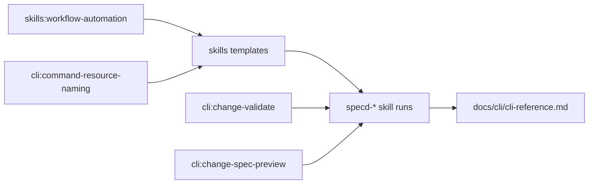

# Design: clarify-skill-review-and-command-usage

## Non-goals

- Do not change runtime behavior of CLI commands.
- Do not change lifecycle semantics in core entities/use-cases.
- Do not introduce new workflow artifacts or schema artifact types.

## Affected areas

- `packages/skills/templates/shared/shared.md`
  Change: add deterministic command-equivalence policy, freshness rules, and explicit separation between structural validate and semantic review.
  Impact: high fan-out to all generated skills; risk MEDIUM because wording can alter behavior across the full workflow.

- `packages/skills/templates/specd/SKILL.md`
  Change: align command examples to canonical plural forms and remove redundant reads only when equivalence/freshness gates pass.
  Impact: direct entrypoint behavior for all sessions; risk MEDIUM.

- `packages/skills/templates/specd-new/SKILL.md`
  Change: discovery-step command pruning and explicit re-read minima when no prior reliable context exists.
  Impact: early lifecycle routing; risk MEDIUM.

- `packages/skills/templates/specd-design/SKILL.md`
  Change: enforce per-step command necessity analysis and freshness checks while preserving safety-critical reads.
  Impact: authoring flow for proposal/spec/verify/design/tasks; risk HIGH due broad lifecycle gating.

- `packages/skills/templates/specd-implement/SKILL.md`
  Change: avoid redundant diagnostics if equivalent fresh data already exists; preserve mandatory reads when context freshness is uncertain.
  Impact: implementation execution quality; risk MEDIUM.

- `packages/skills/templates/specd-verify/SKILL.md`
  Change: clarify when `changes spec-preview` is mandatory (overlap/drift risk) even if raw deltas were inspected.
  Impact: verification integrity; risk HIGH for content safety.

- `packages/skills/templates/specd-archive/SKILL.md`
  Change: avoid duplicate checks already covered by fresh status/context outputs; preserve archival safety checks.
  Impact: finalization flow; risk MEDIUM.

- `skills:workflow-automation` spec-scoped artifacts (via deltas)
  Change: add normative command-necessity/freshness and structural-vs-semantic review requirements.
  Impact: authoritative contract for all skill templates.

- `cli:change-validate` spec-scoped artifacts (via deltas)
  Change: codify structural-only scope and canonical plural command guidance.
  Impact: prevents conflating validate pass with semantic approval.

- `cli:change-spec-preview` spec-scoped artifacts (via deltas)
  Change: codify preview as mandatory merged checkpoint for overlap/drift risk.
  Impact: protects against stale delta overwrite.

- `cli:command-resource-naming` spec-scoped artifacts (via deltas)
  Change: extend canonical naming to workflow artifacts and add deterministic equivalence mapping requirement.
  Impact: unified command language and auditable command-elision policy.

- `docs/cli/cli-reference.md`
  Change: mirror validate semantics (structural-only) and canonical plural usage in user-facing docs.
  Impact: documentation consistency with updated specs/skills.

## New constructs

No new runtime constructs are introduced.

## Approach

1. Normalize normative wording in `skills:workflow-automation`.

- Add explicit requirements for command necessity, deterministic equivalence, and freshness gates.
- Add explicit requirement that `changes validate` is structural only.
- Add explicit requirement that overlap/drift risk requires merged review with `changes spec-preview`.

2. Align CLI-facing specs with updated guidance.

- Update `cli:change-validate` contract text and verification to separate structural validation from semantic review.
- Update `cli:change-spec-preview` contract text and verification to anchor drift/overlap checkpoint behavior.
- Update `cli:command-resource-naming` contract text and verification to require canonical plural forms in workflow artifacts and deterministic equivalence maps.

3. Apply skill-template execution-order policy.

- For each skill, define a minimum mandatory re-read set that is always required when no reliable fresh context exists.
- Allow command skipping only with explicit field equivalence and freshness confidence.
- Keep safety-critical reads (status/context/review blockers) mandatory when equivalence cannot be proven.

4. Mirror semantics in docs.

- Update CLI docs to prevent user confusion: validate pass is structural/state success, not semantic quality approval.
- Keep examples canonical (`changes`, `specs`, `archives`, `drafts`) with alias mention only when needed.

5. Validate artifacts sequentially.

- Keep schema-defined artifact progression strict and revalidate files after every change that can create pending-review drift.

## Key decisions

- **Decision**: Use normative-only rules, not mandatory before/after examples.
  **Alternatives rejected**: Example-heavy guidance was rejected because it risks drifting quickly and duplicating command docs.

- **Decision**: Introduce deterministic equivalence mapping for command elimination.
  **Alternatives rejected**: Ad hoc “best effort” skips were rejected because they are not auditable and can hide missing reads.

- **Decision**: Use `change context` fingerprint as reusable freshness mechanism.
  **Alternatives rejected**: Blind state reuse across skills was rejected because skills can run in separate sessions/times.

- **Decision**: Keep `changes spec-preview` mandatory when overlap/drift risk exists.
  **Alternatives rejected**: Accepting raw delta inspection alone was rejected because stale deltas can mask destructive merged results.

- **Decision**: Mirror clarification in docs as part of this change.
  **Alternatives rejected**: Deferred doc updates were rejected because they perpetuate inconsistent operator expectations.

## Trade-offs

- [Higher instruction complexity] -> Mitigation: centralize shared rules in `templates/shared/shared.md` and keep skill-specific deltas minimal.
- [Potential extra reads in uncertain contexts] -> Mitigation: enforce “skip only with deterministic equivalence + freshness” instead of aggressive elimination.
- [Broader spec/document update scope] -> Mitigation: no runtime CLI/core behavior changes in this change.

## Spec impact

### `skills:workflow-automation`

- Direct dependents: workflow skills generated from templates (`specd`, `specd-new`, `specd-design`, `specd-implement`, `specd-verify`, `specd-archive`).
- Transitive dependents: agent sessions that execute those skills.
- Impact: all dependents must preserve safety reads while adopting deterministic command-elision rules.

### `cli:change-validate`

- Direct dependents: workflow instructions and docs that interpret validate output.
- Transitive dependents: implementation/verify/archive skill decisions.
- Impact: dependent guidance must stop treating validate pass as semantic approval.

### `cli:change-spec-preview`

- Direct dependents: verify/archive and any review logic that checks merged outcomes.
- Transitive dependents: implementation decisions based on delta confidence.
- Impact: dependents must call preview under overlap/drift risk before acceptance.

### `cli:command-resource-naming`

- Direct dependents: skill templates and docs command examples.
- Transitive dependents: generated guidance across lifecycle.
- Impact: command examples must stay canonical plural; alias usage remains compatibility-only.

No additional spec IDs were identified as requiring requirement deltas for this change.

## Dependency map



```
┌─────────────────────────────┐
│ skills:workflow-automation  │
└──────────────┬──────────────┘
               │ rules shared
               ▼
┌─────────────────────────────┐      ┌──────────────────────────────┐
│ templates/shared/shared.md  │─────▶│ templates/specd-*.SKILL.md   │
└──────────────┬──────────────┘      └──────────────┬───────────────┘
               │                                     │
               │ uses                                │ executes
               ▼                                     ▼
      ┌──────────────────────┐              ┌──────────────────────────┐
      │ cli:change-validate  │              │ lifecycle skill decisions │
      └──────────┬───────────┘              └──────────┬───────────────┘
                 │                                     │
                 ▼                                     ▼
      ┌──────────────────────┐              ┌──────────────────────────┐
      │ cli:change-spec-     │              │ docs/cli/cli-reference   │
      │ preview              │              │ (mirrored semantics)      │
      └──────────────────────┘              └──────────────────────────┘
```

## Testing

Automated tests:

- `packages/cli/test/commands/change-validate.spec.ts`
  Add/adjust cases confirming wording and behavior distinction: validate pass != semantic approval signal.
- `packages/cli/test/commands/change/spec-preview.spec.ts`
  Add/adjust cases covering drift/overlap-oriented usage contract language where applicable.
- `packages/skills` template tests/snapshots (if present in repo tooling)
  Update expected generated guidance for canonical command forms, deterministic equivalence mapping, and freshness rules.

Manual / E2E verification:

1. Generate/review skill template outputs and confirm canonical plural commands are primary across updated skills.
2. Run `node packages/cli/dist/index.js changes validate <change> <specId> --artifact specs --format text` and verify text explicitly frames structural validation only.
3. Run `node packages/cli/dist/index.js changes spec-preview <change> <specId> --artifact specs --format text` and confirm guidance alignment for merged-review safety.
4. Review `docs/cli/cli-reference.md` for semantic consistency with updated specs.

Global constraints check:

- Architecture: no domain I/O or layer inversion introduced (docs/spec/template-only change).
- Conventions: ESM/naming/export constraints unaffected.
- Testing: verify scenarios mapped to test-plan updates above.
- Docs/JSDoc: docs update explicitly included; runtime code JSDoc impact is none unless implementation introduces code edits.

## Open questions

- While implementing template updates, confirm whether each skill currently has an existing test harness or snapshot pipeline; if absent, define the smallest practical regression check for generated instructions.
