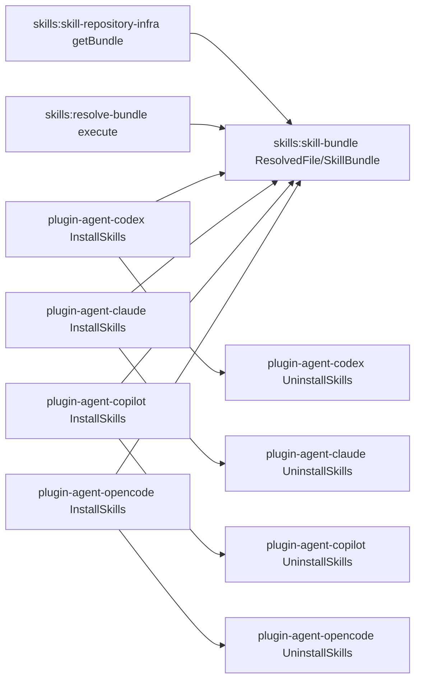

# Design: shared-skill-bundle-targets

## Non-goals

- Introduce content-addressed shared stores, manifest-based shared resolvers, or symlink/hardlink strategies.
- Change agent discovery rules outside ensuring `_specd-shared` does not look like a skill.
- Redesign plugin-manager install result shape unless needed by implementation reality.

## Affected areas

- `packages/skills/src/domain/skill-bundle.ts` (`ResolvedFile`, `SkillBundle`)
  Change: extend bundle contract with shared-file metadata and split target routing semantics.
  Callers/dependents: `SkillBundle` has 4 direct dependent files (MEDIUM risk), `ResolvedFile` has 5 affected files and HIGH risk due to broader transitive usage in skills package and tests.
  Note: contract change must preserve compatibility for string `targetDir` callers.

- `packages/skills/src/infrastructure/repository/skill-repository.ts` (`ResolvedSkillBundle.install`, `ResolvedSkillBundle.uninstall`, `FsSkillRepository.getBundle`)
  Change: mark shared-origin files in resolved bundle output and route install/uninstall by shared marker.
  Impact: central implementation path for all agent plugins; regression here affects every runtime.

- `packages/skills/src/application/ports/skill-repository.ts` (`SkillRepository`, `SharedFile`)
  Change: keep port behavior aligned with shared marker preservation guarantees.
  Impact: API contract for all repository consumers.

- `packages/skills/src/application/use-cases/resolve-bundle.ts` (`ResolveBundle.execute`)
  Change: preserve non-content file metadata (`shared`) while replacing placeholders.
  Impact: required for consistency between repository resolution and installer routing.

- `packages/plugin-agent-codex/src/application/use-cases/install-skills.ts`
- `packages/plugin-agent-claude/src/application/use-cases/install-skills.ts`
- `packages/plugin-agent-copilot/src/application/use-cases/install-skills.ts`
- `packages/plugin-agent-opencode/src/application/use-cases/install-skills.ts`
  Change: split writes between `<agent-root>/<skill-name>/` and `<agent-root>/_specd-shared/`, and avoid prepending skill frontmatter to shared files.
  Symbol-level impact: `InstallSkills` classes are MEDIUM risk with dependents in each package `src/index.ts` factory and `test/install-skills.spec.ts`.

- `packages/plugin-agent-codex/src/application/use-cases/uninstall-skills.ts`
- `packages/plugin-agent-claude/src/application/use-cases/uninstall-skills.ts`
- `packages/plugin-agent-copilot/src/application/use-cases/uninstall-skills.ts`
- `packages/plugin-agent-opencode/src/application/use-cases/uninstall-skills.ts`
  Change: preserve `_specd-shared/` when uninstalling selected skills; when uninstalling without filter, remove only specd-managed skill directories plus `_specd-shared/`, and keep unrelated user skill directories/files.
  Impact: must stay deterministic and idempotent.

- Tests:
  - `packages/skills/test/resolve-bundle.spec.ts`
  - `packages/skills/test/infrastructure/skill-repository.spec.ts`
  - `packages/plugin-agent-*/test/install-skills.spec.ts`
  - `packages/plugin-agent-*/test/domain/types/*-plugin.spec.ts` when uninstall behavior assertions are present
    Change: update fixtures/assertions for shared marker and split install layout.

- Documentation:
  - `packages/plugin-agent-codex/README.md`
  - `packages/plugin-agent-claude/README.md`
  - `packages/plugin-agent-copilot/README.md`
  - `packages/plugin-agent-opencode/README.md`
  - `docs/cli/plugins-install.md` if install output examples mention per-skill shared copies
    Change: document `_specd-shared` install layout and selected uninstall semantics.

## New constructs

- `SkillBundleInstallTarget` in `packages/skills/src/domain/skill-bundle.ts`
  Shape:
  ```ts
  interface SkillBundleInstallTarget {
    readonly targetDir: string
    readonly sharedTargetDir?: string
  }
  ```
  Responsibility: define normal and optional shared install roots for bundle operations.
  Relationships: consumed by `SkillBundle.install/uninstall` and `ResolvedSkillBundle` implementation.

No new classes or files are required; this change is additive within existing modules.

## Approach

1. Update the domain bundle contract:
   - add `shared?: boolean` to `ResolvedFile`.
   - update `SkillBundle.install/uninstall` signatures to accept `string | SkillBundleInstallTarget`.
   - keep string form as compatibility path (`{ targetDir: string }`).

2. Update fs repository resolution:
   - in `FsSkillRepository.getBundle`, when appending entries from `listSharedFiles()`, emit `shared: true`.
   - keep skill-local template files without `shared` marker.

3. Update bundle install/uninstall implementation:
   - compute `normalDir` and `sharedDir` once.
   - route by `file.shared === true`.
   - create shared dir lazily when at least one shared file is present.
   - maintain idempotent uninstall behavior.

4. Update resolve-bundle behavior:
   - when applying variable replacement, preserve all non-content fields on each resolved file.

5. Update agent plugin installers:
   - set per-plugin shared path:
     - Codex: `.codex/skills/_specd-shared/`
     - Claude: `.claude/skills/_specd-shared/`
     - Copilot: `.github/skills/_specd-shared/`
     - OpenCode: `.opencode/skills/_specd-shared/`
   - write shared files there.
   - only prepend skill frontmatter to non-shared markdown files.

6. Update agent plugin uninstallers:
   - uninstall selected skills: remove selected `<skill-name>/` only, keep shared dir.
   - uninstall all skills: remove only specd-managed skill directories and `_specd-shared/`.
   - preserve unrelated user skill directories/files under the same agent skills root.

7. Update docs and tests to match new layout and semantics.

This covers all modified requirements and verify scenarios in the current change.

## Key decisions

- **Use explicit `shared` marker on `ResolvedFile`** -> installer logic remains deterministic and decoupled from filename conventions.
  Alternatives rejected: infer shared files by filename (fragile, leaks template naming into runtime logic).

- **Use optional `sharedTargetDir` with fallback to `targetDir`** -> backwards-compatible behavior for existing call sites.
  Alternatives rejected: breaking signature requiring object-only input (unnecessary migration cost).

- **Keep `_specd-shared` under each agent root** -> no plugin-manager contract expansion needed.
  Alternatives rejected: global cross-agent shared root (cross-runtime coupling and ownership ambiguity).

- **Do not prepend skill frontmatter to shared markdown** -> shared resources are not skill entrypoints and must remain neutral.
  Alternatives rejected: keep frontmatter on all markdown files (pollutes shared resource content).

## Trade-offs

- [Ordering drift in verify/spec sections due to delta application] -> acceptable as long as requirements and scenarios remain complete and validated; keep checks via `changes validate` and `changes spec-preview`.
- [Shared directory retained when uninstalling selected skills may leave unused files] -> intentional to avoid breaking still-installed skills; full uninstall of specd-managed skills cleans remaining shared files.
- [Managed-scope uninstall may leave non-specd files behind] -> intentional to avoid destructive behavior against user-managed skills.

## Spec impact

Modified specs include `skills:skill-bundle`, `skills:skill-repository-port`, `skills:skill-repository-infra`, `skills:resolve-bundle`, and all four `plugin-agent-*` plugin specs. The declared dependency additions from each plugin spec to `skills:skill-bundle` align transitive context.

No additional dependent spec required new deltas after review:

- plugin-manager spec remains `no-op` because contract-level install options/result shape is unchanged.
- no cross-workspace spec outside the current scoped set requires semantic updates for this change.

## Dependency map



```
┌──────────────────────────────────────┐
│ skills:getBundle() (infra)           │
│ marks shared files                   │
└──────────────────┬───────────────────┘
                   │
                   ▼
┌──────────────────────────────────────┐
│ skills:SkillBundle / ResolvedFile    │
│ shared?: boolean + dual target dirs  │
└───────┬───────────────┬──────────────┘
        │               │
        ▼               ▼
┌──────────────┐   ┌───────────────────┐
│ resolveBundle│   │ plugin-agent-*     │
│ preserves    │   │ InstallSkills       │
│ metadata     │   │ route shared writes │
└──────────────┘   └─────────┬──────────┘
                              │
                              ▼
                    ┌─────────────────────┐
                    │ plugin-agent-*      │
                    │ UninstallSkills      │
                    │ keep/remove shared   │
                    └─────────────────────┘
```

## Migration / Rollback

- Migration:
  - no data migration required.
  - reinstalling plugins updates layout to include `_specd-shared/`.

- Rollback:
  - revert code/spec changes and reinstall plugins; shared resources return to per-skill copies under old behavior.
  - because output paths are local skill resources, rollback is file-layout only.

## Testing

Automated tests:

- `packages/skills/test/infrastructure/skill-repository.spec.ts`
  - assert shared files are marked `shared: true` in bundle output.
- `packages/skills/test/resolve-bundle.spec.ts`
  - assert variable substitution preserves shared marker.
- `packages/plugin-agent-codex/test/install-skills.spec.ts`
- `packages/plugin-agent-claude/test/install-skills.spec.ts`
- `packages/plugin-agent-copilot/test/install-skills.spec.ts`
- `packages/plugin-agent-opencode/test/install-skills.spec.ts`
  - assert shared files written to `<agent-root>/_specd-shared/`, non-shared to `<agent-root>/<skill>/`, and frontmatter skipped for shared markdown.
- plugin uninstall tests in each agent package:
  - selected uninstall keeps `_specd-shared/`
  - full uninstall removes specd-managed skill directories and `_specd-shared/` while preserving unrelated user skill directories/files.

Manual / E2E verification:

1. Run plugin install for one agent and inspect output tree:
   - shared file exists once under `_specd-shared/`
   - skill directories do not contain duplicated shared file.
2. Open a generated lifecycle skill `SKILL.md` and confirm shared reference points to `@../_specd-shared/shared.md`.
3. Uninstall a single skill and verify `_specd-shared/` remains.
4. Add a non-specd skill directory/file, uninstall all specd skills, and verify non-specd content remains while `_specd-shared/` and specd-managed skill directories are removed.
5. Run `pnpm test`, `pnpm lint`, and `pnpm typecheck` before implementation completion gates.

Documentation updates:

- Update plugin package READMEs and any CLI docs that describe installed directory layout so they match `_specd-shared` behavior.

## Open questions

_none_
