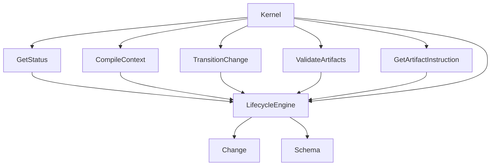

# Design: unify-lifecycle-engine

## Non-goals

- Changing artifact hashing, delta application, or cleanup semantics.
- Changing manifest persistence format or repository storage layout.
- Redesigning schema syntax; this change consumes existing workflow/schema concepts.

## Core principle

`Change` owns persisted facts. `LifecycleEngine` owns interpreted lifecycle meaning.

That split is the heart of this change:

- `Change` persists lifecycle state, approvals, history, artifact files, and aggregate persisted artifact states.
- `LifecycleEngine` interprets those persisted facts together with the resolved schema DAG and workflow rules.
- Any DAG-aware answer such as effective artifact status, recursive blocker propagation, step readiness, or approval routing must come from the engine rather than from the entity.

## Affected areas

- `packages/core/src/domain/services/lifecycle-engine.ts`
  - New domain service that evaluates lifecycle interpretation from `Change` + `Schema`.
  - Impact: HIGH. New single authority for lifecycle semantics.
- `packages/core/src/domain/entities/change.ts`
  - Remove or demote schema-aware helpers that currently derive effective status from the entity.
  - Impact: HIGH. Clarifies entity boundary.
- `packages/core/src/application/use-cases/get-status.ts`
  - Delegate review summary, blockers, next action, effective artifact statuses, and lifecycle availability to the engine.
  - Impact: HIGH. Primary status/reporting surface.
- `packages/core/src/application/use-cases/compile-context.ts`
  - Delegate requested-step availability and workflow-step summaries to the engine while preserving compatibility fields.
  - Impact: HIGH. Prevents liar context for agents.
- `packages/core/src/application/use-cases/transition-change.ts`
  - Delegate routing, readiness checks, and blockers to the engine.
  - Impact: HIGH. Centralizes transition semantics.
- `packages/core/src/application/use-cases/validate-artifacts.ts`
  - Replace entity-owned effective-status checks with engine-derived dependency interpretation.
  - Impact: MEDIUM. Keeps validation ordering aligned with the same DAG semantics.
- `packages/core/src/application/use-cases/get-artifact-instruction.ts`
  - Replace local “next artifact” resolution with engine-derived readiness.
  - Impact: MEDIUM. Keeps authoring guidance aligned with the same DAG semantics.
- `packages/core/src/composition/use-cases/*.ts` and kernel wiring
  - Inject `LifecycleEngine` into every affected use case from one composition path.
  - Impact: HIGH. Without this, the architectural unification stays partial and easy to regress.
- `packages/cli/src/commands/change/status.ts`
  - Keep status serialization aligned with the engine-derived `GetStatus` contract.
  - Impact: MEDIUM. User-facing reporting surface.
- `packages/cli/src/commands/change/context.ts`
  - Keep step-availability warnings and rendered step summaries aligned with engine-derived `CompileContext` data.
  - Impact: MEDIUM. Agent-facing context surface.
- `packages/cli/src/commands/change/transition.ts`
  - Keep repair-guide and routed-transition messaging aligned with engine-derived `TransitionChange` / `GetStatus` semantics.
  - Impact: MEDIUM. User-facing lifecycle control surface.
- `packages/cli/src/commands/change/validate.ts`
  - Preserve engine-derived dependency-block descriptions from `ValidateArtifacts`.
  - Impact: LOW. Serializer alignment.
- `packages/cli/src/commands/change/artifact-instruction.ts`
  - Preserve engine-derived auto-selection semantics from `GetArtifactInstruction`.
  - Impact: LOW. Serializer alignment.

## New construct

### `LifecycleEngine`

- **Location**: `packages/core/src/domain/services/lifecycle-engine.ts`
- **Role**: Pure lifecycle interpreter over persisted change facts plus schema/workflow semantics.
- **Public API**:

  ```typescript
  export interface LifecycleEngineOptions {
    readonly requestedTarget?: ChangeState
    readonly approvals?: { readonly spec: boolean; readonly signoff: boolean }
    readonly bypassFlags?: readonly string[]
  }

  export interface LifecycleArtifactVerdict {
    readonly state: ArtifactStatus
    readonly effectiveStatus: ArtifactStatus
  }

  export interface LifecycleStepVerdict {
    readonly step: string
    readonly available: boolean
    readonly isReady: boolean
    readonly isPermitted: boolean
    readonly blockingArtifacts: readonly string[]
    readonly blockers: readonly Blocker[]
  }

  export interface LifecycleVerdict {
    readonly artifacts: Readonly<Record<string, LifecycleArtifactVerdict>>
    readonly availableSteps: readonly LifecycleStepVerdict[]
    readonly blockers: readonly Blocker[]
    readonly review: ReviewSummary
    readonly nextAction: NextAction | null
    readonly effectiveTarget?: ChangeState
  }

  export class LifecycleEngine {
    evaluate(change: Change, schema: Schema, options?: LifecycleEngineOptions): LifecycleVerdict
  }
  ```

- **Boundary**: `evaluate(...)` is the public contract. Internal helpers may compute recursive blockers or effective statuses, but callers consume the verdict rather than individual schema-aware helper methods on `Change`.

## Approach

1. Extract lifecycle interpretation from `GetStatus` into `LifecycleEngine`.
2. Move recursive effective-status propagation out of `Change` and into the engine.
3. Model blockers as structured, machine-readable diagnostics with file/artifact detail where applicable.
4. Teach the engine to evaluate workflow-step readiness (`isReady`) separately from protocol permission (`isPermitted`).
5. Teach the engine to resolve approval-gated routing (`effectiveTarget`) for transition consumers.
6. Refactor `GetStatus`, `CompileContext`, `TransitionChange`, `ValidateArtifacts`, and `GetArtifactInstruction` to consume the engine.
7. Update composition/kernel wiring so those consumers all receive the same engine dependency through normal assembly paths.
8. Preserve externally useful compatibility fields where needed, but make them projections of engine output rather than parallel logic.
9. Update CLI command serializers/specs wherever their documented behavior mirrors the affected core contracts.

## Key decisions

- **Decision** → Keep lifecycle interpretation in a stateless domain service.
  - **Rationale** → Schema/DAG semantics are not entity invariants; they are interpretation over persisted facts plus resolved schema data.
- **Decision** → Remove entity authority over effective artifact status.
  - **Rationale** → `Change` does not know the schema DAG, so a dependency-aware “effective status” API on the entity is the wrong ownership boundary.
- **Decision** → Reuse engine output for non-transition consumers.
  - **Rationale** → Validation ordering and “next artifact” guidance are also DAG interpretation problems; reusing the engine avoids new shadow implementations.
- **Decision** → Treat dependency injection wiring as part of the design, not incidental glue.
  - **Rationale** → A “single source of truth” is only real if all assembly paths construct and pass the same abstraction consistently.
- **Decision** → Preserve `CompileContext.stepAvailable` and `blockingArtifacts` as compatibility projections.
  - **Rationale** → Existing callers can keep consuming a simple shape while richer `availableSteps` data is introduced.
- **Decision** → Add debug logging at lifecycle interpretation boundaries using the shared `Logger`.
  - **Rationale** → This refactor centralizes complex routing/blocker decisions; targeted debug traces are needed to explain why a step was blocked, rerouted, or auto-selected without changing user-facing contracts.

## Observability

Use the shared `Logger` for debug-only traces at the points where lifecycle meaning is derived or projected:

- `LifecycleEngine.evaluate(...)`
  - log requested target, approval flags, bypass flags, derived `effectiveTarget`, blocker codes, and `nextAction`
- recursive artifact interpretation inside the engine
  - log when a persisted `complete` artifact is downgraded to `pending-parent-artifact-review` and which upstream dependency caused it
- `GetStatus`
  - log that engine output was used and which top-level blockers/review reason were projected
- `CompileContext`
  - log requested step plus resulting `stepAvailable`, `blockingArtifacts`, and whether the richer `availableSteps` verdict changed
- `TransitionChange`
  - log requested target, engine-derived `effectiveTarget`, and blocker reasons before throwing or persisting
- `ValidateArtifacts`
  - log dependency-order failures using engine-reported effective statuses and recursive parent blocker context
- `GetArtifactInstruction`
  - log omitted-artifact auto-resolution decisions, especially when an artifact is skipped because the engine reports dependency blockage

The logging should stay at `debug` level, avoid dumping full file contents, and prefer stable machine-readable fields (artifact IDs, states, blocker codes, transition targets).

## Spec impact

- `core:change`: narrows the entity to persisted facts and removes schema-aware interpretive responsibility.
- `core:lifecycle-engine`: defines the new authoritative interpreter and its cross-consumer role.
- `core:get-status`: returns engine-derived lifecycle interpretation.
- `core:compile-context`: uses engine-derived step summaries and blockers.
- `core:transition-change`: uses engine-derived routing and gating.
- `core:validate-artifacts`: uses engine-derived dependency ordering and blocker context.
- `core:get-artifact-instruction`: uses engine-derived “next artifact” selection.
- `cli:change-status`: serializes engine-derived status semantics from `GetStatus`.
- `cli:change-context`: serializes engine-derived availability semantics from `CompileContext`.
- `cli:change-transition`: serializes engine-derived routing/blocker semantics from `TransitionChange` and failure diagnosis from `GetStatus`.
- `cli:change-validate`: serializes engine-derived dependency-block semantics from `ValidateArtifacts`.
- `cli:change-artifact-instruction`: serializes engine-derived auto-selection semantics from `GetArtifactInstruction`.

## Dependency map



## Testing

**Automated tests**

- `packages/core/test/domain/services/lifecycle-engine.spec.ts`
  - cover effective status propagation, recursive blockers, approval routing, review derivation, and next-action selection
- `packages/core/test/application/use-cases/get-status.spec.ts`
  - assert engine delegation and result projection
- `packages/core/test/application/use-cases/compile-context.spec.ts`
  - assert compatibility fields plus enriched `availableSteps`
- `packages/core/test/application/use-cases/transition-change.spec.ts`
  - assert engine-based routing and blocker failures
- `packages/core/test/application/use-cases/validate-artifacts.spec.ts`
  - assert dependency-order failures reflect engine-reported effective statuses
- `packages/core/test/application/use-cases/get-artifact-instruction.spec.ts`
  - assert omitted `artifactId` uses engine-derived next-artifact selection
- `packages/core/test/composition/kernel*.spec.ts`
  - assert affected use cases are wired with the shared `LifecycleEngine`
- `packages/cli/test/commands/change/*.spec.ts`
  - assert CLI surfaces still project the new core semantics without recomputing lifecycle logic
- logging tests where practical
  - assert key debug calls are emitted around lifecycle evaluation boundaries without requiring brittle full-string snapshots

**Manual / E2E verification**

1. Put a validated upstream artifact into `pending-review` and confirm downstream status/reporting/authoring surfaces all agree on the recursive block.
2. Attempt a protocol-blocked transition with structurally ready artifacts and confirm `isReady: true` but `isPermitted: false`.
3. Request artifact instructions without `artifactId` and confirm the suggested artifact matches status and transition surfaces.
4. Validate a dependent artifact while its parent is blocked and confirm validation failure reports the same effective status as status/context output.
5. Assemble the kernel and confirm every affected entry point uses the same engine-backed interpretation instead of fallback local logic.
6. Run the blocked and rerouted flows with debug logging enabled and confirm the emitted trace explains the same blocker/routing outcome exposed to callers.

## Open questions

- None.
