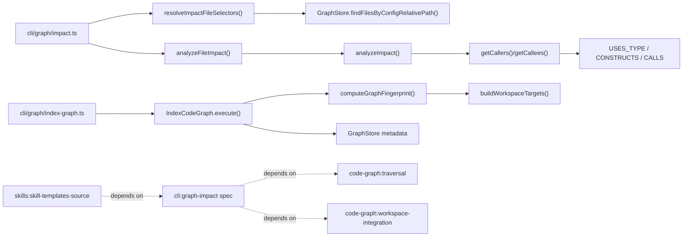

# Design: fix-graph-impact-type-alias-deps

## Non-goals

- Rework the full multi-language extraction strategy beyond the already-modeled `USES_TYPE` / `CONSTRUCTS` semantics.
- Change symbol impact semantics for `--symbol`; this change is about graph freshness, file-selector resolution, and unifying file impact behavior.
- Replace canonical workspace-prefixed graph identity. `FileNode.path` stays canonical.
- Add speculative runtime dependency inference for unresolved or ambiguous references.

## Affected areas

- `ArtifactParserRegistry` in `packages/core/src/application/ports/artifact-parser.ts`
  Change: this is the motivating high-fan-in type alias whose dependents exposed the freshness gap.
  Dependents: `27` direct, `69` indirect, `78` transitive in the current graph after `--force` reindex. Risk: `CRITICAL`.
  Note: `core:src/application/use-cases/generate-spec-metadata.ts` is part of the expected affected set and must stay covered as a regression case.

- `IndexCodeGraph.execute()` in `packages/code-graph/src/application/use-cases/index-code-graph.ts`
  Change: compute and compare a graph-derivation fingerprint before incremental skipping; escalate mismatch to a full rebuild path.
  Impact: central write-path for all graph indexing, shared by configured and bootstrap indexing. Risk: `HIGH` because it controls persistence, deletion scope, and index performance.

- `GraphStore` in `packages/code-graph/src/domain/ports/graph-store.ts`
  Change: extend the abstract store contract to persist and query `configRelativePath` and graph fingerprint metadata.
  Impact: both SQLite and Ladybug implementations plus the in-memory contract store must remain aligned. Risk: `HIGH`.

- `FileNode` in `packages/code-graph/src/domain/value-objects/file-node.ts`
  Change: add `configRelativePath` alongside the canonical `path`.
  Impact: affects all file persistence and any test fixtures creating file nodes. Risk: `MEDIUM`.

- `GraphStatistics` in `packages/code-graph/src/domain/value-objects/graph-statistics.ts`
  Change: expose persisted `graphFingerprint` so readers can detect derivation mismatch.
  Impact: consumed by CLI stats and any freshness diagnostics. Risk: `MEDIUM`.

- `IndexResult` in `packages/code-graph/src/domain/value-objects/index-result.ts`
  Change: add `graphFingerprint` and `fullRebuildReason`.
  Impact: CLI `graph index` text/json output and tests must be updated together. Risk: `MEDIUM`.

- `SQLiteGraphStore` in `packages/code-graph/src/infrastructure/sqlite/sqlite-graph-store.ts` and `packages/code-graph/src/infrastructure/sqlite/schema.ts`
  Change: add a persisted `config_relative_path` column and metadata storage/reads for graph fingerprint.
  Impact: schema version bump, file row mapping, statistics, contract tests, and recreate/clear behavior. Risk: `HIGH`.

- `LadybugGraphStore` in `packages/code-graph/src/infrastructure/ladybug/ladybug-graph-store.ts`
  Change: mirror SQLite semantics for `configRelativePath`, `graphFingerprint`, and `findFilesByConfigRelativePath`.
  Impact: preserves backend parity required by the `GraphStore` contract. Risk: `HIGH`.

- `analyzeImpact()` and `analyzeFileImpact()` in `packages/code-graph/src/domain/services/analyze-impact.ts` and `packages/code-graph/src/domain/services/analyze-file-impact.ts`
  Change: keep `USES_TYPE` / `CONSTRUCTS` / hierarchy semantics explicit in the implementation and tests; no algorithm rewrite is required, but the design needs to preserve this path while removing `detectChanges()` from CLI use.
  Impact: regression-sensitive traversal code with existing tests in `packages/code-graph/test/domain/services/traversal.spec.ts`. Risk: `HIGH`.

- `detectChanges()` in `packages/code-graph/src/domain/services/detect-changes.ts` and `CodeGraphProvider.detectChanges()` in `packages/code-graph/src/composition/code-graph-provider.ts`
  Change: remove them from the `graph impact` CLI path. Keep the provider method only if other callers still need it; otherwise remove the public API and its tests in the same change.
  Impact: currently creates divergent semantics from `analyzeFileImpact()`. Risk: `MEDIUM`.

- `registerGraphImpact()` in `packages/cli/src/commands/graph/impact.ts`
  Change: remove `--changes`, make `--file` variadic, resolve workspace-prefixed/config-relative/absolute paths, aggregate multi-file results, and show changed symbols in text output.
  Impact: user-facing behavior, help text, exit codes, json/text schemas, and a large existing test file. Risk: `HIGH`.

- `registerGraphIndex()` in `packages/cli/src/commands/graph/index-graph.ts`
  Change: surface `fullRebuildReason` in text/json output and keep explicit `--force` behavior as an override.
  Impact: only output and orchestration should change here; the rebuild decision stays in `@specd/code-graph`. Risk: `MEDIUM`.

- `registerGraphStats()` in `packages/cli/src/commands/graph/stats.ts`
  Change: surface derivation mismatch independently from VCS staleness when `graphFingerprint` differs from the current fingerprint.
  Impact: command output and tests only. Risk: `MEDIUM`.

- `buildWorkspaceTargets()` in `packages/cli/src/commands/graph/build-workspace-targets.ts`
  Change: this remains the source of resolved workspace objects whose normalized shape feeds the fingerprint.
  Impact: any change here directly changes graph invalidation behavior. Risk: `MEDIUM`.

- Documentation and agent guidance
  Files to update:
  - `AGENTS.md`
  - `docs/cli/cli-reference.md`
  - `packages/skills/templates/**`
  - `dev/ai-agents/skills/**`
    Change: remove `graph impact --changes`, update examples to `--file <paths...>`, and document workspace-prefixed/config-relative path inputs.
    Impact: prevents agents from reintroducing obsolete CLI usage. Risk: `HIGH` operationally even though the code risk is low.

## New constructs

- `computeGraphFingerprint()` in `packages/code-graph/src/application/use-cases/_shared/compute-graph-fingerprint.ts`
  Shape:

  ```ts
  export interface GraphFingerprintInput {
    readonly codeGraphVersion: string
    readonly workspaces: readonly WorkspaceIndexTarget[]
  }

  export function computeGraphFingerprint(input: GraphFingerprintInput): string
  ```

  Responsibility: build the stable derivation fingerprint from the effective `@specd/code-graph` version and a canonicalized representation of resolved workspaces.
  Relationships: called by `IndexCodeGraph.execute()` and by CLI diagnostics that need to compare current vs persisted derivation identity.

- `normalizeWorkspaceFingerprintInput()` in `packages/code-graph/src/application/use-cases/_shared/compute-graph-fingerprint.ts`
  Shape:

  ```ts
  interface NormalizedWorkspaceFingerprint {
    readonly name: string
    readonly codeRoot: string
    readonly repoRoot: string | null
    readonly excludePaths: readonly string[]
    readonly respectGitignore: boolean
  }

  function normalizeWorkspaceFingerprintInput(
    workspaces: readonly WorkspaceIndexTarget[],
  ): readonly NormalizedWorkspaceFingerprint[]
  ```

  Responsibility: strip function fields such as `specs` and keep only the resolved workspace properties that affect file discovery and graph identity.
  Relationships: internal helper used only by `computeGraphFingerprint()`.

- `resolveImpactFileSelectors()` in `packages/cli/src/commands/graph/resolve-impact-file-selectors.ts`
  Shape:

  ```ts
  export interface ResolvedImpactFile {
    readonly input: string
    readonly normalizedLookup: string
    readonly file: FileNode
  }

  export async function resolveImpactFileSelectors(params: {
    readonly provider: CodeGraphProvider
    readonly context: GraphCliContext
    readonly inputs: readonly string[]
  }): Promise<readonly ResolvedImpactFile[]>
  ```

  Responsibility: resolve user-supplied `--file` arguments to canonical graph files using workspace-prefixed, config-relative, or absolute input semantics.
  Relationships: used only by `packages/cli/src/commands/graph/impact.ts`.

- `AggregatedFileImpactResult` in `packages/cli/src/commands/graph/impact.ts` or a new code-graph value-object if reuse becomes necessary
  Shape:
  ```ts
  interface AggregatedFileImpactResult {
    readonly targets: readonly string[]
    readonly changedSymbols: readonly SymbolNode[]
    readonly affectedSymbols: readonly AffectedSymbol[]
    readonly affectedFiles: readonly string[]
    readonly directDependents: number
    readonly indirectDependents: number
    readonly transitiveDependents: number
    readonly riskLevel: RiskLevel
    readonly perFile: readonly FileImpactResult[]
  }
  ```
  Responsibility: represent the multi-file `--file` result without falling back to the obsolete `detectChanges()` schema.
  Relationships: created by the CLI aggregation layer; no new provider API is required if aggregation stays in CLI.

## Approach

1. Extend the file identity model without changing canonical graph IDs.
   `FileNode.path` stays `{workspace}:{relativeToCodeRoot}`. Add `FileNode.configRelativePath` and populate it during indexing from the directory containing the active `specd.yaml`. In bootstrap mode, config-relative paths are still derived from the synthetic config root under `.specd/config`, which effectively keeps repo-relative behavior for single-workspace bootstrap runs.

2. Persist the extra file identity and derivation metadata in every graph store.
   Update `GraphStore`, `GraphStatistics`, `IndexResult`, the in-memory test store, `SQLiteGraphStore`, and `LadybugGraphStore` so all backends can:
   - store `configRelativePath`
   - return `findFilesByConfigRelativePath(path)`
   - store/read `graphFingerprint`
   - include the fingerprint in `getStatistics()`

3. Move graph-derivation mismatch handling into the indexer, not the CLI.
   `IndexCodeGraph.execute()` should:
   - compute the current fingerprint from the resolved workspaces and loaded `@specd/code-graph` version
   - read the stored fingerprint from `store.getStatistics()`
   - treat unchanged-file skipping as valid only when both content hash and graph fingerprint match
   - call `store.recreate()` before normal indexing when the fingerprint mismatches
   - report the reason through `IndexResult.fullRebuildReason`

   This keeps `graph index` self-healing and avoids duplicating policy in every caller.

4. Keep explicit `--force` as a stronger caller override.
   The CLI already calls `provider.recreate()` in `beforeOpen`. That behavior remains. If the caller passes `--force`, the store is recreated regardless of fingerprint. If the fingerprint mismatches without `--force`, the rebuild happens inside `IndexCodeGraph.execute()`.

5. Remove `graph impact --changes` completely and unify on file impact semantics.
   `packages/cli/src/commands/graph/impact.ts` should switch from:
   - one `--file <path>`
   - one `--changes <files...>`

   to:
   - one variadic `--file <paths...>`
   - `--symbol <name>`

   Exactly one selector remains valid: `--file` or `--symbol`.

6. Resolve file selectors before analysis.
   `resolveImpactFileSelectors()` should:
   - pass through workspace-prefixed inputs directly to `provider.getFile()`
   - normalize relative inputs and look them up with `provider.findFilesByConfigRelativePath()` or equivalent store-backed access
   - normalize absolute inputs relative to `context.configFilePath`'s directory in configured mode, or relative to `context.vcsRoot` in bootstrap mode, then resolve via config-relative lookup
   - raise not-found and ambiguity errors before any impact analysis

7. Aggregate multi-file impact in the CLI using `analyzeFileImpact()` for each resolved file.
   The current divergence exists because `--changes` uses `detectChanges()` and therefore under-reports compared with `analyzeFileImpact()`. The replacement path should:
   - collect the declared symbols for each target file via `provider.findSymbols({ filePath })` to populate `changedSymbols`
   - run `provider.analyzeFileImpact(canonicalPath, direction, maxDepth)` per file
   - dedupe `affectedFiles` and `affectedSymbols`
   - use the max of per-file risk levels
   - derive aggregate direct/indirect/transitive counts from the unioned `affectedSymbols` depths, not from the old `detectChanges()` summary

8. Keep static type dependency semantics explicit and regression-tested.
   The current code already routes `USES_TYPE` / `CONSTRUCTS` through `getCallers()` / `getCallees()` and `analyzeImpact()`. The implementation should preserve that behavior while updating tests to pin the `ArtifactParserRegistry -> GenerateSpecMetadata` path as an impact regression.

9. Surface derivation freshness in reader commands.
   `graph stats` should compare:
   - `stats.lastIndexedRef` vs current VCS ref
   - `stats.graphFingerprint` vs current fingerprint

   and render them as distinct signals. VCS freshness remains warn-only; derivation mismatch must be visible as “built with a different code-graph version or workspace configuration”.

10. Update docs and skill sources in the same change.
    Because this is alpha and the old flag name collides with specd lifecycle “changes”, the removal must be complete. The authored skill sources for this change are `packages/skills/templates` and `dev/ai-agents/skills`.
    `.agents` and `.codex` are not edited directly here; they consume the canonical template sources and should be refreshed later with `specd project update` after the relevant build step.

## Key decisions

- **Fingerprint scope stays minimal** → use only the effective `@specd/code-graph` package version plus normalized resolved workspaces. This matches the proposal and avoids a fragile internal-file hash list.
  **Alternatives rejected** → hashing raw `specd.yaml` was rejected because comments, formatting, and key order would invalidate the graph unnecessarily. Hashing many internal extractor modules was rejected for this iteration because it is easy to forget inputs and harder to explain.

- **Implicit rebuild on fingerprint mismatch** → `graph index` should behave as force-like rebuild when derivation identity changes.
  **Alternatives rejected** → a hard error forcing users to rerun with `--force` was kept only as backend fallback because it is slower operationally and easier for agents to miss.

- **Canonical identity remains workspace-prefixed** → `configRelativePath` is lookup metadata, not identity.
  **Alternatives rejected** → replacing canonical IDs with repo-relative paths would create collisions across workspaces and ripple into `SymbolNode.id`, relations, and existing tests.

- **Multi-file aggregation lives in the CLI** → the provider already exposes `analyzeFileImpact()` and `findSymbols()`, so the CLI can compose them without growing another overlapping domain service.
  **Alternatives rejected** → reusing `detectChanges()` was rejected because it is semantically narrower than file impact. Moving multi-file aggregation into `@specd/code-graph` was rejected for now because only the CLI consumes this UX shape.

- **Both SQLite and Ladybug stay aligned** → even if SQLite is the default backend, the contract and tests must remain backend-agnostic.
  **Alternatives rejected** → implementing `configRelativePath` only in SQLite would violate `GraphStore` and make specs incorrect.

- **Documentation and skill updates are part of the implementation, not cleanup** → stale agent instructions would immediately reintroduce removed CLI usage.
  **Alternatives rejected** → deferring docs/template cleanup to a later change was rejected because this is a behavior-breaking removal in an agent-driven repository.

## Trade-offs

- `[Performance]` Fingerprint mismatch triggers a full rebuild even if no source file content changed.
  Mitigation: keep the fingerprint intentionally narrow so rebuilds happen only on version/config shifts that actually affect graph identity.

- `[Schema churn]` Adding `configRelativePath` forces backend schema changes and invalidates old stores.
  Mitigation: make recreate the standard repair path and expose the rebuild reason in CLI output.

- `[API churn]` Removing `--changes` breaks callers that still use it.
  Mitigation: update all in-repo docs, AGENTS, and skill templates in the same change, and make the CLI error explicit.

- `[Count semantics]` Aggregate multi-file counts may differ from the old `detectChanges()` summary because they now follow file-impact semantics.
  Mitigation: document this as intentional unification and keep JSON output explicit with `changedSymbols`, `affectedSymbols`, and per-file breakdown.

## Spec impact

### `code-graph:symbol-model`

- Directly changed to add `configRelativePath`.
- Downstream readers:
  - `code-graph:graph-store`
  - `code-graph:indexer`
  - `code-graph:workspace-integration`
- Assessment: all direct dependents that need contract changes are already in scope. No extra spec delta is required outside the current set.

### `code-graph:graph-store`

- Directly changed to add file lookup by config-relative path and fingerprint metadata.
- Downstream readers:
  - `code-graph:indexer`
  - `code-graph:traversal`
  - `cli:graph-impact`
  - `cli:graph-stats`
- Assessment: `cli:graph-impact` and `code-graph:indexer` are already in scope. `cli:graph-stats` consumes the new statistics fields operationally, but its existing contract can absorb the additional output without a separate spec delta in this change because the behavior is covered through `code-graph:staleness-detection` and the CLI text/json rendering remains additive.

### `code-graph:traversal`

- Directly changed to make `USES_TYPE` / `CONSTRUCTS` / hierarchy participation explicit.
- Downstream readers:
  - `cli:graph-impact`
  - hotspot logic through shared dependency traversal expectations
- Assessment: `cli:graph-impact` is already in scope. No additional spec change is needed for hotspots because the traversal contract remains additive and compatible with current hotspot semantics.

### `code-graph:indexer`

- Directly changed to add derivation fingerprint comparison and config-relative path derivation.
- Downstream readers:
  - `code-graph:staleness-detection`
  - `cli:graph-index`
  - `cli:graph-stats`
- Assessment: `code-graph:staleness-detection` is already in scope and captures the visible freshness policy. No further spec additions are required.

### `cli:graph-impact`

- Directly changed to remove `--changes`, add variadic `--file`, and define path resolution.
- Downstream readers:
  - `skills:skill-templates-source`
  - repository docs and `AGENTS.md`
- Assessment: `skills:skill-templates-source` is already in scope. Docs and AGENTS are implementation artifacts, not additional specs.

### Scope check result

- After reviewing proposal, current deltas, verification scenarios, and template/docs blast radius, no additional spec IDs need to be added to this change.
- Dependencies such as `cli:entrypoint`, `core:config`, `code-graph:composition`, and `code-graph:language-adapter` remain contextual dependencies only; their contracts are consumed, not changed.

## Dependency map



```text
┌──────────────────────────────┐
│ cli/src/commands/graph/      │
│ impact.ts                    │
└──────────────┬───────────────┘
               │ variadic --file
               ▼
┌──────────────────────────────┐
│ resolveImpactFileSelectors() │
│ - workspace:path             │
│ - configRelativePath         │
│ - absolute -> relative       │
└──────────────┬───────────────┘
               │ lookup
               ▼
┌──────────────────────────────┐
│ GraphStore                   │
│ findFilesByConfigRelative... │
│ getCallers/getCallees        │
└───────┬──────────────────────┘
        │ dependency edges
        ▼
┌──────────────────────────────┐
│ analyzeFileImpact()          │
│  └── analyzeImpact()         │
│      CALLS / CONSTRUCTS /    │
│      USES_TYPE / hierarchy   │
└──────────────────────────────┘

┌──────────────────────────────┐
│ cli/src/commands/graph/      │
│ index-graph.ts               │
└──────────────┬───────────────┘
               │ index()
               ▼
┌──────────────────────────────┐
│ IndexCodeGraph.execute()     │
│ - computeGraphFingerprint()  │
│ - compare stored fingerprint │
│ - recreate on mismatch       │
└──────────────┬───────────────┘
               │ persists
               ▼
┌──────────────────────────────┐
│ SQLite / Ladybug graph store │
│ files.path                   │
│ files.configRelativePath     │
│ meta.graphFingerprint        │
└──────────────────────────────┘

┌────────────────────┐  depends on  ┌──────────────────────────┐
│ skills templates   │─ ─ ─ ─ ─ ─ ─▶│ cli:graph-impact         │
└────────────────────┘              └──────────────────────────┘
                                             │
                                             ├─ ─ ─ depends on ─ ─▶ code-graph:traversal
                                             └─ ─ ─ depends on ─ ─▶ code-graph:workspace-integration
```

## Migration / Rollback

- Migration:
  - bump the SQLite schema version and update Ladybug node properties together
  - treat any missing `configRelativePath` or missing fingerprint metadata as a rebuild-required legacy graph
  - on the first post-upgrade `graph index`, recreate the graph automatically when the stored fingerprint is absent or mismatched

- Rollback:
  - revert the code and rerun `graph index --force` with the previous build to recreate a graph compatible with the older schema and file model
  - because this change removes `--changes`, rollback also requires restoring the old CLI docs/skills if consumers need that flag again

## Testing

Automated tests:

- `packages/code-graph/test/domain/value-objects/file-node.spec.ts`
  - add coverage for `configRelativePath` normalization and equality remaining keyed by canonical `path`

- `packages/code-graph/test/domain/ports/graph-store.contract.ts`
  - add backend-agnostic assertions for `findFilesByConfigRelativePath()`
  - assert `getCallers()` / `getCallees()` include `USES_TYPE` and `CONSTRUCTS`
  - assert `getStatistics()` returns `graphFingerprint`

- `packages/code-graph/test/infrastructure/sqlite/sqlite-graph-store.spec.ts`
  - verify schema migration/recreate path for new file column and fingerprint metadata

- `packages/code-graph/test/infrastructure/ladybug/ladybug-graph-store.spec.ts`
  - mirror SQLite assertions for `configRelativePath` and fingerprint metadata

- `packages/code-graph/test/application/use-cases/workspace-indexing.spec.ts`
  - verify indexed files store both canonical `path` and config-relative path
  - verify unchanged files are skipped only when fingerprint matches
  - verify mismatch triggers full rebuild and sets `fullRebuildReason`

- `packages/code-graph/test/domain/services/traversal.spec.ts`
  - pin upstream/downstream impact through `USES_TYPE` and `CONSTRUCTS`
  - add the regression pattern equivalent to `ArtifactParserRegistry -> GenerateSpecMetadata`
  - remove or downgrade `detectChanges()` assertions if the provider/CLI no longer uses that path

- `packages/code-graph/test/composition/code-graph-provider.spec.ts`
  - update provider surface expectations if `detectChanges()` is removed or deprecated from the public API

- `packages/cli/test/commands/graph-impact.spec.ts`
  - remove `--changes` tests
  - add variadic `--file` parsing
  - add config-relative and absolute selector resolution
  - add ambiguity and not-found errors for unprefixed selectors
  - add grouped `Changed symbols:` text output and multi-file json shape assertions

- `packages/cli/test/commands/graph-index.spec.ts`
  - assert text/json output includes `fullRebuildReason` when the provider reports it

- `packages/cli/test/commands/graph-stats.spec.ts`
  - assert derivation mismatch output is separate from VCS staleness
  - assert json output exposes the persisted fingerprint and current mismatch state

Manual / E2E verification:

1. Rebuild the graph from a clean state:

   ```bash
   node packages/cli/dist/index.js graph index --force
   ```

   Expected: successful index; subsequent `graph impact --symbol ArtifactParserRegistry` includes `core:src/application/use-cases/generate-spec-metadata.ts`.

2. Verify implicit rebuild on derivation mismatch:
   - change the effective code-graph version or workspace config in a controlled test setup
   - run:

   ```bash
   node packages/cli/dist/index.js graph index
   ```

   Expected: visible rebuild reason instead of a silent incremental skip.

3. Verify file selector resolution:

   ```bash
   node packages/cli/dist/index.js graph impact --file core:src/application/use-cases/generate-spec-metadata.ts
   node packages/cli/dist/index.js graph impact --file packages/core/src/application/use-cases/generate-spec-metadata.ts
   node packages/cli/dist/index.js graph impact --file /Users/monki/Documents/Proyectos/specd/packages/core/src/application/use-cases/generate-spec-metadata.ts
   ```

   Expected: all three resolve to the same canonical file in configured mode.

4. Verify multi-file aggregation:

   ```bash
   node packages/cli/dist/index.js graph impact --file packages/core/src/application/use-cases/generate-spec-metadata.ts packages/cli/src/commands/graph/impact.ts --format text
   ```

   Expected: one aggregate summary, grouped changed symbols, and per-file breakdown.

5. Verify removed selector failure:

   ```bash
   node packages/cli/dist/index.js graph impact --changes packages/core/src/application/use-cases/generate-spec-metadata.ts
   ```

   Expected: exit code `1` with a selector error; no mention of `--changes` as supported.

6. Update and review docs:
   - `AGENTS.md`
   - `docs/cli/cli-reference.md`
   - `packages/skills/templates/**`
   - `dev/ai-agents/skills/**`
     Expected: no remaining in-repo examples use `graph impact --changes` or rely on implicit `default:` file resolution.

Linting / conventions:

- Keep new code within existing hexagonal boundaries from `default:_global/architecture`:
  - fingerprint computation in application/shared helpers
  - traversal remains pure domain logic
  - CLI path resolution stays in `packages/cli`
- Follow `default:_global/conventions`:
  - ESM imports
  - no default exports
  - no `any`
- Add JSDoc for any new exported helper/type per `default:_global/docs`.
