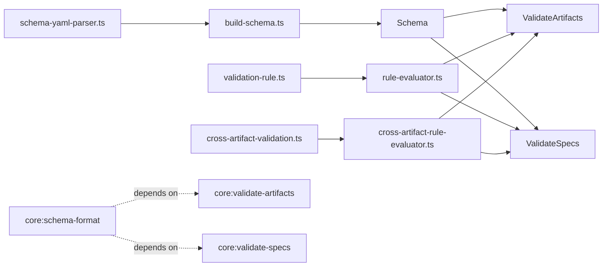

# Design: cross-artifact-validations

## Non-goals

- Supporting cross-spec validation or change-wide relational validation. V1 is limited to artifacts from the same spec.
- Supporting mixed-scope relations between `scope: spec` and `scope: change`.
- Adding a scripting escape hatch for schema authors.
- Extending selector semantics themselves. This change reuses selectors and adds relation/count semantics around them.

## Affected areas

- `packages/core/src/infrastructure/schema-yaml-parser.ts`
  Change: extend the YAML/Zod schema with `count` on validation rules and top-level `crossArtifactValidations`, including participant, key, and relation shapes.
  Callers: 4 direct, 13 transitive · Risk: CRITICAL
  Note: this is the schema ingestion choke point used by both filesystem schema loaders and validation flows. Any shape mistake breaks schema resolution broadly.

- `packages/core/src/domain/services/build-schema.ts`
  Change: convert the new raw YAML shapes into domain value objects, validate duplicate cross-artifact IDs/aliases, and attach them to `Schema`.
  Callers: kernel/schema registry/schema repository through `buildSchema()` · Risk: HIGH
  Note: this is where semantic validation belongs; parser-level syntax checks must stay separate from domain invariants.

- `packages/core/src/domain/value-objects/schema.ts`
  Change: store and expose `crossArtifactValidations()` alongside existing artifacts/workflow/metadata declarations.
  Callers: many use cases through `SchemaProvider.get()` · Risk: MEDIUM
  Note: this is the narrowest stable place to surface the new schema contract.

- `packages/core/src/domain/value-objects/validation-rule.ts`
  Change: extend `ValidationRule` with cardinality metadata instead of overloading `required`.
  Callers: `rule-evaluator`, `build-schema`, `ArtifactType` · Risk: MEDIUM
  Note: the change is localized but cascades through schema building and evaluation.

- `packages/core/src/domain/value-objects/artifact-type.ts`
  Change: continue owning local `validations` and `deltaValidations` unchanged in placement, but against the expanded `ValidationRule` type.
  Callers: `ValidateArtifacts`, `ValidateSpecs`, instruction builders · Risk: MEDIUM
  Note: no new behavior should live here; only type surface changes.

- `packages/core/src/domain/services/rule-evaluator.ts`
  Change: add `count` enforcement to local and delta rule evaluation while preserving current selector/path semantics and warning/failure result shape.
  Callers: 4 direct, 3 indirect, 2 transitive dependents across 8 affected files · Risk: MEDIUM
  Note: `evaluateRules()` and `evaluateRule()` fan into both validation use cases, kernel wiring, and test fixtures. Keep it pure and avoid leaking cross-artifact concerns into the local evaluator.

- `packages/core/src/application/use-cases/validate-artifacts.ts`
  Change: retain parsed locally valid artifact outputs, run a second relational validation pass, and surface deferred rule notices as warnings.
  Callers: 2 direct and 1 transitive dependent focused on the use case's own result types · Risk: MEDIUM
  Note: this is the change-time execution chokepoint and owns merged `scope: spec` previews plus the existing `ValidationFailure` / `ValidationWarning` contract consumed by CLI rendering.

- `packages/core/src/application/use-cases/validate-specs.ts`
  Change: stop validating each file in isolation; retain parsed ASTs per artifact and run the same relational engine for `scope: spec`.
  Callers: 3 direct dependents across composition, kernel, and tests · Risk: MEDIUM
  Note: this use case currently discards ASTs immediately, so it needs a small internal reshaping while preserving the current aggregate result shape.

- `packages/core/src/composition/use-cases/validate-artifacts.ts`
  Change: wire any new pure-domain helper imports if constructor or options change.
  Callers: kernel composition only · Risk: LOW

- `packages/core/src/composition/use-cases/validate-specs.ts`
  Change: wire any new pure-domain helper imports if constructor or options change.
  Callers: kernel composition only · Risk: LOW

- `packages/core/test/infrastructure/schema-yaml-parser.spec.ts`
  Change: cover schema YAML parsing for `count` and `crossArtifactValidations`.

- `packages/core/test/domain/services/build-schema.spec.ts`
  Change: cover semantic validation for duplicate aliases, mixed-scope rules, and invalid relation option combinations.

- `packages/core/test/domain/services/rule-evaluator.spec.ts`
  Change: cover `count.exactly`, `count.min`, `count.max`, and the unchanged zero-match semantics of `required`.

- `packages/core/test/application/use-cases/validate-artifacts.spec.ts`
  Change: cover merged-output relational validation, deferred notices, and single-artifact execution behavior.

- `packages/core/test/application/use-cases/validate-specs.spec.ts`
  Change: cover archived-spec relational validation and reuse of the same relation semantics.

- `docs/adr/0010-schema-format.md`
  Change: document the new schema language additions (`count`, `crossArtifactValidations`, `keySelector`, relation options) so repo documentation stays aligned with the schema contract.

- `docs/schemas/schema-format.md`
  Change: update the schema authoring guide so the documented root fields, local validation semantics, and requirement-mirroring examples match the new `count` and `crossArtifactValidations` contract.

- `docs/schemas/examples/validations-and-delta-validations.md`
  Change: expand examples to show cardinality checks and at least one cross-artifact relational rule so schema authors have a concrete reference beyond the ADR.

## New constructs

- `packages/core/src/domain/value-objects/cross-artifact-validation.ts`
  Shape:

  ```ts
  export interface ValidationCount {
    readonly exactly?: number
    readonly min?: number
    readonly max?: number
    readonly unique?: {
      readonly by: CrossArtifactKeySpec
      readonly minUnique?: number
      readonly maxUnique?: number
      readonly exactlyUnique?: number
    }
  }

  export type CrossArtifactScope = 'spec' | 'change'
  export type CrossArtifactKeySource = 'label' | 'value' | 'content'
  export type CrossArtifactRelationKind = 'all-equal' | 'subset' | 'superset'
  export type CrossArtifactOrdering = 'ignore' | 'strict'

  export interface CrossArtifactKeySpec {
    readonly from: CrossArtifactKeySource
    readonly capture?: string
    readonly strip?: string
  }

  export interface CrossArtifactParticipant {
    readonly artifact: string
    readonly as: string
    readonly selector: Selector
    readonly keySelector?: Selector
    readonly key: CrossArtifactKeySpec
  }

  export interface CrossArtifactRelation {
    readonly kind: CrossArtifactRelationKind
    readonly between: readonly string[]
    readonly options?: {
      readonly ordering?: CrossArtifactOrdering
    }
  }

  export interface CrossArtifactValidationRule {
    readonly id: string
    readonly scope: CrossArtifactScope
    readonly participants: readonly CrossArtifactParticipant[]
    readonly relation: CrossArtifactRelation
  }
  ```

  Responsibility: domain contract for relational validation rules; it does not parse YAML and it does not evaluate ASTs.
  Relationships: built by `build-schema.ts`, stored on `Schema`, consumed by the new relational evaluator and both validation use cases.

- `packages/core/src/domain/services/cross-artifact-rule-evaluator.ts`
  Shape:

  ```ts
  export interface CrossArtifactEvaluationFailure {
    readonly artifactId: string
    readonly description: string
  }

  export interface CrossArtifactEvaluationWarning {
    readonly artifactId: string
    readonly description: string
  }

  export interface CrossArtifactParticipantInput {
    readonly artifactId: string
    readonly root: SelectorNode
    readonly parser: RuleEvaluatorParser
  }

  export interface CrossArtifactEvaluationContext {
    readonly rule: CrossArtifactValidationRule
    readonly participants: ReadonlyMap<string, CrossArtifactParticipantInput>
  }

  export interface CrossArtifactEvaluationResult {
    readonly failures: readonly CrossArtifactEvaluationFailure[]
    readonly warnings: readonly CrossArtifactEvaluationWarning[]
  }

  export function evaluateCrossArtifactRule(
    context: CrossArtifactEvaluationContext,
  ): CrossArtifactEvaluationResult
  ```

  Responsibility: pure set/sequence comparison over already-parsed participant ASTs. It does not load files, merge deltas, or persist state.
  Relationships: called by `ValidateArtifacts` and `ValidateSpecs`; internally reuses selector matching and subtree rendering for key extraction.

- `packages/core/src/application/use-cases/_shared/cross-artifact-participant-state.ts`
  Shape:
  ```ts
  export interface ReadyArtifactParticipant {
    readonly artifactId: string
    readonly key: string
    readonly scope: 'spec' | 'change'
    readonly root: SelectorNode
    readonly parser: ArtifactParser
    readonly filename: string
  }
  ```
  Responsibility: application-layer carrier for parsed/validated artifact outputs across the local-validation pass and the relational pass.
  Relationships: used by both `ValidateArtifacts` and `ValidateSpecs`; not exposed outside application code.

## Approach

The implementation stays split into two passes:

1. Parse and build the schema contract.
2. Evaluate local artifact rules.
3. Evaluate relational rules only over artifacts that are already locally valid and parsed.

That ordering satisfies the changed requirements without mixing responsibilities.

### 1. Extend schema parsing and domain building

`schema-yaml-parser.ts` will accept:

- `count` on `ValidationRuleRaw`
- top-level `crossArtifactValidations`
- participant-local `selector`, optional `keySelector`, and `key`
- relation `kind`, `between`, and `options.ordering`

`build-schema.ts` will then convert those raw shapes into domain value objects and enforce semantic invariants that do not belong in Zod:

- `exactly` cannot coexist with `min` or `max`
- participant aliases (`as`) must be unique within one cross-artifact rule
- `relation.between` aliases must all exist in the participant set
- only `all-equal`, `subset`, and `superset` are accepted
- `scope` of every referenced artifact must match the rule scope
- all participants in one rule must belong to the same scope family

This keeps parser errors syntactic and builder errors semantic, consistent with the current schema pipeline.

### 2. Expand local rule evaluation with cardinality

`rule-evaluator.ts` remains the local evaluator. It should not know about multiple artifacts.

The change is limited to `evaluateRule()`:

- zero selected nodes keep the existing `required` behavior
- once one or more nodes are selected, evaluate `count` before `contentMatches` and `children`
- count failures are added to `failures` without suppressing other per-node checks

This preserves current selector semantics and satisfies:

- uniqueness via `count.exactly: 1`
- minimum child counts via `count.min`
- bounded counts via `count.min` + `count.max`

### 3. Add a pure relational evaluator

Cross-artifact comparison does not fit cleanly in `rule-evaluator.ts`, because it is not “rule against one root” anymore. The design therefore introduces a second pure service: `cross-artifact-rule-evaluator.ts`.

That service will:

1. Receive already-ready participants as AST roots plus parsers.
2. Resolve each participant `selector`.
3. If `keySelector` exists, reselect within each matched node; otherwise use the selected nodes directly as key-producing nodes.
4. Extract keys from `label`, `value`, or rendered `content`.
5. Apply `capture` and `strip`.
6. Compare the resulting key collections using:
   - `all-equal`
   - `subset`
   - `superset`
   - `ordering: ignore | strict`

The evaluator stays format-agnostic. Markdown/YAML/JSON differences are handled entirely by parser ASTs plus selector/key extraction.

### 4. Reshape `ValidateArtifacts` around a two-pass execution

`ValidateArtifacts.execute()` already parses local artifacts. The change is to retain successful parsed outputs instead of discarding them after local validation.

Implementation outline:

1. Keep the existing expected-path, delta-validation, delta-apply, and local-validation flow.
2. For every artifact that reaches local success, store a `ReadyArtifactParticipant`.
3. After the per-artifact loop, collect schema `crossArtifactValidations` matching:
   - the requested `artifactId` if present
   - the current `specPath`
   - the participant scope
4. For each relation:
   - if all participant artifacts are present in the ready map, evaluate it
   - otherwise emit a deferred warning
5. Fold relational failures and warnings into the existing result shape.

For `scope: spec`, the ready participant root must be the merged preview AST, never the raw delta AST. This is the key semantic distinction that keeps spec-scoped validation aligned with archive-time behavior.

### 5. Reshape `ValidateSpecs` to retain ASTs and reuse the same evaluator

`ValidateSpecs._validateSpec()` currently validates one artifact and throws away the AST. It needs a small internal refactor:

1. Iterate spec-scoped artifacts.
2. Parse the artifact if it has local rules or is referenced by any `crossArtifactValidations` rule.
3. Run local validation when local rules exist.
4. If local validation passes, retain the parsed AST in a per-spec ready map.
5. After the artifact loop, run the same relational evaluator for schema rules with `scope: spec`.

The relational service must be shared with `ValidateArtifacts`; do not duplicate the logic in `ValidateSpecs`.

### 6. Documentation alignment

`docs/adr/0010-schema-format.md`, `docs/schemas/schema-format.md`, and `docs/schemas/examples/validations-and-delta-validations.md` all need updates to reflect that schema validation is no longer only artifact-local. The documentation pass should cover:

- `count` as the cardinality primitive
- `crossArtifactValidations` as a first-class schema root field
- `keySelector` as the nested key extraction mechanism
- updated examples that show deferred relational validation and requirement-mirroring without hardcoded file-pair logic

## Key decisions

**Introduce a new relational evaluator instead of teaching `rule-evaluator.ts` about multiple artifacts** → keeps the existing local rule engine simple and pure, and avoids turning one function into two unrelated evaluation models.
**Alternatives rejected** → extending `evaluateRules()` with artifact maps or multi-root mode would blur local vs relational concerns and raise regression risk in a high-fan-in file.

**Model cross-artifact rules as domain value objects on `Schema`** → keeps YAML parsing, semantic validation, and runtime evaluation separated cleanly.
**Alternatives rejected** → leaving them as raw parser output would push schema-shape knowledge into use cases and duplicate validation logic.

**Keep `count` inside `ValidationRule` instead of inventing special-case flags** → one cardinality vocabulary covers top-level and `children` rules consistently.
**Alternatives rejected** → separate booleans like `unique`, `minMatches`, `maxMatches` fragment the model and complicate validation/building.

**Use `keySelector` instead of making `key` a navigation mini-language** → reuses the existing selector model and keeps extraction simple.
**Alternatives rejected** → `key.from.children.*`-style traversal duplicates selectors and creates a second AST navigation language.

**Surface deferred cross-artifact rules as warnings in existing result shapes** → preserves current API compatibility while making the skipped relational checks visible.
**Alternatives rejected** → silent omission hides important state; a new top-level `notes` channel would require broader API churn across CLI and tests.

## Trade-offs

- `[Schema complexity]` More schema surface means more parser/build-schema validation logic. → Mitigation: keep v1 operators small and reject unsupported combinations early.
- `[Evaluation overhead]` `ValidateSpecs` will parse some artifacts that have no local validations only because they are participants in a relational rule. → Mitigation: gate parsing to artifacts referenced by `crossArtifactValidations`.
- `[Warning overload]` Deferred cross-artifact notices may appear more often during partial validation. → Mitigation: standardize one compact warning message per deferred rule, not per missing participant node.
- `[Future extensibility]` The v1 relation model does not cover field-aware structured extraction beyond selector + keySelector + label/value/content. → Mitigation: leave the relational evaluator isolated so key extraction can evolve later without changing use-case orchestration.

## Spec impact

### `core:schema-format`

- Direct dependents: `core:parse-schema-yaml`, `core:build-schema`, `core:resolve-schema`, `core:get-active-schema`, `core:get-artifact-instruction`, `core:generate-metadata`, `core:delta-format`, `core:schema-merge`, several CLI schema commands, and `default:_global/spec-layout`.
- Transitive dependents: schema-loading and validation flows through kernel/composition.
- Assessment:
  - `core:parse-schema-yaml` and `core:build-schema` are implementation dependents, not requirement dependents; their existing requirements remain satisfied because they already own schema ingestion/semantic validation responsibilities.
  - `core:delta-format` references `deltaValidations` generically and remains semantically compatible; no spec delta needed.
  - CLI schema inspection specs describe showing schema structure at a high level; no requirement text change is forced by this design.

### `core:validate-artifacts`

- Direct dependents: `cli:change-validate`, `core:archive-change`, `core:transition-change`, `core:kernel`, `core:approve-spec`, `core:approve-signoff`.
- Transitive dependents: lifecycle and archive workflows that require artifact validation to gate progression.
- Assessment:
  - No dependent spec currently constrains artifact validation to be strictly artifact-local, so adding a second relational pass does not invalidate them.
  - `cli:change-validate` consumes the existing result shape. Because we are reusing `warnings`/`failures`, no additional CLI spec change is required.

### `core:validate-specs`

- Direct dependents: `cli:spec-validate`, `core:kernel`, `core:save-spec-metadata`, `core:generate-metadata`.
- Transitive dependents: metadata and repository tooling that assume archived specs can be structurally audited.
- Assessment:
  - `cli:spec-validate` becomes more useful but not incompatible; it still reports spec failures/warnings through the same aggregate model.
  - No downstream spec requires a separate result channel for relational checks, so no extra spec ripple is needed.

No additional spec deltas are required beyond the three already in scope.

## Dependency map



```text
┌──────────────────────────┐
│ schema-yaml-parser.ts    │
│ [CRITICAL schema ingest] │
└──────────────┬───────────┘
               │ raw schema
               ▼
┌──────────────────────────┐
│ build-schema.ts          │
│ builds value objects     │
└───────┬───────────┬──────┘
        │           │
        ▼           ▼
┌───────────────┐  ┌──────────────────────────┐
│ Schema        │  │ validation-rule.ts       │
│ + cross rules │  │ + count                  │
└──────┬────────┘  └─────────────┬────────────┘
       │                         │
       │                         ▼
       │                ┌──────────────────────┐
       │                │ rule-evaluator.ts    │
       │                │ local rules only     │
       │                └──────────┬───────────┘
       │                           │
       │         ┌─────────────────┴─────────────────┐
       │         │                                   │
       ▼         ▼                                   ▼
┌───────────────┐        ┌──────────────────────────┐
│ cross-artifact│───────▶│ cross-artifact-rule-    │
│ value objects │        │ evaluator.ts            │
└───────────────┘        └──────────┬──────────────┘
                                    │
                      ┌─────────────┴─────────────┐
                      ▼                           ▼
             ┌──────────────────┐        ┌──────────────────┐
             │ ValidateArtifacts │        │ ValidateSpecs    │
             │ merged spec pass  │        │ archived spec    │
             └──────────────────┘        └──────────────────┘

┌───────────────────────┐   depends on   ┌────────────────────────┐
│ core:validate-specs   │ ─ ─ ─ ─ ─ ─ ─▶ │ core:validate-artifacts│
└───────────────────────┘                └────────────────────────┘
             ▲
             │ depends on
             │
┌───────────────────────┐
│ core:schema-format    │
└───────────────────────┘
```

## Testing

**Automated tests**

- `packages/core/test/infrastructure/schema-yaml-parser.spec.ts`
  Add cases for:
  - parsing `count.exactly`, `count.min`, `count.max`
  - parsing `crossArtifactValidations`
  - rejecting unsupported top-level relation fields or malformed participant blocks

- `packages/core/test/domain/services/build-schema.spec.ts`
  Add cases for:
  - `exactly` combined with `min`/`max` rejected
  - duplicate participant aliases rejected
  - mixed-scope relation rejected
  - invalid `between` aliases rejected

- `packages/core/test/domain/services/rule-evaluator.spec.ts`
  Add cases mapping to verify scenarios:
  - zero-match + `required: true` => failure
  - zero-match + `required: false` => warning
- `count.unique.by` rejects duplicates by normalized key
  - `count.min` / `count.max` failures
  - `children` with `count.min: 1`

- `packages/core/test/domain/services/cross-artifact-rule-evaluator.spec.ts`
  New file covering:
  - `all-equal` unordered
  - `all-equal` strict ordered
  - `subset` unordered
  - `subset` strict subsequence semantics
  - `superset` mirror semantics
  - `keySelector`-based nested extraction

- `packages/core/test/application/use-cases/validate-artifacts.spec.ts`
  Add cases for:
  - spec-scoped cross-artifact checks run against merged previews
  - `artifactId` partial validation still evaluates relevant relational rules
  - deferred warning emitted when a participant is not ready
  - relational mismatch adds a failure without changing file-path reporting

- `packages/core/test/application/use-cases/validate-specs.spec.ts`
  Add cases for:
  - artifacts with no local rules still parsed when referenced by cross rules
  - same relational evaluator used for archived specs
  - deferred warning propagation in aggregated results

**Manual / E2E verification**

- Re-run artifact validation for this change:
  - `node packages/cli/dist/index.js changes validate cross-artifact-validations core:schema-format --artifact specs --format text`
  - `node packages/cli/dist/index.js changes validate cross-artifact-validations core:validate-artifacts --artifact specs --format text`
  - `node packages/cli/dist/index.js changes validate cross-artifact-validations core:validate-specs --artifact specs --format text`
  - `node packages/cli/dist/index.js changes validate cross-artifact-validations core:schema-format --artifact verify --format text`
  - `node packages/cli/dist/index.js changes validate cross-artifact-validations core:validate-artifacts --artifact verify --format text`
  - `node packages/cli/dist/index.js changes validate cross-artifact-validations core:validate-specs --artifact verify --format text`
    Expected: structural pass for all three specs; no missing coverage.

- Inspect merged previews after implementation:
  - `node packages/cli/dist/index.js changes spec-preview cross-artifact-validations core:schema-format --artifact specs --format text`
  - `node packages/cli/dist/index.js changes spec-preview cross-artifact-validations core:validate-artifacts --artifact verify --format text`
    Expected: the new `Cross-artifact validation rules` requirement and scenarios appear in order.

- Validate archived specs end-to-end once code is implemented:
  - `node packages/cli/dist/index.js specs validate --format text`
    Expected: existing project specs still pass; any intentionally broken relational fixture should fail with a relational description.

- Validate change-time partial execution once code is implemented:
  - `node packages/cli/dist/index.js changes validate <fixture-change> <specId> --artifact verify --format text`
    Expected: if `specs` is ready, the cross-artifact rule runs; if not, a deferred warning is shown.

- Documentation update check:
  - review `docs/adr/0010-schema-format.md`
  - review `docs/schemas/schema-format.md`
  - review `docs/schemas/examples/validations-and-delta-validations.md`
    Expected: terminology matches `crossArtifactValidations`, `count`, `keySelector`, and relation options exactly across both ADR and author-facing docs.

Global constraints observed:

- Domain services remain pure (`rule-evaluator`, new relational evaluator).
- No I/O is introduced in domain code.
- New types/interfaces stay ESM/named-export compatible.
- Tests remain under existing `packages/core/test/...` structure.
- Any new public types/functions need JSDoc matching `default:_global/docs`.
