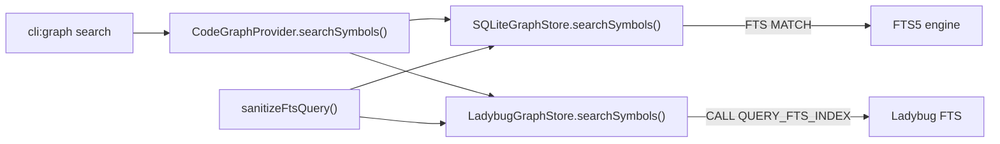

# Design: sanitize-fts-query

## Non-goals

- Refactoring the SQLite store to change its parameterized query approach (already safe)
- Changing the abstract `GraphStore` port or `SearchOptions` interface
- Modifying the CLI layer or provider layer for query validation
- Changing the FTS index schema or tokenizer configuration

## Affected areas

- `packages/code-graph/src/infrastructure/sqlite/sqlite-graph-store.ts`
  - `searchSymbols()` (line 447): add `sanitizeFtsQuery()` call before FTS5 MATCH
  - `searchSpecs()` (line 505): add `sanitizeFtsQuery()` call before FTS5 MATCH
  - Callers: 1 direct test file (`test/infrastructure/sqlite/sqlite-graph-store.spec.ts`)
  - Risk: LOW — internal method, no API change

- `packages/code-graph/src/infrastructure/ladybug/ladybug-graph-store.ts`
  - `searchSymbols()` (line 999): add FTS sanitization + migrate to prepared statement
  - `searchSpecs()` (line 1048): add FTS sanitization + migrate to prepared statement
  - All other query methods (~36): migrate from string interpolation to prepared statements
  - `this.escape()` (line 1310): remove after migration
  - `exec()` helper (line 38): replace or augment with prepared-statement-aware helper
  - Callers: 2 test files (`test/infrastructure/ladybug/ladybug-graph-store.spec.ts`, `test/infrastructure/ladybug/ladybug-graph-store-multi-kind.spec.ts`)
  - Risk: LOW — internal implementation, same test contract

- `packages/code-graph/test/helpers/in-memory-graph-store.ts`
  - `searchSymbols()` (line 359): no change needed (in-memory mock doesn't use FTS)
  - Risk: NONE

## New constructs

### `sanitizeFtsQuery(query: string): string`

- **Location**: `packages/code-graph/src/infrastructure/sanitize-fts-query.ts`
- **Shape**: Pure function, no dependencies, exported as named export
- **Responsibility**: Transforms a raw user search query into a safe FTS query string by wrapping each whitespace-separated token in double quotes and joining with `AND`. Prevents FTS engines from interpreting user input as boolean operators, column filters, or other FTS syntax.
- **Algorithm**:
  1. Trim the input
  2. Split on whitespace
  3. Filter out empty tokens
  4. Wrap each token in double quotes (escaping any internal double quotes by doubling them)
  5. Join with `AND`
  6. Return empty string if no valid tokens remain
- **Relationships**: Used by both `SQLiteGraphStore.searchSymbols()`, `SQLiteGraphStore.searchSpecs()`, `LadybugGraphStore.searchSymbols()`, and `LadybugGraphStore.searchSpecs()`

### Prepared statement helpers in LadybugGraphStore

- **Location**: `packages/code-graph/src/infrastructure/ladybug/ladybug-graph-store.ts` (private methods)
- **Shape**: Private helper methods or refactored `exec()` that use `conn.prepare()` + `conn.execute(stmt, params)`
- **Responsibility**: Encapsulate the prepare/execute pattern for LadybugDB queries, replacing string interpolation
- **Relationships**: Internal to `LadybugGraphStore`, replaces `this.escape()` usage

## Approach

### Phase 1: FTS sanitization (both stores)

1. Create `sanitizeFtsQuery()` in `packages/code-graph/src/infrastructure/sanitize-fts-query.ts`
2. Import and use in `SQLiteGraphStore.searchSymbols()` and `searchSpecs()` — apply to `options.query` before passing to `MATCH ?`
3. Import and use in `LadybugGraphStore.searchSymbols()` and `searchSpecs()` — apply to `options.query` before passing to `CALL QUERY_FTS_INDEX(...)`

### Phase 2: Ladybug prepared statements

1. Create private helper method(s) for prepare + execute pattern
2. Migrate query methods category by category:
   - **Simple lookups** (`getFile`, `getSymbol`, `getSpec`, `findFilesByConfigRelativePath`): single `$param` per query
   - **Relation queries** (`getRelationsBySource`, `getRelationsByTarget`, etc.): `$source`/`$target` params
   - **Node mutations** (`upsertFile`, `upsertSpec`, `removeFile`, `removeSpec`): multiple `$param` bindings per node property
   - **Search methods** (`searchSymbols`, `searchSpecs`): FTS query + filter params
   - **Bulk operations** (`bulkLoad`, `addRelations`): COPY and batched creates
   - **Admin** (`clear`, `recreate`, metadata): DDL and static queries
3. Remove `this.escape()` once all queries are migrated
4. Keep direct `conn.query()` for DDL, COPY, and queries with only compile-time constant values

### Order of operations

Phase 1 first (FTS fix) since it's the critical bug fix. Phase 2 (prepared statements) is a safety improvement that can follow.

## Key decisions

**Decision**: Place `sanitizeFtsQuery()` in `infrastructure/` directory, not in `domain/`.
→ Rationale: The function is specific to FTS query syntax, which is an infrastructure concern. It has no domain meaning.
→ Alternatives rejected: Placing it in `domain/services/` — would violate hexagonal architecture since FTS syntax is an engine detail.

**Decision**: Wrap tokens in double quotes and join with `AND`.
→ Rationale: This is the standard FTS5 approach for literal phrase matching. Double quotes make FTS5 treat the entire token as a literal string, preventing interpretation of `-`, `AND`, `OR`, `NOT`, `column:`, `*` as operators.
→ Alternatives rejected: Escaping individual special characters — fragile, incomplete, different FTS engines have different special characters.

**Decision**: Keep `conn.query()` for DDL and COPY in Ladybug.
→ Rationale: These queries use no user-supplied values. Prepared statements add overhead for no security benefit on compile-time constant queries.
→ Alternatives rejected: Migrating everything to prepared statements — unnecessary complexity for static queries.

## Trade-offs

- [FTS query becomes stricter] → Users can no longer use intentional FTS5 advanced syntax (boolean operators, column filters). This is acceptable because the CLI search is designed for simple keyword searches, not FTS power-user queries.
- [Ladybug prepared statement migration is large scope] → Mitigate by migrating category by category, running tests after each category.

## Spec impact

### `code-graph:sqlite-graph-store`

- Direct dependents: `code-graph:composition`, `code-graph:graph-store`
- Transitive: no transitive spec dependents affected
- Changes: `searchSymbols` and `searchSpecs` now sanitize FTS query — purely internal, no observable API change for callers

### `code-graph:ladybug-graph-store`

- Direct dependents: `code-graph:composition`, `code-graph:graph-store`
- Transitive: no transitive spec dependents affected
- Changes: FTS sanitization + prepared statements — purely internal, no observable API change

No downstream specs need updating.

## Dependency map



```
┌───────────────┐      ┌─────────────────────────┐
│ cli:graph     │─────▶│ CodeGraphProvider       │
│ search        │      │ .searchSymbols()        │
└───────────────┘      └──────────┬──────────────┘
                                  │
                     ┌────────────┴────────────┐
                     ▼                         ▼
           ┌─────────────────┐       ┌──────────────────┐
           │ SQLiteGraphStore│       │ LadybugGraphStore │
           │ .searchSymbols()│       │ .searchSymbols()  │
           │                 │       │                   │
           │ uses: ? params  │       │ migrate to:       │
           │ + sanitizeFts() │       │ prepared stmts    │
           └────────┬────────┘       │ + sanitizeFts()   │
                    │                └────────┬───────────┘
                    ▼                         ▼
              ┌──────────┐            ┌──────────────┐
              │  FTS5    │            │  Ladybug FTS │
              │  engine  │            │  engine      │
              └──────────┘            └──────────────┘

              ┌──────────────────────┐
              │  sanitizeFtsQuery()  │
              │  (new, shared)       │
              └──────────┬───────────┘
              ┌──────────┴───────────┐
              │ used by both stores  │
              └──────────────────────┘
```

## Testing

### Automated tests

- `packages/code-graph/test/infrastructure/sqlite/sqlite-graph-store.spec.ts`
  - Add test: search with hyphenated query does not throw
  - Add test: search with `AND OR NOT` treats them as literal terms
  - Add test: search with empty query returns empty results
  - Add test: search with special FTS characters (`*`, `:`, `"`) does not crash

- `packages/code-graph/test/infrastructure/ladybug/ladybug-graph-store.spec.ts`
  - Same FTS sanitization tests as SQLite above
  - Add test: verify `getFile()` uses prepared statement (no string interpolation)
  - Add test: verify `upsertFile()` uses prepared statement for node properties

- `packages/code-graph/test/infrastructure/sanitize-fts-query.spec.ts` (new file)
  - Test: simple word → wrapped in quotes
  - Test: multiple words → joined with AND, each quoted
  - Test: hyphenated term → treated as single token, quoted
  - Test: term with internal quotes → quotes doubled
  - Test: empty string → empty string
  - Test: whitespace-only → empty string
  - Test: FTS operators (AND, OR, NOT) → treated as literal terms

- Existing `graphStoreContractTests` in `test/domain/ports/graph-store.contract.ts`
  - Existing search tests should continue passing unchanged (API is the same)
  - Covers: `graph-store.contract.ts:graphStoreContractTests` (12 direct dependents, MEDIUM risk)

### Manual / E2E verification

```bash
# Build
pnpm --filter @specd/code-graph build

# Verify the original error is fixed
node packages/cli/dist/index.js graph search "effectiveStatus findBlockingParent pending-parent-artifact-review overlapDetail" --symbols --format toon

# Verify simple search still works
node packages/cli/dist/index.js graph search "sanitizeFts" --symbols --format toon

# Verify spec search still works
node packages/cli/dist/index.js graph search "architecture" --specs --format toon

# Run all code-graph tests
pnpm --filter @specd/code-graph test
```

## Open questions

_none_
