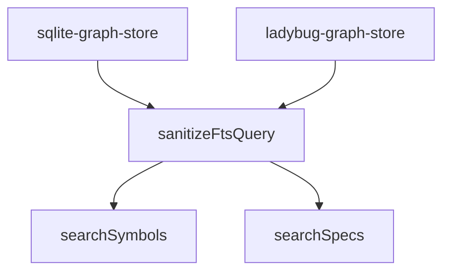

# Design: improve-graph-search-discovery

## Affected areas

- `sanitizeFtsQuery` in `packages/code-graph/src/infrastructure/sqlite/sqlite-graph-store.ts`
  Change: Replace `.join(' AND ')` with `.join(' OR ')`.
  Callers: `searchSymbols`, `searchSpecs`.
  Risk: LOW (purely additive logic change).
- `sanitizeFtsQuery` in `packages/code-graph/src/infrastructure/ladybug/ladybug-graph-store.ts`
  Change: Replace `.join(' AND ')` with `.join(' OR ')`.
  Callers: `searchSymbols`, `searchSpecs`.
  Risk: LOW (purely additive logic change).

## Approach

The implementation involves a simple but high-impact change to the query sanitization function used by both major graph-store backends (SQLite and Ladybug).

1.  **Modify SQLite Sanitization**: Update `packages/code-graph/src/infrastructure/sqlite/sqlite-graph-store.ts`. The existing function splits the query into tokens and joins them with `AND`. By switching to `OR`, FTS5 will return results matching any token.
2.  **Modify Ladybug Sanitization**: Apply the same change to `packages/code-graph/src/infrastructure/ladybug/ladybug-graph-store.ts` to maintain behavioral parity.
3.  **Validate Ranking**: Since both backends already implement BM25 relevance scoring, the move to `OR` will naturally enable a two-step discovery/precision model:
    - **Step 1 (Discovery)**: The `OR` operator ensures records matching even a single term are included in the result set (Recall).
    - **Step 2 (Precision)**: BM25 ranks records containing more terms (higher density) or rarer terms at the top, ensuring that specific multi-term searches still return the most exact matches first.

## Key decisions

- **Decision** → Use explicit `OR` operator in FTS queries.
  Rationale: SQLite FTS5 and Ladybug default to `AND` or phrase searching when no operator is present, which is too restrictive for codebase discovery. Explicit `OR` enables the expected "search-like" behavior.
- **Decision** → Rely on BM25 for precision.
  Rationale: BM25 is industry-standard for ranking search results by relevance. It handles the "precision" side of the search automatically by scoring records that match multiple tokens higher than those that match only one.

## Dependency map



```
  ┌──────────────────┐
  │ sanitizeFtsQuery │
  └────────┬─────────┘
           │
     ┌─────┴─────┐
     ▼           ▼
┌───────────────┐┌─────────────┐
│ searchSymbols ││ searchSpecs │
└───────────────┘└─────────────┘
      ▲                ▲
      │                │
┌─────┴────────────────┴──────┐
│  GraphStore Implementations │
│ (SQLite & Ladybug)          │
└─────────────────────────────┘
```

## Testing

### Automated tests

- **SQLite Integration Tests**:
  - File: `packages/code-graph/test/infrastructure/sqlite/sqlite-graph-store.spec.ts`
  - Test: Update or add a test case to verify that a multi-term query for symbols in different files returns both symbols.
  - Test: Verify that a query with a term present in two symbols ranks the one matching more terms higher.

### Manual / E2E verification

1.  Rebuild the CLI: `pnpm run build` (specifically in `packages/code-graph` and `packages/cli`).
2.  Index the current project: `node packages/cli/dist/index.js graph index`.
3.  Perform a multi-term search: `node packages/cli/dist/index.js graph search "effectiveStatus findBlockingParent" --symbols`.
4.  **Expectation**: Both the `effectiveStatus` methods and the `findBlockingParent` methods should appear in the results, whereas previously it returned zero results.
