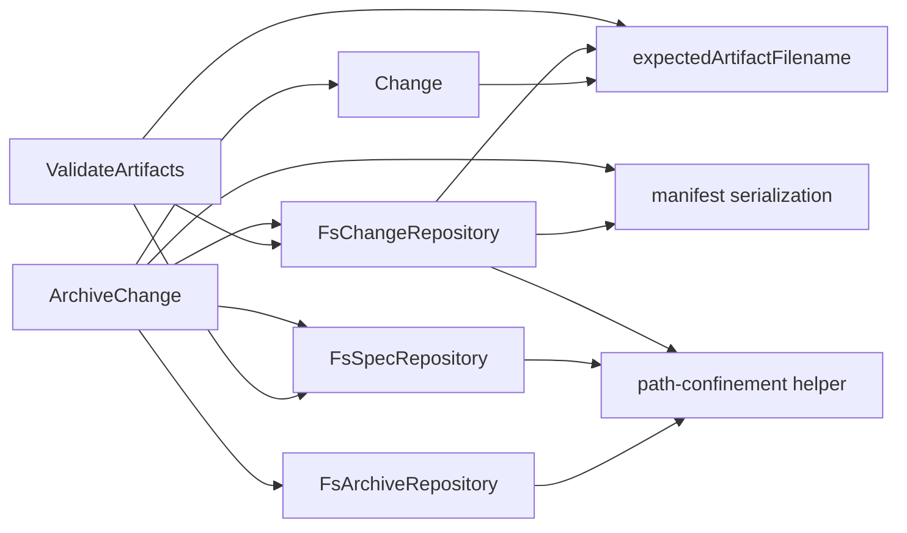

# Design: harden-archive-reload-consistency

## Non-goals

- Do not introduce a brand-new public transaction API across all repositories in this change.
- Do not redesign the full workflow model around a persistent `archiving` recovery state.
- Do not broaden artifact access to arbitrary files for convenience; the goal is the opposite.
- Do not change the global logging spec; this change consumes the existing `Logger` facility.

## Affected areas

- `ArchiveChange` in `packages/core/src/application/use-cases/archive-change.ts`
  Change: stop probing synthetic delta paths, prepare a full archive plan in memory, record failed attempts, and emit debug logs around tracked selection and staged commit boundaries.
  Callers: 19 direct dependents, 1 indirect via composition/tests according to graph impact. Risk: HIGH.
  Note: this is the behavioral center of the bug and already has dense regression coverage in `packages/core/test/application/use-cases/archive-change.spec.ts`.

- `expectedArtifactFilename()` in `packages/core/src/domain/services/artifact-filename.ts`
  Change: keep it as the resolver for initial expected paths, but stop treating it as authority once a tracked filename has already been persisted.
  Callers: 4 direct, 10 indirect, 21 transitive dependents. Risk: CRITICAL.
  Note: this function feeds `Change.syncArtifacts()`, `ValidateArtifacts`, and `FsChangeRepository` reload semantics, so misuse here ripples widely.

- `Change` in `packages/core/src/domain/entities/change.ts`
  Change: add explicit domain support for `archive-failed` history entries and preserve tracked filenames during artifact sync instead of silently flipping representation class on reload.
  Callers: broad transitive fan-in through lifecycle, manifest, and CLI flows. Risk: HIGH.
  Note: the event model change is small, but history/event-sourcing semantics touch multiple serializers and tests.

- `ValidateArtifacts` in `packages/core/src/application/use-cases/validate-artifacts.ts`
  Change: validate against the tracked artifact file from the manifest/change state, not a recomputed alternate path; enforce artifact-level base existence for deltas; reject invalid mixed new-spec representations before archive; add debug logs.
  Callers: surfaced through validation commands and workflow gating. Risk: HIGH.
  Note: this is the earliest safe chokepoint for catching the original `verify`-delta bug.

- `FsChangeRepository` in `packages/core/src/infrastructure/fs/change-repository.ts`
  Change: constrain `artifact()` / `artifactExists()` to tracked filenames only, add strict root confinement, preserve tracked filenames on manifest reload, serialize `archive-failed`, and emit debug diagnostics.
  Callers: 8 direct, 23 indirect, 18 transitive dependents. Risk: CRITICAL.
  Note: the current implementation reads any joined relative path and also renormalizes filenames based on coarse `specExists`, which is the second half of the reported failure.

- `FsSpecRepository` in `packages/core/src/infrastructure/fs/spec-repository.ts`
  Change: constrain `artifact()` and `save()` to expected artifact filenames, enforce spec-root confinement, and emit debug diagnostics.
  Callers: 4 direct, 14 indirect, 10 transitive dependents. Risk: CRITICAL.
  Note: this is the same arbitrary-filename pattern as `FsChangeRepository`, but on permanent specs.

- `FsArchiveRepository` in `packages/core/src/infrastructure/fs/archive-repository.ts`
  Change: confine archive-path derivation to archive root, stage archive persistence more defensively, and emit debug logs for path resolution and commit phases.
  Callers: 4 direct, 6 indirect, 5 transitive dependents. Risk: HIGH.
  Note: the public surface is smaller than the other repositories, but path/index recovery is still a security and consistency boundary.

- Manifest serialization in `packages/core/src/infrastructure/fs/manifest.ts`
  Change: add raw manifest support for `archive-failed` events and keep success traceability on archived manifests via existing `archivedAt` / `archivedBy`.
  Callers: loaded by both active and archived repository adapters. Risk: MEDIUM.

- Regression suites
  Change: extend
  `packages/core/test/application/use-cases/archive-change.spec.ts`,
  `packages/core/test/application/use-cases/validate-artifacts.spec.ts`,
  `packages/core/test/infrastructure/fs/change-repository.spec.ts`,
  `packages/core/test/infrastructure/fs/spec-repository.spec.ts`,
  `packages/core/test/infrastructure/fs/archive-repository.spec.ts`,
  `packages/core/test/domain/entities/change.spec.ts`,
  and `packages/core/test/domain/services/artifact-filename.spec.ts`.
  Risk: LOW, but these tests are the executable proof that the bug is closed.

- `docs/` follow-up
  No documentation edit is required if the implementation remains internal.
  If implementation introduces operator-facing recovery guidance, new debug-log usage worth documenting, or a changed archive failure workflow, update the relevant `docs/core/*` material and the storage/archive ADRs (`docs/adr/0007-archive-organization.md`, `docs/adr/0009-artifact-status-derivation.md`) in the same implementation pass.

## New constructs

- `type ArchiveFailureStep = 'prepare' | 'commit' | 'archive' | 'metadata'`
  Location: `packages/core/src/domain/entities/change.ts`
  Shape:

  ```ts
  export type ArchiveFailureStep = 'prepare' | 'commit' | 'archive' | 'metadata'
  ```

  Responsibility: classify where an archive attempt failed for history and debug logs.
  Relationships: consumed by `Change`, manifest serialization, and `ArchiveChange`.

- `interface ArchiveFailedEvent`
  Location: `packages/core/src/domain/entities/change.ts`
  Shape:

  ```ts
  export interface ArchiveFailedEvent {
    readonly type: 'archive-failed'
    readonly at: Date
    readonly by: ActorIdentity
    readonly step: ArchiveFailureStep
    readonly message: string
    readonly commitStarted: boolean
  }
  ```

  Responsibility: record an archive attempt that failed after archive execution started.
  Relationships: serialized by `manifest.ts`; appended only on active changes.

- `recordArchiveFailure(step, message, actor, commitStarted): void`
  Location: `packages/core/src/domain/entities/change.ts`
  Shape:

  ```ts
  recordArchiveFailure(
    step: ArchiveFailureStep,
    message: string,
    actor: ActorIdentity,
    commitStarted: boolean,
  ): void
  ```

  Responsibility: append a single `archive-failed` event without changing the success model.
  Relationships: called from `ArchiveChange` failure handling through `ChangeRepository.mutate(...)`.

- `interface PreparedArchiveWrite`
  Location: `packages/core/src/application/use-cases/archive-change.ts`
  Shape:

  ```ts
  interface PreparedArchiveWrite {
    readonly specId: string
    readonly workspace: string
    readonly spec: Spec
    readonly outputFilename: string
    readonly content: string
  }
  ```

  Responsibility: represent one permanent spec write produced during archive planning.
  Relationships: internal to `ArchiveChange`; consumed by the commit phase.

- `interface PreparedArchivePlan`
  Location: `packages/core/src/application/use-cases/archive-change.ts`
  Shape:

  ```ts
  interface PreparedArchivePlan {
    readonly writes: readonly PreparedArchiveWrite[]
    readonly staleSpecIds: readonly string[]
  }
  ```

  Responsibility: hold the complete write set and metadata-regeneration set before commit starts.
  Relationships: internal to `ArchiveChange`; separates prepare from commit.

- `resolveConfinedPath(root, relative, allowed?): Promise<string>`
  Location: `packages/core/src/infrastructure/fs/path-confinement.ts`
  Shape:
  ```ts
  export async function resolveConfinedPath(
    root: string,
    relative: string,
    allowed?: ReadonlySet<string>,
  ): Promise<string>
  ```
  Responsibility: normalize, reject traversal/escape paths, and optionally enforce membership in an allowed relative-path set.
  Relationships: shared helper used by `FsChangeRepository`, `FsSpecRepository`, and `FsArchiveRepository`.

## Approach

The implementation is split into four coordinated layers.

1. Preserve tracked representation as the source of truth.
   `ArchiveChange` and `ValidateArtifacts` must stop recomputing “the path they wish existed” as the artifact to read. For archive and validation, the authoritative input is `ArtifactFile.filename` already tracked on the `Change`. `expectedArtifactFilename()` stays useful for initial scaffold/sync and for reporting expected paths, but once a filename is persisted and validated it is no longer allowed to be silently swapped to another representation class.

2. Separate archive prepare from archive commit.
   `ArchiveChange.execute()` will first build a `PreparedArchivePlan` in memory:
   - iterate spec-scoped artifacts through tracked `ArtifactFile` entries
   - load only the tracked file from `ChangeRepository.artifact(change, trackedFilename)`
   - if the tracked file is delta-backed, load the exact base artifact for that output file from `SpecRepository.artifact(spec, outputBasename)` and merge in memory
   - accumulate final file contents as `PreparedArchiveWrite[]`
   - collect `staleSpecIds` for metadata regeneration

   Any failure here is a prepare-phase failure: no permanent spec write has started, so the code records `archive-failed(step: 'prepare', commitStarted: false)` and exits with no partial repo materialization.

3. Tighten repository boundaries instead of widening them.
   The user explicitly asked to keep `artifact()` for now. The hardening therefore lives in adapter behavior, not a new public port shape:
   - `FsChangeRepository.artifact()` and `artifactExists()` compute the allowed tracked relative-path set from the change manifest and reject any filename not in that set.
   - `FsSpecRepository.artifact()` and `save()` accept only adapter-expected artifact filenames (`spec.md`, `verify.md`, and adapter-owned metadata through `metadata()` / `saveMetadata()`, not arbitrary extras).
   - all three fs repositories use a shared confinement helper so `../`, alternate separators, and derived paths outside their roots are rejected consistently.

4. Make archive failure visible without inventing a fake success event.
   On failure after archive execution has begun, `ArchiveChange` mutates the active change and appends `archive-failed`. On success, the code does not append a new active-change event; the archived manifest already carries `archivedAt` / `archivedBy`, which remain the success record.

Implementation order:

- Update domain + manifest support for `archive-failed`.
- Harden fs repository path handling and tracked-filename preservation.
- Refactor `ValidateArtifacts` to validate tracked files and enforce artifact-level base existence.
- Refactor `ArchiveChange` into prepare/commit/failure-recording phases.
- Harden `FsArchiveRepository` path resolution and staging.
- Add regression tests last so each behavioral slice is proven independently.

## Key decisions

- **Tracked filename beats recomputation** → the bug exists because use cases and reload logic treat storage conventions as more authoritative than validated change state. The persisted/tracked filename is the contract after artifact sync/validation.
  **Alternatives rejected** → continuing to derive paths from `expectedArtifactFilename(specExists)` on every read. That recreates the original bug whenever repository state is partially materialized.

- **Prepare everything in memory before the first permanent spec write** → this removes the reported failure mode where `spec.md` is written and `verify.md` fails later.
  **Alternatives rejected** → current interleaved merge/write loop, which guarantees partial side effects on late failure.

- **Keep existing port methods and harden implementations** → this matches the user preference to keep `artifact()` for now while still closing the arbitrary-file read gap.
  **Alternatives rejected** → introducing a new tracked-artifact-only public port API in this same change. That is cleaner long-term, but it widens scope across composition, mocks, and all repository consumers.

- **Record only failed attempts on active changes** → an active `Change` can legitimately record that archive started and failed; it should not claim success once it has ceased to exist as an active change.
  **Alternatives rejected** → adding an `archived` history event to `Change`. That would duplicate archived-manifest state and blur the active/archive boundary the user explicitly called out.

- **Use the ambient `Logger` instead of constructor-plumbing a new logger dependency** → core already standardizes debug logging through `Logger.debug(...)`.
  **Alternatives rejected** → threading logger instances through these constructors for this change alone; that would create unnecessary signature churn and violate the current pattern used by `ValidateArtifacts`, `TransitionChange`, and `GetStatus`.

## Trade-offs

- `[Commit-phase partial writes remain possible if a permanent spec save fails mid-commit]` → mitigated by moving all merge/base-resolution failures into prepare, keeping each individual write atomic, and recording `archive-failed(commitStarted: true)` for diagnosis. A true multi-spec transaction would require a broader port redesign and is intentionally out of scope here.

- `[Tracked-filename preservation may keep older manifests in a “weird but valid” state longer]` → mitigated by normalizing only when the representation class is unchanged or equivalence is proven. Safety is more important than aggressive cleanup.

- `[Repository hardening can expose latent tests or helper code that relied on arbitrary filenames]` → mitigated by updating test helpers in the same patch and funnelling any legitimate metadata access through dedicated metadata APIs instead of `artifact()`.

## Spec impact

### `core:archive-change`

- Direct dependents observed in metadata: `cli:change-archive`, `core:get-archived-change`, `core:list-archived`, `core:template-variables`, `core:workflow-model`, `core:hook-execution-model`, `core:archive-repository-port`, `core:change-layout`.
- Transitive dependents flow through composition/kernel specs and CLI archive commands.
- Assessment: no dependent spec needs a requirement delta. The change tightens internal semantics but does not change the external command contract or hook API.

### `core:change-manifest`

- Direct dependents observed in metadata: `core:change`, `core:change-layout`, `core:change-repository-port`, `core:validate-artifacts`, `core:storage`, `cli:change-deps`, `core:spec-id-format`.
- Assessment: all affected dependents are already in scope except CLI-facing readers, and the new manifest event is additive. No additional spec changes are required outside the current set.

### `core:change-repository-port`, `core:spec-repository-port`, `core:archive-repository-port`, `core:storage`

- Direct dependents span composition/kernel factories plus repo-consuming use cases such as `archive-change`, `compile-context`, `get-spec`, `validate-artifacts`, `list-archived`, and CLI wrappers.
- Assessment: these consumers rely on the same public methods, so scope stays internal to implementation and tests. No downstream spec text currently promises arbitrary filename access, so no ripple delta is needed.

### `core:validate-artifacts`, `core:change-layout`, `core:change`

- Direct dependents include `core:validate-specs`, `core:lifecycle-engine`, `core:edit-change`, approval/signoff flows, and multiple CLI status/transition commands.
- Assessment: behavior becomes stricter but remains compatible with existing workflow semantics. The dependent specs describe lifecycle/use-case orchestration, not the buggy path-probing behavior, so they remain satisfied.

Result: ripple analysis does not reveal any additional spec that requires a requirement change, so the current scope is sufficient.

## Dependency map



```text
┌─────────────────────┐
│ expectedArtifact    │
│ Filename()          │
│ [CRITICAL fan-out]  │
└──────────┬──────────┘
           │
           │ used for initial resolution only
           ▼
┌─────────────────────┐      tracked file      ┌─────────────────────┐
│ Change              │◀──────────────────────▶│ FsChangeRepository  │
│ - artifact files    │                        │ - tracked reads     │
│ - archive-failed    │                        │ - reload semantics  │
└──────────┬──────────┘                        └──────────┬──────────┘
           │                                             │
           │ change state / history                      │
           ▼                                             ▼
┌─────────────────────┐      writes plan       ┌─────────────────────┐
│ ArchiveChange       │───────────────────────▶│ FsSpecRepository    │
│ [HIGH-risk center]  │                        │ - confined save     │
│ prepare → commit    │                        └─────────────────────┘
└──────────┬──────────┘
           │
           │ archive move/index
           ▼
┌─────────────────────┐
│ FsArchiveRepository │
│ staged archive dir  │
│ root confinement    │
└──────────┬──────────┘
           │
           ▼
┌─────────────────────┐
│ manifest.ts         │
│ active failure      │
│ archived success    │
└─────────────────────┘
```

## Migration / Rollback

- Migration is code-only plus spec artifacts; there is no persisted data migration step beyond accepting the new `archive-failed` event shape and preserving tracked filenames on load.
- Rollback is safe as long as the implementation has not started writing new `archive-failed` events into manifests. Once it has, rolling back code would require either forward-compatible deserialization in the old code or cleaning those manifests manually.
- During rollout, validate that existing active changes still load cleanly and that archived changes remain readable from `.specd-index.jsonl`.

## Testing

**Automated tests**

- Extend [archive-change.spec.ts](/Users/monki/Documents/Proyectos/specd/packages/core/test/application/use-cases/archive-change.spec.ts)
  Cover:
  - tracked direct artifact is used even if a stray delta file exists
  - missing tracked file fails even if an alternate path exists
  - full prepare fails before any permanent write when a later artifact is invalid
  - `archive-failed` is recorded with `commitStarted: false` on prepare failure
  - successful archive keeps success traceability on archived manifest metadata, not active history

- Extend [validate-artifacts.spec.ts](/Users/monki/Documents/Proyectos/specd/packages/core/test/application/use-cases/validate-artifacts.spec.ts)
  Cover:
  - validation reads the tracked filename from the change, not a recomputed alternate path
  - delta eligibility uses base existence of the target artifact file, not coarse spec existence
  - new spec with direct `spec.md` plus delta `verify.md` fails before archive
  - `result.files` reports only the tracked expected filename

- Extend [change-repository.spec.ts](/Users/monki/Documents/Proyectos/specd/packages/core/test/infrastructure/fs/change-repository.spec.ts)
  Cover:
  - `artifact()` rejects untracked files that happen to exist
  - `artifact()` / `artifactExists()` reject traversal and alternate relative-path encodings
  - manifest reload preserves tracked direct filenames after partial spec materialization

- Extend [spec-repository.spec.ts](/Users/monki/Documents/Proyectos/specd/packages/core/test/infrastructure/fs/spec-repository.spec.ts)
  Cover:
  - `artifact()` accepts only expected artifact filenames
  - `save()` rejects unsupported filenames
  - both read and save reject escaping paths

- Extend [archive-repository.spec.ts](/Users/monki/Documents/Proyectos/specd/packages/core/test/infrastructure/fs/archive-repository.spec.ts)
  Cover:
  - archive path expansion cannot escape archive root
  - recovered or indexed paths outside root are rejected
  - staged archive persistence does not expose a committed archive result before commit

- Extend [change.spec.ts](/Users/monki/Documents/Proyectos/specd/packages/core/test/domain/entities/change.spec.ts)
  Cover:
  - `recordArchiveFailure(...)` appends `archive-failed`
  - successful archive still has no active-history success event

- Extend [artifact-filename.spec.ts](/Users/monki/Documents/Proyectos/specd/packages/core/test/domain/services/artifact-filename.spec.ts)
  Cover:
  - initial expected filename rules stay unchanged
  - representation preservation is enforced by callers, not by widening `expectedArtifactFilename()`

**Manual / E2E verification**

- Create a throwaway change that introduces a new spec and manually place:
  - `specs/core/<cap>/spec.md`
  - `deltas/core/<cap>/verify.md.delta.yaml`
    Then run `node packages/cli/dist/index.js changes validate <change> core:<cap> --artifact verify --format text`.
    Expected: validation fails before archive; the failure references the tracked `verify` file and missing base semantics.

- Create a throwaway change with a tracked direct `verify.md` and a stray delta file at the same logical target, then run archive through the CLI path that calls `ArchiveChange`.
  Expected: archive uses the tracked direct file, not the stray delta.

- Force an archive prepare failure after a previous partial repo materialization and reload the change with `node packages/cli/dist/index.js changes status <change> --format text`.
  Expected: the change still points to tracked filenames, includes an `archive-failed` history entry, and does not bounce because of synthetic filename rewriting.

- Run the focused suites plus the relevant integration suites:
  - `pnpm --filter @specd/core test -- archive-change.spec.ts`
  - `pnpm --filter @specd/core test -- validate-artifacts.spec.ts`
  - `pnpm --filter @specd/core test -- change-repository.spec.ts spec-repository.spec.ts archive-repository.spec.ts change.spec.ts artifact-filename.spec.ts`

- Run lint on `@specd/core` after implementation.
  Expected: no violations of global architecture/conventions/testing specs, and any added JSDoc matches the existing style in touched files.
