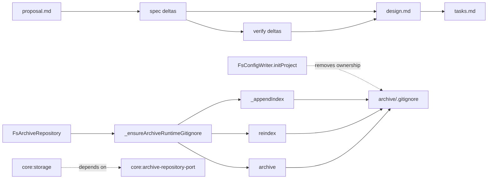

# Design: sync-archive-gitignore-with-runtime-artifacts

## Non-goals

- Changing archive directory naming, archive pattern expansion, or append-only archive semantics.
- Introducing a new public port, schema field, or CLI command for archive ignore maintenance.
- Generalizing archive-local ignore maintenance into a reusable cross-repository utility outside `FsArchiveRepository`.

## Affected areas

- `FsArchiveRepository` in `packages/core/src/infrastructure/fs/archive-repository.ts`
  Change: add runtime-owned archive `.gitignore` maintenance and invoke it from the runtime index-maintenance paths agreed in the specs.
  Callers / dependents: direct runtime entry points include `archive()`, `list()`, `get()`, `reindex()`, `_appendIndex()`, and `_ensureIndex()`. Graph impact for the file is `MEDIUM` in isolation, but this file participates in an overall `CRITICAL` blast radius when considered with `config-writer.ts` because both affect archive wiring and project bootstrap.
  Note: symbol changes must avoid altering the existing archive index format, archive path confinement, staged commit semantics, or archive repository constructor contract.

- `FsConfigWriter` in `packages/core/src/infrastructure/fs/config-writer.ts`
  Change: remove the archive-local `.gitignore` write from init-time bootstrap so `InitProject` only creates directories and the project-level `.gitignore` entry for `specd.local.yaml`.
  Callers / dependents: graph impact for the combined file set is `CRITICAL`; dependents include `InitProject`, project init CLI wiring, and config-writer tests. Any change here must preserve existing `specd init` behavior except for the removed archive-local ignore side effect.

- `core:test/infrastructure/fs/archive-repository.spec.ts`
  Change: add coverage for runtime creation or repair of `archive/.gitignore`, including both `.specd-index.jsonl` and `.staging`, across archive creation, reindex, and recovery or append flows.
  Callers / dependents: test-only impact, but this file is the primary executable proof for the new storage and archive-repository requirements.

- `core:test/infrastructure/fs/config-writer.spec.ts`
  Change: remove or rewrite assertions that expect `InitProject` to create `archive/.gitignore` for `.specd-index.jsonl`.
  Callers / dependents: test-only impact; keeps init-project verification aligned with the updated spec.

- `core:test/application/use-cases/init-project.spec.ts`
  Change: remove or rewrite any use-case-level assertions that still treat archive-local `.gitignore` creation as an init responsibility.
  Callers / dependents: test-only impact through `InitProject` orchestration.

## New constructs

- Private helper `_ensureArchiveRuntimeGitignore(): Promise<void>` in `packages/core/src/infrastructure/fs/archive-repository.ts`
  Shape:

  ```ts
  private async _ensureArchiveRuntimeGitignore(): Promise<void>
  ```

  Responsibility: create or update `path.join(this._archivePath, '.gitignore')` so it contains exactly the runtime ignore entries this repository owns: `.specd-index.jsonl` and `.staging`.
  Relationships: called only inside `FsArchiveRepository`; it depends on `this._archivePath` and local filesystem helpers. Nothing outside the class calls it.

- Private helper for idempotent ignore entry maintenance inside `packages/core/src/infrastructure/fs/archive-repository.ts`
  Shape:
  ```ts
  private async _appendArchiveGitignoreEntry(gitignorePath: string, entry: string): Promise<void>
  ```
  or an equivalent file-local helper with the same behavior.
  Responsibility: append an entry only when it is not already present, preserving stable file content across repeated runtime calls.
  Relationships: used by `_ensureArchiveRuntimeGitignore()` only. This remains local to the archive repository rather than becoming a shared cross-class abstraction.

## Approach

The implementation keeps ownership exactly where the updated specs place it: `FsArchiveRepository` becomes the sole runtime owner of archive-local ignore hygiene for `.specd-index.jsonl` and `.staging`.

1. Add a private archive-local helper in `archive-repository.ts` that ensures `archive/.gitignore` exists and contains the two runtime entries.
2. Invoke that helper from the runtime paths required by the spec updates:
   - `archive()` before the repository exposes a committed archive result
   - `reindex()` before the rebuilt index is written
   - recovery or append paths that maintain `.specd-index.jsonl`, centered on `_appendIndex()` so both normal append and recovery append share the same guarantee
3. Keep the helper idempotent so repeated runtime calls do not duplicate lines or reorder content.
4. Remove the archive-local `.gitignore` write from `FsConfigWriter.initProject()` while preserving archive directory creation.
5. Update tests so the new behavior is proven at runtime and no longer assumed during init.

Requirement coverage:

- `core:storage` / `Requirement: Archive runtime ignore hygiene`
  Covered by the new private helper and by explicit calls from archive creation, reindex, and runtime recovery or append paths.
- `core:init-project` / `Requirement: Side effects performed by the port`
  Covered by deleting the archive-local ignore side effect from `FsConfigWriter.initProject()` and narrowing tests accordingly.
- `core:archive-repository-port` / `Requirement: fs implementation maintains archive runtime ignore rules`
  Covered by making `FsArchiveRepository` itself enforce the `.gitignore` entries from the agreed runtime paths.

The implementation remains within global constraints:

- infrastructure-only filesystem I/O stays in fs adapters, preserving hexagonal boundaries
- no new public API surface or cross-workspace dependency is introduced
- helpers remain private and named in `kebab-case` file context with no default exports and no `any`
- JSDoc must be added for every new helper and updated where behavior meaning changes

Documentation in `docs/` is not expected to change because the behavior is internal archive-storage semantics, not a public CLI or MCP contract. If implementation reveals a public-facing init or archive-storage reference under `docs/core/` or `docs/cli/`, that document must be updated in the same change.

## Key decisions

**Decision** → Runtime archive ignore maintenance belongs to `FsArchiveRepository`, not `FsConfigWriter`.
**Rationale** → the repository already owns `.specd-index.jsonl` lifecycle, including archive append, reindex, and recovery; colocating ignore hygiene with the same lifecycle keeps the archive directory self-healing.
**Alternatives rejected** → keep the behavior only in `InitProject`; rejected because it fails after archive relocation, recreation, or missing-file recovery.

**Decision** → Use one shared private helper inside `FsArchiveRepository` instead of repeating ignore writes in each entry point.
**Rationale** → a single helper keeps behavior idempotent, testable, and consistent across archive creation, reindex, and recovery or append paths.
**Alternatives rejected** → inline duplicated writes in `archive()`, `reindex()`, and append paths; rejected due to duplication and higher risk of incomplete coverage.

**Decision** → Hook runtime recovery coverage at `_appendIndex()` rather than scattering recovery-specific writes elsewhere.
**Rationale** → `_appendIndex()` is the shared persistence point for both normal append and recovery append behavior, so it naturally captures the runtime guarantee for `.specd-index.jsonl` maintenance.
**Alternatives rejected** → attach the guarantee only to `get()` recovery logic or only to `_ensureIndex()`; rejected because those would not cover all append paths cleanly.

## Trade-offs

- `[Risk: repeated runtime calls churn archive/.gitignore]` → Mitigation: make entry insertion idempotent and preserve stable line ordering.
- `[Risk: helper placement accidentally widens responsibility beyond archive runtime artifacts]` → Mitigation: restrict the helper to exactly two entries, `.specd-index.jsonl` and `.staging`, and document that scope in JSDoc and tests.
- `[Risk: removing init-time behavior breaks tests or assumptions outside fs archive runtime]` → Mitigation: update init and config-writer tests first, then add targeted runtime coverage proving the new authoritative path.
- `[Risk: combined file-set blast radius is CRITICAL]` → Mitigation: keep implementation localized to `archive-repository.ts`, `config-writer.ts`, and tests, with no public contract expansion.

## Spec impact

### `core:storage`

- Direct dependents discovered from spec references and graph-assisted search context: `core:archive-repository-port`, `core:archive-change`, `core:list-archived`.
- Transitive dependents likely continue through archive-related use cases and kernel wiring, but the changed behavior stays within existing storage semantics.
- Assessment: no additional spec deltas are required. The new requirement tightens ownership of runtime ignore hygiene without changing archive index format, archive pattern behavior, or any caller-visible contract those dependents rely on.

### `core:init-project`

- Direct dependents: CLI project init behavior and the config-writer port contract usage documented through `core:config`.
- Assessment: no additional spec deltas are required. The change removes one fs side effect from bootstrap but keeps the use case contract and project init command semantics intact.

### `core:archive-repository-port`

- Direct dependents: `core:archive-change`, hook-related archived-change flows, and archive listing or lookup use cases.
- Assessment: no additional spec deltas are required. The new requirement clarifies fs implementation ownership without changing the abstract port surface or archive repository method signatures.

## Dependency map



```
┌──────────────┐      ┌────────────┐      ┌───────────┐
│ proposal.md  │─────▶│ spec deltas│─────▶│ verify    │
└──────────────┘      └─────┬──────┘      │ deltas    │
                            │             └─────┬─────┘
                            │                   │
                            ▼                   ▼
                      ┌─────────────────────────────┐
                      │          design.md          │
                      └──────────────┬──────────────┘
                                     │
                                     ▼
                               ┌──────────┐
                               │ tasks.md │
                               └──────────┘

┌───────────────────────┐
│ FsConfigWriter        │
│ initProject()         │
│ [ownership removed]   │
└───────────┬───────────┘
            │
            ▼
      ┌───────────────┐      ensures      ┌──────────────────────┐
      │ FsArchiveRepo │──────────────────▶│ archive/.gitignore   │
      │ [MEDIUM file] │                   │ .specd-index.jsonl   │
      └──────┬────────┘                   │ .staging             │
             │                            └──────────────────────┘
   ┌─────────┼─────────┐
   │         │         │
   ▼         ▼         ▼
┌───────┐ ┌───────┐ ┌──────────┐
│archive│ │reindex│ │_append   │
│()     │ │()     │ │Index()   │
└───────┘ └───────┘ └──────────┘
```

## Migration / Rollback

- No data migration is required.
- Roll forward is safe because runtime archive operations can recreate or repair `archive/.gitignore` when needed.
- Rollback means restoring the old init-time behavior in `FsConfigWriter` and removing the runtime helper from `FsArchiveRepository`; no persisted archive index schema changes need reversing.

## Testing

Automated tests:

- `packages/core/test/infrastructure/fs/archive-repository.spec.ts`
  - add a scenario for `archive()` creating or repairing `archive/.gitignore` with both `.specd-index.jsonl` and `.staging`
  - add a scenario for `reindex()` creating or repairing the same file when missing
  - add a scenario for recovery or append behavior (through `get()` fallback or the lowest shared append path) preserving those two entries
- `packages/core/test/infrastructure/fs/config-writer.spec.ts`
  - remove the assertion that init creates `archive/.gitignore` for `.specd-index.jsonl`
  - keep assertions for storage directory creation and project-level `.gitignore` update for `specd.local.yaml`
- `packages/core/test/application/use-cases/init-project.spec.ts`
  - update any expectation inherited from the old config-writer side effect

Scenario mapping from verify:

- `core:storage` / `Requirement: Archive runtime ignore hygiene`
  maps to archive repository integration tests for missing-file recreation and entry preservation across runtime paths.
- `core:init-project` / `Requirement: Side effects performed by the port`
  maps to updated init-project and config-writer tests proving only project `.gitignore` and directory creation remain.
- `core:archive-repository-port` / `Requirement: fs implementation maintains archive runtime ignore rules`
  maps to archive repository tests covering `archive()`, `reindex()`, and runtime recovery or append.

Manual / E2E verification:

1. Run the targeted core test files for archive repository and config writer.
2. Create a temporary project fixture, delete `archive/.gitignore`, and invoke an operation that recreates or maintains `.specd-index.jsonl`.
3. Confirm the resulting `archive/.gitignore` contains `.specd-index.jsonl` and `.staging` exactly once each.
4. Run project init on a fresh fixture and confirm it still creates the archive directory and project `.gitignore` entry for `specd.local.yaml`, without relying on archive-local ignore bootstrap.
5. If implementation changes any JSDoc-bearing helper or public description, run the relevant lint or typecheck path that enforces documentation conventions.

## Open questions

_none._
