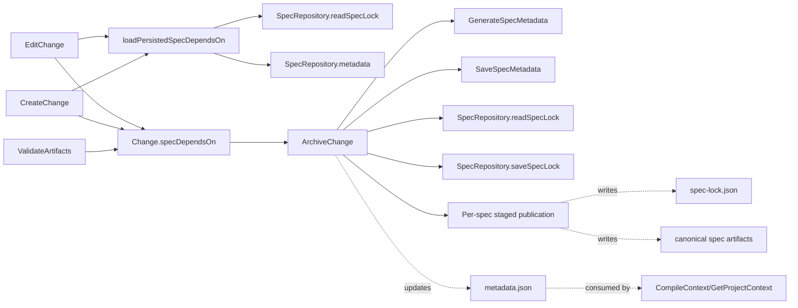

# Design: spec-lock-sidecar

## Non-goals

- Do not redesign `CompileContext` or `GetProjectContext`. They continue consuming `metadata.json.dependsOn`.
- Do not introduce a dedicated mass-migration command for legacy specs. Convergence remains opportunistic.
- Do not add historical tracking of previous dependency sets inside `spec-lock.json`. The sidecar stores current canonical state only.
- Do not promise one indivisible filesystem transaction for every spec in an archive batch. The strongest defensible guarantee is per-spec publication atomicity.

## Affected areas

- `ArchiveChange` in `packages/core/src/application/use-cases/archive-change.ts`
  Change: require actor resolution before archive, reconcile sidecar-owned `dependsOn`, preserve original sidecar schema, and move publication semantics to per-spec staged publication with staging preserved on failure.
  Callers: 17 direct dependents, 3 indirect, 1 transitive · Risk: CRITICAL
  Note: this remains the highest-risk integration point; both behavior and failure semantics change here.

- `GenerateSpecMetadata` in `packages/core/src/application/use-cases/generate-spec-metadata.ts`
  Change: keep deterministic post-publication metadata generation, while using `extractMetadata(...)` over prepared merged artifacts for the pre-publication dependency consistency check.
  Callers: 6 direct dependents, 19 indirect, 2 transitive · Risk: CRITICAL
  Note: no public signature change is needed if pre-publication extraction stays inside `ArchiveChange`.

- `SaveSpecMetadata` in `packages/core/src/application/use-cases/save-spec-metadata.ts`
  Change: behavior stays metadata-only; specs/docs/tests must normalize to JSON terminology and keep sidecar ownership out of this use case.
  Callers: 9 direct dependents, 19 indirect, 2 transitive · Risk: CRITICAL
  Note: keep this use case stable to avoid widening blast radius.

- `CreateChange` in `packages/core/src/application/use-cases/create-change.ts`
  Change: seed `change.specDependsOn` for existing specs at creation time from canonical persisted state.
  Callers: 3 direct dependents, 4 indirect, 2 transitive · Risk: MEDIUM

- `EditChange` in `packages/core/src/application/use-cases/edit-change.ts`
  Change: seed `change.specDependsOn` when a spec newly enters the change scope and preserve existing in-change entries on later scope edits.
  Callers: 3 direct dependents, 4 indirect, 2 transitive · Risk: MEDIUM

- `ValidateArtifacts` in `packages/core/src/application/use-cases/validate-artifacts.ts`
  Change: keep `change.setSpecDependsOn(...)` as the in-progress updater and explicitly avoid hard-failing against canonical sidecar divergence.
  Callers: 35 direct dependents, 3 indirect, 1 transitive · Risk: CRITICAL

- `SpecRepository` port in `packages/core/src/application/ports/spec-repository.ts`
  Change: add explicit sidecar methods such as `readSpecLock()` and `saveSpecLock()` so persistent lock-state is a first-class contract across storage backends.
  Callers: create/edit/archive use cases, fs adapter, tests, composition · Risk: HIGH

- `FsSpecRepository` in `packages/core/src/infrastructure/fs/spec-repository.ts`
  Change: implement sidecar reads/writes and staged publication support needed for per-spec archive atomicity while keeping `spec-lock.json` outside the normal artifact API.
  Callers: repository factory, kernel internals, fs tests · Risk: HIGH

- `FsChangeRepository` and manifest types in `packages/core/src/infrastructure/fs/change-repository.ts` and `packages/core/src/infrastructure/fs/manifest.ts`
  Change: serialization format stays the same, but tests/comments must align with seeded `specDependsOn` semantics as archive input.
  Callers: composition, fs tests, status/preview flows · Risk: HIGH

- Composition wiring in `packages/core/src/composition/use-cases/create-change.ts`, `packages/core/src/composition/use-cases/edit-change.ts`, `packages/core/src/composition/use-cases/archive-change.ts`, and `packages/core/src/composition/kernel.ts`
  Change: pass real `specRepos` into `CreateChange` and `EditChange`; keep archive wiring intact while reusing the same repository map for sidecar read/write.
  Callers: kernel and CLI entrypoints · Risk: HIGH

- Tests
  Change: expand `packages/core/test/application/use-cases/archive-change.spec.ts`, `create-change.spec.ts`, `edit-change.spec.ts`, `generate-spec-metadata.spec.ts`, `save-spec-metadata.spec.ts`, `validate-artifacts.spec.ts`, and fs repository tests in `packages/core/test/infrastructure/fs/spec-repository.spec.ts`.
  Callers: test suite only · Risk: HIGH

- Docs
  Change: update `docs/guide/_sections/getting-started/spec-metadata.md` to describe `metadata.json`, `spec-lock.json`, legacy backfill behavior, and the sidecar authority model.
  Callers: human readers only · Risk: LOW

## New constructs

- `packages/core/src/domain/services/parse-spec-lock.ts`
  Shape:

  ```ts
  export interface SpecLockData {
    readonly schema: { readonly name: string; readonly version: number }
    readonly dependsOn: readonly string[]
    readonly originalHash?: string
  }

  export function parseSpecLock(content: string): SpecLockData
  export const specLockSchema: z.ZodType<SpecLockData>
  ```

  Responsibility: validate and parse `spec-lock.json` content, mirroring the role `parse-metadata` plays for metadata.
  Relationships: used by repository sidecar reads and by create/edit seeding helpers; no infrastructure I/O inside the parser.

- `SpecRepository` sidecar methods in `packages/core/src/application/ports/spec-repository.ts`
  Shape:

  ```ts
  abstract readSpecLock(spec: Spec): Promise<SpecLockData | null>
  abstract saveSpecLock(
    spec: Spec,
    content: SpecLockData,
    options?: { force?: boolean },
  ): Promise<void>
  ```

  Responsibility: expose durable spec-lock state as a dedicated repository capability instead of overloading the normal artifact surface.
  Relationships: implemented by `FsSpecRepository`; consumed by create/edit/archive flows.

- `packages/core/src/application/use-cases/_shared/load-persisted-spec-depends-on.ts`
  Shape:

  ```ts
  export interface PersistedSpecDepsResult {
    readonly dependsOn: readonly string[]
    readonly source: 'spec-lock' | 'metadata' | 'empty'
  }

  export async function loadPersistedSpecDependsOn(
    specRepos: ReadonlyMap<string, SpecRepository>,
    specId: string,
  ): Promise<PersistedSpecDepsResult>
  ```

  Responsibility: load the current persisted dependency baseline for one spec using precedence `spec-lock.json -> metadata.json.dependsOn -> []`.
  Relationships: called by `CreateChange` and `EditChange`; reuses `SpecRepository.readSpecLock()` and `SpecRepository.metadata()`.

- Archive publication helper(s) inside `packages/core/src/application/use-cases/archive-change.ts` or adjacent shared helper file.
  Shape:

  ```ts
  interface FinalDependsOnResolution {
    readonly dependsOn: readonly string[]
    readonly source: 'change' | 'spec-lock' | 'metadata-extraction' | 'metadata'
  }

  private async _publishSpecAtomically(args: {
    spec: Spec
    writes: readonly PreparedSpecWrite[]
  }): Promise<void>
  ```

  Responsibility: isolate final dependency resolution and per-spec staged publication from the rest of archive orchestration.
  Relationships: invoked only by `ArchiveChange.execute()`; sidecar reads and writes go through `SpecRepository.readSpecLock()` and `saveSpecLock()`.

## Approach

1. Add `spec-lock.json` parsing support and dedicated repository methods.
   - `SpecRepository` grows explicit `readSpecLock()` and `saveSpecLock()` methods.
   - `FsSpecRepository` implements those methods against canonical spec storage.
   - The normal `artifact()` / `save()` API remains limited to schema artifacts and must not become a general sidecar escape hatch.

2. Introduce a shared loader for persisted dependency baselines.
   - `CreateChange` and `EditChange` both need the same precedence logic.
   - The helper loads the spec from the correct workspace repository, then reads sidecar first, falls back to `metadata.json.dependsOn`, and otherwise returns `[]`.
   - The helper should not mutate anything; it only returns the baseline and the source used.

3. Seed `change.specDependsOn` at scope-entry time.
   - In `CreateChange.execute()`, build the initial `Change` with a seeded `specDependsOn` map for existing specs.
   - In `EditChange.execute()`, compute the subset of newly added spec IDs and seed only those.
   - Do not overwrite any spec already present in `change.specDependsOn`; `ValidateArtifacts` and later LLM edits remain authoritative once the spec is inside the change.

4. Fix composition wiring so seeding can actually run.
   - `packages/core/src/composition/use-cases/create-change.ts` and `.../edit-change.ts` must stop passing `new Map()`.
   - They should build the same per-workspace `SpecRepository` map pattern already used by archive/kernel wiring, then pass it into the use case constructors.
   - Kernel-level factories stay responsible for creating repository adapters; the use cases remain pure application logic over ports.

5. Keep `ValidateArtifacts` as the in-progress updater.
   - The current flow already stores extracted `dependsOn` into `change.specDependsOn` after successful validation.
   - No sidecar comparison belongs here, because a change is allowed to diverge from canonical state while being edited.
   - Add tests to lock this behavior down instead of redesigning the algorithm.

6. Move durable authority into `ArchiveChange`.
   - Archive must resolve actor identity first; if actor resolution fails, archive aborts before any canonical publication.
   - For each spec, archive prepares the merged artifacts, resolves the final persisted dependency set, runs `extractMetadata(...)` on the prepared merged content, and rejects any `dependsOn` mismatch before publishing canonical outputs.
   - Final persisted dependency resolution:
     - start from `change.specDependsOn.get(specId)` when present;
     - if extraction provides `dependsOn`, it must match the final persisted set whenever archive is sealing persisted dependency state, including the first sidecar creation;
     - if extraction omits `dependsOn`, archive falls back to the final persisted set and `metadata.json.dependsOn` is written from it;
     - legacy extraction-only behavior remains outside archive for specs that still have no sidecar.
   - Sidecar write rules:
     - if no sidecar exists and the spec is structurally compatible under the current schema, stage a new sidecar with current schema identity and final `dependsOn`;
     - if a sidecar exists, preserve `schema` and replace `dependsOn` with the final change value.
   - After successful canonical publication, `GenerateSpecMetadata` still runs against the canonical spec and `metadata.json` remains a derived cache/projection.

7. Make publication semantics explicit and defendable.
   - Prepare archive outputs before canonical publication.
   - Treat merged spec artifacts plus `spec-lock.json` as a single per-spec publication unit staged ahead of the final swap.
   - Publish each spec atomically through staging/swap semantics where the adapter can guarantee it.
   - If publication of a spec fails, do not leave that spec partially written in canonical storage.
   - Do not auto-delete staging on publication failure; surface the staged path and manual recovery guidance in the error.
   - Do not promise that one multi-spec archive is a single filesystem transaction.

8. Keep `GenerateSpecMetadata` and `SaveSpecMetadata` focused.
   - `GenerateSpecMetadata` still extracts deterministic metadata from canonical spec content after publication.
   - `ArchiveChange` becomes the place where pre-publication extraction validates the final persisted `dependsOn` and where `metadata.json.dependsOn` is derived from the persisted sidecar-owned state.
   - `SaveSpecMetadata` remains the writer for `metadata.json` only; no sidecar write path is introduced there.

9. Preserve manifest shape, but tighten semantics.
   - `specDependsOn` already round-trips through `FsChangeRepository`; the implementation change is about ensuring it is seeded and therefore non-empty for existing specs unless the true baseline is empty.
   - No new manifest fields are required.

10. Update docs where the previous authority model was wrong.

- `docs/guide/_sections/getting-started/spec-metadata.md` must describe JSON terminology consistently and explain that `spec-lock.json` is the durable authority for persisted `dependsOn` once present.

## Key decisions

- **Model `spec-lock` as an explicit `SpecRepository` capability** → makes durable lock-state a first-class contract across storage backends and avoids baking archive semantics into the generic artifact API. **Alternatives rejected** → treating `spec-lock.json` as a reserved artifact filename would solve fs only and would blur the artifact boundary.

- **Keep `CompileContext` unchanged** → the specs preserve `metadata.json.dependsOn` as a consumer surface, so the authority shift can happen inside archive/metadata without touching context traversal. **Alternatives rejected** → teaching `CompileContext` to read `spec-lock.json` directly would widen blast radius into `GetProjectContext`, metadata consumers, and context tests.

- **Require actor identity for archive** → archived records should always have an accountable actor; silent anonymous archive fallback makes auditability and spec intent diverge. **Alternatives rejected** → allowing `archiveRepository.archive(change, {})` would preserve old behavior but contradict the desired workflow guard.

- **Enforce mismatch only in `ArchiveChange`** → avoids false failures while a change is still editing dependency state. **Alternatives rejected** → failing early in `ValidateArtifacts` would block legitimate in-progress divergence from canonical sidecar state.

- **Seed `specDependsOn` on scope entry rather than reconstructing it later** → prevents empty-baseline archives and keeps the manifest truthful from the moment a spec enters the change. **Alternatives rejected** → reconstructing at archive time would be lossy and would ignore dependencies removed from metadata extraction or never re-added by the LLM.

- **Guarantee atomicity per spec, not per archive batch** → this is the strongest filesystem-backed promise the implementation can defend honestly. **Alternatives rejected** → promising a full multi-spec transaction would overstate what fs publication can guarantee.

- **Preserve staging on publication failure** → failed final publication should leave recoverable material for the user instead of deleting evidence and forcing regeneration. **Alternatives rejected** → eager cleanup would hide the prepared archive output and make manual recovery impossible.

- **Opportunistic backfill only** → matches the user decision and keeps implementation bounded. **Alternatives rejected** → adding a dedicated migration command now would enlarge scope without being required for correctness.

## Trade-offs

- `[Archive complexity]` → `ArchiveChange` grows additional reconciliation and staged-publication logic. Mitigation: keep dependency resolution small and keep sidecar I/O behind dedicated repository methods.
- `[Port expansion]` → `SpecRepository` grows explicit sidecar methods. Mitigation: this is a narrow, durable concept with clearer long-term semantics than widening the normal artifact surface.
- `[Legacy mixed population]` → repositories will temporarily contain specs with and without sidecars. Mitigation: explicit precedence helper plus opportunistic backfill on successful compatibility checks.
- `[Manual recovery path]` → publication failures can leave staging behind for user intervention. Mitigation: make the error explicit and keep canonical storage uncorrupted for the affected spec.
- `[High-fan-in regressions]` → `ArchiveChange`, `ValidateArtifacts`, and metadata flows are CRITICAL hotspots. Mitigation: extend targeted unit and fs tests before relying on integration behavior.

## Spec impact

### `core:archive-change`

- Direct dependents observed in current metadata/search: `core:archive-repository-port`, `core:list-archived`, `core:get-archived-change`, `core:kernel`, `cli:change-archive`, `core:hook-execution-model`, `core:template-variables`, `core:workflow-model`.
- Assessment: no additional spec deltas are required now because the change does not alter the external CLI/archive command surface or archive index shape; it tightens internal archive-time persistence and publication rules.

### `core:spec-metadata`

- Direct dependents observed in current metadata/search: `core:compile-context`, `core:get-project-context`, `core:generate-metadata`, `core:save-spec-metadata`, `cli:spec-generate-metadata`, `cli:spec-metadata`, `cli:spec-write-metadata`.
- Assessment: no further spec scope is required because consumer behavior remains `metadata.json`-based; only the authority behind `metadata.dependsOn` changes.

### `core:validate-artifacts`

- Direct dependents observed in current metadata/search: `core:validate-specs`, `cli:change-validate`, `core:kernel`.
- Assessment: no downstream spec changes are required because validation behavior remains permissive for in-progress dependency edits; the change documents and tests that existing boundary.

### `core:create-change` / `core:edit-change`

- Direct dependents observed in graph impact: kernel factories plus their dedicated unit tests.
- Assessment: no additional CLI spec is required because the command inputs and outputs do not change; only the internal seeding side effect changes.

### `core:spec-repository-port`

- Direct dependents observed in current metadata/search: `core:archive-change`, `core:save-spec-metadata`, `core:generate-spec-metadata`, `core:get-project-context`, `core:compile-context`, `core:search-specs`, composition wiring, and the fs adapter.
- Assessment: this delta is required because sidecar read/write is now a formal repository capability rather than an fs-only convention.

### Scope conclusion

The ripple analysis does not force additional spec deltas beyond the eight already in scope. The main outward-facing dependents still see the same command contracts and consumer surfaces, while the repository contract grows narrowly to support cross-storage sidecar persistence and archive publication semantics.

## Dependency map



```
┌──────────────────┐       ┌──────────────────────────────┐
│ CreateChange     │──────▶│ loadPersistedSpecDependsOn() │
└────────┬─────────┘       └──────────────┬───────────────┘
         │                                 │
┌────────▼─────────┐                       │
│ EditChange       │───────────────────────┘
└────────┬─────────┘
         │ seeds
         ▼
   ┌───────────────┐         updates          ┌────────────────────┐
   │ change.spec   │◀────────────────────────│ ValidateArtifacts   │
   │ DependsOn     │                         └────────────────────┘
   └──────┬────────┘
          │ final persisted deps
          ▼
   ┌────────────────────┐      reads/writes      ┌──────────────────┐
   │ ArchiveChange      │───────────────────────▶│ spec-lock.json   │
   │ [CRITICAL]         │                        └──────────────────┘
   │ actor required     │────writes metadata────▶┌──────────────────┐
   │ per-spec staging   │                        │ metadata.json    │
   └─────────┬──────────┘                        └────────┬─────────┘
             │ canonical publish                             │ consumed by
             ▼                                               ▼
      ┌───────────────┐                               ┌──────────────────┐
      │ spec artifacts│                               │ CompileContext / │
      │ (canonical)   │                               │ GetProjectContext│
      └───────────────┘                               └──────────────────┘
```

## Migration / Rollback

- Forward migration is opportunistic. Existing specs without `spec-lock.json` continue to function through `metadata.json` until sidecar backfill succeeds.
- If archive-side sidecar reconciliation or per-spec publication fails in production, the rollback path is to revert the implementation and continue relying on pre-existing metadata behavior; no bulk cleanup is required because sidecar creation is additive.
- If final canonical publication fails for a spec, rollback is not automatic. The staged output must be preserved and the error must tell the user how to recover manually.
- No data migration step is required before deployment.

## Testing

### Automated tests

- `packages/core/test/domain/services/parse-spec-lock.spec.ts`
  Cover parsing success, schema validation failures, and optional `originalHash` handling.

- `packages/core/test/infrastructure/fs/spec-repository.spec.ts`
  Cover `readSpecLock()` absent/present behavior, `saveSpecLock()` persistence, conflict detection, readOnly rejection, and preservation of the normal artifact boundary.

- `packages/core/test/application/use-cases/create-change.spec.ts`
  Cover seeding from sidecar, metadata fallback, and empty fallback during initial change creation.

- `packages/core/test/application/use-cases/edit-change.spec.ts`
  Cover seeding only for newly added specs and preserving existing in-change `specDependsOn` entries.

- `packages/core/test/application/use-cases/archive-change.spec.ts`
  Map every new archive scenario:
  - actor resolution required;
  - sidecar first-write;
  - re-archive preserves original schema;
  - re-archive replaces `dependsOn` with current change state;
  - sidecar-backed mismatch between extraction and final persisted `dependsOn` fails archive;
  - legacy no-sidecar flow still writes `metadata.json`;
  - opportunistic backfill creates sidecar only when structurally compatible;
  - incompatible legacy spec skips sidecar creation;
  - per-spec publication failure preserves staging and avoids partial canonical write.

- `packages/core/test/application/use-cases/generate-spec-metadata.spec.ts`
  Cover that extraction stays deterministic and that sidecar-specific authority remains outside this use case.

- `packages/core/test/application/use-cases/save-spec-metadata.spec.ts`
  Cover JSON terminology/documented behavior and that sidecar consistency is not enforced here.

- `packages/core/test/application/use-cases/validate-artifacts.spec.ts`
  Cover that extracted `dependsOn` continues to update `change.specDependsOn` and does not hard-fail on canonical sidecar divergence.

### Manual / E2E verification

1. Create or reuse a legacy spec without `spec-lock.json`, run metadata generation, and verify `metadata.json` still updates even if sidecar backfill is skipped.
2. Add an existing spec with known `dependsOn` to a fresh change and verify `manifest.json` is seeded immediately.
3. Validate artifacts so `change.specDependsOn` changes, then inspect the manifest to confirm the in-change snapshot updates.
4. Archive a change for a spec without sidecar and verify `spec-lock.json` appears next to canonical spec artifacts when compatibility passes.
5. Re-archive the same spec with changed dependencies and verify the sidecar keeps the original schema while replacing `dependsOn`.
6. Force a mismatch between sidecar-owned `dependsOn` and extracted `dependsOn` and confirm archive fails.
7. Force a final publication failure for one spec and confirm canonical storage is not partially updated while staging remains available for manual recovery.

Documentation and quality constraints:

- Keep implementation inside hexagonal boundaries from `default:_global/architecture`.
- Use ESM/named exports and avoid `any` per `default:_global/conventions`.
- Add/update JSDoc where signatures or behavior change per `default:_global/docs`.
- Keep tests colocated with the existing package test structure per `default:_global/testing`.
- Update docs in `docs/` when user-facing metadata behavior descriptions change.

## Open questions

_none_.
