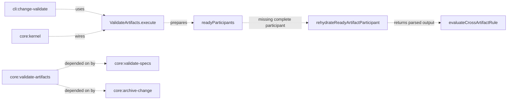

# Design: cross-artifact-ready-participants

## Non-goals

- Changing schema-level cross-artifact rule syntax or evaluation semantics in `packages/schema-std/schema.yaml`.
- Changing `ValidateSpecs` to load persisted `complete` state from changes; this fix is limited to change-artifact validation in `ValidateArtifacts`.
- Changing CLI output wording beyond preserving the existing deferred-warning path when a participant is genuinely unavailable.
- Adding user-facing documentation under `docs/`; this is an internal validation-behavior fix and the normative contract lives in spec deltas.

## Affected areas

- `ValidateArtifacts.execute()` in `packages/core/src/application/use-cases/validate-artifacts.ts`
  Change: split current cross-artifact participant preparation into two phases: participants produced in the current invocation, and participants rehydrated from already-`complete` artifact files when a rule needs them.
  Callers: `36` direct dependents from file impact · Risk: `CRITICAL`
  Note: this is the runtime integration point for change validation, so behavior changes here must preserve existing dependency checks, delta preview behavior, and metadata extraction flow.

- `readyParticipants` handling in `packages/core/src/application/use-cases/validate-artifacts.ts`
  Change: replace the current invocation-local-only map semantics with rule-aware participant loading that can fill missing entries from persisted complete artifact state before deferring a cross-rule.
  Callers: internal to `ValidateArtifacts.execute()` · Risk: `HIGH`
  Note: this is the smallest place where the bug exists; current deferral happens because `readyParticipants` is populated only at the end of the per-artifact loop.

- `packages/core/src/application/use-cases/_shared/cross-artifact-participant-state.ts`
  Change: expand this shared module from a pure interface holder into the canonical place for cross-artifact participant rehydration helpers used by `ValidateArtifacts`.
  Callers: currently imported by `ValidateArtifacts` only · Risk: `MEDIUM`
  Note: centralizing the helper here avoids embedding file-loading and parsing branches directly inside the cross-rule loop.

- `packages/core/test/application/use-cases/validate-artifacts.spec.ts`
  Change: add regression coverage for deferred-first-pass / rehydrated-second-pass behavior and keep existing same-invocation coverage.
  Callers: test-only · Risk: `MEDIUM`
  Note: the file is already the main hotspot for `ValidateArtifacts` behavior and must absorb the new scenarios.

## New constructs

- `rehydrateReadyArtifactParticipant(...)` in `packages/core/src/application/use-cases/_shared/cross-artifact-participant-state.ts`
  Shape:

  ```ts
  export interface RehydrateReadyArtifactParticipantInput {
    readonly change: Change
    readonly artifactType: ArtifactType
    readonly fileKey: string
    readonly validationFilename: string
    readonly workspace: string
    readonly capabilityPath: string
    readonly specExists: boolean
    readonly changes: ChangeRepository
    readonly specs: ReadonlyMap<string, SpecRepository>
    readonly parsers: ArtifactParserRegistry
  }

  export async function rehydrateReadyArtifactParticipant(
    input: RehydrateReadyArtifactParticipantInput,
  ): Promise<ReadyArtifactParticipant | null>
  ```

  Responsibility: reload and parse the expected artifact content for a participant that is already in `complete` state, returning the same `ReadyArtifactParticipant` shape used by the cross-rule evaluator.
  Relationships: called only from `ValidateArtifacts.execute()` when a rule needs a participant that was not parsed in the current invocation; depends on change/spec repositories and parser registry but does not evaluate rules itself.

- `collectCrossRuleParticipants(...)` in `packages/core/src/application/use-cases/validate-artifacts.ts`
  Shape:
  ```ts
  private async _collectCrossRuleParticipants(
    rule: CrossArtifactValidationRule,
    readyParticipants: Map<string, ReadyArtifactParticipant>,
    context: {
      change: Change
      schema: Schema
      workspace: string
      capabilityPath: string
      specExists: boolean
      inputArtifactId?: string
    },
  ): Promise<
    | { deferred: true }
    | {
        deferred: false
        participants: Map<string, CrossArtifactParticipantInput>
      }
  >
  ```
  Responsibility: build the participant map for one rule by preferring already-prepared participants, rehydrating `complete` participants when possible, and returning `deferred: true` only when a participant is genuinely unavailable.
  Relationships: stays private to `ValidateArtifacts`; calls `rehydrateReadyArtifactParticipant(...)` and feeds `evaluateCrossArtifactRule(...)`.

## Approach

1. Keep the existing per-artifact validation loop intact through dependency checks, file resolution, delta preview, structural validation, and metadata extraction.
2. Continue populating `readyParticipants` immediately after a participant becomes locally valid in the current invocation.
3. Replace the current cross-rule evaluation loop with a participant-collection step that:
   - checks whether a participant is already present in `readyParticipants`;
   - if not present, checks whether the corresponding tracked artifact file is already `complete` on the change;
   - if `complete`, reloads the expected artifact content and reconstructs the parsed/materialized participant output using the same delta/direct-file rules as local validation;
   - if rehydration succeeds, caches that participant in `readyParticipants` for the remainder of the invocation;
   - if the participant is missing, still invalid, or cannot be rehydrated, returns `deferred: true` so the existing warning path is preserved.
4. Evaluate `evaluateCrossArtifactRule(...)` only after all required participants have either been prepared locally or rehydrated.
5. Keep warning semantics unchanged for genuinely unavailable participants so CLI behavior remains stable.
6. Do not change spec dependency persistence, metadata extraction, or hash completion rules; this change is limited to participant availability for cross-artifact evaluation.

Coverage against changed requirements:

- `Requirement: Cross-artifact structural validation` is satisfied by the rehydration step and by using reconstructed parsed/materialized outputs for `complete` participants.
- `Scenario: Completed counterpart is rehydrated for a later validation pass` is satisfied by step 3.
- `Scenario: Missing ready participant defers cross-artifact validation` remains satisfied by the `deferred: true` branch when rehydration is impossible.

## Key decisions

**Decision**: Rehydrate only participants already in `complete` state.
**Rationale**: `complete` is the existing contract that local structural validation has already passed, so the reloaded file can safely participate in cross-rule evaluation without re-running the full artifact status transition.
**Alternatives rejected**: Rehydrating `in-progress` or `pending-review` artifacts would blur validation-state semantics and could compare against content that never passed local validation.

**Decision**: Keep rehydration in an explicit helper instead of embedding it inline in the cross-rule loop.
**Rationale**: the current bug is already caused by participant-state handling being too implicit; extracting rehydration makes the difference between “prepared now” and “reused from complete state” visible and testable.
**Alternatives rejected**: Duplicating file-loading and parser selection inline inside the cross-rule loop would make `ValidateArtifacts.execute()` harder to reason about and easier to regress.

**Decision**: Preserve deferred warnings for genuinely unavailable participants.
**Rationale**: the user only wants to eliminate false deferrals caused by prior-invocation completion, not to turn every missing counterpart into a hard failure.
**Alternatives rejected**: converting all deferred cross-rules into hard failures would change workflow behavior far beyond the bug being fixed.

## Trade-offs

- [Cross-rule evaluation now reloads complete artifacts] → Limit rehydration to rule participants only and cache the rehydrated participant in `readyParticipants` for the rest of the invocation.
- [Delta-backed participant reconstruction can drift from local validation logic] → Route rehydration through the same expected-filename, parser, and merged-preview rules already used during per-artifact validation.
- [Critical integration point in `ValidateArtifacts`] → Keep the spec scope narrow and add regression tests around the exact deferred/rehydrated branches before broader refactors.

## Spec impact

### `core:validate-artifacts`

- Direct dependents found via metadata: `core:validate-specs`, `cli:change-validate`, `core:kernel`, `core:archive-change`
- Transitive dependents from those direct dependents are present, but the changed requirement stays inside change-artifact validation semantics.
- `core:validate-specs` remains satisfied because it validates canonical spec artifacts, not change-state `complete` artifacts; its requirement about reusing `ValidateArtifacts` semantics still holds at the rule-evaluator level.
- `cli:change-validate` remains satisfied because command signature and result rendering do not change.
- `core:kernel` remains satisfied because there is no constructor signature or kernel-surface change.
- `core:archive-change` remains satisfied because archive-time validation semantics are unaffected.
- Result: no additional spec needs to be added to scope.

## Dependency map



```
┌─────────────────────┐       ┌────────────────────────────┐
│ cli:change-validate │──────▶│ ValidateArtifacts.execute  │
└─────────────────────┘       │          [CRITICAL]        │◀──────┐
                               └──────────────┬─────────────┘       │
┌─────────────────────┐                      │                     │
│ core:kernel         │──────────────────────┘                     │
└─────────────────────┘                                            │
                                                                    │
                               ┌────────────────────────────┐        │
                               │ readyParticipants map      │────────┘
                               └──────────────┬─────────────┘
                                              │ missing but complete
                                              ▼
                               ┌────────────────────────────┐
                               │ rehydrateReadyArtifact     │
                               │ Participant()              │
                               └──────────────┬─────────────┘
                                              ▼
                               ┌────────────────────────────┐
                               │ evaluateCrossArtifactRule  │
                               └────────────────────────────┘

┌────────────────────────┐  depends on  ┌──────────────────────────┐
│ core:validate-specs    │─ ─ ─ ─ ─ ─ ─▶│ core:validate-artifacts  │
└────────────────────────┘              └──────────────────────────┘
┌────────────────────────┐
│ core:archive-change    │─ ─ ─ ─ ─ ─ ─▶ same spec, no delta needed
└────────────────────────┘
```

## Testing

**Automated tests**

- Extend `packages/core/test/application/use-cases/validate-artifacts.spec.ts` with a dedicated describe block for cross-artifact participant rehydration. The minimum battery should cover:
  - baseline regression: `specs` validates first, `verify` validates later, and the second pass rehydrates `specs` instead of deferring;
  - same-invocation control: both participants are locally valid in one invocation and the rule still evaluates exactly as before;
  - genuine defer: the counterpart artifact file does not exist yet, so the rule still defers with a warning;
  - invalid counterpart: the counterpart artifact exists but is not locally valid, so the rule still defers with a warning;
  - stale-complete-but-unreadable counterpart: the counterpart artifact is marked `complete` but its expected file cannot be loaded, so rehydration fails and the rule defers instead of crashing;
  - delta-backed rehydration: the persisted participant is tracked through a delta file and rehydration evaluates the merged/materialized output rather than the raw delta YAML;
  - direct-file rehydration: a non-delta participant is rehydrated from direct artifact content and participates in the rule normally;
  - rule filtering with `artifactId`: when validating only `verify`, only rules that reference `verify` attempt rehydration, and unrelated cross-rules remain untouched;
  - participant caching: once a participant is rehydrated for one rule in an invocation, later rules in the same invocation reuse the cached participant instead of reloading it repeatedly.
- Add helper-level tests if `rehydrateReadyArtifactParticipant(...)` is extracted into its own shared module. Those tests should cover:
  - direct artifact parsing;
  - delta base loading and merge application;
  - null result when the tracked artifact is not `complete`;
  - null result when parser resolution fails or expected content is unavailable.
- Keep and rerun the existing cross-artifact tests that already cover same-invocation participants, ordered subset semantics, and ordinary deferral, so the change proves non-regression as well as the new behavior.
- Run targeted tests for `ValidateArtifacts` first, then the broader `@specd/core` test slice if the helper extraction changes shared participant-preparation code.

**Manual / E2E verification**

- Create a change with `specs` and `verify` artifacts targeting the same spec.
- Validate `specs` first and confirm the relevant cross-rule is deferred because `verify` is not ready yet.
- Then validate `verify` and confirm the same cross-rule is evaluated instead of being deferred again.
- Re-run with the counterpart artifact missing or invalid and confirm the deferred warning still appears.
- Repeat once with a delta-backed `specs` artifact so the second validation proves the rule sees merged content rather than raw delta content.
- Commands:
  - `node packages/cli/dist/index.js changes validate <change> <specId> --artifact specs --format text`
  - `node packages/cli/dist/index.js changes validate <change> <specId> --artifact verify --format text`
- Expected result: the second command no longer reports a false defer when the first participant is already complete and rehydratable.

Global constraints applied:

- architecture: keep repository access in the application layer and avoid new I/O in domain services;
- conventions/eslint: ESM imports, no default exports, no `any`, explicit helper signatures;
- testing: behavior covered in application-layer tests with mocked repositories/parsers.

Documentation note:

- No update under `docs/` is required because the change is internal to validation semantics and is fully captured by spec deltas and tests.

## Open questions

- None.
